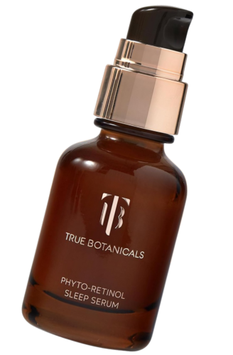
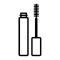
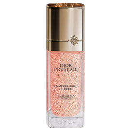
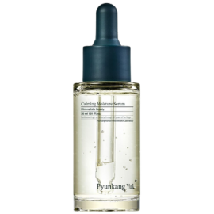
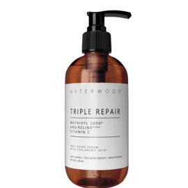
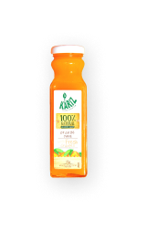
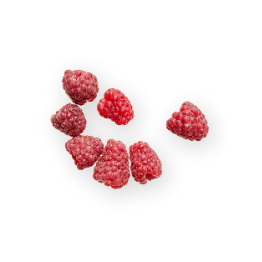
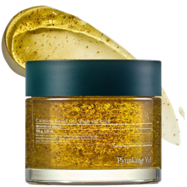
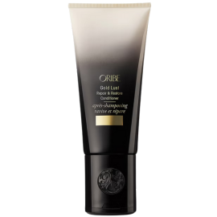
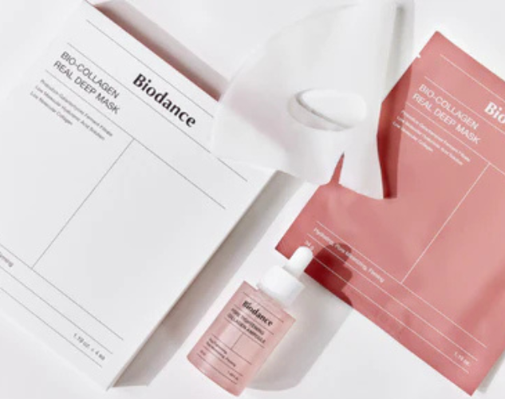

# Project Full Source

## File: ajouter_panier.php

`
<?php
session_start();

// Vérifiez si le panier existe, sinon créez-le
if (!isset($_SESSION['panier'])) {
    $_SESSION['panier'] = [];
}

// Modifier la quantité d'un produit
if ($_SERVER['REQUEST_METHOD'] === 'POST' && isset($_POST['update'])) {
    $product_id = isset($_POST['product_id']) ? intval($_POST['product_id']) : 0;
    $quantity = isset($_POST['quantity']) ? intval($_POST['quantity']) : 1;

    if ($product_id > 0 && $quantity > 0) {
        if (isset($_SESSION['panier'][$product_id])) {
            $_SESSION['panier'][$product_id]['quantity'] = $quantity;
        }
    }

    // Redirigez vers index.php
    header('Location: index.php');
    exit();
}

// Supprimer un produit du panier
if ($_SERVER['REQUEST_METHOD'] === 'POST' && isset($_POST['delete'])) {
    $product_id = isset($_POST['product_id']) ? intval($_POST['product_id']) : 0;

    if ($product_id > 0) {
        unset($_SESSION['panier'][$product_id]);
    }

    // Redirigez vers index.php
    header('Location: index.php');
    exit();
}

// Ajouter un produit au panier
if ($_SERVER['REQUEST_METHOD'] === 'POST' && isset($_POST['add'])) {
    $product_id = isset($_POST['product_id']) ? intval($_POST['product_id']) : 0;
    $product_name = isset($_POST['product_name']) ? htmlspecialchars($_POST['product_name']) : '';
    $product_price = isset($_POST['product_price']) ? floatval($_POST['product_price']) : 0.0;
    $quantity = isset($_POST['quantity']) ? intval($_POST['quantity']) : 1;

    if ($product_id > 0 && $quantity > 0) {
        // Vérifiez si le produit est déjà dans le panier
        if (isset($_SESSION['panier'][$product_id])) {
            $_SESSION['panier'][$product_id]['quantity'] += $quantity;
        } else {
            $_SESSION['panier'][$product_id] = [
                'name' => $product_name,
                'price' => $product_price,
                'quantity' => $quantity
            ];
        }
    }

    // Redirigez vers index.php
    header('Location: index.php');
    exit();
}
?>
`

## File: confirmation.php

`
<?php
session_start();
require "connexionbd.php";

// Vérifiez si le mode de paiement est défini dans la session
if (!isset($_SESSION['mode_paiement'])) {
    echo "Mode de paiement non défini. Veuillez revenir à la page précédente.";
    exit();
}

// Vérifiez si l'utilisateur est connecté
if (!isset($_SESSION['user_id'])) {
    header("Location: connexion.php");
    exit();
}

// Vérifiez si une commande est en cours
if (!isset($_SESSION['id_commande'])) {
    header("Location: index.php");
    exit();
}

$id_commande = intval($_SESSION['id_commande']);
$mode_paiement = trim($_SESSION['mode_paiement']); // Récupérer le mode de paiement
$basi = connectMaBasi();

// Définir le statut en fonction du mode de paiement
if ($mode_paiement === 'Carte bancaire') {
    $statut_commande = 'Payee';
} elseif ($mode_paiement === 'Paiement à la livraison') {
    $statut_commande = 'En attente';
} else {
    $statut_commande = 'Inconnu'; // Par défaut, si le mode de paiement est invalide
}

// Mettre à jour le statut de la commande
$query = "UPDATE commande SET statut_commande = '$statut_commande' WHERE id_commande = $id_commande";
if (mysqli_query($basi, $query)) {
    $message = "Votre commande a été confirmée avec succès. Mode de paiement : $mode_paiement.";
} else {
    $message = "Une erreur s'est produite lors de la confirmation de votre commande : " . mysqli_error($basi);
}
?>

<!DOCTYPE html>
<html lang="fr">
<head>
    <meta charset="UTF-8">
    <meta name="viewport" content="width=device-width, initial-scale=1.0">
    <title>Commande confirmée</title>
    <link href="https://cdn.jsdelivr.net/npm/bootstrap@5.3.0-alpha3/dist/css/bootstrap.min.css" rel="stylesheet">
</head>
<body class="bg-light">
    

        

            

                

                    

                        <h3>Commande confirmée</h3>
                    

                    

                        
<?php echo $message; ?>

                        <a href="index.php" class="btn btn-primary mt-3">Retourner à la boutique</a>
                    

                

            

        

    

    
</body>
</html>
`

## File: connexion.php

`
<?php
session_start();
require "connexionbd.php";

$message = "";

if (isset($_POST['success'])) {
    // Vérification des champs remplis
    if (!empty($_POST['email']) && !empty($_POST['password'])) {
        $email = htmlspecialchars($_POST['email']);
        $password = $_POST['password']; // Pas de hachage ici si les mots de passe sont stockés en clair

        $basi = connectMaBasi();
        $query = "SELECT * FROM users WHERE EMAIL='$email' AND PASSWORD='$password'";
        $result = mysqli_query($basi, $query);

        if (mysqli_num_rows($result) > 0) {
            // Connexion réussie
            $user = mysqli_fetch_assoc($result);

            // Stocker les informations utilisateur dans la session
            $_SESSION['user_id'] = $user['ID']; // ID utilisateur
            $_SESSION['user_email'] = $user['EMAIL'];
            $_SESSION['user_name'] = $user['NOM']; // Nom de l'utilisateur
            $_SESSION['role'] = $user['role']; // Rôle de l'utilisateur

            // Redirection en fonction du rôle
            if ($user['role'] === 'admin') {
                header("Location: interface_admin.php"); // Rediriger vers l'interface admin
            } else {
                header("Location: index.php"); // Rediriger vers la page d'accueil pour les utilisateurs normaux
            }
            exit();
        } else {
            $message = "Adresse e-mail ou mot de passe incorrect !";
        }
    } else {
        $message = "Veuillez remplir tous les champs !";
    }
}
?>

<!DOCTYPE html>
<html lang="fr">
<head>
    <meta charset="UTF-8">
    <meta name="viewport" content="width=device-width, initial-scale=1.0">
    <title>Connexion</title>
    
    <!-- Lien Google Fonts -->
    <link href="https://fonts.googleapis.com/css2?family=Poppins:wght@300;400;500;600&display=swap" rel="stylesheet">
    <!-- Lien Font Awesome pour les icônes -->
    <link rel="stylesheet" href="https://cdnjs.cloudflare.com/ajax/libs/font-awesome/6.0.0/css/all.min.css">
</head>
<body>
    

        

            <h2>Connexion</h2>
            
Connectez-vous pour accéder à votre compte

        

        
        <?php if(!empty($message)): ?>
            
<?php echo $message; ?>

        <?php endif; ?>
        
        <form action="" method="POST">
            

                

                    <i class="fas fa-envelope"></i>
                    <input type="text" class="form-control" placeholder="Adresse e-mail" name="email" required>
                

            

            
            

                

                    <i class="fas fa-lock"></i>
                    <input type="password" class="form-control" placeholder="Mot de passe" name="password" required>
                

            

            
            <button type="submit" class="btn" name="success">Se connecter</button>
            
            

                Vous n'avez pas de compte ? <a href="inscription.php">Inscrivez-vous</a>
            

        </form>
    

</body>
</html>
`

## File: connexionbd.php

`
<?php
function connectMaBasi(){
$basi=mysqli_connect("localhost","root","","projects");

if (!$basi) {
    die("Connection failed: " . mysqli_connect_error());
}
// echo "Connected successfully";

return $basi;

}

?>
`

## File: css\normalize.css

`
/*! normalize.css v8.0.1 | MIT License | github.com/necolas/normalize.css */

/* Document
   ========================================================================== */

/**
 * 1. Correct the line height in all browsers.
 * 2. Prevent adjustments of font size after orientation changes in iOS.
 */

html {
  line-height: 1.15; /* 1 */
  -webkit-text-size-adjust: 100%; /* 2 */
}

/* Sections
   ========================================================================== */

/**
 * Remove the margin in all browsers.
 */

body {
  margin: 0;
}

/**
 * Render the `main` element consistently in IE.
 */

main {
  display: block;
}

/**
 * Correct the font size and margin on `h1` elements within `section` and
 * `article` contexts in Chrome, Firefox, and Safari.
 */

h1 {
  font-size: 2em;
  margin: 0.67em 0;
}

/* Grouping content
   ========================================================================== */

/**
 * 1. Add the correct box sizing in Firefox.
 * 2. Show the overflow in Edge and IE.
 */

hr {
  box-sizing: content-box; /* 1 */
  height: 0; /* 1 */
  overflow: visible; /* 2 */
}

/**
 * 1. Correct the inheritance and scaling of font size in all browsers.
 * 2. Correct the odd `em` font sizing in all browsers.
 */

pre {
  font-family: monospace, monospace; /* 1 */
  font-size: 1em; /* 2 */
}

/* Text-level semantics
   ========================================================================== */

/**
 * Remove the gray background on active links in IE 10.
 */

a {
  background-color: transparent;
}

/**
 * 1. Remove the bottom border in Chrome 57-
 * 2. Add the correct text decoration in Chrome, Edge, IE, Opera, and Safari.
 */

abbr[title] {
  border-bottom: none; /* 1 */
  text-decoration: underline; /* 2 */
  text-decoration: underline dotted; /* 2 */
}

/**
 * Add the correct font weight in Chrome, Edge, and Safari.
 */

b,
strong {
  font-weight: 900;
}

/**
 * 1. Correct the inheritance and scaling of font size in all browsers.
 * 2. Correct the odd `em` font sizing in all browsers.
 */

code,
kbd,
samp {
  font-family: monospace, monospace; /* 1 */
  font-size: 1em; /* 2 */
}

/**
 * Add the correct font size in all browsers.
 */

small {
  font-size: 80%;
}

/**
 * Prevent `sub` and `sup` elements from affecting the line height in
 * all browsers.
 */

sub,
sup {
  font-size: 75%;
  line-height: 0;
  position: relative;
  vertical-align: baseline;
}

sub {
  bottom: -0.25em;
}

sup {
  top: -0.5em;
}

/* Embedded content
   ========================================================================== */

/**
 * Remove the border on images inside links in IE 10.
 */

img {
  border-style: none;
}

/* Forms
   ========================================================================== */

/**
 * 1. Change the font styles in all browsers.
 * 2. Remove the margin in Firefox and Safari.
 */

button,
input,
optgroup,
select,
textarea {
  font-family: inherit; /* 1 */
  font-size: 100%; /* 1 */
  line-height: 1.15; /* 1 */
  margin: 0; /* 2 */
}

/**
 * Show the overflow in IE.
 * 1. Show the overflow in Edge.
 */

button,
input {
  /* 1 */
  overflow: visible;
}

/**
 * Remove the inheritance of text transform in Edge, Firefox, and IE.
 * 1. Remove the inheritance of text transform in Firefox.
 */

button,
select {
  /* 1 */
  text-transform: none;
}

/**
 * Correct the inability to style clickable types in iOS and Safari.
 */

button,
[type='button'],
[type='reset'],
[type='submit'] {
  -webkit-appearance: button;
}

/**
 * Remove the inner border and padding in Firefox.
 */

button::-moz-focus-inner,
[type='button']::-moz-focus-inner,
[type='reset']::-moz-focus-inner,
[type='submit']::-moz-focus-inner {
  border-style: none;
  padding: 0;
}

/**
 * Restore the focus styles unset by the previous rule.
 */

button:-moz-focusring,
[type='button']:-moz-focusring,
[type='reset']:-moz-focusring,
[type='submit']:-moz-focusring {
  outline: 1px dotted ButtonText;
}

/**
 * Correct the padding in Firefox.
 */

fieldset {
  padding: 0.35em 0.75em 0.625em;
}

/**
 * 1. Correct the text wrapping in Edge and IE.
 * 2. Correct the color inheritance from `fieldset` elements in IE.
 * 3. Remove the padding so developers are not caught out when they zero out
 *    `fieldset` elements in all browsers.
 */

legend {
  box-sizing: border-box; /* 1 */
  color: inherit; /* 2 */
  display: table; /* 1 */
  max-width: 100%; /* 1 */
  padding: 0; /* 3 */
  white-space: normal; /* 1 */
}

/**
 * Add the correct vertical alignment in Chrome, Firefox, and Opera.
 */

progress {
  vertical-align: baseline;
}

/**
 * Remove the default vertical scrollbar in IE 10+.
 */

textarea {
  overflow: auto;
}

/**
 * 1. Add the correct box sizing in IE 10.
 * 2. Remove the padding in IE 10.
 */

[type='checkbox'],
[type='radio'] {
  box-sizing: border-box; /* 1 */
  padding: 0; /* 2 */
}

/**
 * Correct the cursor style of increment and decrement buttons in Chrome.
 */

[type='number']::-webkit-inner-spin-button,
[type='number']::-webkit-outer-spin-button {
  height: auto;
}

/**
 * 1. Correct the odd appearance in Chrome and Safari.
 * 2. Correct the outline style in Safari.
 */

[type='search'] {
  -webkit-appearance: textfield; /* 1 */
  outline-offset: -2px; /* 2 */
}

/**
 * Remove the inner padding in Chrome and Safari on macOS.
 */

[type='search']::-webkit-search-decoration {
  -webkit-appearance: none;
}

/**
 * 1. Correct the inability to style clickable types in iOS and Safari.
 * 2. Change font properties to `inherit` in Safari.
 */

::-webkit-file-upload-button {
  -webkit-appearance: button; /* 1 */
  font: inherit; /* 2 */
}

/* Interactive
   ========================================================================== */

/*
 * Add the correct display in Edge, IE 10+, and Firefox.
 */

details {
  display: block;
}

/*
 * Add the correct display in all browsers.
 */

summary {
  display: list-item;
}

/* Misc
   ========================================================================== */

/**
 * Add the correct display in IE 10+.
 */

template {
  display: none;
}

/**
 * Add the correct display in IE 10.
 */

[hidden] {
  display: none;
}
`

## File: css\vendor.css

`
/*
- AOS - Animate on Scroll
- Jarallax
- Chocolat - lightbox plugin
- Swiper Slider
*/

/* AOS */
[data-aos][data-aos][data-aos-duration="50"],body[data-aos-duration="50"] [data-aos]{transition-duration:50ms}[data-aos][data-aos][data-aos-delay="50"],body[data-aos-delay="50"] [data-aos]{transition-delay:0}[data-aos][data-aos][data-aos-delay="50"].aos-animate,body[data-aos-delay="50"] [data-aos].aos-animate{transition-delay:50ms}[data-aos][data-aos][data-aos-duration="100"],body[data-aos-duration="100"] [data-aos]{transition-duration:.1s}[data-aos][data-aos][data-aos-delay="100"],body[data-aos-delay="100"] [data-aos]{transition-delay:0}[data-aos][data-aos][data-aos-delay="100"].aos-animate,body[data-aos-delay="100"] [data-aos].aos-animate{transition-delay:.1s}[data-aos][data-aos][data-aos-duration="150"],body[data-aos-duration="150"] [data-aos]{transition-duration:.15s}[data-aos][data-aos][data-aos-delay="150"],body[data-aos-delay="150"] [data-aos]{transition-delay:0}[data-aos][data-aos][data-aos-delay="150"].aos-animate,body[data-aos-delay="150"] [data-aos].aos-animate{transition-delay:.15s}[data-aos][data-aos][data-aos-duration="200"],body[data-aos-duration="200"] [data-aos]{transition-duration:.2s}[data-aos][data-aos][data-aos-delay="200"],body[data-aos-delay="200"] [data-aos]{transition-delay:0}[data-aos][data-aos][data-aos-delay="200"].aos-animate,body[data-aos-delay="200"] [data-aos].aos-animate{transition-delay:.2s}[data-aos][data-aos][data-aos-duration="250"],body[data-aos-duration="250"] [data-aos]{transition-duration:.25s}[data-aos][data-aos][data-aos-delay="250"],body[data-aos-delay="250"] [data-aos]{transition-delay:0}[data-aos][data-aos][data-aos-delay="250"].aos-animate,body[data-aos-delay="250"] [data-aos].aos-animate{transition-delay:.25s}[data-aos][data-aos][data-aos-duration="300"],body[data-aos-duration="300"] [data-aos]{transition-duration:.3s}[data-aos][data-aos][data-aos-delay="300"],body[data-aos-delay="300"] [data-aos]{transition-delay:0}[data-aos][data-aos][data-aos-delay="300"].aos-animate,body[data-aos-delay="300"] [data-aos].aos-animate{transition-delay:.3s}[data-aos][data-aos][data-aos-duration="350"],body[data-aos-duration="350"] [data-aos]{transition-duration:.35s}[data-aos][data-aos][data-aos-delay="350"],body[data-aos-delay="350"] [data-aos]{transition-delay:0}[data-aos][data-aos][data-aos-delay="350"].aos-animate,body[data-aos-delay="350"] [data-aos].aos-animate{transition-delay:.35s}[data-aos][data-aos][data-aos-duration="400"],body[data-aos-duration="400"] [data-aos]{transition-duration:.4s}[data-aos][data-aos][data-aos-delay="400"],body[data-aos-delay="400"] [data-aos]{transition-delay:0}[data-aos][data-aos][data-aos-delay="400"].aos-animate,body[data-aos-delay="400"] [data-aos].aos-animate{transition-delay:.4s}[data-aos][data-aos][data-aos-duration="450"],body[data-aos-duration="450"] [data-aos]{transition-duration:.45s}[data-aos][data-aos][data-aos-delay="450"],body[data-aos-delay="450"] [data-aos]{transition-delay:0}[data-aos][data-aos][data-aos-delay="450"].aos-animate,body[data-aos-delay="450"] [data-aos].aos-animate{transition-delay:.45s}[data-aos][data-aos][data-aos-duration="500"],body[data-aos-duration="500"] [data-aos]{transition-duration:.5s}[data-aos][data-aos][data-aos-delay="500"],body[data-aos-delay="500"] [data-aos]{transition-delay:0}[data-aos][data-aos][data-aos-delay="500"].aos-animate,body[data-aos-delay="500"] [data-aos].aos-animate{transition-delay:.5s}[data-aos][data-aos][data-aos-duration="550"],body[data-aos-duration="550"] [data-aos]{transition-duration:.55s}[data-aos][data-aos][data-aos-delay="550"],body[data-aos-delay="550"] [data-aos]{transition-delay:0}[data-aos][data-aos][data-aos-delay="550"].aos-animate,body[data-aos-delay="550"] [data-aos].aos-animate{transition-delay:.55s}[data-aos][data-aos][data-aos-duration="600"],body[data-aos-duration="600"] [data-aos]{transition-duration:.6s}[data-aos][data-aos][data-aos-delay="600"],body[data-aos-delay="600"] [data-aos]{transition-delay:0}[data-aos][data-aos][data-aos-delay="600"].aos-animate,body[data-aos-delay="600"] [data-aos].aos-animate{transition-delay:.6s}[data-aos][data-aos][data-aos-duration="650"],body[data-aos-duration="650"] [data-aos]{transition-duration:.65s}[data-aos][data-aos][data-aos-delay="650"],body[data-aos-delay="650"] [data-aos]{transition-delay:0}[data-aos][data-aos][data-aos-delay="650"].aos-animate,body[data-aos-delay="650"] [data-aos].aos-animate{transition-delay:.65s}[data-aos][data-aos][data-aos-duration="700"],body[data-aos-duration="700"] [data-aos]{transition-duration:.7s}[data-aos][data-aos][data-aos-delay="700"],body[data-aos-delay="700"] [data-aos]{transition-delay:0}[data-aos][data-aos][data-aos-delay="700"].aos-animate,body[data-aos-delay="700"] [data-aos].aos-animate{transition-delay:.7s}[data-aos][data-aos][data-aos-duration="750"],body[data-aos-duration="750"] [data-aos]{transition-duration:.75s}[data-aos][data-aos][data-aos-delay="750"],body[data-aos-delay="750"] [data-aos]{transition-delay:0}[data-aos][data-aos][data-aos-delay="750"].aos-animate,body[data-aos-delay="750"] [data-aos].aos-animate{transition-delay:.75s}[data-aos][data-aos][data-aos-duration="800"],body[data-aos-duration="800"] [data-aos]{transition-duration:.8s}[data-aos][data-aos][data-aos-delay="800"],body[data-aos-delay="800"] [data-aos]{transition-delay:0}[data-aos][data-aos][data-aos-delay="800"].aos-animate,body[data-aos-delay="800"] [data-aos].aos-animate{transition-delay:.8s}[data-aos][data-aos][data-aos-duration="850"],body[data-aos-duration="850"] [data-aos]{transition-duration:.85s}[data-aos][data-aos][data-aos-delay="850"],body[data-aos-delay="850"] [data-aos]{transition-delay:0}[data-aos][data-aos][data-aos-delay="850"].aos-animate,body[data-aos-delay="850"] [data-aos].aos-animate{transition-delay:.85s}[data-aos][data-aos][data-aos-duration="900"],body[data-aos-duration="900"] [data-aos]{transition-duration:.9s}[data-aos][data-aos][data-aos-delay="900"],body[data-aos-delay="900"] [data-aos]{transition-delay:0}[data-aos][data-aos][data-aos-delay="900"].aos-animate,body[data-aos-delay="900"] [data-aos].aos-animate{transition-delay:.9s}[data-aos][data-aos][data-aos-duration="950"],body[data-aos-duration="950"] [data-aos]{transition-duration:.95s}[data-aos][data-aos][data-aos-delay="950"],body[data-aos-delay="950"] [data-aos]{transition-delay:0}[data-aos][data-aos][data-aos-delay="950"].aos-animate,body[data-aos-delay="950"] [data-aos].aos-animate{transition-delay:.95s}[data-aos][data-aos][data-aos-duration="1000"],body[data-aos-duration="1000"] [data-aos]{transition-duration:1s}[data-aos][data-aos][data-aos-delay="1000"],body[data-aos-delay="1000"] [data-aos]{transition-delay:0}[data-aos][data-aos][data-aos-delay="1000"].aos-animate,body[data-aos-delay="1000"] [data-aos].aos-animate{transition-delay:1s}[data-aos][data-aos][data-aos-duration="1050"],body[data-aos-duration="1050"] [data-aos]{transition-duration:1.05s}[data-aos][data-aos][data-aos-delay="1050"],body[data-aos-delay="1050"] [data-aos]{transition-delay:0}[data-aos][data-aos][data-aos-delay="1050"].aos-animate,body[data-aos-delay="1050"] [data-aos].aos-animate{transition-delay:1.05s}[data-aos][data-aos][data-aos-duration="1100"],body[data-aos-duration="1100"] [data-aos]{transition-duration:1.1s}[data-aos][data-aos][data-aos-delay="1100"],body[data-aos-delay="1100"] [data-aos]{transition-delay:0}[data-aos][data-aos][data-aos-delay="1100"].aos-animate,body[data-aos-delay="1100"] [data-aos].aos-animate{transition-delay:1.1s}[data-aos][data-aos][data-aos-duration="1150"],body[data-aos-duration="1150"] [data-aos]{transition-duration:1.15s}[data-aos][data-aos][data-aos-delay="1150"],body[data-aos-delay="1150"] [data-aos]{transition-delay:0}[data-aos][data-aos][data-aos-delay="1150"].aos-animate,body[data-aos-delay="1150"] [data-aos].aos-animate{transition-delay:1.15s}[data-aos][data-aos][data-aos-duration="1200"],body[data-aos-duration="1200"] [data-aos]{transition-duration:1.2s}[data-aos][data-aos][data-aos-delay="1200"],body[data-aos-delay="1200"] [data-aos]{transition-delay:0}[data-aos][data-aos][data-aos-delay="1200"].aos-animate,body[data-aos-delay="1200"] [data-aos].aos-animate{transition-delay:1.2s}[data-aos][data-aos][data-aos-duration="1250"],body[data-aos-duration="1250"] [data-aos]{transition-duration:1.25s}[data-aos][data-aos][data-aos-delay="1250"],body[data-aos-delay="1250"] [data-aos]{transition-delay:0}[data-aos][data-aos][data-aos-delay="1250"].aos-animate,body[data-aos-delay="1250"] [data-aos].aos-animate{transition-delay:1.25s}[data-aos][data-aos][data-aos-duration="1300"],body[data-aos-duration="1300"] [data-aos]{transition-duration:1.3s}[data-aos][data-aos][data-aos-delay="1300"],body[data-aos-delay="1300"] [data-aos]{transition-delay:0}[data-aos][data-aos][data-aos-delay="1300"].aos-animate,body[data-aos-delay="1300"] [data-aos].aos-animate{transition-delay:1.3s}[data-aos][data-aos][data-aos-duration="1350"],body[data-aos-duration="1350"] [data-aos]{transition-duration:1.35s}[data-aos][data-aos][data-aos-delay="1350"],body[data-aos-delay="1350"] [data-aos]{transition-delay:0}[data-aos][data-aos][data-aos-delay="1350"].aos-animate,body[data-aos-delay="1350"] [data-aos].aos-animate{transition-delay:1.35s}[data-aos][data-aos][data-aos-duration="1400"],body[data-aos-duration="1400"] [data-aos]{transition-duration:1.4s}[data-aos][data-aos][data-aos-delay="1400"],body[data-aos-delay="1400"] [data-aos]{transition-delay:0}[data-aos][data-aos][data-aos-delay="1400"].aos-animate,body[data-aos-delay="1400"] [data-aos].aos-animate{transition-delay:1.4s}[data-aos][data-aos][data-aos-duration="1450"],body[data-aos-duration="1450"] [data-aos]{transition-duration:1.45s}[data-aos][data-aos][data-aos-delay="1450"],body[data-aos-delay="1450"] [data-aos]{transition-delay:0}[data-aos][data-aos][data-aos-delay="1450"].aos-animate,body[data-aos-delay="1450"] [data-aos].aos-animate{transition-delay:1.45s}[data-aos][data-aos][data-aos-duration="1500"],body[data-aos-duration="1500"] [data-aos]{transition-duration:1.5s}[data-aos][data-aos][data-aos-delay="1500"],body[data-aos-delay="1500"] [data-aos]{transition-delay:0}[data-aos][data-aos][data-aos-delay="1500"].aos-animate,body[data-aos-delay="1500"] [data-aos].aos-animate{transition-delay:1.5s}[data-aos][data-aos][data-aos-duration="1550"],body[data-aos-duration="1550"] [data-aos]{transition-duration:1.55s}[data-aos][data-aos][data-aos-delay="1550"],body[data-aos-delay="1550"] [data-aos]{transition-delay:0}[data-aos][data-aos][data-aos-delay="1550"].aos-animate,body[data-aos-delay="1550"] [data-aos].aos-animate{transition-delay:1.55s}[data-aos][data-aos][data-aos-duration="1600"],body[data-aos-duration="1600"] [data-aos]{transition-duration:1.6s}[data-aos][data-aos][data-aos-delay="1600"],body[data-aos-delay="1600"] [data-aos]{transition-delay:0}[data-aos][data-aos][data-aos-delay="1600"].aos-animate,body[data-aos-delay="1600"] [data-aos].aos-animate{transition-delay:1.6s}[data-aos][data-aos][data-aos-duration="1650"],body[data-aos-duration="1650"] [data-aos]{transition-duration:1.65s}[data-aos][data-aos][data-aos-delay="1650"],body[data-aos-delay="1650"] [data-aos]{transition-delay:0}[data-aos][data-aos][data-aos-delay="1650"].aos-animate,body[data-aos-delay="1650"] [data-aos].aos-animate{transition-delay:1.65s}[data-aos][data-aos][data-aos-duration="1700"],body[data-aos-duration="1700"] [data-aos]{transition-duration:1.7s}[data-aos][data-aos][data-aos-delay="1700"],body[data-aos-delay="1700"] [data-aos]{transition-delay:0}[data-aos][data-aos][data-aos-delay="1700"].aos-animate,body[data-aos-delay="1700"] [data-aos].aos-animate{transition-delay:1.7s}[data-aos][data-aos][data-aos-duration="1750"],body[data-aos-duration="1750"] [data-aos]{transition-duration:1.75s}[data-aos][data-aos][data-aos-delay="1750"],body[data-aos-delay="1750"] [data-aos]{transition-delay:0}[data-aos][data-aos][data-aos-delay="1750"].aos-animate,body[data-aos-delay="1750"] [data-aos].aos-animate{transition-delay:1.75s}[data-aos][data-aos][data-aos-duration="1800"],body[data-aos-duration="1800"] [data-aos]{transition-duration:1.8s}[data-aos][data-aos][data-aos-delay="1800"],body[data-aos-delay="1800"] [data-aos]{transition-delay:0}[data-aos][data-aos][data-aos-delay="1800"].aos-animate,body[data-aos-delay="1800"] [data-aos].aos-animate{transition-delay:1.8s}[data-aos][data-aos][data-aos-duration="1850"],body[data-aos-duration="1850"] [data-aos]{transition-duration:1.85s}[data-aos][data-aos][data-aos-delay="1850"],body[data-aos-delay="1850"] [data-aos]{transition-delay:0}[data-aos][data-aos][data-aos-delay="1850"].aos-animate,body[data-aos-delay="1850"] [data-aos].aos-animate{transition-delay:1.85s}[data-aos][data-aos][data-aos-duration="1900"],body[data-aos-duration="1900"] [data-aos]{transition-duration:1.9s}[data-aos][data-aos][data-aos-delay="1900"],body[data-aos-delay="1900"] [data-aos]{transition-delay:0}[data-aos][data-aos][data-aos-delay="1900"].aos-animate,body[data-aos-delay="1900"] [data-aos].aos-animate{transition-delay:1.9s}[data-aos][data-aos][data-aos-duration="1950"],body[data-aos-duration="1950"] [data-aos]{transition-duration:1.95s}[data-aos][data-aos][data-aos-delay="1950"],body[data-aos-delay="1950"] [data-aos]{transition-delay:0}[data-aos][data-aos][data-aos-delay="1950"].aos-animate,body[data-aos-delay="1950"] [data-aos].aos-animate{transition-delay:1.95s}[data-aos][data-aos][data-aos-duration="2000"],body[data-aos-duration="2000"] [data-aos]{transition-duration:2s}[data-aos][data-aos][data-aos-delay="2000"],body[data-aos-delay="2000"] [data-aos]{transition-delay:0}[data-aos][data-aos][data-aos-delay="2000"].aos-animate,body[data-aos-delay="2000"] [data-aos].aos-animate{transition-delay:2s}[data-aos][data-aos][data-aos-duration="2050"],body[data-aos-duration="2050"] [data-aos]{transition-duration:2.05s}[data-aos][data-aos][data-aos-delay="2050"],body[data-aos-delay="2050"] [data-aos]{transition-delay:0}[data-aos][data-aos][data-aos-delay="2050"].aos-animate,body[data-aos-delay="2050"] [data-aos].aos-animate{transition-delay:2.05s}[data-aos][data-aos][data-aos-duration="2100"],body[data-aos-duration="2100"] [data-aos]{transition-duration:2.1s}[data-aos][data-aos][data-aos-delay="2100"],body[data-aos-delay="2100"] [data-aos]{transition-delay:0}[data-aos][data-aos][data-aos-delay="2100"].aos-animate,body[data-aos-delay="2100"] [data-aos].aos-animate{transition-delay:2.1s}[data-aos][data-aos][data-aos-duration="2150"],body[data-aos-duration="2150"] [data-aos]{transition-duration:2.15s}[data-aos][data-aos][data-aos-delay="2150"],body[data-aos-delay="2150"] [data-aos]{transition-delay:0}[data-aos][data-aos][data-aos-delay="2150"].aos-animate,body[data-aos-delay="2150"] [data-aos].aos-animate{transition-delay:2.15s}[data-aos][data-aos][data-aos-duration="2200"],body[data-aos-duration="2200"] [data-aos]{transition-duration:2.2s}[data-aos][data-aos][data-aos-delay="2200"],body[data-aos-delay="2200"] [data-aos]{transition-delay:0}[data-aos][data-aos][data-aos-delay="2200"].aos-animate,body[data-aos-delay="2200"] [data-aos].aos-animate{transition-delay:2.2s}[data-aos][data-aos][data-aos-duration="2250"],body[data-aos-duration="2250"] [data-aos]{transition-duration:2.25s}[data-aos][data-aos][data-aos-delay="2250"],body[data-aos-delay="2250"] [data-aos]{transition-delay:0}[data-aos][data-aos][data-aos-delay="2250"].aos-animate,body[data-aos-delay="2250"] [data-aos].aos-animate{transition-delay:2.25s}[data-aos][data-aos][data-aos-duration="2300"],body[data-aos-duration="2300"] [data-aos]{transition-duration:2.3s}[data-aos][data-aos][data-aos-delay="2300"],body[data-aos-delay="2300"] [data-aos]{transition-delay:0}[data-aos][data-aos][data-aos-delay="2300"].aos-animate,body[data-aos-delay="2300"] [data-aos].aos-animate{transition-delay:2.3s}[data-aos][data-aos][data-aos-duration="2350"],body[data-aos-duration="2350"] [data-aos]{transition-duration:2.35s}[data-aos][data-aos][data-aos-delay="2350"],body[data-aos-delay="2350"] [data-aos]{transition-delay:0}[data-aos][data-aos][data-aos-delay="2350"].aos-animate,body[data-aos-delay="2350"] [data-aos].aos-animate{transition-delay:2.35s}[data-aos][data-aos][data-aos-duration="2400"],body[data-aos-duration="2400"] [data-aos]{transition-duration:2.4s}[data-aos][data-aos][data-aos-delay="2400"],body[data-aos-delay="2400"] [data-aos]{transition-delay:0}[data-aos][data-aos][data-aos-delay="2400"].aos-animate,body[data-aos-delay="2400"] [data-aos].aos-animate{transition-delay:2.4s}[data-aos][data-aos][data-aos-duration="2450"],body[data-aos-duration="2450"] [data-aos]{transition-duration:2.45s}[data-aos][data-aos][data-aos-delay="2450"],body[data-aos-delay="2450"] [data-aos]{transition-delay:0}[data-aos][data-aos][data-aos-delay="2450"].aos-animate,body[data-aos-delay="2450"] [data-aos].aos-animate{transition-delay:2.45s}[data-aos][data-aos][data-aos-duration="2500"],body[data-aos-duration="2500"] [data-aos]{transition-duration:2.5s}[data-aos][data-aos][data-aos-delay="2500"],body[data-aos-delay="2500"] [data-aos]{transition-delay:0}[data-aos][data-aos][data-aos-delay="2500"].aos-animate,body[data-aos-delay="2500"] [data-aos].aos-animate{transition-delay:2.5s}[data-aos][data-aos][data-aos-duration="2550"],body[data-aos-duration="2550"] [data-aos]{transition-duration:2.55s}[data-aos][data-aos][data-aos-delay="2550"],body[data-aos-delay="2550"] [data-aos]{transition-delay:0}[data-aos][data-aos][data-aos-delay="2550"].aos-animate,body[data-aos-delay="2550"] [data-aos].aos-animate{transition-delay:2.55s}[data-aos][data-aos][data-aos-duration="2600"],body[data-aos-duration="2600"] [data-aos]{transition-duration:2.6s}[data-aos][data-aos][data-aos-delay="2600"],body[data-aos-delay="2600"] [data-aos]{transition-delay:0}[data-aos][data-aos][data-aos-delay="2600"].aos-animate,body[data-aos-delay="2600"] [data-aos].aos-animate{transition-delay:2.6s}[data-aos][data-aos][data-aos-duration="2650"],body[data-aos-duration="2650"] [data-aos]{transition-duration:2.65s}[data-aos][data-aos][data-aos-delay="2650"],body[data-aos-delay="2650"] [data-aos]{transition-delay:0}[data-aos][data-aos][data-aos-delay="2650"].aos-animate,body[data-aos-delay="2650"] [data-aos].aos-animate{transition-delay:2.65s}[data-aos][data-aos][data-aos-duration="2700"],body[data-aos-duration="2700"] [data-aos]{transition-duration:2.7s}[data-aos][data-aos][data-aos-delay="2700"],body[data-aos-delay="2700"] [data-aos]{transition-delay:0}[data-aos][data-aos][data-aos-delay="2700"].aos-animate,body[data-aos-delay="2700"] [data-aos].aos-animate{transition-delay:2.7s}[data-aos][data-aos][data-aos-duration="2750"],body[data-aos-duration="2750"] [data-aos]{transition-duration:2.75s}[data-aos][data-aos][data-aos-delay="2750"],body[data-aos-delay="2750"] [data-aos]{transition-delay:0}[data-aos][data-aos][data-aos-delay="2750"].aos-animate,body[data-aos-delay="2750"] [data-aos].aos-animate{transition-delay:2.75s}[data-aos][data-aos][data-aos-duration="2800"],body[data-aos-duration="2800"] [data-aos]{transition-duration:2.8s}[data-aos][data-aos][data-aos-delay="2800"],body[data-aos-delay="2800"] [data-aos]{transition-delay:0}[data-aos][data-aos][data-aos-delay="2800"].aos-animate,body[data-aos-delay="2800"] [data-aos].aos-animate{transition-delay:2.8s}[data-aos][data-aos][data-aos-duration="2850"],body[data-aos-duration="2850"] [data-aos]{transition-duration:2.85s}[data-aos][data-aos][data-aos-delay="2850"],body[data-aos-delay="2850"] [data-aos]{transition-delay:0}[data-aos][data-aos][data-aos-delay="2850"].aos-animate,body[data-aos-delay="2850"] [data-aos].aos-animate{transition-delay:2.85s}[data-aos][data-aos][data-aos-duration="2900"],body[data-aos-duration="2900"] [data-aos]{transition-duration:2.9s}[data-aos][data-aos][data-aos-delay="2900"],body[data-aos-delay="2900"] [data-aos]{transition-delay:0}[data-aos][data-aos][data-aos-delay="2900"].aos-animate,body[data-aos-delay="2900"] [data-aos].aos-animate{transition-delay:2.9s}[data-aos][data-aos][data-aos-duration="2950"],body[data-aos-duration="2950"] [data-aos]{transition-duration:2.95s}[data-aos][data-aos][data-aos-delay="2950"],body[data-aos-delay="2950"] [data-aos]{transition-delay:0}[data-aos][data-aos][data-aos-delay="2950"].aos-animate,body[data-aos-delay="2950"] [data-aos].aos-animate{transition-delay:2.95s}[data-aos][data-aos][data-aos-duration="3000"],body[data-aos-duration="3000"] [data-aos]{transition-duration:3s}[data-aos][data-aos][data-aos-delay="3000"],body[data-aos-delay="3000"] [data-aos]{transition-delay:0}[data-aos][data-aos][data-aos-delay="3000"].aos-animate,body[data-aos-delay="3000"] [data-aos].aos-animate{transition-delay:3s}[data-aos][data-aos][data-aos-easing=linear],body[data-aos-easing=linear] [data-aos]{transition-timing-function:cubic-bezier(.25,.25,.75,.75)}[data-aos][data-aos][data-aos-easing=ease],body[data-aos-easing=ease] [data-aos]{transition-timing-function:ease}[data-aos][data-aos][data-aos-easing=ease-in],body[data-aos-easing=ease-in] [data-aos]{transition-timing-function:ease-in}[data-aos][data-aos][data-aos-easing=ease-out],body[data-aos-easing=ease-out] [data-aos]{transition-timing-function:ease-out}[data-aos][data-aos][data-aos-easing=ease-in-out],body[data-aos-easing=ease-in-out] [data-aos]{transition-timing-function:ease-in-out}[data-aos][data-aos][data-aos-easing=ease-in-back],body[data-aos-easing=ease-in-back] [data-aos]{transition-timing-function:cubic-bezier(.6,-.28,.735,.045)}[data-aos][data-aos][data-aos-easing=ease-out-back],body[data-aos-easing=ease-out-back] [data-aos]{transition-timing-function:cubic-bezier(.175,.885,.32,1.275)}[data-aos][data-aos][data-aos-easing=ease-in-out-back],body[data-aos-easing=ease-in-out-back] [data-aos]{transition-timing-function:cubic-bezier(.68,-.55,.265,1.55)}[data-aos][data-aos][data-aos-easing=ease-in-sine],body[data-aos-easing=ease-in-sine] [data-aos]{transition-timing-function:cubic-bezier(.47,0,.745,.715)}[data-aos][data-aos][data-aos-easing=ease-out-sine],body[data-aos-easing=ease-out-sine] [data-aos]{transition-timing-function:cubic-bezier(.39,.575,.565,1)}[data-aos][data-aos][data-aos-easing=ease-in-out-sine],body[data-aos-easing=ease-in-out-sine] [data-aos]{transition-timing-function:cubic-bezier(.445,.05,.55,.95)}[data-aos][data-aos][data-aos-easing=ease-in-quad],body[data-aos-easing=ease-in-quad] [data-aos]{transition-timing-function:cubic-bezier(.55,.085,.68,.53)}[data-aos][data-aos][data-aos-easing=ease-out-quad],body[data-aos-easing=ease-out-quad] [data-aos]{transition-timing-function:cubic-bezier(.25,.46,.45,.94)}[data-aos][data-aos][data-aos-easing=ease-in-out-quad],body[data-aos-easing=ease-in-out-quad] [data-aos]{transition-timing-function:cubic-bezier(.455,.03,.515,.955)}[data-aos][data-aos][data-aos-easing=ease-in-cubic],body[data-aos-easing=ease-in-cubic] [data-aos]{transition-timing-function:cubic-bezier(.55,.085,.68,.53)}[data-aos][data-aos][data-aos-easing=ease-out-cubic],body[data-aos-easing=ease-out-cubic] [data-aos]{transition-timing-function:cubic-bezier(.25,.46,.45,.94)}[data-aos][data-aos][data-aos-easing=ease-in-out-cubic],body[data-aos-easing=ease-in-out-cubic] [data-aos]{transition-timing-function:cubic-bezier(.455,.03,.515,.955)}[data-aos][data-aos][data-aos-easing=ease-in-quart],body[data-aos-easing=ease-in-quart] [data-aos]{transition-timing-function:cubic-bezier(.55,.085,.68,.53)}[data-aos][data-aos][data-aos-easing=ease-out-quart],body[data-aos-easing=ease-out-quart] [data-aos]{transition-timing-function:cubic-bezier(.25,.46,.45,.94)}[data-aos][data-aos][data-aos-easing=ease-in-out-quart],body[data-aos-easing=ease-in-out-quart] [data-aos]{transition-timing-function:cubic-bezier(.455,.03,.515,.955)}[data-aos^=fade][data-aos^=fade]{opacity:0;transition-property:opacity,transform}[data-aos^=fade][data-aos^=fade].aos-animate{opacity:1;transform:translateZ(0)}[data-aos=fade-up]{transform:translate3d(0,100px,0)}[data-aos=fade-down]{transform:translate3d(0,-100px,0)}[data-aos=fade-right]{transform:translate3d(-100px,0,0)}[data-aos=fade-left]{transform:translate3d(100px,0,0)}[data-aos=fade-up-right]{transform:translate3d(-100px,100px,0)}[data-aos=fade-up-left]{transform:translate3d(100px,100px,0)}[data-aos=fade-down-right]{transform:translate3d(-100px,-100px,0)}[data-aos=fade-down-left]{transform:translate3d(100px,-100px,0)}[data-aos^=zoom][data-aos^=zoom]{opacity:0;transition-property:opacity,transform}[data-aos^=zoom][data-aos^=zoom].aos-animate{opacity:1;transform:translateZ(0) scale(1)}[data-aos=zoom-in]{transform:scale(.6)}[data-aos=zoom-in-up]{transform:translate3d(0,100px,0) scale(.6)}[data-aos=zoom-in-down]{transform:translate3d(0,-100px,0) scale(.6)}[data-aos=zoom-in-right]{transform:translate3d(-100px,0,0) scale(.6)}[data-aos=zoom-in-left]{transform:translate3d(100px,0,0) scale(.6)}[data-aos=zoom-out]{transform:scale(1.2)}[data-aos=zoom-out-up]{transform:translate3d(0,100px,0) scale(1.2)}[data-aos=zoom-out-down]{transform:translate3d(0,-100px,0) scale(1.2)}[data-aos=zoom-out-right]{transform:translate3d(-100px,0,0) scale(1.2)}[data-aos=zoom-out-left]{transform:translate3d(100px,0,0) scale(1.2)}[data-aos^=slide][data-aos^=slide]{transition-property:transform}[data-aos^=slide][data-aos^=slide].aos-animate{transform:translateZ(0)}[data-aos=slide-up]{transform:translate3d(0,100%,0)}[data-aos=slide-down]{transform:translate3d(0,-100%,0)}[data-aos=slide-right]{transform:translate3d(-100%,0,0)}[data-aos=slide-left]{transform:translate3d(100%,0,0)}[data-aos^=flip][data-aos^=flip]{backface-visibility:hidden;transition-property:transform}[data-aos=flip-left]{transform:perspective(2500px) rotateY(-100deg)}[data-aos=flip-left].aos-animate{transform:perspective(2500px) rotateY(0)}[data-aos=flip-right]{transform:perspective(2500px) rotateY(100deg)}[data-aos=flip-right].aos-animate{transform:perspective(2500px) rotateY(0)}[data-aos=flip-up]{transform:perspective(2500px) rotateX(-100deg)}[data-aos=flip-up].aos-animate{transform:perspective(2500px) rotateX(0)}[data-aos=flip-down]{transform:perspective(2500px) rotateX(100deg)}[data-aos=flip-down].aos-animate{transform:perspective(2500px) rotateX(0)}

/*--------------------------------------------------------------
/** Jarallax
--------------------------------------------------------------*/
.jarallax {
  position: relative;
  z-index: 0;
  min-height: 520px;
}
.jarallax > .jarallax-img {
  position: absolute;
  object-fit: cover;
  top: 0;
  left: 0;
  width: 100%;
  height: 100%;
  z-index: -1;
}
.jarallax-keep-img {
  position: relative;
  z-index: 0;
}
.jarallax-keep-img > .jarallax-img {
    position: relative;
    display: block;
    max-width: 100%;
    height: auto;
    z-index: -100;
}

/* Chocolat Lightbox */

.chocolat-zoomable.chocolat-zoomed {
    cursor: zoom-out;
}
.chocolat-open {
    overflow: hidden;
}
.chocolat-overlay {
    transition: opacity 0.4s ease, visibility 0s 0.4s ease;
    height: 100%;
    width: 100%;
    position: fixed;
    left: 0;
    top: 0;
    z-index: 10;
    background-color: #000;
    visibility: hidden;
    opacity: 0;
}
.chocolat-overlay.chocolat-visible {
    transition: opacity 0.4s, visibility 0s;
    visibility: visible;
    opacity: 0.8;
}

.chocolat-wrapper {
    transition: opacity 0.4s ease, visibility 0s 0.4s ease;
    width: 100%;
    height: 100%;
    position: fixed;
    opacity: 0;
    left: 0;
    top: 0;
    z-index: 16;
    color: #fff;
    visibility: hidden;
}
.chocolat-wrapper.chocolat-visible {
    transition: opacity 0.4s, visibility 0s;
    opacity: 1;
    visibility: visible;
}

.chocolat-zoomable .chocolat-img {
    cursor: zoom-in;
}
.chocolat-loader {
    transition: opacity 0.3s;
    height: 32px;
    width: 32px;
    position: absolute;
    left: 50%;
    top: 50%;
    margin-left: -16px;
    margin-top: -16px;
    z-index: 11;
    background: url(../images/chocolat/loader.gif);
    opacity: 0;
}
.chocolat-loader.chocolat-visible {
    opacity: 1;
}

.chocolat-image-wrapper {
    position: fixed;
    width: 0px;
    height: 0px;
    left: 50%;
    top: 50%;
    z-index: 14;
    text-align: left;
    transform: translate(-50%, -50%);
}

.chocolat-image-wrapper .chocolat-img {
    position: absolute;
    width: 100%;
    height: 100%;
}
.chocolat-wrapper .chocolat-left {
    width: 50px;
    height: 100px;
    cursor: pointer;
    background: url(../images/chocolat/left.png) 50% 50% no-repeat;
    z-index: 17;
    visibility: hidden;
}

.chocolat-layout {
    display: flex;
    flex-direction: column;
    position: absolute;
    top: 0;
    bottom: 0;
    left: 0;
    right: 0;
}
.chocolat-image-canvas {
    transition: opacity .2s;
    opacity: 0;
    flex-grow: 1;
    align-self: stretch;
}
.chocolat-image-canvas.chocolat-visible {
    opacity: 1;
}
.chocolat-center {
    flex-grow: 1;
    display: flex;
    justify-content: center;
    align-items: center;
    user-select: none;
}

.chocolat-wrapper .chocolat-right {
    width: 50px;
    height: 100px;
    cursor: pointer;
    background: url(../images/chocolat/right.png) 50% 50% no-repeat;
    z-index: 17;
    visibility: hidden;
}
.chocolat-wrapper .chocolat-right.active {
    visibility: visible;
}
.chocolat-wrapper .chocolat-left.active {
    visibility: visible;
}
.chocolat-wrapper .chocolat-top {
    height: 50px;
    overflow: hidden;
    z-index: 17;
    flex-shrink: 0;
}
.chocolat-wrapper .chocolat-close {
    width: 50px;
    height: 50px;
    cursor: pointer;
    position: absolute;
    top: 0;
    right: 0;
    background: url(../images/chocolat/close.png) 50% 50% no-repeat;
}
.chocolat-wrapper .chocolat-bottom {
    height: 40px;
    font-size: 12px;
    z-index: 17;
    padding-left: 15px;
    padding-right: 15px;
    background: rgba(0, 0, 0, 0.2);
    flex-shrink: 0;
    display: flex;
    align-items: center;

}
.chocolat-wrapper .chocolat-set-title {
    display: inline-block;
    padding-right: 15px;
    line-height: 1;
    border-right: 1px solid rgba(255, 255, 255, 0.3);
}
.chocolat-wrapper .chocolat-pagination {
    float: right;
    display: inline-block;
    padding-left: 15px;
    padding-right: 15px;
    margin-right: 15px;
    /*border-right: 1px solid rgba(255, 255, 255, 0.2);*/
}
.chocolat-wrapper .chocolat-fullscreen {
    width: 16px;
    height: 40px;
    background: url(../images/chocolat/fullscreen.png) 50% 50% no-repeat;
    display: block;
    cursor: pointer;
    float: right;
}
.chocolat-wrapper .chocolat-description {
    display: inline-block;
    flex-grow: 1;
    text-align: left;
}

/* no container mode*/
body.chocolat-open > .chocolat-overlay {
    z-index: 15;
}
body.chocolat-open > .chocolat-loader {
    z-index: 15;
}
body.chocolat-open > .chocolat-image-wrapper {
    z-index: 17;
}

/* container mode*/
.chocolat-in-container .chocolat-wrapper,
.chocolat-in-container .chocolat-image-wrapper,
.chocolat-in-container .chocolat-overlay {
    position: absolute;
}
.chocolat-in-container {
    position: relative;
}

.chocolat-zoomable.chocolat-zooming-in .chocolat-image-wrapper,
.chocolat-zoomable.chocolat-zooming-out .chocolat-image-wrapper {
    transition: width .2s ease, height .2s ease;
}
.chocolat-zoomable.chocolat-zooming-in .chocolat-img,
.chocolat-zoomable.chocolat-zooming-out .chocolat-img {
    transition: margin .2s ease;
}
`

## File: effectuer_commande.php

`
<?php
session_start();
require "connexionbd.php";

// Vérifiez si l'utilisateur est connecté
if (!isset($_SESSION['user_id'])) {
    header("Location: connexion.php");
    exit();
}

// Vérifiez si le panier existe et n'est pas vide
if (!isset($_SESSION['panier']) || empty($_SESSION['panier'])) {
    header("Location: index.php");
    exit();
}

$message = "";

// Traitement de la commande
if ($_SERVER['REQUEST_METHOD'] === 'POST') {
    $id_client = $_SESSION['user_id']; // ID de l'utilisateur connecté
    $mode_paiement = $_POST['mode_paiement']; // Récupérer le mode de paiement depuis le formulaire
    $_SESSION['mode_paiement'] = $mode_paiement; // Enregistrer le mode de paiement dans la session
    $statut_commande = "En attente"; // Statut initial de la commande
    $basi = connectMaBasi();

    // Insérer la commande dans la table `commande`
    $query_commande = "INSERT INTO commande (id_client, date_commande, statut_commande) VALUES ('$id_client', NOW(), '$statut_commande')";
    if (mysqli_query($basi, $query_commande)) {
        $id_commande = mysqli_insert_id($basi); // Récupérer l'ID de la commande insérée
        $_SESSION['id_commande'] = $id_commande; // Enregistrer l'ID de la commande dans la session

        // Insérer les lignes de commande dans la table `ligne_commande`
        foreach ($_SESSION['panier'] as $id_produit => $produit) {
            $quantite = $produit['quantity'];
            $prix_unitaire = $produit['price'];

            $query_ligne_commande = "INSERT INTO ligne_commande (id_commande, id_produit, quantite, prix_unitaire) 
                                     VALUES ('$id_commande', '$id_produit', '$quantite', '$prix_unitaire')";
            mysqli_query($basi, $query_ligne_commande);
        }

        // Vider le panier après la commande
        unset($_SESSION['panier']);
        header("Location: confirmation.php"); // Rediriger vers la page de confirmation
        exit();
    } else {
        $message = "Une erreur s'est produite lors de la finalisation de la commande.";
    }
}
?>

<!DOCTYPE html>
<html lang="fr">
<head>
    <meta charset="UTF-8">
    <meta name="viewport" content="width=device-width, initial-scale=1.0">
    <title>Effectuer commande</title>
    <link href="https://cdn.jsdelivr.net/npm/bootstrap@5.3.0-alpha3/dist/css/bootstrap.min.css" rel="stylesheet">
</head>
<body class="bg-light">
    

        

            

                

                    

                        <h3>Effectuer commande</h3>
                    

                    

                        <?php if (!empty($message)): ?>
                            

                                <?php echo $message; ?>
                            

                        <?php endif; ?>
                        <form action="effectuer_commande.php" method="POST">
                            

                                <label for="mode_paiement" class="form-label">Choisissez un mode de paiement :</label>
                                <select name="mode_paiement" id="mode_paiement" class="form-select" required>
                                    <option value="Carte bancaire">Carte bancaire</option>
                                    <option value="Paiement à la livraison">Paiement à la livraison</option>
                                </select>
                            

                            <button type="submit" class="btn btn-success w-100">Confirmer la commande</button>
                        </form>
                        

                            <a href="index.php" class="btn btn-link">Continuer les achats</a>
                        

                    

                

            

        

    

    
</body>
</html>
`

## File: filtrage.php

`
<?php
// Database connection
$servername = "localhost";
$username = "root";
$password = "";
$dbname = "projects"; // Replace with your database name

// Function to find product image with any extension
function findProductImage($productName) {
    $imageDir = 'images/prod_images/';
    $allowedExtensions = ['jpg', 'jpeg', 'png', 'gif', 'webp', 'avif'];
    
    foreach ($allowedExtensions as $ext) {
        $imagePath = $imageDir . $productName . '.' . $ext;
        if (file_exists($imagePath)) {
            return $imagePath;
        }
    }
    
    // Return default image if no product image found
    return 'images/no-image.png';
}

// Create connection
$conn = new mysqli($servername, $username, $password, $dbname);

// Check connection
if ($conn->connect_error) {
    die("Connection failed: " . $conn->connect_error);
}

// Get unique categories, subcategories, brands
$categories = $conn->query("SELECT DISTINCT category FROM products ORDER BY category ASC");
$subcategories = $conn->query("SELECT DISTINCT subcategory FROM products ORDER BY subcategory ASC");
$brands = $conn->query("SELECT DISTINCT brand FROM products ORDER BY brand ASC");

// Get filter parameters
$category = isset($_GET['category']) ? $_GET['category'] : '';
$subcategory = isset($_GET['subcategory']) ? $_GET['subcategory'] : '';
$brand = isset($_GET['brand']) ? $_GET['brand'] : '';
$min_price = isset($_GET['min_price']) ? (float)$_GET['min_price'] : 0;
$max_price = isset($_GET['max_price']) ? (float)$_GET['max_price'] : 100000;
$sort_price = isset($_GET['sort_price']) ? $_GET['sort_price'] : 'none'; // triage by price 
$search = isset($_GET['search']) ? $conn->real_escape_string($_GET['search']) : ''; //recherche par mot clé

// Base query
$sql = "SELECT * FROM products WHERE 1=1";

// Add category filter if specified
if (!empty($category) && $category !== 'all') {
    $sql .= " AND category = '" . $conn->real_escape_string($category) . "'";
}
// Add subcategory filter if specified
if (!empty($subcategory) && $subcategory !== 'all') {
    $sql .= " AND subcategory = '" . $conn->real_escape_string($subcategory) . "'";
}
// Add brand filter if specified
if (!empty($brand) && $brand !== 'all') {
    $sql .= " AND brand = '" . $conn->real_escape_string($brand) . "'";
}
// Add price range filter
$sql .= " AND price BETWEEN " . $min_price . " AND " . $max_price;

// Add search filter if specified
if (!empty($search)) {
    $sql .= " AND (name LIKE '%$search%' OR description LIKE '%$search%')";
}

// fitlrage by price 
if ($sort_price === 'asc') {
    $sql .= " ORDER BY price ASC";
} elseif ($sort_price === 'desc') {
    $sql .= " ORDER BY price DESC";
}

// Execute query
$result = $conn->query($sql);
?>

<!DOCTYPE html>
<html lang="en">
<head>
    <title>Glow - ECommerce Beauty Store </title>
    <meta charset="utf-8">
    <meta http-equiv="X-UA-Compatible" content="IE=edge">
    <meta name="viewport" content="width=device-width, initial-scale=1.0">
    <meta name="format-detection" content="telephone=no">
    <meta name="apple-mobile-web-app-capable" content="yes">
    <meta name="author" content="">
    <meta name="keywords" content="">
    <meta name="description" content="">

    <link rel="stylesheet" href="https://cdn.jsdelivr.net/npm/swiper@9/swiper-bundle.min.css">
    <link href="https://cdn.jsdelivr.net/npm/bootstrap@5.3.0-alpha3/dist/css/bootstrap.min.css" rel="stylesheet">
    <link rel="stylesheet" type="text/css" href="css/vendor.css">
    <link rel="stylesheet" type="text/css" href="style.css">

    <link rel="preconnect" href="https://fonts.googleapis.com">
    <link rel="preconnect" href="https://fonts.gstatic.com" crossorigin>
    <link href="https://fonts.googleapis.com/css2?family=Nunito:wght@400;700&family=Open+Sans:ital,wght@0,400;0,700;1,400;1,700&display=swap" rel="stylesheet">
    
</head>
<body>
  <svg xmlns="http://www.w3.org/2000/svg" style="display: none;">
    <defs>
       <symbol xmlns="http://www.w3.org/2000/svg" id="link" viewBox="0 0 24 24">
          <path fill="currentColor" d="M12 19a1 1 0 1 0-1-1a1 1 0 0 0 1 1Zm5 0a1 1 0 1 0-1-1a1 1 0 0 0 1 1Zm0-4a1 1 0 1 0-1-1a1 1 0 0 0 1 1Zm-5 0a1 1 0 1 0-1-1a1 1 0 0 0 1 1Zm7-12h-1V2a1 1 0 0 0-2 0v1H8V2a1 1 0 0 0-2 0v1H5a3 3 0 0 0-3 3v14a3 3 0 0 0 3 3h14a3 3 0 0 0 3-3V6a3 3 0 0 0-3-3Zm1 17a1 1 0 0 1-1 1H5a1 1 0 0 1-1-1v-9h16Zm0-11H4V6a1 1 0 0 1 1-1h1v1a1 1 0 0 0 2 0V5h8v1a1 1 0 0 0 2 0V5h1a1 1 0 0 1 1 1ZM7 15a1 1 0 1 0-1-1a1 1 0 0 0 1 1Zm0 4a1 1 0 1 0-1-1a1 1 0 0 0 1 1Z"/>
        </symbol>
        <symbol xmlns="http://www.w3.org/2000/svg" id="arrow-right" viewBox="0 0 24 24">
          <path fill="currentColor" d="M17.92 11.62a1 1 0 0 0-.21-.33l-5-5a1 1 0 0 0-1.42 1.42l3.3 3.29H7a1 1 0 0 0 0 2h7.59l-3.3 3.29a1 1 0 0 0 0 1.42a1 1 0 0 0 1.42 0l5-5a1 1 0 0 0 .21-.33a1 1 0 0 0 0-.76Z"/>
        </symbol>
        <symbol xmlns="http://www.w3.org/2000/svg" id="category" viewBox="0 0 24 24">
          <path fill="currentColor" d="M19 5.5h-6.28l-.32-1a3 3 0 0 0-2.84-2H5a3 3 0 0 0-3 3v13a3 3 0 0 0 3 3h14a3 3 0 0 0 3-3v-10a3 3 0 0 0-3-3Zm1 13a1 1 0 0 1-1 1H5a1 1 0 0 1-1-1v-13a1 1 0 0 1 1-1h4.56a1 1 0 0 1 .95.68l.54 1.64a1 1 0 0 0 .95.68h7a1 1 0 0 1 1 1Z"/>
        </symbol>
        <symbol xmlns="http://www.w3.org/2000/svg" id="calendar" viewBox="0 0 24 24">
          <path fill="currentColor" d="M19 4h-2V3a1 1 0 0 0-2 0v1H9V3a1 1 0 0 0-2 0v1H5a3 3 0 0 0-3 3v12a3 3 0 0 0 3 3h14a3 3 0 0 0 3-3V7a3 3 0 0 0-3-3Zm1 15a1 1 0 0 1-1 1H5a1 1 0 0 1-1-1v-7h16Zm0-9H4V7a1 1 0 0 1 1-1h2v1a1 1 0 0 0 2 0V6h6v1a1 1 0 0 0 2 0V6h2a1 1 0 0 1 1 1Z"/>
        </symbol>
        <symbol xmlns="http://www.w3.org/2000/svg" id="heart" viewBox="0 0 24 24">
          <path fill="currentColor" d="M20.16 4.61A6.27 6.27 0 0 0 12 4a6.27 6.27 0 0 0-8.16 9.48l7.45 7.45a1 1 0 0 0 1.42 0l7.45-7.45a6.27 6.27 0 0 0 0-8.87Zm-1.41 7.46L12 18.81l-6.75-6.74a4.28 4.28 0 0 1 3-7.3a4.25 4.25 0 0 1 3 1.25a1 1 0 0 0 1.42 0a4.27 4.27 0 0 1 6 6.05Z"/>
        </symbol>
        <symbol xmlns="http://www.w3.org/2000/svg" id="plus" viewBox="0 0 24 24">
          <path fill="currentColor" d="M19 11h-6V5a1 1 0 0 0-2 0v6H5a1 1 0 0 0 0 2h6v6a1 1 0 0 0 2 0v-6h6a1 1 0 0 0 0-2Z"/>
        </symbol>
        <symbol xmlns="http://www.w3.org/2000/svg" id="minus" viewBox="0 0 24 24">
          <path fill="currentColor" d="M19 11H5a1 1 0 0 0 0 2h14a1 1 0 0 0 0-2Z"/>
        </symbol>
        <symbol xmlns="http://www.w3.org/2000/svg" id="cart" viewBox="0 0 24 24">
          <path fill="currentColor" d="M8.5 19a1.5 1.5 0 1 0 1.5 1.5A1.5 1.5 0 0 0 8.5 19ZM19 16H7a1 1 0 0 1 0-2h8.491a3.013 3.013 0 0 0 2.885-2.176l1.585-5.55A1 1 0 0 0 19 5H6.74a3.007 3.007 0 0 0-2.82-2H3a1 1 0 0 0 0 2h.921a1.005 1.005 0 0 1 .962.725l.155.545v.005l1.641 5.742A3 3 0 0 0 7 18h12a1 1 0 0 0 0-2Zm-1.326-9l-1.22 4.274a1.005 1.005 0 0 1-.963.726H8.754l-.255-.892L7.326 7ZM16.5 19a1.5 1.5 0 1 0 1.5 1.5a1.5 1.5 0 0 0-1.5-1.5Z"/>
        </symbol>
        <symbol xmlns="http://www.w3.org/2000/svg" id="check" viewBox="0 0 24 24">
          <path fill="currentColor" d="M18.71 7.21a1 1 0 0 0-1.42 0l-7.45 7.46l-3.13-3.14A1 1 0 1 0 5.29 13l3.84 3.84a1 1 0 0 0 1.42 0l8.16-8.16a1 1 0 0 0 0-1.47Z"/>
        </symbol>
        <symbol xmlns="http://www.w3.org/2000/svg" id="trash" viewBox="0 0 24 24">
          <path fill="currentColor" d="M10 18a1 1 0 0 0 1-1v-6a1 1 0 0 0-2 0v6a1 1 0 0 0 1 1ZM20 6h-4V5a3 3 0 0 0-3-3h-2a3 3 0 0 0-3 3v1H4a1 1 0 0 0 0 2h1v11a3 3 0 0 0 3 3h8a3 3 0 0 0 3-3V8h1a1 1 0 0 0 0-2ZM10 5a1 1 0 0 1 1-1h2a1 1 0 0 1 1 1v1h-4Zm7 14a1 1 0 0 1-1 1H8a1 1 0 0 1-1-1V8h10Zm-3-1a1 1 0 0 0 1-1v-6a1 1 0 0 0-2 0v6a1 1 0 0 0 1 1Z"/>
        </symbol>
        <symbol xmlns="http://www.w3.org/2000/svg" id="star-outline" viewBox="0 0 15 15">
          <path fill="none" stroke="currentColor" stroke-linecap="round" stroke-linejoin="round" d="M7.5 9.804L5.337 11l.413-2.533L4 6.674l2.418-.37L7.5 4l1.082 2.304l2.418.37l-1.75 1.793L9.663 11L7.5 9.804Z"/>
        </symbol>
        <symbol xmlns="http://www.w3.org/2000/svg" id="star-solid" viewBox="0 0 15 15">
          <path fill="currentColor" d="M7.953 3.788a.5.5 0 0 0-.906 0L6.08 5.85l-2.154.33a.5.5 0 0 0-.283.843l1.574 1.613l-.373 2.284a.5.5 0 0 0 .736.518l1.92-1.063l1.921 1.063a.5.5 0 0 0 .736-.519l-.373-2.283l1.574-1.613a.5.5 0 0 0-.283-.844L8.921 5.85l-.968-2.062Z"/>
        </symbol>
        <symbol xmlns="http://www.w3.org/2000/svg" id="search" viewBox="0 0 24 24">
          <path fill="currentColor" d="M21.71 20.29L18 16.61A9 9 0 1 0 16.61 18l3.68 3.68a1 1 0 0 0 1.42 0a1 1 0 0 0 0-1.39ZM11 18a7 7 0 1 1 7-7a7 7 0 0 1-7 7Z"/>
        </symbol>
        <symbol xmlns="http://www.w3.org/2000/svg" id="user" viewBox="0 0 24 24">
          <path fill="currentColor" d="M15.71 12.71a6 6 0 1 0-7.42 0a10 10 0 0 0-6.22 8.18a1 1 0 0 0 2 .22a8 8 0 0 1 15.9 0a1 1 0 0 0 1 .89h.11a1 1 0 0 0 .88-1.1a10 10 0 0 0-6.25-8.19ZM12 12a4 4 0 1 1 4-4a4 4 0 0 1-4 4Z"/>
        </symbol>
        <symbol xmlns="http://www.w3.org/2000/svg" id="close" viewBox="0 0 15 15">
          <path fill="currentColor" d="M7.953 3.788a.5.5 0 0 0-.906 0L6.08 5.85l-2.154.33a.5.5 0 0 0-.283.843l1.574 1.613l-.373 2.284a.5.5 0 0 0 .736.518l1.92-1.063l1.921 1.063a.5.5 0 0 0 .736-.519l-.373-2.283l1.574-1.613a.5.5 0 0 0-.283-.844L8.921 5.85l-.968-2.062Z"/>
        </symbol>
    </defs>
  </svg>
    <header>
      

        

          <!-- Logo Section -->
          

            

              
            

          

          
          <!-- Search Bar Section -->
          

            

              <form id="search-form" action="filtrage.php" method="GET" class="d-flex align-items-center">
                

                  <select class="form-select border-0 bg-transparent">
                    <option>All Categories</option>
                  </select>
                

                

                  <input type="text" name="search" class="form-control border-0 bg-transparent" placeholder="Search for more than 20,000 products" value="<?php echo isset($_GET['search']) ? htmlspecialchars($_GET['search']) : ''; ?>" />
                

                

                  <button type="submit" class="btn btn-link p-0">
                    <svg xmlns="http://www.w3.org/2000/svg" width="24" height="24" viewBox="0 0 24 24"><path fill="currentColor" d="M21.71 20.29L18 16.61A9 9 0 1 0 16.61 18l3.68 3.68a1 1 0 0 0 1.42 0a1 1 0 0 0 0-1.39ZM11 18a7 7 0 1 1 7-7a7 7 0 0 1-7 7Z"/></svg>
                  </button>
                

              </form>
            

          

          
          <!-- Support Section -->
          

            

              

                For Support?
                <h5 class="mb-0">+33-34984089</h5>
              

            

          

        

      

      <!-- Navigation Section -->
      

        

          

            <nav class="main-menu navbar navbar-expand-lg">
              <button class="navbar-toggler" type="button" data-bs-toggle="offcanvas" data-bs-target="#offcanvasNavbar" aria-controls="offcanvasNavbar">
                
              </button>

              

                

                  <h5 class="offcanvas-title" id="offcanvasNavbarLabel">Menu</h5>
                  <button type="button" class="btn-close" data-bs-dismiss="offcanvas" aria-label="Close"></button>
                

                

                  <ul class="navbar-nav justify-content-center menu-list list-unstyled d-flex gap-md-3 mb-0">
                    <li class="nav-item" id="home">
                      <a href="index.php" class="nav-link">Home</a>
                    </li>
                    <li class="nav-item active">
                      <a href="filtrage.php?category=Makeup" class="nav-link">Makeup</a>
                    </li>
                    <li class="nav-item">
                      <a href="filtrage.php?category=Skin Care" class="nav-link">Skin Care</a>
                    </li>
                    <li class="nav-item">
                      <a href="filtrage.php?category=Hair" class="nav-link">Hair</a>
                    </li>
                    <li class="nav-item">
                      <a href="filtrage.php?category=accessories" class="nav-link">Accessories</a>
                    </li>
                  </ul>
                

              

            </nav>
          

        

      

    </header>

    <section class="py-5">
      

        

          <!-- Sidebar Filter -->
          <aside class="sidebar-filter col-md-2">
            

              

                <h5 class="card-title">Filter Products</h5>
                <form action="filtrage.php" method="GET" id="filter-form">
                  

                    <label class="form-label">Category</label>
                    <select name="category" class="form-select">
                      <option value="all">All Categories</option>
                      <?php if ($categories) while($cat = $categories->fetch_assoc()): ?>
                        <option value="<?php echo htmlspecialchars($cat['category']); ?>" <?php if($category == $cat['category']) echo 'selected'; ?>>
                          <?php echo htmlspecialchars($cat['category']); ?>
                        </option>
                      <?php endwhile; ?>
                    </select>
                  

                  

                    <label class="form-label">Subcategory</label>
                    <select name="subcategory" class="form-select">
                      <option value="all">All Subcategories</option>
                      <?php if ($subcategories) while($sub = $subcategories->fetch_assoc()): ?>
                        <option value="<?php echo htmlspecialchars($sub['subcategory']); ?>" <?php if($subcategory == $sub['subcategory']) echo 'selected'; ?>>
                          <?php echo htmlspecialchars($sub['subcategory']); ?>
                        </option>
                      <?php endwhile; ?>
                    </select>
                  

                  

                    <label class="form-label">Brand</label>
                    <select name="brand" class="form-select">
                      <option value="all">All Brands</option>
                      <?php if ($brands) while($b = $brands->fetch_assoc()): ?>
                        <option value="<?php echo htmlspecialchars($b['brand']); ?>" <?php if($brand == $b['brand']) echo 'selected'; ?>>
                          <?php echo htmlspecialchars($b['brand']); ?>
                        </option>
                      <?php endwhile; ?>
                    </select>
                  

                  

                    <label class="form-label">Price Range</label>
                    

                    

                      
                      
                    

                    <input type="hidden" name="min_price" id="min_price" value="<?php echo $min_price; ?>">
                    <input type="hidden" name="max_price" id="max_price" value="<?php echo $max_price; ?>">
                  

                  

                    <label class="form-label">Sort by Price</label>
                    <select name="sort_price" class="form-select">
                      <option value="none" <?php if ($sort_price === 'none') echo 'selected'; ?>>None</option>
                      <option value="asc" <?php if ($sort_price === 'asc') echo 'selected'; ?>>Price: Low to High</option>
                      <option value="desc" <?php if ($sort_price === 'desc') echo 'selected'; ?>>Price: High to Low</option>
                    </select>
                  

                  <button type="submit" class="btn btn-primary w-100">Apply Filters</button>
                </form>
              

            

          </aside>
          <!-- Product Grid -->
          <main class="col-md-10">
            

              <?php
              if ($result && $result->num_rows > 0) {
                  while($row = $result->fetch_assoc()) {
              ?>
                

                  

                    <!-- Example badge, you can add logic for discounts if you add a badge field -->
                    <a href="#" class="btn-wishlist"><svg width="24" height="24"><use xlink:href="#heart"></use></svg></a>
                    <figure>
                      " class="tab-image" alt="<?php echo htmlspecialchars($row['name']); ?>">
                    </figure>
                    <h3><?php echo htmlspecialchars($row['name']); ?></h3>
                    <?php echo htmlspecialchars($row['brand']); ?> | <?php echo htmlspecialchars($row['subcategory']); ?>
                    $<?php echo number_format($row['price'], 2); ?>
                    <form action="ajouter_panier.php" method="POST">
                    

                      

                          
                            
                              <input type="hidden" name="product_id" value="<?php echo $row['id']; ?>">
                              <input type="hidden" name="product_name" value="<?php echo htmlspecialchars($row['name']); ?>">
                              <input type="hidden" name="product_price" value="<?php echo $row['price']; ?>">
                              <button type="button" class="quantity-left-minus btn btn-danger btn-number" data-type="minus">
                                <svg width="16" height="16"><use xlink:href="#minus"></use></svg>
                              </button>
                          
                          <input type="text" id="quantity" name="quantity" class="form-control input-number" value="1">
                          
                              <button type="button" class="quantity-right-plus btn btn-success btn-number" data-type="plus">
                                  <svg width="16" height="16"><use xlink:href="#plus"></use></svg>
                              </button>
                          
                      

                      <input type="submit" class="btn btn-primary" value="Add to Cart" name="add">
                    

                  

                  </form>
                

              <?php
                  }
              } else {
                  echo '

No products found matching your criteria.

';
              }
              ?>
            

            <!-- / product-grid -->
          </main>
        

      

    </section>

    
    
    
    
    
    <!-- noUiSlider CSS -->
    <link rel="stylesheet" href="https://cdn.jsdelivr.net/npm/nouislider@15.7.0/dist/nouislider.min.css">
    <!-- noUiSlider JS -->
    
    
</body>
</html>

<?php
// Close database connection
$conn->close();
?>
`

## File: historique_commandes.php

`
<?php
session_start();
require "connexionbd.php";

// Vérifiez si l'utilisateur est connecté
if (!isset($_SESSION['user_id'])) {
    header("Location: connexion.php");
    exit();
}

$id_client = $_SESSION['user_id'];
$basi = connectMaBasi();

// Récupérer les commandes de l'utilisateur avec le total calculé
$query = "
    SELECT c.id_commande, c.date_commande, c.statut_commande, 
           (SELECT SUM(lc.quantite * lc.prix_unitaire) 
            FROM ligne_commande lc 
            WHERE lc.id_commande = c.id_commande) AS total
    FROM commande c
    WHERE c.id_client = '$id_client'
    ORDER BY c.date_commande DESC";
$result = mysqli_query($basi, $query);
?>

<!DOCTYPE html>
<html lang="fr">
<head>
    <meta charset="UTF-8">
    <meta name="viewport" content="width=device-width, initial-scale=1.0">
    <title>Historique des commandes</title>
    <link href="https://cdn.jsdelivr.net/npm/bootstrap@5.3.0-alpha3/dist/css/bootstrap.min.css" rel="stylesheet">
    
</head>
<body>
    

        

            

                

                    

                        <h3>Historique des commandes</h3>
                    

                    

                        <?php if (mysqli_num_rows($result) > 0): ?>
                            <table class="table table-bordered table-hover">
                                <thead>
                                    <tr>
                                        <th>#</th>
                                        <th>Date</th>
                                        <th>Statut</th>
                                        <th>Total</th>
                                    </tr>
                                </thead>
                                <tbody>
                                    <?php while ($commande = mysqli_fetch_assoc($result)): ?>
                                        <tr>
                                            <td><?php echo $commande['id_commande']; ?></td>
                                            <td><?php echo $commande['date_commande']; ?></td>
                                            <td>
                                                <?php if ($commande['statut_commande'] === 'Payée'): ?>
                                                    Payée
                                                <?php elseif ($commande['statut_commande'] === 'En attente'): ?>
                                                    En attente
                                                <?php else: ?>
                                                    <?php echo htmlspecialchars($commande['statut_commande']); ?>
                                                <?php endif; ?>
                                            </td>
                                            <td><?php echo number_format($commande['total'], 2); ?> €</td>
                                        </tr>
                                    <?php endwhile; ?>
                                </tbody>
                            </table>
                        <?php else: ?>
                            

                                Vous n'avez pas encore passé de commande.
                            

                        <?php endif; ?>
                    

                    

                        <a href="index.php" class="btn btn-primary">Retourner à la boutique</a>
                    

                

            

        

    

    
</body>
</html>
`

## File: index.php

`
<?php 
  session_start();
  ?> <!DOCTYPE html>
<html lang="en">
  <head>
    <title>Glow - ECommerce Beauty Store </title>
    <meta charset="utf-8">
    <meta http-equiv="X-UA-Compatible" content="IE=edge">
    <meta name="viewport" content="width=device-width, initial-scale=1.0">
    <meta name="format-detection" content="telephone=no">
    <meta name="apple-mobile-web-app-capable" content="yes">
    <meta name="author" content="">
    <meta name="keywords" content="">
    <meta name="description" content="">

    <link rel="stylesheet" href="https://cdn.jsdelivr.net/npm/swiper@9/swiper-bundle.min.css">
    <link href="https://cdn.jsdelivr.net/npm/bootstrap@5.3.0-alpha3/dist/css/bootstrap.min.css" rel="stylesheet" integrity="sha384-KK94CHFLLe+nY2dmCWGMq91rCGa5gtU4mk92HdvYe+M/SXH301p5ILy+dN9+nJOZ" crossorigin="anonymous">
    <link rel="stylesheet" type="text/css" href="css/vendor.css">
    <link rel="stylesheet" type="text/css" href="style.css">

    <link rel="preconnect" href="https://fonts.googleapis.com">
    <link rel="preconnect" href="https://fonts.gstatic.com" crossorigin>
    <link href="https://fonts.googleapis.com/css2?family=Nunito:wght@400;700&family=Open+Sans:ital,wght@0,400;0,700;1,400;1,700&display=swap" rel="stylesheet">

    

  </head>
  <body>

    <svg xmlns="http://www.w3.org/2000/svg" style="display: none;">
      <defs>
        <symbol xmlns="http://www.w3.org/2000/svg" id="link" viewBox="0 0 24 24">
          <path fill="currentColor" d="M12 19a1 1 0 1 0-1-1a1 1 0 0 0 1 1Zm5 0a1 1 0 1 0-1-1a1 1 0 0 0 1 1Zm0-4a1 1 0 1 0-1-1a1 1 0 0 0 1 1Zm-5 0a1 1 0 1 0-1-1a1 1 0 0 0 1 1Zm7-12h-1V2a1 1 0 0 0-2 0v1H8V2a1 1 0 0 0-2 0v1H5a3 3 0 0 0-3 3v14a3 3 0 0 0 3 3h14a3 3 0 0 0 3-3V6a3 3 0 0 0-3-3Zm1 17a1 1 0 0 1-1 1H5a1 1 0 0 1-1-1v-9h16Zm0-11H4V6a1 1 0 0 1 1-1h1v1a1 1 0 0 0 2 0V5h8v1a1 1 0 0 0 2 0V5h1a1 1 0 0 1 1 1ZM7 15a1 1 0 1 0-1-1a1 1 0 0 0 1 1Zm0 4a1 1 0 1 0-1-1a1 1 0 0 0 1 1Z"/>
        </symbol>
        <symbol xmlns="http://www.w3.org/2000/svg" id="arrow-right" viewBox="0 0 24 24">
          <path fill="currentColor" d="M17.92 11.62a1 1 0 0 0-.21-.33l-5-5a1 1 0 0 0-1.42 1.42l3.3 3.29H7a1 1 0 0 0 0 2h7.59l-3.3 3.29a1 1 0 0 0 0 1.42a1 1 0 0 0 1.42 0l5-5a1 1 0 0 0 .21-.33a1 1 0 0 0 0-.76Z"/>
        </symbol>
        <symbol xmlns="http://www.w3.org/2000/svg" id="category" viewBox="0 0 24 24">
          <path fill="currentColor" d="M19 5.5h-6.28l-.32-1a3 3 0 0 0-2.84-2H5a3 3 0 0 0-3 3v13a3 3 0 0 0 3 3h14a3 3 0 0 0 3-3v-10a3 3 0 0 0-3-3Zm1 13a1 1 0 0 1-1 1H5a1 1 0 0 1-1-1v-13a1 1 0 0 1 1-1h4.56a1 1 0 0 1 .95.68l.54 1.64a1 1 0 0 0 .95.68h7a1 1 0 0 1 1 1Z"/>
        </symbol>
        <symbol xmlns="http://www.w3.org/2000/svg" id="calendar" viewBox="0 0 24 24">
          <path fill="currentColor" d="M19 4h-2V3a1 1 0 0 0-2 0v1H9V3a1 1 0 0 0-2 0v1H5a3 3 0 0 0-3 3v12a3 3 0 0 0 3 3h14a3 3 0 0 0 3-3V7a3 3 0 0 0-3-3Zm1 15a1 1 0 0 1-1 1H5a1 1 0 0 1-1-1v-7h16Zm0-9H4V7a1 1 0 0 1 1-1h2v1a1 1 0 0 0 2 0V6h6v1a1 1 0 0 0 2 0V6h2a1 1 0 0 1 1 1Z"/>
        </symbol>
        <symbol xmlns="http://www.w3.org/2000/svg" id="heart" viewBox="0 0 24 24">
          <path fill="currentColor" d="M20.16 4.61A6.27 6.27 0 0 0 12 4a6.27 6.27 0 0 0-8.16 9.48l7.45 7.45a1 1 0 0 0 1.42 0l7.45-7.45a6.27 6.27 0 0 0 0-8.87Zm-1.41 7.46L12 18.81l-6.75-6.74a4.28 4.28 0 0 1 3-7.3a4.25 4.25 0 0 1 3 1.25a1 1 0 0 0 1.42 0a4.27 4.27 0 0 1 6 6.05Z"/>
        </symbol>
        <symbol xmlns="http://www.w3.org/2000/svg" id="plus" viewBox="0 0 24 24">
          <path fill="currentColor" d="M19 11h-6V5a1 1 0 0 0-2 0v6H5a1 1 0 0 0 0 2h6v6a1 1 0 0 0 2 0v-6h6a1 1 0 0 0 0-2Z"/>
        </symbol>
        <symbol xmlns="http://www.w3.org/2000/svg" id="minus" viewBox="0 0 24 24">
          <path fill="currentColor" d="M19 11H5a1 1 0 0 0 0 2h14a1 1 0 0 0 0-2Z"/>
        </symbol>
        <symbol xmlns="http://www.w3.org/2000/svg" id="cart" viewBox="0 0 24 24">
          <path fill="currentColor" d="M8.5 19a1.5 1.5 0 1 0 1.5 1.5A1.5 1.5 0 0 0 8.5 19ZM19 16H7a1 1 0 0 1 0-2h8.491a3.013 3.013 0 0 0 2.885-2.176l1.585-5.55A1 1 0 0 0 19 5H6.74a3.007 3.007 0 0 0-2.82-2H3a1 1 0 0 0 0 2h.921a1.005 1.005 0 0 1 .962.725l.155.545v.005l1.641 5.742A3 3 0 0 0 7 18h12a1 1 0 0 0 0-2Zm-1.326-9l-1.22 4.274a1.005 1.005 0 0 1-.963.726H8.754l-.255-.892L7.326 7ZM16.5 19a1.5 1.5 0 1 0 1.5 1.5a1.5 1.5 0 0 0-1.5-1.5Z"/>
        </symbol>
        <symbol xmlns="http://www.w3.org/2000/svg" id="check" viewBox="0 0 24 24">
          <path fill="currentColor" d="M18.71 7.21a1 1 0 0 0-1.42 0l-7.45 7.46l-3.13-3.14A1 1 0 1 0 5.29 13l3.84 3.84a1 1 0 0 0 1.42 0l8.16-8.16a1 1 0 0 0 0-1.47Z"/>
        </symbol>
        <symbol xmlns="http://www.w3.org/2000/svg" id="trash" viewBox="0 0 24 24">
          <path fill="currentColor" d="M10 18a1 1 0 0 0 1-1v-6a1 1 0 0 0-2 0v6a1 1 0 0 0 1 1ZM20 6h-4V5a3 3 0 0 0-3-3h-2a3 3 0 0 0-3 3v1H4a1 1 0 0 0 0 2h1v11a3 3 0 0 0 3 3h8a3 3 0 0 0 3-3V8h1a1 1 0 0 0 0-2ZM10 5a1 1 0 0 1 1-1h2a1 1 0 0 1 1 1v1h-4Zm7 14a1 1 0 0 1-1 1H8a1 1 0 0 1-1-1V8h10Zm-3-1a1 1 0 0 0 1-1v-6a1 1 0 0 0-2 0v6a1 1 0 0 0 1 1Z"/>
        </symbol>
        <symbol xmlns="http://www.w3.org/2000/svg" id="star-outline" viewBox="0 0 15 15">
          <path fill="none" stroke="currentColor" stroke-linecap="round" stroke-linejoin="round" d="M7.5 9.804L5.337 11l.413-2.533L4 6.674l2.418-.37L7.5 4l1.082 2.304l2.418.37l-1.75 1.793L9.663 11L7.5 9.804Z"/>
        </symbol>
        <symbol xmlns="http://www.w3.org/2000/svg" id="star-solid" viewBox="0 0 15 15">
          <path fill="currentColor" d="M7.953 3.788a.5.5 0 0 0-.906 0L6.08 5.85l-2.154.33a.5.5 0 0 0-.283.843l1.574 1.613l-.373 2.284a.5.5 0 0 0 .736.518l1.92-1.063l1.921 1.063a.5.5 0 0 0 .736-.519l-.373-2.283l1.574-1.613a.5.5 0 0 0-.283-.844L8.921 5.85l-.968-2.062Z"/>
        </symbol>
        <symbol xmlns="http://www.w3.org/2000/svg" id="search" viewBox="0 0 24 24">
          <path fill="currentColor" d="M21.71 20.29L18 16.61A9 9 0 1 0 16.61 18l3.68 3.68a1 1 0 0 0 1.42 0a1 1 0 0 0 0-1.39ZM11 18a7 7 0 1 1 7-7a7 7 0 0 1-7 7Z"/>
        </symbol>
        <symbol xmlns="http://www.w3.org/2000/svg" id="user" viewBox="0 0 24 24">
          <path fill="currentColor" d="M15.71 12.71a6 6 0 1 0-7.42 0a10 10 0 0 0-6.22 8.18a1 1 0 0 0 2 .22a8 8 0 0 1 15.9 0a1 1 0 0 0 1 .89h.11a1 1 0 0 0 .88-1.1a10 10 0 0 0-6.25-8.19ZM12 12a4 4 0 1 1 4-4a4 4 0 0 1-4 4Z"/>
        </symbol>
        <symbol xmlns="http://www.w3.org/2000/svg" id="close" viewBox="0 0 15 15">
          <path fill="currentColor" d="M7.953 3.788a.5.5 0 0 0-.906 0L6.08 5.85l-2.154.33a.5.5 0 0 0-.283.843l1.574 1.613l-.373 2.284a.5.5 0 0 0 .736.518l1.92-1.063l1.921 1.063a.5.5 0 0 0 .736-.519l-.373-2.283l1.574-1.613a.5.5 0 0 0-.283-.844L8.921 5.85l-.968-2.062Z"/>
        </symbol>
      </defs>
    </svg>

    

      

      

    

<!-- Preloader -->

<!-- filepath: c:\xampp\htdocs\panier\Glow-E.web .1.0.0\index.php -->

  

    <button type="button" class="btn-close" data-bs-dismiss="offcanvas" aria-label="Close"></button>
  

  

    

      <h4 class="d-flex justify-content-between align-items-center mb-3">
        Your cart
        
          <?php echo isset($_SESSION['panier']) ? count($_SESSION['panier']) : 0; ?>
        
      </h4>
      <ul class="list-group mb-3">
        <?php
        if (isset($_SESSION['panier']) && !empty($_SESSION['panier'])) {
          foreach ($_SESSION['panier'] as $product_id => $product) {
            echo '<li class="list-group-item d-flex justify-content-between lh-sm">';
            echo '
';
            echo '<h6 class="my-0">' . htmlspecialchars($product['name']) . '</h6>';
            echo '<small class="text-muted">Prix: $' . number_format($product['price'], 2) . '</small>';
            echo '
';
            echo '
';
            echo '<form action="ajouter_panier.php" method="POST" class="d-inline">';
            echo '<input type="hidden" name="product_id" value="' . $product_id . '">';
            echo '<input type="number" name="quantity" value="' . $product['quantity'] . '" min="1" class="form-control d-inline w-50">';
            echo '<button type="submit" name="update" class="btn btn-sm btn-success">Modifier</button>';
            echo '</form>';
            echo '<form action="ajouter_panier.php" method="POST" class="d-inline">';
            echo '<input type="hidden" name="product_id" value="' . $product_id . '">';
            echo '<button type="submit" name="delete" class="btn btn-sm btn-danger">Supprimer</button>';
            echo '</form>';
            echo '
';
            echo '</li>';
          }
        } else {
          echo '<li class="list-group-item d-flex justify-content-between lh-sm">';
          echo '
<h6 class="my-0">Votre panier est vide</h6>
';
          echo '</li>';
        }
        ?>
        <li class="list-group-item d-flex justify-content-between">
          Total (USD)
          <strong>
            <?php
            $total = 0;
            if (isset($_SESSION['panier'])) {
              foreach ($_SESSION['panier'] as $product) {
                $total += $product['price'] * $product['quantity'];
              }
            }
            echo '$' . number_format($total, 2);
            ?>
          </strong>
        </li>
      </ul>

  

    <!-- Bouton pour effectuer la commande -->
    <a href="effectuer_commande.php" class="btn btn-success">Effectuer commande</a>

    <!-- Bouton pour continuer les achats -->
    <a href="filtrage.php" class="btn btn-primary">Continuer les achats</a>

    

  

   
    <!-- Preloader -->
    

      

        <button type="button" class="btn-close" data-bs-dismiss="offcanvas" aria-label="Close"></button>
      

      

        

          <h4 class="d-flex justify-content-between align-items-center mb-3">
            Search
          </h4>
          <form role="search" action="index.php" method="get" class="d-flex mt-3 gap-0">
            <input class="form-control rounded-start rounded-0 bg-light" type="email" placeholder="What are you looking for?" aria-label="What are you looking for?">
            <button class="btn btn-dark rounded-end rounded-0" type="submit">Search</button>
          </form>
        

      

    

    <header>
      

        

          <!-- Logo Section -->
          

            

              
            

          

          
          <!-- Search Bar Section -->
          

            

              <form id="search-form" action="filtrage.php" method="GET" class="d-flex align-items-center">
                

                  <select class="form-select border-0 bg-transparent">
                    <option>All Categories</option>
                  </select>
                

                

                  <input 
                    type="text" 
                    name="search" 
                    class="form-control border-0 bg-transparent" 
                    placeholder="Search for more than 20,000 products" 
                    value="<?php echo isset($_GET['search']) ? htmlspecialchars($_GET['search']) : ''; ?>" 
                  />
                

                

                  <button type="submit" class="btn btn-link p-0">
                    <svg width="24" height="24" viewBox="0 0 24 24"><use xlink:href="#search"></use></svg>
                  </button>
                

              </form>
            

          

          
          <!-- Support and Cart Section -->
          

            

              

                For Support?
                <h5 class="mb-0">+33-34984089</h5>
              

              <ul class="d-flex justify-content-end list-unstyled m-0">
                <li>
                  <a href="connexion.php" class="rounded-circle bg-light p-2 mx-1">
                    <svg width="24" height="24" viewBox="0 0 24 24"><use xlink:href="#user"></use></svg>
                  </a>
<!-- filepath: c:\xampp\htdocs\panier\Glow-E.web .1.0.0\index.php -->
<li>
  <a href="historique_commandes.php" class="rounded-circle bg-light p-2 mx-1">
    <svg width="24" height="24" viewBox="0 0 24 24">
      <path fill="currentColor" d="M12 1a11 11 0 1 0 11 11A11 11 0 0 0 12 1Zm0 20a9 9 0 1 1 9-9a9 9 0 0 1-9 9Zm1-9h4a1 1 0 0 0 0-2h-3V7a1 1 0 0 0-2 0v5a1 1 0 0 0 1 1Z"/>
    </svg>
  </a>
</li>
                </li>
                <li>
                  <a href="#" class="rounded-circle bg-light p-2 mx-1">
                    <svg width="24" height="24" viewBox="0 0 24 24"><use xlink:href="#heart"></use></svg>
                  </a>
                </li>
                <li class="d-lg-none">
                  <a href="#" class="rounded-circle bg-light p-2 mx-1" data-bs-toggle="offcanvas" data-bs-target="#offcanvasCart" aria-controls="offcanvasCart">
                    <svg width="24" height="24" viewBox="0 0 24 24"><use xlink:href="#cart"></use></svg>
                  </a>
                </li>
                <li class="d-lg-none">
                  <a href="#" class="rounded-circle bg-light p-2 mx-1" data-bs-toggle="offcanvas" data-bs-target="#offcanvasSearch" aria-controls="offcanvasSearch">
                    <svg width="24" height="24" viewBox="0 0 24 24"><use xlink:href="#search"></use></svg>
                  </a>
                </li>
              </ul>

              

                <button class="border-0 bg-transparent d-flex flex-column gap-2 lh-1" type="button" data-bs-toggle="offcanvas" data-bs-target="#offcanvasCart" aria-controls="offcanvasCart">
                  Your Cart
                  check here
                </button>
              

            

          

        

      

      <!-- Navigation Section -->
      

        

          

            <nav class="main-menu navbar navbar-expand-lg">
              <button class="navbar-toggler" type="button" data-bs-toggle="offcanvas" data-bs-target="#offcanvasNavbar" aria-controls="offcanvasNavbar">
                
              </button>

              

                

                  <h5 class="offcanvas-title" id="offcanvasNavbarLabel">Menu</h5>
                  <button type="button" class="btn-close" data-bs-dismiss="offcanvas" aria-label="Close"></button>
                

                

                  <ul class="navbar-nav justify-content-center menu-list list-unstyled d-flex gap-md-3 mb-0">
                    <li class="nav-item" id="home">
                      <a href="index.php" class="nav-link">Home</a>
                    </li>
                    <li class="nav-item active">
                      <a href="filtrage.php?category=Makeup" class="nav-link">Makeup</a>
                    </li>
                    <li class="nav-item">
                      <a href="filtrage.php?category=Skin Care" class="nav-link">Skin Care</a>
                    </li>
                    <li class="nav-item">
                      <a href="filtrage.php?category=hair" class="nav-link">Hair</a>
                    </li>
                    <li class="nav-item">
                      <a href="filtrage.php?category=accessories" class="nav-link">Accessories</a>
                    </li>
                  </ul>
                

              

            </nav>
          

        

      

    </header>
    
    <section class="py-3" style="background-image: url('images/background-pattern.jpg');background-repeat: no-repeat;background-size: cover;">
      

        

          

            

            
              

                

                  

                    
                    

                      

                        

                          
100% natural

                          <h3 class="display-4">Glow Recipe & Bright  Moisture Cream</h3>
                          
Lorem ipsum dolor sit amet, consectetur adipiscing elit. Dignissim massa diam elementum.

                          <a href="filtrage.php?category=Skin Care&brand=Estee Lauder" class="btn btn-outline-dark btn-lg text-uppercase fs-6 rounded-1 px-4 py-3 mt-3">Shop Now</a>
                        

                        

                          
                        

                      

                    

                    
                    

                      

                        

                          
100% natural

                          <h3 class="banner-title">BYOMA Hydrating  & Bright  whipped Cream</h3>
                          
Lorem ipsum dolor sit amet, consectetur adipiscing elit. Dignissim massa diam elementum.

                          <a href="#" class="btn btn-outline-dark btn-lg text-uppercase fs-6 rounded-1">Shop Collection</a>
                        

                        

                          
                        

                      

                    

                    
                    

                      

                        

                          
100% natural

                          <h3 class="banner-title">Good Genes & Acid  Treatment Cream</h3>
                          
Lorem ipsum dolor sit amet, consectetur adipiscing elit. Dignissim massa diam elementum.

                          <a href="filtrage.php?category=Skin Care&brand=Good Genese" class="btn btn-outline-dark btn-lg text-uppercase fs-6 rounded-1">Shop Collection</a>
                        

                        

                          
                        

                      

                    

                  

                  
                  

                

              

              
              

                

                  

                    
20% off

                    <h3 class="banner-title">MAKEUP</h3>
                    <a href="filtrage.php?category=makeup" class="d-flex align-items-center nav-link">Shop Collection <svg width="24" height="24"><use xlink:href="#arrow-right"></use></svg></a>
                  

                

              

              

                

                  

                    
15% off

                    <h3 class="item-title">New  Products</h3>
                    <a href="filtrage.php?category=Skin Care" class="d-flex align-items-center nav-link">Shop Collection <svg width="24" height="24"><use xlink:href="#arrow-right"></use></svg></a>
                  

                

              

            

            <!-- / Banner Blocks -->
              
          

        

      

    </section>

    <section class="py-5 overflow-hidden">
      

        

          

            

              <h2 class="section-title">Category</h2>

              

                <a href="#" class="btn-link text-decoration-none">View All Categories →</a>
                

                  <button class="swiper-prev category-carousel-prev btn btn-yellow">❮</button>
                  <button class="swiper-next category-carousel-next btn btn-yellow">❯</button>
                

              

            

            
          

        

        

          

            

              

                <a href="filtrage.php?category=Skin Care&subcategory=Organic Products" class="nav-link category-item swiper-slide">
                  
                  <h3 class="category-title">Organic Products</h3>
                </a>
                <a href="filtrage.php?category=Skin Care" class="nav-link category-item swiper-slide">
                  
                  <h3 class="category-title">Serums & Lotion </h3>
                </a>
                <a href="filtrage.php?category=Skin Care&subcategory=Sunblock" class="nav-link category-item swiper-slide">
                  
                  <h3 class="category-title">Sunblock</h3>
                </a>
                <a href="filtrage.php?category=Skin Care" class="nav-link category-item swiper-slide">
                  
                  <h3 class="category-title">Cream</h3>
                </a>
                <a href="filtrage.php?category=Skin Care&subcategory=Facial Mask" class="nav-link category-item swiper-slide">
                  
                  <h3 class="category-title">Facial Mask</h3>
                </a>
                <a href="filtrage.php?category=makeup&subcategory=Lipstick" class="nav-link category-item swiper-slide">
                  
                  <h3 class="category-title">Lipstick</h3>
                </a>
                <a href="filtrage.php?category=Skin Care&subcategory=Organic Products" class="nav-link category-item swiper-slide">
                  
                  <h3 class="category-title">Organic</h3>
                </a>
                <a href="filtrage.php?category=Skin Care&subcategory=Serum" class="nav-link category-item swiper-slide">
                  
                  <h3 class="category-title">Serums</h3>
                </a>
                <a href="filtrage.php?category=makeup" class="nav-link category-item swiper-slide">
                  
                  <h3 class="category-title">Beauty</h3>
                </a>
                <a href="filtrage.php?category=Skin Care&subcategory=Cleanser" class="nav-link category-item swiper-slide">
                  
                  <h3 class="category-title">Cleanser</h3>
                </a>
                <a href="filtrage.php?category=Makeup&subcategory=Mascara" class="nav-link category-item swiper-slide">
                  
                  <h3 class="category-title">Lashes</h3>
                </a>
                <a href="filtrage.php?category=Hair" class="nav-link category-item swiper-slide">
                  
                  <h3 class="category-title">Hair Routine</h3>
                </a>
                
              

            

          

        

      

    </section>

    <section class="py-5 overflow-hidden">
      

        

          

            

              
              <h2 class="section-title">Newly Arrived Brands</h2>

              

                <a href="#" class="btn-link text-decoration-none">View All Brands →</a>
                

                  <button class="swiper-prev brand-carousel-prev btn btn-yellow">❮</button>
                  <button class="swiper-next brand-carousel-next btn btn-yellow">❯</button>
                
  
              

            

            
          

        

        

          

            

              

                
                

                  

                    

                      

                        
                      

                      

                        

                          
Amber Jar

                          <h5 class="card-title">Honey best nectar you wish to get</h5>
                        

                      

                    

                  

                

                

                  

                    

                      

                        
                      

                      

                        

                          
Amber Jar

                          <h5 class="card-title">Honey best nectar you wish to get</h5>
                        

                      

                    

                  

                

                

                  

                    

                      

                        
                      

                      

                        

                          
Amber Jar

                          <h5 class="card-title">Honey best nectar you wish to get</h5>
                        

                      

                    

                  

                

                

                  

                    

                      

                        
                      

                      

                        

                          
Amber Jar

                          <h5 class="card-title">Honey best nectar you wish to get</h5>
                        

                      

                    

                  

                

                

                  

                    

                      

                        
                      

                      

                        

                          
Amber Jar

                          <h5 class="card-title">Honey best nectar you wish to get</h5>
                        

                      

                    

                  

                

                

                  

                    

                      

                        
                      

                      

                        

                          
Amber Jar

                          <h5 class="card-title">Honey best nectar you wish to get</h5>
                        

                      

                    

                  

                

                
              

            

          

        

      

    </section>

    <section class="py-5">
      

        
        

          

            

              

                <h3>Trending Products</h3>
                <nav>
                  

                    <a href="#" class="nav-link text-uppercase fs-6 active" id="nav-all-tab" data-bs-toggle="tab" data-bs-target="#nav-all">All</a>
                    <a href="#" class="nav-link text-uppercase fs-6" id="nav-juices-tab" data-bs-toggle="tab" data-bs-target="#nav-juices">Exclusive</a>
                  

                </nav>
              

              

                

                  

                  
                    

                      

                        -30%
                        <a href="#" class="btn-wishlist"><svg width="24" height="24"><use xlink:href="#heart"></use></svg></a>
                        <figure>
                          
                        </figure>
                        <h3>Elemis Pro-Collagen Black Cherry Cleansing Balm 100g</h3>
                        1 Unit<svg width="24" height="24" class="text-primary"><use xlink:href="#star-solid"></use></svg> 4.5
                        $18.00
                        

                          

                              
                          

                            
                        

                      

                    

                    

                      

                        -30%
                        <a href="#" class="btn-wishlist"><svg width="24" height="24"><use xlink:href="#heart"></use></svg></a>
                        <figure>
                          
                        </figure>
                        <h3>Summer Fridays Lip Butter Balm 15g (Various Shades)</h3>
                        1 Unit<svg width="24" height="24" class="text-primary"><use xlink:href="#star-solid"></use></svg> 4.5
                        $34.00
                        

                          

                              
                          

                            
                        

                      

                    

                    

                      

                        <a href="#" class="btn-wishlist"><svg width="24" height="24"><use xlink:href="#heart"></use></svg></a>
                        <figure>
                          
                        </figure>
                        <h3>LYMA Laser Starter Kit</h3>
                        1 Unit<svg width="24" height="24" class="text-primary"><use xlink:href="#star-solid"></use></svg> 4.5
                        $45.00
                        

                          

                              
                          

                            
                        

                      

                    

                    

                      

                        <a href="#" class="btn-wishlist"><svg width="24" height="24"><use xlink:href="#heart"></use></svg></a>
                        <figure>
                          
                        </figure>
                        <h3>Augustinus Bader The Face Cream Mask 50ml</h3>
                        1 Unit<svg width="24" height="24" class="text-primary"><use xlink:href="#star-solid"></use></svg> 4.5
                        $156.00
                        

                          

                              
                          

                            
                        

                      

                    

                    

                      

                        <a href="#" class="btn-wishlist"><svg width="24" height="24"><use xlink:href="#heart"></use></svg></a>
                        <figure>
                          
                        </figure>
                        <h3>Drunk Elephant B-Hydra Intensive Hydration Serum 50ml</h3>
                        1 Unit<svg width="24" height="24" class="text-primary"><use xlink:href="#star-solid"></use></svg> 4.5
                        $40.00
                        

                          

                              
                          

                            
                        

                      

                    

                    

                      

                        <a href="#" class="btn-wishlist"><svg width="24" height="24"><use xlink:href="#heart"></use></svg></a>
                        <figure>
                          
                        </figure>
                        <h3>Drunk Elephant Lala Retro Whipped Cream 50ml</h3>
                        1 Unit<svg width="24" height="24" class="text-primary"><use xlink:href="#star-solid"></use></svg> 4.5
                        $55.00
                        

                          

                              
                          

                            
                        

                      

                    

                    

                      

                        <a href="#" class="btn-wishlist"><svg width="24" height="24"><use xlink:href="#heart"></use></svg></a>
                        <figure>
                          
                        </figure>
                        <h3>Glow Recipe Cloudberry Bright Moisture Cream 50ml</h3>
                        1 Unit<svg width="24" height="24" class="text-primary"><use xlink:href="#star-solid"></use></svg> 4.5
                        $32.54
                        

                          

                              
                          

                            
                        

                      

                    

                    

                      

                        <a href="#" class="btn-wishlist"><svg width="24" height="24"><use xlink:href="#heart"></use></svg></a>
                        <figure>
                          
                        </figure>
                        <h3>Glow Recipe Cloudberry Bright Moisture Cream 50ml</h3>
                        1 Unit<svg width="24" height="24" class="text-primary"><use xlink:href="#star-solid"></use></svg> 4.5
                        $18.00
                        

                          

                              
                          

                            
                        

                      

                    

                    

                      

                        <a href="#" class="btn-wishlist"><svg width="24" height="24"><use xlink:href="#heart"></use></svg></a>
                        <figure>
                          
                        </figure>
                        <h3>Kate Somerville Goat Milk Moisturising Cleanser 120ml</h3>
                        1 Unit<svg width="24" height="24" class="text-primary"><use xlink:href="#star-solid"></use></svg> 4.5
                        $35.20
                        

                          

                              
                          

                            
                        

                      

                    

                    

                      

                        <a href="#" class="btn-wishlist"><svg width="24" height="24"><use xlink:href="#heart"></use></svg></a>
                        <figure>
                          
                        </figure>
                        <h3>Ultra Violette Supreme Screen Hydrating Facial Skinscreen SPF 50+</h3>
                        1 Unit<svg width="24" height="24" class="text-primary"><use xlink:href="#star-solid"></use></svg> 4.5
                        $32.72
                        

                          

                              
                          

                            
                        

                      

                    

                  

                  <!-- / product-grid -->
                  
                

                

                  
                  

                    

                      

                        -30%
                        <a href="#" class="btn-wishlist"><svg width="24" height="24"><use xlink:href="#heart"></use></svg></a>
                        <figure>
                          
                        </figure>
                        <h3>Medik8 C-Tetra Serum 30ml</h3>
                        1 Unit<svg width="24" height="24" class="text-primary"><use xlink:href="#star-solid"></use></svg> 4.5
                        $43.20
                        

                          

                              
                          

                            
                        

                      

                    

                    

                      

                        -30%
                        <a href="#" class="btn-wishlist"><svg width="24" height="24"><use xlink:href="#heart"></use></svg></a>
                        <figure>
                          
                        </figure>
                        <h3>Medik8 Crystal Retinal 6</h3>
                        1 Unit<svg width="24" height="24" class="text-primary"><use xlink:href="#star-solid"></use></svg> 4.5
                        $68.80
                        

                          

                              
                          

                            
                        

                      

                    

                  
                    

                      

                        -30%
                        <a href="#" class="btn-wishlist"><svg width="24" height="24"><use xlink:href="#heart"></use></svg></a>
                        <figure>
                          
                        </figure>
                        <h3>Medik8 Crystal Retinal 6 Advanced</h3>
                        1 Unit<svg width="24" height="24" class="text-primary"><use xlink:href="#star-solid"></use></svg> 4.5
                        $89.00
                        

                          

                              
                          

                            
                        

                      

                    

                    

                      

                        <a href="#" class="btn-wishlist"><svg width="24" height="24"><use xlink:href="#heart"></use></svg></a>
                        <figure>
                          
                        </figure>
                        <h3>Huda Beauty Baby Bake 6g</h3>
                        1 Unit<svg width="24" height="24" class="text-primary"><use xlink:href="#star-solid"></use></svg> 4.5
                        $21.40
                        

                          

                              
                          

                            
                        

                      

                    

                    

                      

                        <a href="#" class="btn-wishlist"><svg width="24" height="24"><use xlink:href="#heart"></use></svg></a>
                        <figure>
                          
                        </figure>
                        <h3>LANEIGE Lip Sleeping Mask - Berry</h3>
                        1 Unit<svg width="24" height="24" class="text-primary"><use xlink:href="#star-solid"></use></svg> 4.5
                        $18.90
                        

                          

                             
                          

                            
                        

                      

                    

                    

                      

                        <a href="#" class="btn-wishlist"><svg width="24" height="24"><use xlink:href="#heart"></use></svg></a>
                        <figure>
                          
                        </figure>
                        <h3>Color Wow Travel Dream Coat </h3>
                        1 Unit<svg width="24" height="24" class="text-primary"><use xlink:href="#star-solid"></use></svg> 4.5
                        $18.00
                        

                          

                              
                          

                            
                        

                      

                    

                  

                  <!-- / product-grid -->

                

                

                  

                    

                      

                        <a href="#" class="btn-wishlist"><svg width="24" height="24"><use xlink:href="#heart"></use></svg></a>
                        <figure>
                          
                        </figure>
                        <h3>Urban Decay All Nighter Setting Spray</h3>
                        1 Unit<svg width="24" height="24" class="text-primary"><use xlink:href="#star-solid"></use></svg> 4.5
                        $13.52
                        

                          

                              
                          

                            
                        

                      

                    

                    

                      

                        <a href="#" class="btn-wishlist"><svg width="24" height="24"><use xlink:href="#heart"></use></svg></a>
                        <figure>
                          
                        </figure>
                        <h3>Weleda Skin Food 75ml</h3>
                        1 Unit<svg width="24" height="24" class="text-primary"><use xlink:href="#star-solid"></use></svg> 4.5
                        $12.16
                        

                          

                              
                          

                            
                        

                      

                    

                  
                    

                      

                        <a href="#" class="btn-wishlist"><svg width="24" height="24"><use xlink:href="#heart"></use></svg></a>
                        <figure>
                          
                        </figure>
                        <h3>BYOMA Hydrating Serum 30ml</h3>
                        1 Unit<svg width="24" height="24" class="text-primary"><use xlink:href="#star-solid"></use></svg> 4.5
                        $11.53
                        

                          

                              
                          

                            
                        

                      

                    

                    

                      

                        <a href="#" class="btn-wishlist"><svg width="24" height="24"><use xlink:href="#heart"></use></svg></a>
                        <figure>
                          
                        </figure>
                        <h3>The INKEY List Retinol Serum 30ml</h3>
                        1 Unit<svg width="24" height="24" class="text-primary"><use xlink:href="#star-solid"></use></svg> 4.5
                        $18.58
                        

                          

                              
                          

                            
                        

                      

                    

                    

                      

                        <a href="#" class="btn-wishlist"><svg width="24" height="24"><use xlink:href="#heart"></use></svg></a>
                        <figure>
                          
                        </figure>
                        <h3>LANEIGE Lip Sleeping Mask - Vanilla 20g</h3>
                        1 Unit<svg width="24" height="24" class="text-primary"><use xlink:href="#star-solid"></use></svg> 4.5
                        $18.98
                        

                          

                              
                          

                            
                        

                      

                    

                    

                      

                        <a href="#" class="btn-wishlist"><svg width="24" height="24"><use xlink:href="#heart"></use></svg></a>
                        <figure>
                          
                        </figure>
                        <h3>VIEVE Skin Highlighter - Nova 10ml</h3>
                        1 Unit<svg width="24" height="24" class="text-primary"><use xlink:href="#star-solid"></use></svg> 4.5
                        $18.30
                        

                          

                              
                          

                            
                        

                      

                    

                  

                  <!-- / product-grid -->
                  
                

                
              

            

          

        

      

    </section>

    <section class="py-5">
      

        

          
          

            

              

                
Upto 25% Off

                <h3 class="banner-title">Luxa  Bag Organizer </h3>
                
Very tasty & creamy vanilla flavour creamy muffins.

                <a href="#" class="btn btn-dark text-uppercase">Show Now</a>

              

            
            

          

          

            

              

                
Upto 25% Off

                <h3 class="banner-title">Creamy Serum</h3>
                
Very tasty & creamy vanilla flavour creamy Serums.

                <a href="#" class="btn btn-dark text-uppercase">Show Now</a>

              

            
            

          

             
        

      

    </section>

    <section class="py-5 overflow-hidden">
      

        

          

            

              
              <h2 class="section-title">Best selling products</h2>

              

                <a href="#" class="btn-link text-decoration-none">View All  →</a>
                

                  <button class="swiper-prev products-carousel-prev btn btn-primary">❮</button>
                  <button class="swiper-next products-carousel-next btn btn-primary">❯</button>
                
  
              

            

            
          

        

        

          

            

              

                
                

                  -35%
                  <a href="#" class="btn-wishlist"><svg width="24" height="24"><use xlink:href="#heart"></use></svg></a>
                  <figure>
                    
                  </figure>
                  <h3>Urban Decay All Nighter Setting Spray</h3>
                  1 Unit<svg width="24" height="24" class="text-primary"><use xlink:href="#star-solid"></use></svg> 4.5
                  $22.6
                  

                    

                        
                    

                      
                  

                

                

                  -35%
                  <a href="#" class="btn-wishlist"><svg width="24" height="24"><use xlink:href="#heart"></use></svg></a>
                  <figure>
                    
                  </figure>
                  <h3>SUltra Violette Supreme Screen Hydrating Facial Skinscreen SPF 50+</h3>
                  1 Unit<svg width="24" height="24" class="text-primary"><use xlink:href="#star-solid"></use></svg> 4.5
                  $45.68
                  

                    

                      
                    

                    
                  

                

                

                  -25%
                  <a href="#" class="btn-wishlist"><svg width="24" height="24"><use xlink:href="#heart"></use></svg></a>
                  <figure>
                    
                  </figure>
                  <h3>Drunk Elephant Lala Retro Whipped Cream 50ml</h3>
                  1 Unit<svg width="24" height="24" class="text-primary"><use xlink:href="#star-solid"></use></svg> 4.5
                  $69.89
                  

                    

                        
                    

                      
                  

                

                

                  -50%
                  <a href="#" class="btn-wishlist"><svg width="24" height="24"><use xlink:href="#heart"></use></svg></a>
                  <figure>
                    
                  </figure>
                  <h3>BYOMA Hydrating Serum 30ml</h3>
                  1 Unit<svg width="24" height="24" class="text-primary"><use xlink:href="#star-solid"></use></svg> 4.5
                  $65..50
                  

                    

                        
                    

                      
                  

                

                

                  <a href="#" class="btn-wishlist"><svg width="24" height="24"><use xlink:href="#heart"></use></svg></a>
                  <figure>
                    
                  </figure>
                  <h3>LANEIGE Lip Sleeping Mask - Berry</h3>
                  1 Unit<svg width="24" height="24" class="text-primary"><use xlink:href="#star-solid"></use></svg> 4.5
                  $18.20
                  

                    

                        
                    

                      
                  

                

                

                  <a href="#" class="btn-wishlist"><svg width="24" height="24"><use xlink:href="#heart"></use></svg></a>
                  <figure>
                    
                  </figure>
                  <h3>Color Wow Travel Dream Coat </h3>
                  1 Unit<svg width="24" height="24" class="text-primary"><use xlink:href="#star-solid"></use></svg> 4.5
                  $13.65
                  

                    

                        
                    

                      
                  

                

                

                  <a href="#" class="btn-wishlist"><svg width="24" height="24"><use xlink:href="#heart"></use></svg></a>
                  <figure>
                    
                  </figure>
                  <h3>Kate Somerville Goat Milk Moisturising Cleanser 120ml</h3>
                  1 Unit<svg width="24" height="24" class="text-primary"><use xlink:href="#star-solid"></use></svg> 4.5
                  $34.40
                  

                    

                        
                    

                      
                  

                

                

                  <a href="#" class="btn-wishlist"><svg width="24" height="24"><use xlink:href="#heart"></use></svg></a>
                  <figure>
                    
                  </figure>
                  <h3>LYMA Laser Starter Kit</h3>
                  1 Unit<svg width="24" height="24" class="text-primary"><use xlink:href="#star-solid"></use></svg> 4.5
                  $182.00
                  

                    

                        
                    

                      
                  

                

                
              

            

            <!-- / products-carousel -->

          

        

      

    </section>

    <section class="py-5">
      

        

          

            

              

                

                  <h2 class="section-title display-4">Get 25% Discount on your first purchase</h2>
                

                
Lorem ipsum dolor sit amet, consectetur adipiscing elit. Dictumst amet, metus, sit massa posuere maecenas. At tellus ut nunc amet vel egestas.

              

              

                <form method="POST" action="connexion.php">
                  

                    <label for="email" class="form-label">Adresse e-mail</label>
                    <input type="email" class="form-control form-control-lg" name="email" id="email" placeholder="your@mail.com" required>
                  

                  

                    <label for="password" class="form-label">Mot de passe</label>
                    <input type="password" class="form-control form-control-lg" name="password" id="password" placeholder="Mot de passe" required>
                  

                  

                    <button type="submit" class="btn btn-dark btn-lg" name="success">Se connecter</button>
                  

                  
                </form>
                
              

              
            

            
          

        

        
      

    </section>

    <section class="py-5 overflow-hidden">
      

        

          

            

              
              <h2 class="section-title">Most popular products</h2>

              

                <a href="#" class="btn-link text-decoration-none">View All Products →</a>
                

                  <button class="swiper-prev products-carousel-prev btn btn-primary">❮</button>
                  <button class="swiper-next products-carousel-next btn btn-primary">❯</button>
                
  
              

            

            
          

        

        

          

            

              

                
                

                  <a href="#" class="btn-wishlist"><svg width="24" height="24"><use xlink:href="#heart"></use></svg></a>
                  <figure>
                    
                  </figure>
                  <h3>LANEIGE Lip Sleeping Mask - Vanilla 20g</h3>
                  1 Unit<svg width="24" height="24" class="text-primary"><use xlink:href="#star-solid"></use></svg> 4.5
                  $13.78
                  

                    

                        
                    

                      
                  

                

                

                  <a href="#" class="btn-wishlist"><svg width="24" height="24"><use xlink:href="#heart"></use></svg></a>
                  <figure>
                    
                  </figure>
                  <h3>BYOMA Hydrating Serum 30ml</h3>
                  1 Unit<svg width="24" height="24" class="text-primary"><use xlink:href="#star-solid"></use></svg> 4.5
                  $13.76
                  

                    

                    

                      
                  

                

                

                  <a href="#" class="btn-wishlist"><svg width="24" height="24"><use xlink:href="#heart"></use></svg></a>
                  <figure>
                    
                  </figure>
                  <h3>Urban Decay All Nighter Setting Spray</h3>
                  1 Unit<svg width="24" height="24" class="text-primary"><use xlink:href="#star-solid"></use></svg> 4.5
                  $47.50
                  

                    

                        
                    

                    
                  

                

                

                  <a href="#" class="btn-wishlist"><svg width="24" height="24"><use xlink:href="#heart"></use></svg></a>
                  <figure>
                    
                  </figure>
                  <h3>Glow Recipe Cloudberry Bright Moisture Cream 50ml</h3>
                  1 Unit<svg width="24" height="24" class="text-primary"><use xlink:href="#star-solid"></use></svg> 4.5
                  $112.20
                  

                    

                       
                    

                      
                  

                

                

                  <a href="#" class="btn-wishlist"><svg width="24" height="24"><use xlink:href="#heart"></use></svg></a>
                  <figure>
                    
                  </figure>
                  <h3>Color Wow Travel Dream Coat </h3>
                  1 Unit<svg width="24" height="24" class="text-primary"><use xlink:href="#star-solid"></use></svg> 4.5
                  $18.00
                  

                    

                       
                    

                    
                  

                

                

                  <a href="#" class="btn-wishlist"><svg width="24" height="24"><use xlink:href="#heart"></use></svg></a>
                  <figure>
                    
                  </figure>
                  <h3>LYMA Laser Starter Kit</h3>
                  1 Unit<svg width="24" height="24" class="text-primary"><use xlink:href="#star-solid"></use></svg> 4.5
                  $34.80
                  

                    

                    

                      
                  

                

                

                  <a href="#" class="btn-wishlist"><svg width="24" height="24"><use xlink:href="#heart"></use></svg></a>
                  <figure>
                    
                  </figure>
                  <h3>Elemis Pro-Collagen Black Cherry Cleansing Balm 100g</h3>
                  1 Unit<svg width="24" height="24" class="text-primary"><use xlink:href="#star-solid"></use></svg> 4.5
                  $19.78
                  

                    

                       
                    

                    
                  

                

                

                  <a href="#" class="btn-wishlist"><svg width="24" height="24"><use xlink:href="#heart"></use></svg></a>
                  <figure>
                    
                  </figure>
                  <h3>Drunk Elephant Lala Retro Whipped Cream 50ml</h3>
                  1 Unit<svg width="24" height="24" class="text-primary"><use xlink:href="#star-solid"></use></svg> 4.5
                  $43.65
                  

                    

                       
                    

                      
                  

                

                
              

            

            <!-- / products-carousel -->

          

        

      

    </section>

    <section class="py-5 overflow-hidden">
      

        

          

            

              
              <h2 class="section-title">Just arrived</h2>

              

                <a href="#" class="btn-link text-decoration-none">View All Categories →</a>
                

                  <button class="swiper-prev products-carousel-prev btn btn-primary">❮</button>
                  <button class="swiper-next products-carousel-next btn btn-primary">❯</button>
                
  
              

            

            
          

        

        

          

            

              

                
                

                  <a href="#" class="btn-wishlist"><svg width="24" height="24"><use xlink:href="#heart"></use></svg></a>
                  <figure>
                    
                  </figure>
                  <h3>SVIEVE Skin Highlighter - Nova 10ml</h3>
                  1 Unit<svg width="24" height="24" class="text-primary"><use xlink:href="#star-solid"></use></svg> 4.5
                  57.35
                  

                    

                       
                    

                      
                  

                

                

                  <a href="#" class="btn-wishlist"><svg width="24" height="24"><use xlink:href="#heart"></use></svg></a>
                  <figure>
                    
                  </figure>
                  <h3>The INKEY List Retinol Serum 30ml</h3>
                  1 Unit<svg width="24" height="24" class="text-primary"><use xlink:href="#star-solid"></use></svg> 4.5
                  $132.40
                  

                    

                     
                    

                      
                  

                

                

                  <a href="#" class="btn-wishlist"><svg width="24" height="24"><use xlink:href="#heart"></use></svg></a>
                  <figure>
                    
                  </figure>
                  <h3>SLANEIGE Lip Sleeping Mask - Berry</h3>
                  1 Unit<svg width="24" height="24" class="text-primary"><use xlink:href="#star-solid"></use></svg> 4.5
                  $18.43
                  

                    

                        
                    

                      
                  

                

                

                  <a href="#" class="btn-wishlist"><svg width="24" height="24"><use xlink:href="#heart"></use></svg></a>
                  <figure>
                    
                  </figure>
                  <h3>Ultra Violette Supreme Screen Hydrating Facial Skinscreen SPF 50+</h3>
                  1 Unit<svg width="24" height="24" class="text-primary"><use xlink:href="#star-solid"></use></svg> 4.5
                  $11.34
                  

                    

                        
                    

                      
                  

                

                

                  <a href="#" class="btn-wishlist"><svg width="24" height="24"><use xlink:href="#heart"></use></svg></a>
                  <figure>
                    
                  </figure>
                  <h3>Huda Beauty Baby Bake 6g</h3>
                  1 Unit<svg width="24" height="24" class="text-primary"><use xlink:href="#star-solid"></use></svg> 4.5
                  $18.00
                  

                    

                      
                    

                      
                  

                

                

                  <a href="#" class="btn-wishlist"><svg width="24" height="24"><use xlink:href="#heart"></use></svg></a>
                  <figure>
                    
                  </figure>
                  <h3>Kate Somerville Goat Milk Moisturising Cleanser 120ml</h3>
                  1 Unit<svg width="24" height="24" class="text-primary"><use xlink:href="#star-solid"></use></svg> 4.5
                  $153.00
                  

                    

                       
                    

                      
                  

                

                

                  <a href="#" class="btn-wishlist"><svg width="24" height="24"><use xlink:href="#heart"></use></svg></a>
                  <figure>
                    
                  </figure>
                  <h3>Summer Fridays Lip Butter Balm 15g (Various Shades)</h3>
                  1 Unit<svg width="24" height="24" class="text-primary"><use xlink:href="#star-solid"></use></svg> 4.5
                  $12.60
                  

                    

                       
                    

                      
                  

                

                

                  <a href="#" class="btn-wishlist"><svg width="24" height="24"><use xlink:href="#heart"></use></svg></a>
                  <figure>
                    
                  </figure>
                  <h3>Glow Recipe Cloudberry Bright Moisture Cream 50ml</h3>
                  1 Unit<svg width="24" height="24" class="text-primary"><use xlink:href="#star-solid"></use></svg> 4.5
                  $35.
                  

                    

                        
                    

                    
                  

                

                
              

            

            <!-- / products-carousel -->

          

        

      

    </section>

    <section id="latest-blog" class="py-5">
      

        

          

            <h2 class="section-title">Our Recent Blog</h2>
            

              <a href="#" class="d-flex align-items-center nav-link">Read All Articles <svg width="24" height="24"><use xlink:href="#arrow-right"></use></svg></a>
            

          

        

        

          

            <article class="post-item card border-0 shadow-sm p-3">
              

                
              

              

                

                  
<svg width="16" height="16"><use xlink:href="#calendar"></use></svg>22 Aug 2021

                  
<svg width="16" height="16"><use xlink:href="#category"></use></svg>tips & tricks

                

                

                  <h3 class="post-title">
                    <a href="#" class="text-decoration-none">Top 10 casual look ideas to MAKEUP</a>
                  </h3>
                  
Lorem ipsum dolor sit amet, consectetur adipi elit. Aliquet eleifend viverra enim tincidunt donec quam. A in arcu, hendrerit neque dolor morbi...

                

              

            </article>
          

          

            <article class="post-item card border-0 shadow-sm p-3">
              

                
              

              

                

                  
<svg width="16" height="16"><use xlink:href="#calendar"></use></svg>25 Feb 2025

                  
<svg width="16" height="16"><use xlink:href="#category"></use></svg>trending

                

                

                  <h3 class="post-title">
                    <a href="#" class="text-decoration-none">Latest trends of TIKTOK s supremely</a>
                  </h3>
                  
Lorem ipsum dolor sit amet, consectetur adipi elit. Aliquet eleifend viverra enim tincidunt donec quam. A in arcu, hendrerit neque dolor morbi...

                

              

            </article>
          

          

            <article class="post-item card border-0 shadow-sm p-3">
              

                
              

              

                

                  
<svg width="16" height="16"><use xlink:href="#calendar"></use></svg>28 Aug 2021

                  
<svg width="16" height="16"><use xlink:href="#category"></use></svg>inspiration

                

                

                  <h3 class="post-title">
                    <a href="#" class="text-decoration-none">10 Different Types of SERUMES  ideas for women</a>
                  </h3>
                  
Lorem ipsum dolor sit amet, consectetur adipi elit. Aliquet eleifend viverra enim tincidunt donec quam. A in arcu, hendrerit neque dolor morbi...

                

              

            </article>
          

        

      

    </section>

    
    <section class="py-5">
      

        <h2 class="my-5">People are also looking for</h2>
        <a href="#" class="btn btn-warning me-2 mb-2">Blue diamon hair</a>
        <a href="#" class="btn btn-warning me-2 mb-2">Angie's Boomchickapo this is </a>
        <a href="#" class="btn btn-warning me-2 mb-2">Salty kettle mask</a>
        <a href="#" class="btn btn-warning me-2 mb-2">Chobani Greek pill</a>
        <a href="#" class="btn btn-warning me-2 mb-2">Sweet Vanilla cream</a>
        <a href="#" class="btn btn-warning me-2 mb-2">Foster Farms  products</a>
        <a href="#" class="btn btn-warning me-2 mb-2">Warrior Blend Organic</a>
        <a href="#" class="btn btn-warning me-2 mb-2">Chao  Creamy</a>
        <a href="#" class="btn btn-warning me-2 mb-2">lavender sents</a>
        <a href="#" class="btn btn-warning me-2 mb-2">Blue diamon nail</a>
        <a href="#" class="btn btn-warning me-2 mb-2">Angie's Boomchickapop cream</a>
        <a href="#" class="btn btn-warning me-2 mb-2">Salty kettle lip</a>
        <a href="#" class="btn btn-warning me-2 mb-2">Chobani Greek mask</a>
        <a href="#" class="btn btn-warning me-2 mb-2">Sweet Vanilla perfum</a>
        <a href="#" class="btn btn-warning me-2 mb-2">Foster Farms prooducts</a>
        <a href="#" class="btn btn-warning me-2 mb-2">Warrior Blend organic</a>
        <a href="#" class="btn btn-warning me-2 mb-2">Chao  Cream</a>
        <a href="#" class="btn btn-warning me-2 mb-2">lavender perfum </a>
      

    </section>

    <section class="py-5">
      

        

          

            

              

                

                  <svg xmlns="http://www.w3.org/2000/svg" width="32" height="32" viewBox="0 0 24 24"><path fill="currentColor" d="M21.5 15a3 3 0 0 0-1.9-2.78l1.87-7a1 1 0 0 0-.18-.87A1 1 0 0 0 20.5 4H6.8l-.33-1.26A1 1 0 0 0 5.5 2h-2v2h1.23l2.48 9.26a1 1 0 0 0 1 .74H18.5a1 1 0 0 1 0 2h-13a1 1 0 0 0 0 2h1.18a3 3 0 1 0 5.64 0h2.36a3 3 0 1 0 5.82 1a2.94 2.94 0 0 0-.4-1.47A3 3 0 0 0 21.5 15Zm-3.91-3H9L7.34 6H19.2ZM9.5 20a1 1 0 1 1 1-1a1 1 0 0 1-1 1Zm8 0a1 1 0 1 1 1-1a1 1 0 0 1-1 1Z"/></svg>
                

                

                  

                    <h5>Free delivery</h5>
                    
Lorem ipsum dolor sit amet, consectetur adipi elit.

                  

                

              

              

          

          

            

              

                

                  <svg xmlns="http://www.w3.org/2000/svg" width="32" height="32" viewBox="0 0 24 24"><path fill="currentColor" d="M19.63 3.65a1 1 0 0 0-.84-.2a8 8 0 0 1-6.22-1.27a1 1 0 0 0-1.14 0a8 8 0 0 1-6.22 1.27a1 1 0 0 0-.84.2a1 1 0 0 0-.37.78v7.45a9 9 0 0 0 3.77 7.33l3.65 2.6a1 1 0 0 0 1.16 0l3.65-2.6A9 9 0 0 0 20 11.88V4.43a1 1 0 0 0-.37-.78ZM18 11.88a7 7 0 0 1-2.93 5.7L12 19.77l-3.07-2.19A7 7 0 0 1 6 11.88v-6.3a10 10 0 0 0 6-1.39a10 10 0 0 0 6 1.39Zm-4.46-2.29l-2.69 2.7l-.89-.9a1 1 0 0 0-1.42 1.42l1.6 1.6a1 1 0 0 0 1.42 0L15 11a1 1 0 0 0-1.42-1.42Z"/></svg>
                

                

                  

                    <h5>100% secure payment</h5>
                    
Lorem ipsum dolor sit amet, consectetur adipi elit.

                  

                

              

              

          

          

            

              

                

                  <svg xmlns="http://www.w3.org/2000/svg" width="32" height="32" viewBox="0 0 24 24"><path fill="currentColor" d="M22 5H2a1 1 0 0 0-1 1v4a3 3 0 0 0 2 2.82V22a1 1 0 0 0 1 1h16a1 1 0 0 0 1-1v-9.18A3 3 0 0 0 23 10V6a1 1 0 0 0-1-1Zm-7 2h2v3a1 1 0 0 1-2 0Zm-4 0h2v3a1 1 0 0 1-2 0ZM7 7h2v3a1 1 0 0 1-2 0Zm-3 4a1 1 0 0 1-1-1V7h2v3a1 1 0 0 1-1 1Zm10 10h-4v-2a2 2 0 0 1 4 0Zm5 0h-3v-2a4 4 0 0 0-8 0v2H5v-8.18a3.17 3.17 0 0 0 1-.6a3 3 0 0 0 4 0a3 3 0 0 0 4 0a3 3 0 0 0 4 0a3.17 3.17 0 0 0 1 .6Zm2-11a1 1 0 0 1-2 0V7h2ZM4.3 3H20a1 1 0 0 0 0-2H4.3a1 1 0 0 0 0 2Z"/></svg>
                

                

                  

                    <h5>Quality guarantee</h5>
                    
Lorem ipsum dolor sit amet, consectetur adipi elit.

                  

                

              

              

          

          

            

              

                

                  <svg xmlns="http://www.w3.org/2000/svg" width="32" height="32" viewBox="0 0 24 24"><path fill="currentColor" d="M12 8.35a3.07 3.07 0 0 0-3.54.53a3 3 0 0 0 0 4.24L11.29 16a1 1 0 0 0 1.42 0l2.83-2.83a3 3 0 0 0 0-4.24A3.07 3.07 0 0 0 12 8.35Zm2.12 3.36L12 13.83l-2.12-2.12a1 1 0 0 1 0-1.42a1 1 0 0 1 1.41 0a1 1 0 0 0 1.42 0a1 1 0 0 1 1.41 0a1 1 0 0 1 0 1.42ZM12 2A10 10 0 0 0 2 12a9.89 9.89 0 0 0 2.26 6.33l-2 2a1 1 0 0 0-.21 1.09A1 1 0 0 0 3 22h9a10 10 0 0 0 0-20Zm0 18H5.41l.93-.93a1 1 0 0 0 0-1.41A8 8 0 1 1 12 20Z"/></svg>
                

                

                  

                    <h5>guaranteed savings</h5>
                    
Lorem ipsum dolor sit amet, consectetur adipi elit.

                  

                

              

              

          

          

            

              

                

                  <svg xmlns="http://www.w3.org/2000/svg" width="32" height="32" viewBox="0 0 24 24"><path fill="currentColor" d="M18 7h-.35A3.45 3.45 0 0 0 18 5.5a3.49 3.49 0 0 0-6-2.44A3.49 3.49 0 0 0 6 5.5A3.45 3.45 0 0 0 6.35 7H6a3 3 0 0 0-3 3v2a1 1 0 0 0 1 1h1v6a3 3 0 0 0 3 3h8a3 3 0 0 0 3-3v-6h1a1 1 0 0 0 1-1v-2a3 3 0 0 0-3-3Zm-7 13H8a1 1 0 0 1-1-1v-6h4Zm0-9H5v-1a1 1 0 0 1 1-1h5Zm0-4H9.5A1.5 1.5 0 1 1 11 5.5Zm2-1.5A1.5 1.5 0 1 1 14.5 7H13ZM17 19a1 1 0 0 1-1 1h-3v-7h4Zm2-8h-6V9h5a1 1 0 0 1 1 1Z"/></svg>
                

                

                  

                    <h5>Daily offers</h5>
                    
Lorem ipsum dolor sit amet, consectetur adipi elit.

                  

                

              

              

          

        

      

    </section>

    <footer class="py-5">
      

        

          

            

              
              

                <ul class="d-flex list-unstyled gap-2">
                  <li>
                    <a href="#" class="btn btn-outline-light">
                      <svg xmlns="http://www.w3.org/2000/svg" width="16" height="16" viewBox="0 0 24 24"><path fill="currentColor" d="M15.12 5.32H17V2.14A26.11 26.11 0 0 0 14.26 2c-2.72 0-4.58 1.66-4.58 4.7v2.62H6.61v3.56h3.07V22h3.68v-9.12h3.06l.46-3.56h-3.52V7.05c0-1.05.28-1.73 1.76-1.73Z"/></svg>
                    </a>
                  </li>
                  <li>
                    <a href="#" class="btn btn-outline-light">
                      <svg xmlns="http://www.w3.org/2000/svg" width="16" height="16" viewBox="0 0 24 24"><path fill="currentColor" d="M22.991 3.95a1 1 0 0 0-1.51-.86a7.48 7.48 0 0 1-1.874.794a5.152 5.152 0 0 0-3.374-1.242a5.232 5.232 0 0 0-5.223 5.063a11.032 11.032 0 0 1-6.814-3.924a1.012 1.012 0 0 0-.857-.365a.999.999 0 0 0-.785.5a5.276 5.276 0 0 0-.242 4.769l-.002.001a1.041 1.041 0 0 0-.496.89a3.042 3.042 0 0 0 .027.439a5.185 5.185 0 0 0 1.568 3.312a.998.998 0 0 0-.066.77a5.204 5.204 0 0 0 2.362 2.922a7.465 7.465 0 0 1-3.59.448A1 1 0 0 0 1.45 19.3a12.942 12.942 0 0 0 7.01 2.061a12.788 12.788 0 0 0 12.465-9.363a12.822 12.822 0 0 0 .535-3.646l-.001-.2a5.77 5.77 0 0 0 1.532-4.202Zm-3.306 3.212a.995.995 0 0 0-.234.702c.01.165.009.331.009.488a10.824 10.824 0 0 1-.454 3.08a10.685 10.685 0 0 1-10.546 7.93a10.938 10.938 0 0 1-2.55-.301a9.48 9.48 0 0 0 2.942-1.564a1 1 0 0 0-.602-1.786a3.208 3.208 0 0 1-2.214-.935q.224-.042.445-.105a1 1 0 0 0-.08-1.943a3.198 3.198 0 0 1-2.25-1.726a5.3 5.3 0 0 0 .545.046a1.02 1.02 0 0 0 .984-.696a1 1 0 0 0-.4-1.137a3.196 3.196 0 0 1-1.425-2.673c0-.066.002-.133.006-.198a13.014 13.014 0 0 0 8.21 3.48a1.02 1.02 0 0 0 .817-.36a1 1 0 0 0 .206-.867a3.157 3.157 0 0 1-.087-.729a3.23 3.23 0 0 1 3.226-3.226a3.184 3.184 0 0 1 2.345 1.02a.993.993 0 0 0 .921.298a9.27 9.27 0 0 0 1.212-.322a6.681 6.681 0 0 1-1.026 1.524Z"/></svg>
                    </a>
                  </li>
                  <li>
                    <a href="#" class="btn btn-outline-light">
                      <svg xmlns="http://www.w3.org/2000/svg" width="16" height="16" viewBox="0 0 24 24"><path fill="currentColor" d="M23 9.71a8.5 8.5 0 0 0-.91-4.13a2.92 2.92 0 0 0-1.72-1A78.36 78.36 0 0 0 12 4.27a78.45 78.45 0 0 0-8.34.3a2.87 2.87 0 0 0-1.46.74c-.9.83-1 2.25-1.1 3.45a48.29 48.29 0 0 0 0 6.48a9.55 9.55 0 0 0 .3 2a3.14 3.14 0 0 0 .71 1.36a2.86 2.86 0 0 0 1.49.78a45.18 45.18 0 0 0 6.5.33c3.5.05 6.57 0 10.2-.28a2.88 2.88 0 0 0 1.53-.78a2.49 2.49 0 0 0 .61-1a10.58 10.58 0 0 0 .52-3.4c.04-.56.04-3.94.04-4.54ZM9.74 14.85V8.66l5.92 3.11c-1.66.92-3.85 1.96-5.92 3.08Z"/></svg>
                    </a>
                  </li>
                  <li>
                    <a href="#" class="btn btn-outline-light">
                      <svg xmlns="http://www.w3.org/2000/svg" width="16" height="16" viewBox="0 0 24 24"><path fill="currentColor" d="M17.34 5.46a1.2 1.2 0 1 0 1.2 1.2a1.2 1.2 0 0 0-1.2-1.2Zm4.6 2.42a7.59 7.59 0 0 0-.46-2.43a4.94 4.94 0 0 0-1.16-1.77a4.7 4.7 0 0 0-1.77-1.15a7.3 7.3 0 0 0-2.43-.47C15.06 2 14.72 2 12 2s-3.06 0-4.12.06a7.3 7.3 0 0 0-2.43.47a4.78 4.78 0 0 0-1.77 1.15a4.7 4.7 0 0 0-1.15 1.77a7.3 7.3 0 0 0-.47 2.43C2 8.94 2 9.28 2 12s0 3.06.06 4.12a7.3 7.3 0 0 0 .47 2.43a4.7 4.7 0 0 0 1.15 1.77a4.78 4.78 0 0 0 1.77 1.15a7.3 7.3 0 0 0 2.43.47C8.94 22 9.28 22 12 22s3.06 0 4.12-.06a7.3 7.3 0 0 0 2.43-.47a4.7 4.7 0 0 0 1.77-1.15a4.85 4.85 0 0 0 1.16-1.77a7.59 7.59 0 0 0 .46-2.43c0-1.06.06-1.4.06-4.12s0-3.06-.06-4.12ZM20.14 16a5.61 5.61 0 0 1-.34 1.86a3.06 3.06 0 0 1-.75 1.15a3.19 3.19 0 0 1-1.15.75a5.61 5.61 0 0 1-1.86.34c-1 .05-1.37.06-4 .06s-3 0-4-.06a5.73 5.73 0 0 1-1.94-.3a3.27 3.27 0 0 1-1.1-.75a3 3 0 0 1-.74-1.15a5.54 5.54 0 0 1-.4-1.9c0-1-.06-1.37-.06-4s0-3 .06-4a5.54 5.54 0 0 1 .35-1.9A3 3 0 0 1 5 5a3.14 3.14 0 0 1 1.1-.8A5.73 5.73 0 0 1 8 3.86c1 0 1.37-.06 4-.06s3 0 4 .06a5.61 5.61 0 0 1 1.86.34a3.06 3.06 0 0 1 1.19.8a3.06 3.06 0 0 1 .75 1.1a5.61 5.61 0 0 1 .34 1.9c.05 1 .06 1.37.06 4s-.01 3-.06 4ZM12 6.87A5.13 5.13 0 1 0 17.14 12A5.12 5.12 0 0 0 12 6.87Zm0 8.46A3.33 3.33 0 1 1 15.33 12A3.33 3.33 0 0 1 12 15.33Z"/></svg>
                    </a>
                  </li>
                  <li>
                    <a href="#" class="btn btn-outline-light">
                      <svg xmlns="http://www.w3.org/2000/svg" width="16" height="16" viewBox="0 0 24 24"><path fill="currentColor" d="M1.04 17.52q.1-.16.32-.02a21.308 21.308 0 0 0 10.88 2.9a21.524 21.524 0 0 0 7.74-1.46q.1-.04.29-.12t.27-.12a.356.356 0 0 1 .47.12q.17.24-.11.44q-.36.26-.92.6a14.99 14.99 0 0 1-3.84 1.58A16.175 16.175 0 0 1 12 22a16.017 16.017 0 0 1-5.9-1.09a16.246 16.246 0 0 1-4.98-3.07a.273.273 0 0 1-.12-.2a.215.215 0 0 1 .04-.12Zm6.02-5.7a4.036 4.036 0 0 1 .68-2.36A4.197 4.197 0 0 1 9.6 7.98a10.063 10.063 0 0 1 2.66-.66q.54-.06 1.76-.16v-.34a3.562 3.562 0 0 0-.28-1.72a1.5 1.5 0 0 0-1.32-.6h-.16a2.189 2.189 0 0 0-1.14.42a1.64 1.64 0 0 0-.62 1a.508.508 0 0 1-.4.46L7.8 6.1q-.34-.08-.34-.36a.587.587 0 0 1 .02-.14a3.834 3.834 0 0 1 1.67-2.64A6.268 6.268 0 0 1 12.26 2h.5a5.054 5.054 0 0 1 3.56 1.18a3.81 3.81 0 0 1 .37.43a3.875 3.875 0 0 1 .27.41a2.098 2.098 0 0 1 .18.52q.08.34.12.47a2.856 2.856 0 0 1 .06.56q.02.43.02.51v4.84a2.868 2.868 0 0 0 .15.95a2.475 2.475 0 0 0 .29.62q.14.19.46.61a.599.599 0 0 1 .12.32a.346.346 0 0 1-.16.28q-1.66 1.44-1.8 1.56a.557.557 0 0 1-.58.04q-.28-.24-.49-.46t-.3-.32a4.466 4.466 0 0 1-.29-.39q-.2-.29-.28-.39a4.91 4.91 0 0 1-2.2 1.52a6.038 6.038 0 0 1-1.68.2a3.505 3.505 0 0 1-2.53-.95a3.553 3.553 0 0 1-.99-2.69Zm3.44-.4a1.895 1.895 0 0 0 .39 1.25a1.294 1.294 0 0 0 1.05.47a1.022 1.022 0 0 0 .17-.02a1.022 1.022 0 0 1 .15-.02a2.033 2.033 0 0 0 1.3-1.08a3.13 3.13 0 0 0 .33-.83a3.8 3.8 0 0 0 .12-.73q.01-.28.01-.92v-.5a7.287 7.287 0 0 0-1.76.16a2.144 2.144 0 0 0-1.76 2.22Zm8.4 6.44a.626.626 0 0 1 .12-.16a3.14 3.14 0 0 1 .96-.46a6.52 6.52 0 0 1 1.48-.22a1.195 1.195 0 0 1 .38.02q.9.08 1.08.3a.655.655 0 0 1 .08.36v.14a4.56 4.56 0 0 1-.38 1.65a3.84 3.84 0 0 1-1.06 1.53a.302.302 0 0 1-.18.08a.177.177 0 0 1-.08-.02q-.12-.06-.06-.22a7.632 7.632 0 0 0 .74-2.42a.513.513 0 0 0-.08-.32q-.2-.24-1.12-.24q-.34 0-.8.04q-.5.06-.92.12a.232.232 0 0 1-.16-.04a.065.065 0 0 1-.02-.08a.153.153 0 0 1 .02-.06Z"/></svg>
                    </a>
                  </li>
                </ul>
              

            

          

          

            

              <h5 class="widget-title">Ultras</h5>
              <ul class="menu-list list-unstyled">
                <li class="menu-item">
                  <a href="#" class="nav-link">About us</a>
                </li>
                <li class="menu-item">
                  <a href="#" class="nav-link">Conditions </a>
                </li>
                <li class="menu-item">
                  <a href="#" class="nav-link">Our Journals</a>
                </li>
                <li class="menu-item">
                  <a href="#" class="nav-link">Careers</a>
                </li>
                <li class="menu-item">
                  <a href="#" class="nav-link">Affiliate Programme</a>
                </li>
                <li class="menu-item">
                  <a href="#" class="nav-link">Ultras Press</a>
                </li>
              </ul>
            

          

          

            

              <h5 class="widget-title">Customer Service</h5>
              <ul class="menu-list list-unstyled">
                <li class="menu-item">
                  <a href="#" class="nav-link">FAQ</a>
                </li>
                <li class="menu-item">
                  <a href="#" class="nav-link">Contact</a>
                </li>
                <li class="menu-item">
                  <a href="#" class="nav-link">Privacy Policy</a>
                </li>
                <li class="menu-item">
                  <a href="#" class="nav-link">Returns & Refunds</a>
                </li>
                <li class="menu-item">
                  <a href="#" class="nav-link">Cookie Guidelines</a>
                </li>
                <li class="menu-item">
                  <a href="#" class="nav-link">Delivery Information</a>
                </li>
              </ul>
            

          

          

            

              <h5 class="widget-title">Customer Service</h5>
              <ul class="menu-list list-unstyled">
                <li class="menu-item">
                  <a href="#" class="nav-link">FAQ</a>
                </li>
                <li class="menu-item">
                  <a href="#" class="nav-link">Contact</a>
                </li>
                <li class="menu-item">
                  <a href="#" class="nav-link">Privacy Policy</a>
                </li>
                <li class="menu-item">
                  <a href="#" class="nav-link">Returns & Refunds</a>
                </li>
                <li class="menu-item">
                  <a href="#" class="nav-link">SkinCare Guidelines</a>
                </li>
                <li class="menu-item">
                  <a href="#" class="nav-link">Delivery Information</a>
                </li>
              </ul>
            

          

          

            

              <h5 class="widget-title">Subscribe Us</h5>
              
Subscribe to our newsletter to get updates about our grand offers.

              <form class="d-flex mt-3 gap-0" role="newsletter">
                <input class="form-control rounded-start rounded-0 bg-light" type="email" placeholder="Email Address" aria-label="Email Address">
                <button class="btn btn-dark rounded-end rounded-0" type="submit">Subscribe</button>
              </form>
            

          

          
        

      

    </footer>
    

      

        

          

            
© 2025. All rights reserved.

          

         
        

      

    

    
    
    
    
    
  </body>
</html>
`

## File: inscription.php

`
<?php 
require "connexionbd.php"; // Assurez-vous que ce fichier contient la connexion à la BDD
$message = ""; // Variable pour stocker les messages d'erreur/succès

if (isset($_POST['inscription'])) {
    $basi = connectMaBasi();
    $nom = htmlspecialchars($_POST['nom']);
    $prenom = htmlspecialchars($_POST['prenom']);
    $email = htmlspecialchars($_POST['email']);
    $password = $_POST['password'];
    $confirm_password = $_POST['confirm_password'];
    $role = htmlspecialchars($_POST['role']);

    // Validation des champs
    if (empty($nom) || empty($prenom) || empty($email) || empty($password) || empty($confirm_password)) {
        $message = "⚠️ Tous les champs sont obligatoires !";
    } elseif (strlen($password) < 8) {
        $message = "⚠️ Le mot de passe doit contenir au moins 8 caractères !";
    } elseif (strlen($password) > 20 || strlen($nom) > 50) {
        $message = "⚠️ Le mot de passe ou le nom est trop long";
    } elseif ($password !== $confirm_password) {
        $message = "⚠️ Les mots de passe ne correspondent pas";
    } elseif (empty($role)) {
        $message = "⚠️ Vous devez sélectionner un rôle !";
    } else {
        // Vérification si l'email existe déjà
        $check = "SELECT email FROM users WHERE EMAIL='$email'";
        $result = mysqli_query($basi, $check) or die(mysqli_error($basi));
        if (mysqli_num_rows($result) > 0) {
            $message = "⚠️ Cet email est déjà utilisé !";
        } else {
            // Insertion dans la base de données
            $insert = "INSERT INTO users (NOM, PRENOM, EMAIL, PASSWORD, role) 
                       VALUES ('$nom', '$prenom', '$email', '$password', '$role')";
            $result = mysqli_query($basi, $insert);

            if ($result) {
                $message = "✅ Inscription réussie !";
            } else {
                $message = "⚠️ Une erreur s'est produite : " . mysqli_error($basi);
            }
        }
    }
}
?>
<!DOCTYPE html>
<html lang="fr">
<head>
    <meta charset="UTF-8">
    <meta name="viewport" content="width=device-width, initial-scale=1.0">
    <title>Inscription</title>
    
    <!-- Lien Google Fonts -->
    <link href="https://fonts.googleapis.com/css2?family=Poppins:wght@300;400;500;600&display=swap" rel="stylesheet">
    <!-- Lien Font Awesome pour les icônes -->
    <link rel="stylesheet" href="https://cdnjs.cloudflare.com/ajax/libs/font-awesome/6.0.0/css/all.min.css">
</head>
<body>
    

        

            <h2>Inscription</h2>
            
Créez un compte pour accéder à nos services

        

        
        <?php if(!empty($message)): ?>
            
<?php echo $message; ?>

        <?php endif; ?>
        
        <form method="POST" action="">
            

                

                    <i class="fas fa-user"></i>
                    <input type="text" class="form-control" placeholder="Nom" name="nom" required>
                

            

            
            

                

                    <i class="fas fa-user-tag"></i>
                    <input type="text" class="form-control" placeholder="Prénom" name="prenom" required>
                

            

            
            

                

                    <i class="fas fa-envelope"></i>
                    <input type="email" class="form-control" placeholder="Adresse e-mail" name="email" required>
                

            

            
            

                

                    <i class="fas fa-lock"></i>
                    <input type="password" class="form-control" placeholder="Mot de passe" name="password" required minlength="8" maxlength="20">
                

            

            
            

                

                    <i class="fas fa-lock"></i>
                    <input type="password" class="form-control" placeholder="Confirmez le mot de passe" name="confirm_password" required minlength="8" maxlength="20">
                

            

            
            

                

                    <i class="fas fa-user-cog"></i>
                    <input type="text" class="form-control" value="Client" readonly>
                    <input type="hidden" name="role" value="client">
                

            

            
            <button type="submit" class="btn" name="inscription">
                <i class="fas fa-user-plus"></i> S'inscrire
            </button>
        </form>
        
        

            Déjà inscrit ? <a href="connexion.php">Connectez-vous</a>
        

    

</body>
</html>
`

## File: interface_admin.php

`
<?php
session_start();
require "connexionbd.php";

// Vérifiez si l'utilisateur est connecté et est un administrateur
if (!isset($_SESSION['user_id']) || $_SESSION['role'] !== 'admin') {
    header("Location: connexion.php");
    exit();
}

$basi = connectMaBasi();

// Initialisation des variables pour le formulaire de modification
$edit_product = null;
$edit_client = null;

// Gestion des produits
if ($_SERVER['REQUEST_METHOD'] === 'POST') {
    // Ajouter un produit
    if (isset($_POST['add_product'])) {
        $name = mysqli_real_escape_string($basi, $_POST['name']);
        $description = mysqli_real_escape_string($basi, $_POST['description']);
        $price = floatval($_POST['price']);
        $category = mysqli_real_escape_string($basi, $_POST['category']);

        $query = "INSERT INTO products (name, description, price, category) 
                  VALUES ('$name', '$description', $price, '$category')";
        mysqli_query($basi, $query);
        header("Location: interface_admin.php");
        exit();
    }

    // Supprimer un produit
    if (isset($_POST['delete_product'])) {
        $product_id = intval($_POST['product_id']);
        $query = "DELETE FROM products WHERE id = $product_id";
        mysqli_query($basi, $query);
        header("Location: interface_admin.php");
        exit();
    }

    // Préparer la modification d'un produit
    if (isset($_POST['edit_product'])) {
        $product_id = intval($_POST['product_id']);
        $query = "SELECT * FROM products WHERE id = $product_id";
        $result = mysqli_query($basi, $query);
        $edit_product = mysqli_fetch_assoc($result);
    }

    // Modifier un produit
    if (isset($_POST['update_product'])) {
        $product_id = intval($_POST['product_id']);
        $name = mysqli_real_escape_string($basi, $_POST['name']);
        $description = mysqli_real_escape_string($basi, $_POST['description']);
        $price = floatval($_POST['price']);
        $category = mysqli_real_escape_string($basi, $_POST['category']);

        $query = "UPDATE products SET 
                  name = '$name', description = '$description', price = $price, 
                  category = '$category' 
                  WHERE id = $product_id";
        mysqli_query($basi, $query);
        header("Location: interface_admin.php");
        exit();
    }

    // Supprimer un client
    if (isset($_POST['delete_client'])) {
        $client_id = intval($_POST['client_id']);
        $query = "DELETE FROM users WHERE ID = $client_id";
        mysqli_query($basi, $query);
        header("Location: interface_admin.php");
        exit();
    }

    // Préparer la modification d'un client
    if (isset($_POST['edit_client'])) {
        $client_id = intval($_POST['client_id']);
        $query = "SELECT * FROM users WHERE ID = $client_id";
        $result = mysqli_query($basi, $query);
        $edit_client = mysqli_fetch_assoc($result);
    }

    // Modifier un client
    if (isset($_POST['update_client'])) {
        $client_id = intval($_POST['client_id']);
        $name = mysqli_real_escape_string($basi, $_POST['name']);
        $prenom = mysqli_real_escape_string($basi, $_POST['prenom']);
        $email = mysqli_real_escape_string($basi, $_POST['email']);

        $query = "UPDATE users SET NOM = '$name', PRENOM = '$prenom', EMAIL = '$email' WHERE ID = $client_id";
        mysqli_query($basi, $query);
        header("Location: interface_admin.php");
        exit();
    }
}

// Récupérer les produits
$query_products = "SELECT * FROM products";
$result_products = mysqli_query($basi, $query_products);

// Récupérer les clients
$query_clients = "SELECT ID, NOM, PRENOM, EMAIL FROM users WHERE role != 'admin'";
$result_clients = mysqli_query($basi, $query_clients);
?>

<!DOCTYPE html>
<html lang="fr">
<head>
    <meta charset="UTF-8">
    <meta name="viewport" content="width=device-width, initial-scale=1.0">
    <title>Interface Administrateur</title>
    <link href="https://cdn.jsdelivr.net/npm/bootstrap@5.3.0-alpha3/dist/css/bootstrap.min.css" rel="stylesheet">
</head>
<body class="bg-light">
    

        <h1 class="text-center mb-4">Interface Administrateur</h1>

        <!-- Gestion des produits -->
        <h2>Gestion des Produits</h2>
        <?php if ($edit_product): ?>
            <!-- Formulaire de modification d'un produit -->
            <form action="" method="POST" class="mb-4">
                <input type="hidden" name="product_id" value="<?php echo $edit_product['id']; ?>">
                

                    

                        <input type="text" name="name" class="form-control" value="<?php echo $edit_product['name']; ?>" required>
                    

                    

                        <input type="text" name="description" class="form-control" value="<?php echo $edit_product['description']; ?>" required>
                    

                    

                        <input type="number" step="0.01" name="price" class="form-control" value="<?php echo $edit_product['price']; ?>" required>
                    

                    

                        <input type="text" name="category" class="form-control" value="<?php echo $edit_product['category']; ?>" required>
                    

                

                <button type="submit" name="update_product" class="btn btn-warning mt-3">Modifier le produit</button>
            </form>
        <?php else: ?>
            <!-- Formulaire d'ajout d'un produit -->
            <form action="" method="POST" class="mb-4">
                

                    

                        <input type="text" name="name" class="form-control" placeholder="Nom" required>
                    

                    

                        <input type="text" name="description" class="form-control" placeholder="Description" required>
                    

                    

                        <input type="number" step="0.01" name="price" class="form-control" placeholder="Prix" required>
                    

                    

                        <input type="text" name="category" class="form-control" placeholder="Catégorie" required>
                    

                

                <button type="submit" name="add_product" class="btn btn-success mt-3">Ajouter le produit</button>
            </form>
        <?php endif; ?>

        <table class="table table-bordered">
            <thead class="table-dark">
                <tr>
                    <th>ID</th>
                    <th>Nom</th>
                    <th>Description</th>
                    <th>Prix</th>
                    <th>Catégorie</th>
                    <th>Actions</th>
                </tr>
            </thead>
            <tbody>
                <?php while ($product = mysqli_fetch_assoc($result_products)): ?>
                    <tr>
                        <td><?php echo $product['id']; ?></td>
                        <td><?php echo $product['name']; ?></td>
                        <td><?php echo $product['description']; ?></td>
                        <td><?php echo $product['price']; ?></td>
                        <td><?php echo $product['category']; ?></td>
                        <td>
                            <form action="" method="POST" class="d-inline">
                                <input type="hidden" name="product_id" value="<?php echo $product['id']; ?>">
                                <button type="submit" name="edit_product" class="btn btn-warning btn-sm">Modifier</button>
                                <button type="submit" name="delete_product" class="btn btn-danger btn-sm">Supprimer</button>
                            </form>
                        </td>
                    </tr>
                <?php endwhile; ?>
            </tbody>
        </table>

        <!-- Gestion des clients -->
        <h2 class="mt-5">Gestion des Clients</h2>
        <?php if ($edit_client): ?>
            <!-- Formulaire de modification d'un client -->
            <form action="" method="POST" class="mb-4">
                <input type="hidden" name="client_id" value="<?php echo $edit_client['ID']; ?>">
                

                    

                        <input type="text" name="name" class="form-control" value="<?php echo $edit_client['NOM']; ?>" required>
                    

                    

                        <input type="text" name="prenom" class="form-control" value="<?php echo $edit_client['PRENOM']; ?>" required>
                    

                    

                        <input type="email" name="email" class="form-control" value="<?php echo $edit_client['EMAIL']; ?>" required>
                    

                

                <button type="submit" name="update_client" class="btn btn-warning mt-3">Modifier le client</button>
            </form>
        <?php endif; ?>

        <table class="table table-bordered">
            <thead class="table-dark">
                <tr>
                    <th>ID</th>
                    <th>Nom</th>
                    <th>Prénom</th>
                    <th>Email</th>
                    <th>Actions</th>
                </tr>
            </thead>
            <tbody>
                <?php while ($client = mysqli_fetch_assoc($result_clients)): ?>
                    <tr>
                        <td><?php echo $client['ID']; ?></td>
                        <td><?php echo $client['NOM']; ?></td>
                        <td><?php echo $client['PRENOM']; ?></td>
                        <td><?php echo $client['EMAIL']; ?></td>
                        <td>
                            <form action="" method="POST" class="d-inline">
                                <input type="hidden" name="client_id" value="<?php echo $client['ID']; ?>">
                                <button type="submit" name="edit_client" class="btn btn-warning btn-sm">Modifier</button>
                                <button type="submit" name="delete_client" class="btn btn-danger btn-sm">Supprimer</button>
                            </form>
                        </td>
                    </tr>
                <?php endwhile; ?>
            </tbody>
        </table>
    

</body>
</html>
`

## File: js\jquery-1.11.0.min.js

`
/*! jQuery v1.11.0 | (c) 2005, 2014 jQuery Foundation, Inc. | jquery.org/license */
!function(a,b){"object"==typeof module&&"object"==typeof module.exports?module.exports=a.document?b(a,!0):function(a){if(!a.document)throw new Error("jQuery requires a window with a document");return b(a)}:b(a)}("undefined"!=typeof window?window:this,function(a,b){var c=[],d=c.slice,e=c.concat,f=c.push,g=c.indexOf,h={},i=h.toString,j=h.hasOwnProperty,k="".trim,l={},m="1.11.0",n=function(a,b){return new n.fn.init(a,b)},o=/^[\s\uFEFF\xA0]+|[\s\uFEFF\xA0]+$/g,p=/^-ms-/,q=/-([\da-z])/gi,r=function(a,b){return b.toUpperCase()};n.fn=n.prototype={jquery:m,constructor:n,selector:"",length:0,toArray:function(){return d.call(this)},get:function(a){return null!=a?0>a?this[a+this.length]:this[a]:d.call(this)},pushStack:function(a){var b=n.merge(this.constructor(),a);return b.prevObject=this,b.context=this.context,b},each:function(a,b){return n.each(this,a,b)},map:function(a){return this.pushStack(n.map(this,function(b,c){return a.call(b,c,b)}))},slice:function(){return this.pushStack(d.apply(this,arguments))},first:function(){return this.eq(0)},last:function(){return this.eq(-1)},eq:function(a){var b=this.length,c=+a+(0>a?b:0);return this.pushStack(c>=0&&b>c?[this[c]]:[])},end:function(){return this.prevObject||this.constructor(null)},push:f,sort:c.sort,splice:c.splice},n.extend=n.fn.extend=function(){var a,b,c,d,e,f,g=arguments[0]||{},h=1,i=arguments.length,j=!1;for("boolean"==typeof g&&(j=g,g=arguments[h]||{},h++),"object"==typeof g||n.isFunction(g)||(g={}),h===i&&(g=this,h--);i>h;h++)if(null!=(e=arguments[h]))for(d in e)a=g[d],c=e[d],g!==c&&(j&&c&&(n.isPlainObject(c)||(b=n.isArray(c)))?(b?(b=!1,f=a&&n.isArray(a)?a:[]):f=a&&n.isPlainObject(a)?a:{},g[d]=n.extend(j,f,c)):void 0!==c&&(g[d]=c));return g},n.extend({expando:"jQuery"+(m+Math.random()).replace(/\D/g,""),isReady:!0,error:function(a){throw new Error(a)},noop:function(){},isFunction:function(a){return"function"===n.type(a)},isArray:Array.isArray||function(a){return"array"===n.type(a)},isWindow:function(a){return null!=a&&a==a.window},isNumeric:function(a){return a-parseFloat(a)>=0},isEmptyObject:function(a){var b;for(b in a)return!1;return!0},isPlainObject:function(a){var b;if(!a||"object"!==n.type(a)||a.nodeType||n.isWindow(a))return!1;try{if(a.constructor&&!j.call(a,"constructor")&&!j.call(a.constructor.prototype,"isPrototypeOf"))return!1}catch(c){return!1}if(l.ownLast)for(b in a)return j.call(a,b);for(b in a);return void 0===b||j.call(a,b)},type:function(a){return null==a?a+"":"object"==typeof a||"function"==typeof a?h[i.call(a)]||"object":typeof a},globalEval:function(b){b&&n.trim(b)&&(a.execScript||function(b){a.eval.call(a,b)})(b)},camelCase:function(a){return a.replace(p,"ms-").replace(q,r)},nodeName:function(a,b){return a.nodeName&&a.nodeName.toLowerCase()===b.toLowerCase()},each:function(a,b,c){var d,e=0,f=a.length,g=s(a);if(c){if(g){for(;f>e;e++)if(d=b.apply(a[e],c),d===!1)break}else for(e in a)if(d=b.apply(a[e],c),d===!1)break}else if(g){for(;f>e;e++)if(d=b.call(a[e],e,a[e]),d===!1)break}else for(e in a)if(d=b.call(a[e],e,a[e]),d===!1)break;return a},trim:k&&!k.call("\ufeff\xa0")?function(a){return null==a?"":k.call(a)}:function(a){return null==a?"":(a+"").replace(o,"")},makeArray:function(a,b){var c=b||[];return null!=a&&(s(Object(a))?n.merge(c,"string"==typeof a?[a]:a):f.call(c,a)),c},inArray:function(a,b,c){var d;if(b){if(g)return g.call(b,a,c);for(d=b.length,c=c?0>c?Math.max(0,d+c):c:0;d>c;c++)if(c in b&&b[c]===a)return c}return-1},merge:function(a,b){var c=+b.length,d=0,e=a.length;while(c>d)a[e++]=b[d++];if(c!==c)while(void 0!==b[d])a[e++]=b[d++];return a.length=e,a},grep:function(a,b,c){for(var d,e=[],f=0,g=a.length,h=!c;g>f;f++)d=!b(a[f],f),d!==h&&e.push(a[f]);return e},map:function(a,b,c){var d,f=0,g=a.length,h=s(a),i=[];if(h)for(;g>f;f++)d=b(a[f],f,c),null!=d&&i.push(d);else for(f in a)d=b(a[f],f,c),null!=d&&i.push(d);return e.apply([],i)},guid:1,proxy:function(a,b){var c,e,f;return"string"==typeof b&&(f=a[b],b=a,a=f),n.isFunction(a)?(c=d.call(arguments,2),e=function(){return a.apply(b||this,c.concat(d.call(arguments)))},e.guid=a.guid=a.guid||n.guid++,e):void 0},now:function(){return+new Date},support:l}),n.each("Boolean Number String Function Array Date RegExp Object Error".split(" "),function(a,b){h["[object "+b+"]"]=b.toLowerCase()});function s(a){var b=a.length,c=n.type(a);return"function"===c||n.isWindow(a)?!1:1===a.nodeType&&b?!0:"array"===c||0===b||"number"==typeof b&&b>0&&b-1 in a}var t=function(a){var b,c,d,e,f,g,h,i,j,k,l,m,n,o,p,q,r,s="sizzle"+-new Date,t=a.document,u=0,v=0,w=eb(),x=eb(),y=eb(),z=function(a,b){return a===b&&(j=!0),0},A="undefined",B=1<<31,C={}.hasOwnProperty,D=[],E=D.pop,F=D.push,G=D.push,H=D.slice,I=D.indexOf||function(a){for(var b=0,c=this.length;c>b;b++)if(this[b]===a)return b;return-1},J="checked|selected|async|autofocus|autoplay|controls|defer|disabled|hidden|ismap|loop|multiple|open|readonly|required|scoped",K="[\\x20\\t\\r\\n\\f]",L="(?:\\\\.|[\\w-]|[^\\x00-\\xa0])+",M=L.replace("w","w#"),N="\\["+K+"*("+L+")"+K+"*(?:([*^$|!~]?=)"+K+"*(?:(['\"])((?:\\\\.|[^\\\\])*?)\\3|("+M+")|)|)"+K+"*\\]",O=":("+L+")(?:\\(((['\"])((?:\\\\.|[^\\\\])*?)\\3|((?:\\\\.|[^\\\\()[\\]]|"+N.replace(3,8)+")*)|.*)\\)|)",P=new RegExp("^"+K+"+|((?:^|[^\\\\])(?:\\\\.)*)"+K+"+$","g"),Q=new RegExp("^"+K+"*,"+K+"*"),R=new RegExp("^"+K+"*([>+~]|"+K+")"+K+"*"),S=new RegExp("="+K+"*([^\\]'\"]*?)"+K+"*\\]","g"),T=new RegExp(O),U=new RegExp("^"+M+"$"),V={ID:new RegExp("^#("+L+")"),CLASS:new RegExp("^\\.("+L+")"),TAG:new RegExp("^("+L.replace("w","w*")+")"),ATTR:new RegExp("^"+N),PSEUDO:new RegExp("^"+O),CHILD:new RegExp("^:(only|first|last|nth|nth-last)-(child|of-type)(?:\\("+K+"*(even|odd|(([+-]|)(\\d*)n|)"+K+"*(?:([+-]|)"+K+"*(\\d+)|))"+K+"*\\)|)","i"),bool:new RegExp("^(?:"+J+")$","i"),needsContext:new RegExp("^"+K+"*[>+~]|:(even|odd|eq|gt|lt|nth|first|last)(?:\\("+K+"*((?:-\\d)?\\d*)"+K+"*\\)|)(?=[^-]|$)","i")},W=/^(?:input|select|textarea|button)$/i,X=/^h\d$/i,Y=/^[^{]+\{\s*\[native \w/,Z=/^(?:#([\w-]+)|(\w+)|\.([\w-]+))$/,$=/[+~]/,_=/'|\\/g,ab=new RegExp("\\\\([\\da-f]{1,6}"+K+"?|("+K+")|.)","ig"),bb=function(a,b,c){var d="0x"+b-65536;return d!==d||c?b:0>d?String.fromCharCode(d+65536):String.fromCharCode(d>>10|55296,1023&d|56320)};try{G.apply(D=H.call(t.childNodes),t.childNodes),D[t.childNodes.length].nodeType}catch(cb){G={apply:D.length?function(a,b){F.apply(a,H.call(b))}:function(a,b){var c=a.length,d=0;while(a[c++]=b[d++]);a.length=c-1}}}function db(a,b,d,e){var f,g,h,i,j,m,p,q,u,v;if((b?b.ownerDocument||b:t)!==l&&k(b),b=b||l,d=d||[],!a||"string"!=typeof a)return d;if(1!==(i=b.nodeType)&&9!==i)return[];if(n&&!e){if(f=Z.exec(a))if(h=f[1]){if(9===i){if(g=b.getElementById(h),!g||!g.parentNode)return d;if(g.id===h)return d.push(g),d}else if(b.ownerDocument&&(g=b.ownerDocument.getElementById(h))&&r(b,g)&&g.id===h)return d.push(g),d}else{if(f[2])return G.apply(d,b.getElementsByTagName(a)),d;if((h=f[3])&&c.getElementsByClassName&&b.getElementsByClassName)return G.apply(d,b.getElementsByClassName(h)),d}if(c.qsa&&(!o||!o.test(a))){if(q=p=s,u=b,v=9===i&&a,1===i&&"object"!==b.nodeName.toLowerCase()){m=ob(a),(p=b.getAttribute("id"))?q=p.replace(_,"\\$&"):b.setAttribute("id",q),q="[id='"+q+"'] ",j=m.length;while(j--)m[j]=q+pb(m[j]);u=$.test(a)&&mb(b.parentNode)||b,v=m.join(",")}if(v)try{return G.apply(d,u.querySelectorAll(v)),d}catch(w){}finally{p||b.removeAttribute("id")}}}return xb(a.replace(P,"$1"),b,d,e)}function eb(){var a=[];function b(c,e){return a.push(c+" ")>d.cacheLength&&delete b[a.shift()],b[c+" "]=e}return b}function fb(a){return a[s]=!0,a}function gb(a){var b=l.createElement("div");try{return!!a(b)}catch(c){return!1}finally{b.parentNode&&b.parentNode.removeChild(b),b=null}}function hb(a,b){var c=a.split("|"),e=a.length;while(e--)d.attrHandle[c[e]]=b}function ib(a,b){var c=b&&a,d=c&&1===a.nodeType&&1===b.nodeType&&(~b.sourceIndex||B)-(~a.sourceIndex||B);if(d)return d;if(c)while(c=c.nextSibling)if(c===b)return-1;return a?1:-1}function jb(a){return function(b){var c=b.nodeName.toLowerCase();return"input"===c&&b.type===a}}function kb(a){return function(b){var c=b.nodeName.toLowerCase();return("input"===c||"button"===c)&&b.type===a}}function lb(a){return fb(function(b){return b=+b,fb(function(c,d){var e,f=a([],c.length,b),g=f.length;while(g--)c[e=f[g]]&&(c[e]=!(d[e]=c[e]))})})}function mb(a){return a&&typeof a.getElementsByTagName!==A&&a}c=db.support={},f=db.isXML=function(a){var b=a&&(a.ownerDocument||a).documentElement;return b?"HTML"!==b.nodeName:!1},k=db.setDocument=function(a){var b,e=a?a.ownerDocument||a:t,g=e.defaultView;return e!==l&&9===e.nodeType&&e.documentElement?(l=e,m=e.documentElement,n=!f(e),g&&g!==g.top&&(g.addEventListener?g.addEventListener("unload",function(){k()},!1):g.attachEvent&&g.attachEvent("onunload",function(){k()})),c.attributes=gb(function(a){return a.className="i",!a.getAttribute("className")}),c.getElementsByTagName=gb(function(a){return a.appendChild(e.createComment("")),!a.getElementsByTagName("*").length}),c.getElementsByClassName=Y.test(e.getElementsByClassName)&&gb(function(a){return a.innerHTML="

",a.firstChild.className="i",2===a.getElementsByClassName("i").length}),c.getById=gb(function(a){return m.appendChild(a).id=s,!e.getElementsByName||!e.getElementsByName(s).length}),c.getById?(d.find.ID=function(a,b){if(typeof b.getElementById!==A&&n){var c=b.getElementById(a);return c&&c.parentNode?[c]:[]}},d.filter.ID=function(a){var b=a.replace(ab,bb);return function(a){return a.getAttribute("id")===b}}):(delete d.find.ID,d.filter.ID=function(a){var b=a.replace(ab,bb);return function(a){var c=typeof a.getAttributeNode!==A&&a.getAttributeNode("id");return c&&c.value===b}}),d.find.TAG=c.getElementsByTagName?function(a,b){return typeof b.getElementsByTagName!==A?b.getElementsByTagName(a):void 0}:function(a,b){var c,d=[],e=0,f=b.getElementsByTagName(a);if("*"===a){while(c=f[e++])1===c.nodeType&&d.push(c);return d}return f},d.find.CLASS=c.getElementsByClassName&&function(a,b){return typeof b.getElementsByClassName!==A&&n?b.getElementsByClassName(a):void 0},p=[],o=[],(c.qsa=Y.test(e.querySelectorAll))&&(gb(function(a){a.innerHTML="<select t=''><option selected=''></option></select>",a.querySelectorAll("[t^='']").length&&o.push("[*^$]="+K+"*(?:''|\"\")"),a.querySelectorAll("[selected]").length||o.push("\\["+K+"*(?:value|"+J+")"),a.querySelectorAll(":checked").length||o.push(":checked")}),gb(function(a){var b=e.createElement("input");b.setAttribute("type","hidden"),a.appendChild(b).setAttribute("name","D"),a.querySelectorAll("[name=d]").length&&o.push("name"+K+"*[*^$|!~]?="),a.querySelectorAll(":enabled").length||o.push(":enabled",":disabled"),a.querySelectorAll("*,:x"),o.push(",.*:")})),(c.matchesSelector=Y.test(q=m.webkitMatchesSelector||m.mozMatchesSelector||m.oMatchesSelector||m.msMatchesSelector))&&gb(function(a){c.disconnectedMatch=q.call(a,"div"),q.call(a,"[s!='']:x"),p.push("!=",O)}),o=o.length&&new RegExp(o.join("|")),p=p.length&&new RegExp(p.join("|")),b=Y.test(m.compareDocumentPosition),r=b||Y.test(m.contains)?function(a,b){var c=9===a.nodeType?a.documentElement:a,d=b&&b.parentNode;return a===d||!(!d||1!==d.nodeType||!(c.contains?c.contains(d):a.compareDocumentPosition&&16&a.compareDocumentPosition(d)))}:function(a,b){if(b)while(b=b.parentNode)if(b===a)return!0;return!1},z=b?function(a,b){if(a===b)return j=!0,0;var d=!a.compareDocumentPosition-!b.compareDocumentPosition;return d?d:(d=(a.ownerDocument||a)===(b.ownerDocument||b)?a.compareDocumentPosition(b):1,1&d||!c.sortDetached&&b.compareDocumentPosition(a)===d?a===e||a.ownerDocument===t&&r(t,a)?-1:b===e||b.ownerDocument===t&&r(t,b)?1:i?I.call(i,a)-I.call(i,b):0:4&d?-1:1)}:function(a,b){if(a===b)return j=!0,0;var c,d=0,f=a.parentNode,g=b.parentNode,h=[a],k=[b];if(!f||!g)return a===e?-1:b===e?1:f?-1:g?1:i?I.call(i,a)-I.call(i,b):0;if(f===g)return ib(a,b);c=a;while(c=c.parentNode)h.unshift(c);c=b;while(c=c.parentNode)k.unshift(c);while(h[d]===k[d])d++;return d?ib(h[d],k[d]):h[d]===t?-1:k[d]===t?1:0},e):l},db.matches=function(a,b){return db(a,null,null,b)},db.matchesSelector=function(a,b){if((a.ownerDocument||a)!==l&&k(a),b=b.replace(S,"='$1']"),!(!c.matchesSelector||!n||p&&p.test(b)||o&&o.test(b)))try{var d=q.call(a,b);if(d||c.disconnectedMatch||a.document&&11!==a.document.nodeType)return d}catch(e){}return db(b,l,null,[a]).length>0},db.contains=function(a,b){return(a.ownerDocument||a)!==l&&k(a),r(a,b)},db.attr=function(a,b){(a.ownerDocument||a)!==l&&k(a);var e=d.attrHandle[b.toLowerCase()],f=e&&C.call(d.attrHandle,b.toLowerCase())?e(a,b,!n):void 0;return void 0!==f?f:c.attributes||!n?a.getAttribute(b):(f=a.getAttributeNode(b))&&f.specified?f.value:null},db.error=function(a){throw new Error("Syntax error, unrecognized expression: "+a)},db.uniqueSort=function(a){var b,d=[],e=0,f=0;if(j=!c.detectDuplicates,i=!c.sortStable&&a.slice(0),a.sort(z),j){while(b=a[f++])b===a[f]&&(e=d.push(f));while(e--)a.splice(d[e],1)}return i=null,a},e=db.getText=function(a){var b,c="",d=0,f=a.nodeType;if(f){if(1===f||9===f||11===f){if("string"==typeof a.textContent)return a.textContent;for(a=a.firstChild;a;a=a.nextSibling)c+=e(a)}else if(3===f||4===f)return a.nodeValue}else while(b=a[d++])c+=e(b);return c},d=db.selectors={cacheLength:50,createPseudo:fb,match:V,attrHandle:{},find:{},relative:{">":{dir:"parentNode",first:!0}," ":{dir:"parentNode"},"+":{dir:"previousSibling",first:!0},"~":{dir:"previousSibling"}},preFilter:{ATTR:function(a){return a[1]=a[1].replace(ab,bb),a[3]=(a[4]||a[5]||"").replace(ab,bb),"~="===a[2]&&(a[3]=" "+a[3]+" "),a.slice(0,4)},CHILD:function(a){return a[1]=a[1].toLowerCase(),"nth"===a[1].slice(0,3)?(a[3]||db.error(a[0]),a[4]=+(a[4]?a[5]+(a[6]||1):2*("even"===a[3]||"odd"===a[3])),a[5]=+(a[7]+a[8]||"odd"===a[3])):a[3]&&db.error(a[0]),a},PSEUDO:function(a){var b,c=!a[5]&&a[2];return V.CHILD.test(a[0])?null:(a[3]&&void 0!==a[4]?a[2]=a[4]:c&&T.test(c)&&(b=ob(c,!0))&&(b=c.indexOf(")",c.length-b)-c.length)&&(a[0]=a[0].slice(0,b),a[2]=c.slice(0,b)),a.slice(0,3))}},filter:{TAG:function(a){var b=a.replace(ab,bb).toLowerCase();return"*"===a?function(){return!0}:function(a){return a.nodeName&&a.nodeName.toLowerCase()===b}},CLASS:function(a){var b=w[a+" "];return b||(b=new RegExp("(^|"+K+")"+a+"("+K+"|$)"))&&w(a,function(a){return b.test("string"==typeof a.className&&a.className||typeof a.getAttribute!==A&&a.getAttribute("class")||"")})},ATTR:function(a,b,c){return function(d){var e=db.attr(d,a);return null==e?"!="===b:b?(e+="","="===b?e===c:"!="===b?e!==c:"^="===b?c&&0===e.indexOf(c):"*="===b?c&&e.indexOf(c)>-1:"$="===b?c&&e.slice(-c.length)===c:"~="===b?(" "+e+" ").indexOf(c)>-1:"|="===b?e===c||e.slice(0,c.length+1)===c+"-":!1):!0}},CHILD:function(a,b,c,d,e){var f="nth"!==a.slice(0,3),g="last"!==a.slice(-4),h="of-type"===b;return 1===d&&0===e?function(a){return!!a.parentNode}:function(b,c,i){var j,k,l,m,n,o,p=f!==g?"nextSibling":"previousSibling",q=b.parentNode,r=h&&b.nodeName.toLowerCase(),t=!i&&!h;if(q){if(f){while(p){l=b;while(l=l[p])if(h?l.nodeName.toLowerCase()===r:1===l.nodeType)return!1;o=p="only"===a&&!o&&"nextSibling"}return!0}if(o=[g?q.firstChild:q.lastChild],g&&t){k=q[s]||(q[s]={}),j=k[a]||[],n=j[0]===u&&j[1],m=j[0]===u&&j[2],l=n&&q.childNodes[n];while(l=++n&&l&&l[p]||(m=n=0)||o.pop())if(1===l.nodeType&&++m&&l===b){k[a]=[u,n,m];break}}else if(t&&(j=(b[s]||(b[s]={}))[a])&&j[0]===u)m=j[1];else while(l=++n&&l&&l[p]||(m=n=0)||o.pop())if((h?l.nodeName.toLowerCase()===r:1===l.nodeType)&&++m&&(t&&((l[s]||(l[s]={}))[a]=[u,m]),l===b))break;return m-=e,m===d||m%d===0&&m/d>=0}}},PSEUDO:function(a,b){var c,e=d.pseudos[a]||d.setFilters[a.toLowerCase()]||db.error("unsupported pseudo: "+a);return e[s]?e(b):e.length>1?(c=[a,a,"",b],d.setFilters.hasOwnProperty(a.toLowerCase())?fb(function(a,c){var d,f=e(a,b),g=f.length;while(g--)d=I.call(a,f[g]),a[d]=!(c[d]=f[g])}):function(a){return e(a,0,c)}):e}},pseudos:{not:fb(function(a){var b=[],c=[],d=g(a.replace(P,"$1"));return d[s]?fb(function(a,b,c,e){var f,g=d(a,null,e,[]),h=a.length;while(h--)(f=g[h])&&(a[h]=!(b[h]=f))}):function(a,e,f){return b[0]=a,d(b,null,f,c),!c.pop()}}),has:fb(function(a){return function(b){return db(a,b).length>0}}),contains:fb(function(a){return function(b){return(b.textContent||b.innerText||e(b)).indexOf(a)>-1}}),lang:fb(function(a){return U.test(a||"")||db.error("unsupported lang: "+a),a=a.replace(ab,bb).toLowerCase(),function(b){var c;do if(c=n?b.lang:b.getAttribute("xml:lang")||b.getAttribute("lang"))return c=c.toLowerCase(),c===a||0===c.indexOf(a+"-");while((b=b.parentNode)&&1===b.nodeType);return!1}}),target:function(b){var c=a.location&&a.location.hash;return c&&c.slice(1)===b.id},root:function(a){return a===m},focus:function(a){return a===l.activeElement&&(!l.hasFocus||l.hasFocus())&&!!(a.type||a.href||~a.tabIndex)},enabled:function(a){return a.disabled===!1},disabled:function(a){return a.disabled===!0},checked:function(a){var b=a.nodeName.toLowerCase();return"input"===b&&!!a.checked||"option"===b&&!!a.selected},selected:function(a){return a.parentNode&&a.parentNode.selectedIndex,a.selected===!0},empty:function(a){for(a=a.firstChild;a;a=a.nextSibling)if(a.nodeType<6)return!1;return!0},parent:function(a){return!d.pseudos.empty(a)},header:function(a){return X.test(a.nodeName)},input:function(a){return W.test(a.nodeName)},button:function(a){var b=a.nodeName.toLowerCase();return"input"===b&&"button"===a.type||"button"===b},text:function(a){var b;return"input"===a.nodeName.toLowerCase()&&"text"===a.type&&(null==(b=a.getAttribute("type"))||"text"===b.toLowerCase())},first:lb(function(){return[0]}),last:lb(function(a,b){return[b-1]}),eq:lb(function(a,b,c){return[0>c?c+b:c]}),even:lb(function(a,b){for(var c=0;b>c;c+=2)a.push(c);return a}),odd:lb(function(a,b){for(var c=1;b>c;c+=2)a.push(c);return a}),lt:lb(function(a,b,c){for(var d=0>c?c+b:c;--d>=0;)a.push(d);return a}),gt:lb(function(a,b,c){for(var d=0>c?c+b:c;++d<b;)a.push(d);return a})}},d.pseudos.nth=d.pseudos.eq;for(b in{radio:!0,checkbox:!0,file:!0,password:!0,image:!0})d.pseudos[b]=jb(b);for(b in{submit:!0,reset:!0})d.pseudos[b]=kb(b);function nb(){}nb.prototype=d.filters=d.pseudos,d.setFilters=new nb;function ob(a,b){var c,e,f,g,h,i,j,k=x[a+" "];if(k)return b?0:k.slice(0);h=a,i=[],j=d.preFilter;while(h){(!c||(e=Q.exec(h)))&&(e&&(h=h.slice(e[0].length)||h),i.push(f=[])),c=!1,(e=R.exec(h))&&(c=e.shift(),f.push({value:c,type:e[0].replace(P," ")}),h=h.slice(c.length));for(g in d.filter)!(e=V[g].exec(h))||j[g]&&!(e=j[g](e))||(c=e.shift(),f.push({value:c,type:g,matches:e}),h=h.slice(c.length));if(!c)break}return b?h.length:h?db.error(a):x(a,i).slice(0)}function pb(a){for(var b=0,c=a.length,d="";c>b;b++)d+=a[b].value;return d}function qb(a,b,c){var d=b.dir,e=c&&"parentNode"===d,f=v++;return b.first?function(b,c,f){while(b=b[d])if(1===b.nodeType||e)return a(b,c,f)}:function(b,c,g){var h,i,j=[u,f];if(g){while(b=b[d])if((1===b.nodeType||e)&&a(b,c,g))return!0}else while(b=b[d])if(1===b.nodeType||e){if(i=b[s]||(b[s]={}),(h=i[d])&&h[0]===u&&h[1]===f)return j[2]=h[2];if(i[d]=j,j[2]=a(b,c,g))return!0}}}function rb(a){return a.length>1?function(b,c,d){var e=a.length;while(e--)if(!a[e](b,c,d))return!1;return!0}:a[0]}function sb(a,b,c,d,e){for(var f,g=[],h=0,i=a.length,j=null!=b;i>h;h++)(f=a[h])&&(!c||c(f,d,e))&&(g.push(f),j&&b.push(h));return g}function tb(a,b,c,d,e,f){return d&&!d[s]&&(d=tb(d)),e&&!e[s]&&(e=tb(e,f)),fb(function(f,g,h,i){var j,k,l,m=[],n=[],o=g.length,p=f||wb(b||"*",h.nodeType?[h]:h,[]),q=!a||!f&&b?p:sb(p,m,a,h,i),r=c?e||(f?a:o||d)?[]:g:q;if(c&&c(q,r,h,i),d){j=sb(r,n),d(j,[],h,i),k=j.length;while(k--)(l=j[k])&&(r[n[k]]=!(q[n[k]]=l))}if(f){if(e||a){if(e){j=[],k=r.length;while(k--)(l=r[k])&&j.push(q[k]=l);e(null,r=[],j,i)}k=r.length;while(k--)(l=r[k])&&(j=e?I.call(f,l):m[k])>-1&&(f[j]=!(g[j]=l))}}else r=sb(r===g?r.splice(o,r.length):r),e?e(null,g,r,i):G.apply(g,r)})}function ub(a){for(var b,c,e,f=a.length,g=d.relative[a[0].type],i=g||d.relative[" "],j=g?1:0,k=qb(function(a){return a===b},i,!0),l=qb(function(a){return I.call(b,a)>-1},i,!0),m=[function(a,c,d){return!g&&(d||c!==h)||((b=c).nodeType?k(a,c,d):l(a,c,d))}];f>j;j++)if(c=d.relative[a[j].type])m=[qb(rb(m),c)];else{if(c=d.filter[a[j].type].apply(null,a[j].matches),c[s]){for(e=++j;f>e;e++)if(d.relative[a[e].type])break;return tb(j>1&&rb(m),j>1&&pb(a.slice(0,j-1).concat({value:" "===a[j-2].type?"*":""})).replace(P,"$1"),c,e>j&&ub(a.slice(j,e)),f>e&&ub(a=a.slice(e)),f>e&&pb(a))}m.push(c)}return rb(m)}function vb(a,b){var c=b.length>0,e=a.length>0,f=function(f,g,i,j,k){var m,n,o,p=0,q="0",r=f&&[],s=[],t=h,v=f||e&&d.find.TAG("*",k),w=u+=null==t?1:Math.random()||.1,x=v.length;for(k&&(h=g!==l&&g);q!==x&&null!=(m=v[q]);q++){if(e&&m){n=0;while(o=a[n++])if(o(m,g,i)){j.push(m);break}k&&(u=w)}c&&((m=!o&&m)&&p--,f&&r.push(m))}if(p+=q,c&&q!==p){n=0;while(o=b[n++])o(r,s,g,i);if(f){if(p>0)while(q--)r[q]||s[q]||(s[q]=E.call(j));s=sb(s)}G.apply(j,s),k&&!f&&s.length>0&&p+b.length>1&&db.uniqueSort(j)}return k&&(u=w,h=t),r};return c?fb(f):f}g=db.compile=function(a,b){var c,d=[],e=[],f=y[a+" "];if(!f){b||(b=ob(a)),c=b.length;while(c--)f=ub(b[c]),f[s]?d.push(f):e.push(f);f=y(a,vb(e,d))}return f};function wb(a,b,c){for(var d=0,e=b.length;e>d;d++)db(a,b[d],c);return c}function xb(a,b,e,f){var h,i,j,k,l,m=ob(a);if(!f&&1===m.length){if(i=m[0]=m[0].slice(0),i.length>2&&"ID"===(j=i[0]).type&&c.getById&&9===b.nodeType&&n&&d.relative[i[1].type]){if(b=(d.find.ID(j.matches[0].replace(ab,bb),b)||[])[0],!b)return e;a=a.slice(i.shift().value.length)}h=V.needsContext.test(a)?0:i.length;while(h--){if(j=i[h],d.relative[k=j.type])break;if((l=d.find[k])&&(f=l(j.matches[0].replace(ab,bb),$.test(i[0].type)&&mb(b.parentNode)||b))){if(i.splice(h,1),a=f.length&&pb(i),!a)return G.apply(e,f),e;break}}}return g(a,m)(f,b,!n,e,$.test(a)&&mb(b.parentNode)||b),e}return c.sortStable=s.split("").sort(z).join("")===s,c.detectDuplicates=!!j,k(),c.sortDetached=gb(function(a){return 1&a.compareDocumentPosition(l.createElement("div"))}),gb(function(a){return a.innerHTML="","#"===a.firstChild.getAttribute("href")})||hb("type|href|height|width",function(a,b,c){return c?void 0:a.getAttribute(b,"type"===b.toLowerCase()?1:2)}),c.attributes&&gb(function(a){return a.innerHTML="<input/>",a.firstChild.setAttribute("value",""),""===a.firstChild.getAttribute("value")})||hb("value",function(a,b,c){return c||"input"!==a.nodeName.toLowerCase()?void 0:a.defaultValue}),gb(function(a){return null==a.getAttribute("disabled")})||hb(J,function(a,b,c){var d;return c?void 0:a[b]===!0?b.toLowerCase():(d=a.getAttributeNode(b))&&d.specified?d.value:null}),db}(a);n.find=t,n.expr=t.selectors,n.expr[":"]=n.expr.pseudos,n.unique=t.uniqueSort,n.text=t.getText,n.isXMLDoc=t.isXML,n.contains=t.contains;var u=n.expr.match.needsContext,v=/^<(\w+)\s*\/?>(?:<\/\1>|)$/,w=/^.[^:#\[\.,]*$/;function x(a,b,c){if(n.isFunction(b))return n.grep(a,function(a,d){return!!b.call(a,d,a)!==c});if(b.nodeType)return n.grep(a,function(a){return a===b!==c});if("string"==typeof b){if(w.test(b))return n.filter(b,a,c);b=n.filter(b,a)}return n.grep(a,function(a){return n.inArray(a,b)>=0!==c})}n.filter=function(a,b,c){var d=b[0];return c&&(a=":not("+a+")"),1===b.length&&1===d.nodeType?n.find.matchesSelector(d,a)?[d]:[]:n.find.matches(a,n.grep(b,function(a){return 1===a.nodeType}))},n.fn.extend({find:function(a){var b,c=[],d=this,e=d.length;if("string"!=typeof a)return this.pushStack(n(a).filter(function(){for(b=0;e>b;b++)if(n.contains(d[b],this))return!0}));for(b=0;e>b;b++)n.find(a,d[b],c);return c=this.pushStack(e>1?n.unique(c):c),c.selector=this.selector?this.selector+" "+a:a,c},filter:function(a){return this.pushStack(x(this,a||[],!1))},not:function(a){return this.pushStack(x(this,a||[],!0))},is:function(a){return!!x(this,"string"==typeof a&&u.test(a)?n(a):a||[],!1).length}});var y,z=a.document,A=/^(?:\s*(<[\w\W]+>)[^>]*|#([\w-]*))$/,B=n.fn.init=function(a,b){var c,d;if(!a)return this;if("string"==typeof a){if(c="<"===a.charAt(0)&&">"===a.charAt(a.length-1)&&a.length>=3?[null,a,null]:A.exec(a),!c||!c[1]&&b)return!b||b.jquery?(b||y).find(a):this.constructor(b).find(a);if(c[1]){if(b=b instanceof n?b[0]:b,n.merge(this,n.parseHTML(c[1],b&&b.nodeType?b.ownerDocument||b:z,!0)),v.test(c[1])&&n.isPlainObject(b))for(c in b)n.isFunction(this[c])?this[c](b[c]):this.attr(c,b[c]);return this}if(d=z.getElementById(c[2]),d&&d.parentNode){if(d.id!==c[2])return y.find(a);this.length=1,this[0]=d}return this.context=z,this.selector=a,this}return a.nodeType?(this.context=this[0]=a,this.length=1,this):n.isFunction(a)?"undefined"!=typeof y.ready?y.ready(a):a(n):(void 0!==a.selector&&(this.selector=a.selector,this.context=a.context),n.makeArray(a,this))};B.prototype=n.fn,y=n(z);var C=/^(?:parents|prev(?:Until|All))/,D={children:!0,contents:!0,next:!0,prev:!0};n.extend({dir:function(a,b,c){var d=[],e=a[b];while(e&&9!==e.nodeType&&(void 0===c||1!==e.nodeType||!n(e).is(c)))1===e.nodeType&&d.push(e),e=e[b];return d},sibling:function(a,b){for(var c=[];a;a=a.nextSibling)1===a.nodeType&&a!==b&&c.push(a);return c}}),n.fn.extend({has:function(a){var b,c=n(a,this),d=c.length;return this.filter(function(){for(b=0;d>b;b++)if(n.contains(this,c[b]))return!0})},closest:function(a,b){for(var c,d=0,e=this.length,f=[],g=u.test(a)||"string"!=typeof a?n(a,b||this.context):0;e>d;d++)for(c=this[d];c&&c!==b;c=c.parentNode)if(c.nodeType<11&&(g?g.index(c)>-1:1===c.nodeType&&n.find.matchesSelector(c,a))){f.push(c);break}return this.pushStack(f.length>1?n.unique(f):f)},index:function(a){return a?"string"==typeof a?n.inArray(this[0],n(a)):n.inArray(a.jquery?a[0]:a,this):this[0]&&this[0].parentNode?this.first().prevAll().length:-1},add:function(a,b){return this.pushStack(n.unique(n.merge(this.get(),n(a,b))))},addBack:function(a){return this.add(null==a?this.prevObject:this.prevObject.filter(a))}});function E(a,b){do a=a[b];while(a&&1!==a.nodeType);return a}n.each({parent:function(a){var b=a.parentNode;return b&&11!==b.nodeType?b:null},parents:function(a){return n.dir(a,"parentNode")},parentsUntil:function(a,b,c){return n.dir(a,"parentNode",c)},next:function(a){return E(a,"nextSibling")},prev:function(a){return E(a,"previousSibling")},nextAll:function(a){return n.dir(a,"nextSibling")},prevAll:function(a){return n.dir(a,"previousSibling")},nextUntil:function(a,b,c){return n.dir(a,"nextSibling",c)},prevUntil:function(a,b,c){return n.dir(a,"previousSibling",c)},siblings:function(a){return n.sibling((a.parentNode||{}).firstChild,a)},children:function(a){return n.sibling(a.firstChild)},contents:function(a){return n.nodeName(a,"iframe")?a.contentDocument||a.contentWindow.document:n.merge([],a.childNodes)}},function(a,b){n.fn[a]=function(c,d){var e=n.map(this,b,c);return"Until"!==a.slice(-5)&&(d=c),d&&"string"==typeof d&&(e=n.filter(d,e)),this.length>1&&(D[a]||(e=n.unique(e)),C.test(a)&&(e=e.reverse())),this.pushStack(e)}});var F=/\S+/g,G={};function H(a){var b=G[a]={};return n.each(a.match(F)||[],function(a,c){b[c]=!0}),b}n.Callbacks=function(a){a="string"==typeof a?G[a]||H(a):n.extend({},a);var b,c,d,e,f,g,h=[],i=!a.once&&[],j=function(l){for(c=a.memory&&l,d=!0,f=g||0,g=0,e=h.length,b=!0;h&&e>f;f++)if(h[f].apply(l[0],l[1])===!1&&a.stopOnFalse){c=!1;break}b=!1,h&&(i?i.length&&j(i.shift()):c?h=[]:k.disable())},k={add:function(){if(h){var d=h.length;!function f(b){n.each(b,function(b,c){var d=n.type(c);"function"===d?a.unique&&k.has(c)||h.push(c):c&&c.length&&"string"!==d&&f(c)})}(arguments),b?e=h.length:c&&(g=d,j(c))}return this},remove:function(){return h&&n.each(arguments,function(a,c){var d;while((d=n.inArray(c,h,d))>-1)h.splice(d,1),b&&(e>=d&&e--,f>=d&&f--)}),this},has:function(a){return a?n.inArray(a,h)>-1:!(!h||!h.length)},empty:function(){return h=[],e=0,this},disable:function(){return h=i=c=void 0,this},disabled:function(){return!h},lock:function(){return i=void 0,c||k.disable(),this},locked:function(){return!i},fireWith:function(a,c){return!h||d&&!i||(c=c||[],c=[a,c.slice?c.slice():c],b?i.push(c):j(c)),this},fire:function(){return k.fireWith(this,arguments),this},fired:function(){return!!d}};return k},n.extend({Deferred:function(a){var b=[["resolve","done",n.Callbacks("once memory"),"resolved"],["reject","fail",n.Callbacks("once memory"),"rejected"],["notify","progress",n.Callbacks("memory")]],c="pending",d={state:function(){return c},always:function(){return e.done(arguments).fail(arguments),this},then:function(){var a=arguments;return n.Deferred(function(c){n.each(b,function(b,f){var g=n.isFunction(a[b])&&a[b];e[f[1]](function(){var a=g&&g.apply(this,arguments);a&&n.isFunction(a.promise)?a.promise().done(c.resolve).fail(c.reject).progress(c.notify):c[f[0]+"With"](this===d?c.promise():this,g?[a]:arguments)})}),a=null}).promise()},promise:function(a){return null!=a?n.extend(a,d):d}},e={};return d.pipe=d.then,n.each(b,function(a,f){var g=f[2],h=f[3];d[f[1]]=g.add,h&&g.add(function(){c=h},b[1^a][2].disable,b[2][2].lock),e[f[0]]=function(){return e[f[0]+"With"](this===e?d:this,arguments),this},e[f[0]+"With"]=g.fireWith}),d.promise(e),a&&a.call(e,e),e},when:function(a){var b=0,c=d.call(arguments),e=c.length,f=1!==e||a&&n.isFunction(a.promise)?e:0,g=1===f?a:n.Deferred(),h=function(a,b,c){return function(e){b[a]=this,c[a]=arguments.length>1?d.call(arguments):e,c===i?g.notifyWith(b,c):--f||g.resolveWith(b,c)}},i,j,k;if(e>1)for(i=new Array(e),j=new Array(e),k=new Array(e);e>b;b++)c[b]&&n.isFunction(c[b].promise)?c[b].promise().done(h(b,k,c)).fail(g.reject).progress(h(b,j,i)):--f;return f||g.resolveWith(k,c),g.promise()}});var I;n.fn.ready=function(a){return n.ready.promise().done(a),this},n.extend({isReady:!1,readyWait:1,holdReady:function(a){a?n.readyWait++:n.ready(!0)},ready:function(a){if(a===!0?!--n.readyWait:!n.isReady){if(!z.body)return setTimeout(n.ready);n.isReady=!0,a!==!0&&--n.readyWait>0||(I.resolveWith(z,[n]),n.fn.trigger&&n(z).trigger("ready").off("ready"))}}});function J(){z.addEventListener?(z.removeEventListener("DOMContentLoaded",K,!1),a.removeEventListener("load",K,!1)):(z.detachEvent("onreadystatechange",K),a.detachEvent("onload",K))}function K(){(z.addEventListener||"load"===event.type||"complete"===z.readyState)&&(J(),n.ready())}n.ready.promise=function(b){if(!I)if(I=n.Deferred(),"complete"===z.readyState)setTimeout(n.ready);else if(z.addEventListener)z.addEventListener("DOMContentLoaded",K,!1),a.addEventListener("load",K,!1);else{z.attachEvent("onreadystatechange",K),a.attachEvent("onload",K);var c=!1;try{c=null==a.frameElement&&z.documentElement}catch(d){}c&&c.doScroll&&!function e(){if(!n.isReady){try{c.doScroll("left")}catch(a){return setTimeout(e,50)}J(),n.ready()}}()}return I.promise(b)};var L="undefined",M;for(M in n(l))break;l.ownLast="0"!==M,l.inlineBlockNeedsLayout=!1,n(function(){var a,b,c=z.getElementsByTagName("body")[0];c&&(a=z.createElement("div"),a.style.cssText="border:0;width:0;height:0;position:absolute;top:0;left:-9999px;margin-top:1px",b=z.createElement("div"),c.appendChild(a).appendChild(b),typeof b.style.zoom!==L&&(b.style.cssText="border:0;margin:0;width:1px;padding:1px;display:inline;zoom:1",(l.inlineBlockNeedsLayout=3===b.offsetWidth)&&(c.style.zoom=1)),c.removeChild(a),a=b=null)}),function(){var a=z.createElement("div");if(null==l.deleteExpando){l.deleteExpando=!0;try{delete a.test}catch(b){l.deleteExpando=!1}}a=null}(),n.acceptData=function(a){var b=n.noData[(a.nodeName+" ").toLowerCase()],c=+a.nodeType||1;return 1!==c&&9!==c?!1:!b||b!==!0&&a.getAttribute("classid")===b};var N=/^(?:\{[\w\W]*\}|\[[\w\W]*\])$/,O=/([A-Z])/g;function P(a,b,c){if(void 0===c&&1===a.nodeType){var d="data-"+b.replace(O,"-$1").toLowerCase();if(c=a.getAttribute(d),"string"==typeof c){try{c="true"===c?!0:"false"===c?!1:"null"===c?null:+c+""===c?+c:N.test(c)?n.parseJSON(c):c}catch(e){}n.data(a,b,c)}else c=void 0}return c}function Q(a){var b;for(b in a)if(("data"!==b||!n.isEmptyObject(a[b]))&&"toJSON"!==b)return!1;return!0}function R(a,b,d,e){if(n.acceptData(a)){var f,g,h=n.expando,i=a.nodeType,j=i?n.cache:a,k=i?a[h]:a[h]&&h;if(k&&j[k]&&(e||j[k].data)||void 0!==d||"string"!=typeof b)return k||(k=i?a[h]=c.pop()||n.guid++:h),j[k]||(j[k]=i?{}:{toJSON:n.noop}),("object"==typeof b||"function"==typeof b)&&(e?j[k]=n.extend(j[k],b):j[k].data=n.extend(j[k].data,b)),g=j[k],e||(g.data||(g.data={}),g=g.data),void 0!==d&&(g[n.camelCase(b)]=d),"string"==typeof b?(f=g[b],null==f&&(f=g[n.camelCase(b)])):f=g,f
}}function S(a,b,c){if(n.acceptData(a)){var d,e,f=a.nodeType,g=f?n.cache:a,h=f?a[n.expando]:n.expando;if(g[h]){if(b&&(d=c?g[h]:g[h].data)){n.isArray(b)?b=b.concat(n.map(b,n.camelCase)):b in d?b=[b]:(b=n.camelCase(b),b=b in d?[b]:b.split(" ")),e=b.length;while(e--)delete d[b[e]];if(c?!Q(d):!n.isEmptyObject(d))return}(c||(delete g[h].data,Q(g[h])))&&(f?n.cleanData([a],!0):l.deleteExpando||g!=g.window?delete g[h]:g[h]=null)}}}n.extend({cache:{},noData:{"applet ":!0,"embed ":!0,"object ":"clsid:D27CDB6E-AE6D-11cf-96B8-444553540000"},hasData:function(a){return a=a.nodeType?n.cache[a[n.expando]]:a[n.expando],!!a&&!Q(a)},data:function(a,b,c){return R(a,b,c)},removeData:function(a,b){return S(a,b)},_data:function(a,b,c){return R(a,b,c,!0)},_removeData:function(a,b){return S(a,b,!0)}}),n.fn.extend({data:function(a,b){var c,d,e,f=this[0],g=f&&f.attributes;if(void 0===a){if(this.length&&(e=n.data(f),1===f.nodeType&&!n._data(f,"parsedAttrs"))){c=g.length;while(c--)d=g[c].name,0===d.indexOf("data-")&&(d=n.camelCase(d.slice(5)),P(f,d,e[d]));n._data(f,"parsedAttrs",!0)}return e}return"object"==typeof a?this.each(function(){n.data(this,a)}):arguments.length>1?this.each(function(){n.data(this,a,b)}):f?P(f,a,n.data(f,a)):void 0},removeData:function(a){return this.each(function(){n.removeData(this,a)})}}),n.extend({queue:function(a,b,c){var d;return a?(b=(b||"fx")+"queue",d=n._data(a,b),c&&(!d||n.isArray(c)?d=n._data(a,b,n.makeArray(c)):d.push(c)),d||[]):void 0},dequeue:function(a,b){b=b||"fx";var c=n.queue(a,b),d=c.length,e=c.shift(),f=n._queueHooks(a,b),g=function(){n.dequeue(a,b)};"inprogress"===e&&(e=c.shift(),d--),e&&("fx"===b&&c.unshift("inprogress"),delete f.stop,e.call(a,g,f)),!d&&f&&f.empty.fire()},_queueHooks:function(a,b){var c=b+"queueHooks";return n._data(a,c)||n._data(a,c,{empty:n.Callbacks("once memory").add(function(){n._removeData(a,b+"queue"),n._removeData(a,c)})})}}),n.fn.extend({queue:function(a,b){var c=2;return"string"!=typeof a&&(b=a,a="fx",c--),arguments.length<c?n.queue(this[0],a):void 0===b?this:this.each(function(){var c=n.queue(this,a,b);n._queueHooks(this,a),"fx"===a&&"inprogress"!==c[0]&&n.dequeue(this,a)})},dequeue:function(a){return this.each(function(){n.dequeue(this,a)})},clearQueue:function(a){return this.queue(a||"fx",[])},promise:function(a,b){var c,d=1,e=n.Deferred(),f=this,g=this.length,h=function(){--d||e.resolveWith(f,[f])};"string"!=typeof a&&(b=a,a=void 0),a=a||"fx";while(g--)c=n._data(f[g],a+"queueHooks"),c&&c.empty&&(d++,c.empty.add(h));return h(),e.promise(b)}});var T=/[+-]?(?:\d*\.|)\d+(?:[eE][+-]?\d+|)/.source,U=["Top","Right","Bottom","Left"],V=function(a,b){return a=b||a,"none"===n.css(a,"display")||!n.contains(a.ownerDocument,a)},W=n.access=function(a,b,c,d,e,f,g){var h=0,i=a.length,j=null==c;if("object"===n.type(c)){e=!0;for(h in c)n.access(a,b,h,c[h],!0,f,g)}else if(void 0!==d&&(e=!0,n.isFunction(d)||(g=!0),j&&(g?(b.call(a,d),b=null):(j=b,b=function(a,b,c){return j.call(n(a),c)})),b))for(;i>h;h++)b(a[h],c,g?d:d.call(a[h],h,b(a[h],c)));return e?a:j?b.call(a):i?b(a[0],c):f},X=/^(?:checkbox|radio)$/i;!function(){var a=z.createDocumentFragment(),b=z.createElement("div"),c=z.createElement("input");if(b.setAttribute("className","t"),b.innerHTML="  <link/><table></table><a href='/a'>a</a>",l.leadingWhitespace=3===b.firstChild.nodeType,l.tbody=!b.getElementsByTagName("tbody").length,l.htmlSerialize=!!b.getElementsByTagName("link").length,l.html5Clone="<:nav></:nav>"!==z.createElement("nav").cloneNode(!0).outerHTML,c.type="checkbox",c.checked=!0,a.appendChild(c),l.appendChecked=c.checked,b.innerHTML="<textarea>x</textarea>",l.noCloneChecked=!!b.cloneNode(!0).lastChild.defaultValue,a.appendChild(b),b.innerHTML="<input type='radio' checked='checked' name='t'/>",l.checkClone=b.cloneNode(!0).cloneNode(!0).lastChild.checked,l.noCloneEvent=!0,b.attachEvent&&(b.attachEvent("onclick",function(){l.noCloneEvent=!1}),b.cloneNode(!0).click()),null==l.deleteExpando){l.deleteExpando=!0;try{delete b.test}catch(d){l.deleteExpando=!1}}a=b=c=null}(),function(){var b,c,d=z.createElement("div");for(b in{submit:!0,change:!0,focusin:!0})c="on"+b,(l[b+"Bubbles"]=c in a)||(d.setAttribute(c,"t"),l[b+"Bubbles"]=d.attributes[c].expando===!1);d=null}();var Y=/^(?:input|select|textarea)$/i,Z=/^key/,$=/^(?:mouse|contextmenu)|click/,_=/^(?:focusinfocus|focusoutblur)$/,ab=/^([^.]*)(?:\.(.+)|)$/;function bb(){return!0}function cb(){return!1}function db(){try{return z.activeElement}catch(a){}}n.event={global:{},add:function(a,b,c,d,e){var f,g,h,i,j,k,l,m,o,p,q,r=n._data(a);if(r){c.handler&&(i=c,c=i.handler,e=i.selector),c.guid||(c.guid=n.guid++),(g=r.events)||(g=r.events={}),(k=r.handle)||(k=r.handle=function(a){return typeof n===L||a&&n.event.triggered===a.type?void 0:n.event.dispatch.apply(k.elem,arguments)},k.elem=a),b=(b||"").match(F)||[""],h=b.length;while(h--)f=ab.exec(b[h])||[],o=q=f[1],p=(f[2]||"").split(".").sort(),o&&(j=n.event.special[o]||{},o=(e?j.delegateType:j.bindType)||o,j=n.event.special[o]||{},l=n.extend({type:o,origType:q,data:d,handler:c,guid:c.guid,selector:e,needsContext:e&&n.expr.match.needsContext.test(e),namespace:p.join(".")},i),(m=g[o])||(m=g[o]=[],m.delegateCount=0,j.setup&&j.setup.call(a,d,p,k)!==!1||(a.addEventListener?a.addEventListener(o,k,!1):a.attachEvent&&a.attachEvent("on"+o,k))),j.add&&(j.add.call(a,l),l.handler.guid||(l.handler.guid=c.guid)),e?m.splice(m.delegateCount++,0,l):m.push(l),n.event.global[o]=!0);a=null}},remove:function(a,b,c,d,e){var f,g,h,i,j,k,l,m,o,p,q,r=n.hasData(a)&&n._data(a);if(r&&(k=r.events)){b=(b||"").match(F)||[""],j=b.length;while(j--)if(h=ab.exec(b[j])||[],o=q=h[1],p=(h[2]||"").split(".").sort(),o){l=n.event.special[o]||{},o=(d?l.delegateType:l.bindType)||o,m=k[o]||[],h=h[2]&&new RegExp("(^|\\.)"+p.join("\\.(?:.*\\.|)")+"(\\.|$)"),i=f=m.length;while(f--)g=m[f],!e&&q!==g.origType||c&&c.guid!==g.guid||h&&!h.test(g.namespace)||d&&d!==g.selector&&("**"!==d||!g.selector)||(m.splice(f,1),g.selector&&m.delegateCount--,l.remove&&l.remove.call(a,g));i&&!m.length&&(l.teardown&&l.teardown.call(a,p,r.handle)!==!1||n.removeEvent(a,o,r.handle),delete k[o])}else for(o in k)n.event.remove(a,o+b[j],c,d,!0);n.isEmptyObject(k)&&(delete r.handle,n._removeData(a,"events"))}},trigger:function(b,c,d,e){var f,g,h,i,k,l,m,o=[d||z],p=j.call(b,"type")?b.type:b,q=j.call(b,"namespace")?b.namespace.split("."):[];if(h=l=d=d||z,3!==d.nodeType&&8!==d.nodeType&&!_.test(p+n.event.triggered)&&(p.indexOf(".")>=0&&(q=p.split("."),p=q.shift(),q.sort()),g=p.indexOf(":")<0&&"on"+p,b=b[n.expando]?b:new n.Event(p,"object"==typeof b&&b),b.isTrigger=e?2:3,b.namespace=q.join("."),b.namespace_re=b.namespace?new RegExp("(^|\\.)"+q.join("\\.(?:.*\\.|)")+"(\\.|$)"):null,b.result=void 0,b.target||(b.target=d),c=null==c?[b]:n.makeArray(c,[b]),k=n.event.special[p]||{},e||!k.trigger||k.trigger.apply(d,c)!==!1)){if(!e&&!k.noBubble&&!n.isWindow(d)){for(i=k.delegateType||p,_.test(i+p)||(h=h.parentNode);h;h=h.parentNode)o.push(h),l=h;l===(d.ownerDocument||z)&&o.push(l.defaultView||l.parentWindow||a)}m=0;while((h=o[m++])&&!b.isPropagationStopped())b.type=m>1?i:k.bindType||p,f=(n._data(h,"events")||{})[b.type]&&n._data(h,"handle"),f&&f.apply(h,c),f=g&&h[g],f&&f.apply&&n.acceptData(h)&&(b.result=f.apply(h,c),b.result===!1&&b.preventDefault());if(b.type=p,!e&&!b.isDefaultPrevented()&&(!k._default||k._default.apply(o.pop(),c)===!1)&&n.acceptData(d)&&g&&d[p]&&!n.isWindow(d)){l=d[g],l&&(d[g]=null),n.event.triggered=p;try{d[p]()}catch(r){}n.event.triggered=void 0,l&&(d[g]=l)}return b.result}},dispatch:function(a){a=n.event.fix(a);var b,c,e,f,g,h=[],i=d.call(arguments),j=(n._data(this,"events")||{})[a.type]||[],k=n.event.special[a.type]||{};if(i[0]=a,a.delegateTarget=this,!k.preDispatch||k.preDispatch.call(this,a)!==!1){h=n.event.handlers.call(this,a,j),b=0;while((f=h[b++])&&!a.isPropagationStopped()){a.currentTarget=f.elem,g=0;while((e=f.handlers[g++])&&!a.isImmediatePropagationStopped())(!a.namespace_re||a.namespace_re.test(e.namespace))&&(a.handleObj=e,a.data=e.data,c=((n.event.special[e.origType]||{}).handle||e.handler).apply(f.elem,i),void 0!==c&&(a.result=c)===!1&&(a.preventDefault(),a.stopPropagation()))}return k.postDispatch&&k.postDispatch.call(this,a),a.result}},handlers:function(a,b){var c,d,e,f,g=[],h=b.delegateCount,i=a.target;if(h&&i.nodeType&&(!a.button||"click"!==a.type))for(;i!=this;i=i.parentNode||this)if(1===i.nodeType&&(i.disabled!==!0||"click"!==a.type)){for(e=[],f=0;h>f;f++)d=b[f],c=d.selector+" ",void 0===e[c]&&(e[c]=d.needsContext?n(c,this).index(i)>=0:n.find(c,this,null,[i]).length),e[c]&&e.push(d);e.length&&g.push({elem:i,handlers:e})}return h<b.length&&g.push({elem:this,handlers:b.slice(h)}),g},fix:function(a){if(a[n.expando])return a;var b,c,d,e=a.type,f=a,g=this.fixHooks[e];g||(this.fixHooks[e]=g=$.test(e)?this.mouseHooks:Z.test(e)?this.keyHooks:{}),d=g.props?this.props.concat(g.props):this.props,a=new n.Event(f),b=d.length;while(b--)c=d[b],a[c]=f[c];return a.target||(a.target=f.srcElement||z),3===a.target.nodeType&&(a.target=a.target.parentNode),a.metaKey=!!a.metaKey,g.filter?g.filter(a,f):a},props:"altKey bubbles cancelable ctrlKey currentTarget eventPhase metaKey relatedTarget shiftKey target timeStamp view which".split(" "),fixHooks:{},keyHooks:{props:"char charCode key keyCode".split(" "),filter:function(a,b){return null==a.which&&(a.which=null!=b.charCode?b.charCode:b.keyCode),a}},mouseHooks:{props:"button buttons clientX clientY fromElement offsetX offsetY pageX pageY screenX screenY toElement".split(" "),filter:function(a,b){var c,d,e,f=b.button,g=b.fromElement;return null==a.pageX&&null!=b.clientX&&(d=a.target.ownerDocument||z,e=d.documentElement,c=d.body,a.pageX=b.clientX+(e&&e.scrollLeft||c&&c.scrollLeft||0)-(e&&e.clientLeft||c&&c.clientLeft||0),a.pageY=b.clientY+(e&&e.scrollTop||c&&c.scrollTop||0)-(e&&e.clientTop||c&&c.clientTop||0)),!a.relatedTarget&&g&&(a.relatedTarget=g===a.target?b.toElement:g),a.which||void 0===f||(a.which=1&f?1:2&f?3:4&f?2:0),a}},special:{load:{noBubble:!0},focus:{trigger:function(){if(this!==db()&&this.focus)try{return this.focus(),!1}catch(a){}},delegateType:"focusin"},blur:{trigger:function(){return this===db()&&this.blur?(this.blur(),!1):void 0},delegateType:"focusout"},click:{trigger:function(){return n.nodeName(this,"input")&&"checkbox"===this.type&&this.click?(this.click(),!1):void 0},_default:function(a){return n.nodeName(a.target,"a")}},beforeunload:{postDispatch:function(a){void 0!==a.result&&(a.originalEvent.returnValue=a.result)}}},simulate:function(a,b,c,d){var e=n.extend(new n.Event,c,{type:a,isSimulated:!0,originalEvent:{}});d?n.event.trigger(e,null,b):n.event.dispatch.call(b,e),e.isDefaultPrevented()&&c.preventDefault()}},n.removeEvent=z.removeEventListener?function(a,b,c){a.removeEventListener&&a.removeEventListener(b,c,!1)}:function(a,b,c){var d="on"+b;a.detachEvent&&(typeof a[d]===L&&(a[d]=null),a.detachEvent(d,c))},n.Event=function(a,b){return this instanceof n.Event?(a&&a.type?(this.originalEvent=a,this.type=a.type,this.isDefaultPrevented=a.defaultPrevented||void 0===a.defaultPrevented&&(a.returnValue===!1||a.getPreventDefault&&a.getPreventDefault())?bb:cb):this.type=a,b&&n.extend(this,b),this.timeStamp=a&&a.timeStamp||n.now(),void(this[n.expando]=!0)):new n.Event(a,b)},n.Event.prototype={isDefaultPrevented:cb,isPropagationStopped:cb,isImmediatePropagationStopped:cb,preventDefault:function(){var a=this.originalEvent;this.isDefaultPrevented=bb,a&&(a.preventDefault?a.preventDefault():a.returnValue=!1)},stopPropagation:function(){var a=this.originalEvent;this.isPropagationStopped=bb,a&&(a.stopPropagation&&a.stopPropagation(),a.cancelBubble=!0)},stopImmediatePropagation:function(){this.isImmediatePropagationStopped=bb,this.stopPropagation()}},n.each({mouseenter:"mouseover",mouseleave:"mouseout"},function(a,b){n.event.special[a]={delegateType:b,bindType:b,handle:function(a){var c,d=this,e=a.relatedTarget,f=a.handleObj;return(!e||e!==d&&!n.contains(d,e))&&(a.type=f.origType,c=f.handler.apply(this,arguments),a.type=b),c}}}),l.submitBubbles||(n.event.special.submit={setup:function(){return n.nodeName(this,"form")?!1:void n.event.add(this,"click._submit keypress._submit",function(a){var b=a.target,c=n.nodeName(b,"input")||n.nodeName(b,"button")?b.form:void 0;c&&!n._data(c,"submitBubbles")&&(n.event.add(c,"submit._submit",function(a){a._submit_bubble=!0}),n._data(c,"submitBubbles",!0))})},postDispatch:function(a){a._submit_bubble&&(delete a._submit_bubble,this.parentNode&&!a.isTrigger&&n.event.simulate("submit",this.parentNode,a,!0))},teardown:function(){return n.nodeName(this,"form")?!1:void n.event.remove(this,"._submit")}}),l.changeBubbles||(n.event.special.change={setup:function(){return Y.test(this.nodeName)?(("checkbox"===this.type||"radio"===this.type)&&(n.event.add(this,"propertychange._change",function(a){"checked"===a.originalEvent.propertyName&&(this._just_changed=!0)}),n.event.add(this,"click._change",function(a){this._just_changed&&!a.isTrigger&&(this._just_changed=!1),n.event.simulate("change",this,a,!0)})),!1):void n.event.add(this,"beforeactivate._change",function(a){var b=a.target;Y.test(b.nodeName)&&!n._data(b,"changeBubbles")&&(n.event.add(b,"change._change",function(a){!this.parentNode||a.isSimulated||a.isTrigger||n.event.simulate("change",this.parentNode,a,!0)}),n._data(b,"changeBubbles",!0))})},handle:function(a){var b=a.target;return this!==b||a.isSimulated||a.isTrigger||"radio"!==b.type&&"checkbox"!==b.type?a.handleObj.handler.apply(this,arguments):void 0},teardown:function(){return n.event.remove(this,"._change"),!Y.test(this.nodeName)}}),l.focusinBubbles||n.each({focus:"focusin",blur:"focusout"},function(a,b){var c=function(a){n.event.simulate(b,a.target,n.event.fix(a),!0)};n.event.special[b]={setup:function(){var d=this.ownerDocument||this,e=n._data(d,b);e||d.addEventListener(a,c,!0),n._data(d,b,(e||0)+1)},teardown:function(){var d=this.ownerDocument||this,e=n._data(d,b)-1;e?n._data(d,b,e):(d.removeEventListener(a,c,!0),n._removeData(d,b))}}}),n.fn.extend({on:function(a,b,c,d,e){var f,g;if("object"==typeof a){"string"!=typeof b&&(c=c||b,b=void 0);for(f in a)this.on(f,b,c,a[f],e);return this}if(null==c&&null==d?(d=b,c=b=void 0):null==d&&("string"==typeof b?(d=c,c=void 0):(d=c,c=b,b=void 0)),d===!1)d=cb;else if(!d)return this;return 1===e&&(g=d,d=function(a){return n().off(a),g.apply(this,arguments)},d.guid=g.guid||(g.guid=n.guid++)),this.each(function(){n.event.add(this,a,d,c,b)})},one:function(a,b,c,d){return this.on(a,b,c,d,1)},off:function(a,b,c){var d,e;if(a&&a.preventDefault&&a.handleObj)return d=a.handleObj,n(a.delegateTarget).off(d.namespace?d.origType+"."+d.namespace:d.origType,d.selector,d.handler),this;if("object"==typeof a){for(e in a)this.off(e,b,a[e]);return this}return(b===!1||"function"==typeof b)&&(c=b,b=void 0),c===!1&&(c=cb),this.each(function(){n.event.remove(this,a,c,b)})},trigger:function(a,b){return this.each(function(){n.event.trigger(a,b,this)})},triggerHandler:function(a,b){var c=this[0];return c?n.event.trigger(a,b,c,!0):void 0}});function eb(a){var b=fb.split("|"),c=a.createDocumentFragment();if(c.createElement)while(b.length)c.createElement(b.pop());return c}var fb="abbr|article|aside|audio|bdi|canvas|data|datalist|details|figcaption|figure|footer|header|hgroup|mark|meter|nav|output|progress|section|summary|time|video",gb=/ jQuery\d+="(?:null|\d+)"/g,hb=new RegExp("<(?:"+fb+")[\\s/>]","i"),ib=/^\s+/,jb=/<(?!area|br|col|embed|hr|img|input|link|meta|param)(([\w:]+)[^>]*)\/>/gi,kb=/<([\w:]+)/,lb=/<tbody/i,mb=/<|&#?\w+;/,nb=/<(?:script|style|link)/i,ob=/checked\s*(?:[^=]|=\s*.checked.)/i,pb=/^$|\/(?:java|ecma)script/i,qb=/^true\/(.*)/,rb=/^\s*<!(?:\[CDATA\[|--)|(?:\]\]|--)>\s*$/g,sb={option:[1,"<select multiple='multiple'>","</select>"],legend:[1,"<fieldset>","</fieldset>"],area:[1,"<map>","</map>"],param:[1,"<object>","</object>"],thead:[1,"<table>","</table>"],tr:[2,"<table><tbody>","</tbody></table>"],col:[2,"<table><tbody></tbody><colgroup>","</colgroup></table>"],td:[3,"<table><tbody><tr>","</tr></tbody></table>"],_default:l.htmlSerialize?[0,"",""]:[1,"X
","
"]},tb=eb(z),ub=tb.appendChild(z.createElement("div"));sb.optgroup=sb.option,sb.tbody=sb.tfoot=sb.colgroup=sb.caption=sb.thead,sb.th=sb.td;function vb(a,b){var c,d,e=0,f=typeof a.getElementsByTagName!==L?a.getElementsByTagName(b||"*"):typeof a.querySelectorAll!==L?a.querySelectorAll(b||"*"):void 0;if(!f)for(f=[],c=a.childNodes||a;null!=(d=c[e]);e++)!b||n.nodeName(d,b)?f.push(d):n.merge(f,vb(d,b));return void 0===b||b&&n.nodeName(a,b)?n.merge([a],f):f}function wb(a){X.test(a.type)&&(a.defaultChecked=a.checked)}function xb(a,b){return n.nodeName(a,"table")&&n.nodeName(11!==b.nodeType?b:b.firstChild,"tr")?a.getElementsByTagName("tbody")[0]||a.appendChild(a.ownerDocument.createElement("tbody")):a}function yb(a){return a.type=(null!==n.find.attr(a,"type"))+"/"+a.type,a}function zb(a){var b=qb.exec(a.type);return b?a.type=b[1]:a.removeAttribute("type"),a}function Ab(a,b){for(var c,d=0;null!=(c=a[d]);d++)n._data(c,"globalEval",!b||n._data(b[d],"globalEval"))}function Bb(a,b){if(1===b.nodeType&&n.hasData(a)){var c,d,e,f=n._data(a),g=n._data(b,f),h=f.events;if(h){delete g.handle,g.events={};for(c in h)for(d=0,e=h[c].length;e>d;d++)n.event.add(b,c,h[c][d])}g.data&&(g.data=n.extend({},g.data))}}function Cb(a,b){var c,d,e;if(1===b.nodeType){if(c=b.nodeName.toLowerCase(),!l.noCloneEvent&&b[n.expando]){e=n._data(b);for(d in e.events)n.removeEvent(b,d,e.handle);b.removeAttribute(n.expando)}"script"===c&&b.text!==a.text?(yb(b).text=a.text,zb(b)):"object"===c?(b.parentNode&&(b.outerHTML=a.outerHTML),l.html5Clone&&a.innerHTML&&!n.trim(b.innerHTML)&&(b.innerHTML=a.innerHTML)):"input"===c&&X.test(a.type)?(b.defaultChecked=b.checked=a.checked,b.value!==a.value&&(b.value=a.value)):"option"===c?b.defaultSelected=b.selected=a.defaultSelected:("input"===c||"textarea"===c)&&(b.defaultValue=a.defaultValue)}}n.extend({clone:function(a,b,c){var d,e,f,g,h,i=n.contains(a.ownerDocument,a);if(l.html5Clone||n.isXMLDoc(a)||!hb.test("<"+a.nodeName+">")?f=a.cloneNode(!0):(ub.innerHTML=a.outerHTML,ub.removeChild(f=ub.firstChild)),!(l.noCloneEvent&&l.noCloneChecked||1!==a.nodeType&&11!==a.nodeType||n.isXMLDoc(a)))for(d=vb(f),h=vb(a),g=0;null!=(e=h[g]);++g)d[g]&&Cb(e,d[g]);if(b)if(c)for(h=h||vb(a),d=d||vb(f),g=0;null!=(e=h[g]);g++)Bb(e,d[g]);else Bb(a,f);return d=vb(f,"script"),d.length>0&&Ab(d,!i&&vb(a,"script")),d=h=e=null,f},buildFragment:function(a,b,c,d){for(var e,f,g,h,i,j,k,m=a.length,o=eb(b),p=[],q=0;m>q;q++)if(f=a[q],f||0===f)if("object"===n.type(f))n.merge(p,f.nodeType?[f]:f);else if(mb.test(f)){h=h||o.appendChild(b.createElement("div")),i=(kb.exec(f)||["",""])[1].toLowerCase(),k=sb[i]||sb._default,h.innerHTML=k[1]+f.replace(jb,"<$1></$2>")+k[2],e=k[0];while(e--)h=h.lastChild;if(!l.leadingWhitespace&&ib.test(f)&&p.push(b.createTextNode(ib.exec(f)[0])),!l.tbody){f="table"!==i||lb.test(f)?"<table>"!==k[1]||lb.test(f)?0:h:h.firstChild,e=f&&f.childNodes.length;while(e--)n.nodeName(j=f.childNodes[e],"tbody")&&!j.childNodes.length&&f.removeChild(j)}n.merge(p,h.childNodes),h.textContent="";while(h.firstChild)h.removeChild(h.firstChild);h=o.lastChild}else p.push(b.createTextNode(f));h&&o.removeChild(h),l.appendChecked||n.grep(vb(p,"input"),wb),q=0;while(f=p[q++])if((!d||-1===n.inArray(f,d))&&(g=n.contains(f.ownerDocument,f),h=vb(o.appendChild(f),"script"),g&&Ab(h),c)){e=0;while(f=h[e++])pb.test(f.type||"")&&c.push(f)}return h=null,o},cleanData:function(a,b){for(var d,e,f,g,h=0,i=n.expando,j=n.cache,k=l.deleteExpando,m=n.event.special;null!=(d=a[h]);h++)if((b||n.acceptData(d))&&(f=d[i],g=f&&j[f])){if(g.events)for(e in g.events)m[e]?n.event.remove(d,e):n.removeEvent(d,e,g.handle);j[f]&&(delete j[f],k?delete d[i]:typeof d.removeAttribute!==L?d.removeAttribute(i):d[i]=null,c.push(f))}}}),n.fn.extend({text:function(a){return W(this,function(a){return void 0===a?n.text(this):this.empty().append((this[0]&&this[0].ownerDocument||z).createTextNode(a))},null,a,arguments.length)},append:function(){return this.domManip(arguments,function(a){if(1===this.nodeType||11===this.nodeType||9===this.nodeType){var b=xb(this,a);b.appendChild(a)}})},prepend:function(){return this.domManip(arguments,function(a){if(1===this.nodeType||11===this.nodeType||9===this.nodeType){var b=xb(this,a);b.insertBefore(a,b.firstChild)}})},before:function(){return this.domManip(arguments,function(a){this.parentNode&&this.parentNode.insertBefore(a,this)})},after:function(){return this.domManip(arguments,function(a){this.parentNode&&this.parentNode.insertBefore(a,this.nextSibling)})},remove:function(a,b){for(var c,d=a?n.filter(a,this):this,e=0;null!=(c=d[e]);e++)b||1!==c.nodeType||n.cleanData(vb(c)),c.parentNode&&(b&&n.contains(c.ownerDocument,c)&&Ab(vb(c,"script")),c.parentNode.removeChild(c));return this},empty:function(){for(var a,b=0;null!=(a=this[b]);b++){1===a.nodeType&&n.cleanData(vb(a,!1));while(a.firstChild)a.removeChild(a.firstChild);a.options&&n.nodeName(a,"select")&&(a.options.length=0)}return this},clone:function(a,b){return a=null==a?!1:a,b=null==b?a:b,this.map(function(){return n.clone(this,a,b)})},html:function(a){return W(this,function(a){var b=this[0]||{},c=0,d=this.length;if(void 0===a)return 1===b.nodeType?b.innerHTML.replace(gb,""):void 0;if(!("string"!=typeof a||nb.test(a)||!l.htmlSerialize&&hb.test(a)||!l.leadingWhitespace&&ib.test(a)||sb[(kb.exec(a)||["",""])[1].toLowerCase()])){a=a.replace(jb,"<$1></$2>");try{for(;d>c;c++)b=this[c]||{},1===b.nodeType&&(n.cleanData(vb(b,!1)),b.innerHTML=a);b=0}catch(e){}}b&&this.empty().append(a)},null,a,arguments.length)},replaceWith:function(){var a=arguments[0];return this.domManip(arguments,function(b){a=this.parentNode,n.cleanData(vb(this)),a&&a.replaceChild(b,this)}),a&&(a.length||a.nodeType)?this:this.remove()},detach:function(a){return this.remove(a,!0)},domManip:function(a,b){a=e.apply([],a);var c,d,f,g,h,i,j=0,k=this.length,m=this,o=k-1,p=a[0],q=n.isFunction(p);if(q||k>1&&"string"==typeof p&&!l.checkClone&&ob.test(p))return this.each(function(c){var d=m.eq(c);q&&(a[0]=p.call(this,c,d.html())),d.domManip(a,b)});if(k&&(i=n.buildFragment(a,this[0].ownerDocument,!1,this),c=i.firstChild,1===i.childNodes.length&&(i=c),c)){for(g=n.map(vb(i,"script"),yb),f=g.length;k>j;j++)d=i,j!==o&&(d=n.clone(d,!0,!0),f&&n.merge(g,vb(d,"script"))),b.call(this[j],d,j);if(f)for(h=g[g.length-1].ownerDocument,n.map(g,zb),j=0;f>j;j++)d=g[j],pb.test(d.type||"")&&!n._data(d,"globalEval")&&n.contains(h,d)&&(d.src?n._evalUrl&&n._evalUrl(d.src):n.globalEval((d.text||d.textContent||d.innerHTML||"").replace(rb,"")));i=c=null}return this}}),n.each({appendTo:"append",prependTo:"prepend",insertBefore:"before",insertAfter:"after",replaceAll:"replaceWith"},function(a,b){n.fn[a]=function(a){for(var c,d=0,e=[],g=n(a),h=g.length-1;h>=d;d++)c=d===h?this:this.clone(!0),n(g[d])[b](c),f.apply(e,c.get());return this.pushStack(e)}});var Db,Eb={};function Fb(b,c){var d=n(c.createElement(b)).appendTo(c.body),e=a.getDefaultComputedStyle?a.getDefaultComputedStyle(d[0]).display:n.css(d[0],"display");return d.detach(),e}function Gb(a){var b=z,c=Eb[a];return c||(c=Fb(a,b),"none"!==c&&c||(Db=(Db||n("<iframe frameborder='0' width='0' height='0'/>")).appendTo(b.documentElement),b=(Db[0].contentWindow||Db[0].contentDocument).document,b.write(),b.close(),c=Fb(a,b),Db.detach()),Eb[a]=c),c}!function(){var a,b,c=z.createElement("div"),d="-webkit-box-sizing:content-box;-moz-box-sizing:content-box;box-sizing:content-box;display:block;padding:0;margin:0;border:0";c.innerHTML="  <link/><table></table><a href='/a'>a</a><input type='checkbox'/>",a=c.getElementsByTagName("a")[0],a.style.cssText="float:left;opacity:.5",l.opacity=/^0.5/.test(a.style.opacity),l.cssFloat=!!a.style.cssFloat,c.style.backgroundClip="content-box",c.cloneNode(!0).style.backgroundClip="",l.clearCloneStyle="content-box"===c.style.backgroundClip,a=c=null,l.shrinkWrapBlocks=function(){var a,c,e,f;if(null==b){if(a=z.getElementsByTagName("body")[0],!a)return;f="border:0;width:0;height:0;position:absolute;top:0;left:-9999px",c=z.createElement("div"),e=z.createElement("div"),a.appendChild(c).appendChild(e),b=!1,typeof e.style.zoom!==L&&(e.style.cssText=d+";width:1px;padding:1px;zoom:1",e.innerHTML="

",e.firstChild.style.width="5px",b=3!==e.offsetWidth),a.removeChild(c),a=c=e=null}return b}}();var Hb=/^margin/,Ib=new RegExp("^("+T+")(?!px)[a-z%]+$","i"),Jb,Kb,Lb=/^(top|right|bottom|left)$/;a.getComputedStyle?(Jb=function(a){return a.ownerDocument.defaultView.getComputedStyle(a,null)},Kb=function(a,b,c){var d,e,f,g,h=a.style;return c=c||Jb(a),g=c?c.getPropertyValue(b)||c[b]:void 0,c&&(""!==g||n.contains(a.ownerDocument,a)||(g=n.style(a,b)),Ib.test(g)&&Hb.test(b)&&(d=h.width,e=h.minWidth,f=h.maxWidth,h.minWidth=h.maxWidth=h.width=g,g=c.width,h.width=d,h.minWidth=e,h.maxWidth=f)),void 0===g?g:g+""}):z.documentElement.currentStyle&&(Jb=function(a){return a.currentStyle},Kb=function(a,b,c){var d,e,f,g,h=a.style;return c=c||Jb(a),g=c?c[b]:void 0,null==g&&h&&h[b]&&(g=h[b]),Ib.test(g)&&!Lb.test(b)&&(d=h.left,e=a.runtimeStyle,f=e&&e.left,f&&(e.left=a.currentStyle.left),h.left="fontSize"===b?"1em":g,g=h.pixelLeft+"px",h.left=d,f&&(e.left=f)),void 0===g?g:g+""||"auto"});function Mb(a,b){return{get:function(){var c=a();if(null!=c)return c?void delete this.get:(this.get=b).apply(this,arguments)}}}!function(){var b,c,d,e,f,g,h=z.createElement("div"),i="border:0;width:0;height:0;position:absolute;top:0;left:-9999px",j="-webkit-box-sizing:content-box;-moz-box-sizing:content-box;box-sizing:content-box;display:block;padding:0;margin:0;border:0";h.innerHTML="  <link/><table></table><a href='/a'>a</a><input type='checkbox'/>",b=h.getElementsByTagName("a")[0],b.style.cssText="float:left;opacity:.5",l.opacity=/^0.5/.test(b.style.opacity),l.cssFloat=!!b.style.cssFloat,h.style.backgroundClip="content-box",h.cloneNode(!0).style.backgroundClip="",l.clearCloneStyle="content-box"===h.style.backgroundClip,b=h=null,n.extend(l,{reliableHiddenOffsets:function(){if(null!=c)return c;var a,b,d,e=z.createElement("div"),f=z.getElementsByTagName("body")[0];if(f)return e.setAttribute("className","t"),e.innerHTML="  <link/><table></table><a href='/a'>a</a><input type='checkbox'/>",a=z.createElement("div"),a.style.cssText=i,f.appendChild(a).appendChild(e),e.innerHTML="<table><tr><td></td><td>t</td></tr></table>",b=e.getElementsByTagName("td"),b[0].style.cssText="padding:0;margin:0;border:0;display:none",d=0===b[0].offsetHeight,b[0].style.display="",b[1].style.display="none",c=d&&0===b[0].offsetHeight,f.removeChild(a),e=f=null,c},boxSizing:function(){return null==d&&k(),d},boxSizingReliable:function(){return null==e&&k(),e},pixelPosition:function(){return null==f&&k(),f},reliableMarginRight:function(){var b,c,d,e;if(null==g&&a.getComputedStyle){if(b=z.getElementsByTagName("body")[0],!b)return;c=z.createElement("div"),d=z.createElement("div"),c.style.cssText=i,b.appendChild(c).appendChild(d),e=d.appendChild(z.createElement("div")),e.style.cssText=d.style.cssText=j,e.style.marginRight=e.style.width="0",d.style.width="1px",g=!parseFloat((a.getComputedStyle(e,null)||{}).marginRight),b.removeChild(c)}return g}});function k(){var b,c,h=z.getElementsByTagName("body")[0];h&&(b=z.createElement("div"),c=z.createElement("div"),b.style.cssText=i,h.appendChild(b).appendChild(c),c.style.cssText="-webkit-box-sizing:border-box;-moz-box-sizing:border-box;box-sizing:border-box;position:absolute;display:block;padding:1px;border:1px;width:4px;margin-top:1%;top:1%",n.swap(h,null!=h.style.zoom?{zoom:1}:{},function(){d=4===c.offsetWidth}),e=!0,f=!1,g=!0,a.getComputedStyle&&(f="1%"!==(a.getComputedStyle(c,null)||{}).top,e="4px"===(a.getComputedStyle(c,null)||{width:"4px"}).width),h.removeChild(b),c=h=null)}}(),n.swap=function(a,b,c,d){var e,f,g={};for(f in b)g[f]=a.style[f],a.style[f]=b[f];e=c.apply(a,d||[]);for(f in b)a.style[f]=g[f];return e};var Nb=/alpha\([^)]*\)/i,Ob=/opacity\s*=\s*([^)]*)/,Pb=/^(none|table(?!-c[ea]).+)/,Qb=new RegExp("^("+T+")(.*)$","i"),Rb=new RegExp("^([+-])=("+T+")","i"),Sb={position:"absolute",visibility:"hidden",display:"block"},Tb={letterSpacing:0,fontWeight:400},Ub=["Webkit","O","Moz","ms"];function Vb(a,b){if(b in a)return b;var c=b.charAt(0).toUpperCase()+b.slice(1),d=b,e=Ub.length;while(e--)if(b=Ub[e]+c,b in a)return b;return d}function Wb(a,b){for(var c,d,e,f=[],g=0,h=a.length;h>g;g++)d=a[g],d.style&&(f[g]=n._data(d,"olddisplay"),c=d.style.display,b?(f[g]||"none"!==c||(d.style.display=""),""===d.style.display&&V(d)&&(f[g]=n._data(d,"olddisplay",Gb(d.nodeName)))):f[g]||(e=V(d),(c&&"none"!==c||!e)&&n._data(d,"olddisplay",e?c:n.css(d,"display"))));for(g=0;h>g;g++)d=a[g],d.style&&(b&&"none"!==d.style.display&&""!==d.style.display||(d.style.display=b?f[g]||"":"none"));return a}function Xb(a,b,c){var d=Qb.exec(b);return d?Math.max(0,d[1]-(c||0))+(d[2]||"px"):b}function Yb(a,b,c,d,e){for(var f=c===(d?"border":"content")?4:"width"===b?1:0,g=0;4>f;f+=2)"margin"===c&&(g+=n.css(a,c+U[f],!0,e)),d?("content"===c&&(g-=n.css(a,"padding"+U[f],!0,e)),"margin"!==c&&(g-=n.css(a,"border"+U[f]+"Width",!0,e))):(g+=n.css(a,"padding"+U[f],!0,e),"padding"!==c&&(g+=n.css(a,"border"+U[f]+"Width",!0,e)));return g}function Zb(a,b,c){var d=!0,e="width"===b?a.offsetWidth:a.offsetHeight,f=Jb(a),g=l.boxSizing()&&"border-box"===n.css(a,"boxSizing",!1,f);if(0>=e||null==e){if(e=Kb(a,b,f),(0>e||null==e)&&(e=a.style[b]),Ib.test(e))return e;d=g&&(l.boxSizingReliable()||e===a.style[b]),e=parseFloat(e)||0}return e+Yb(a,b,c||(g?"border":"content"),d,f)+"px"}n.extend({cssHooks:{opacity:{get:function(a,b){if(b){var c=Kb(a,"opacity");return""===c?"1":c}}}},cssNumber:{columnCount:!0,fillOpacity:!0,fontWeight:!0,lineHeight:!0,opacity:!0,order:!0,orphans:!0,widows:!0,zIndex:!0,zoom:!0},cssProps:{"float":l.cssFloat?"cssFloat":"styleFloat"},style:function(a,b,c,d){if(a&&3!==a.nodeType&&8!==a.nodeType&&a.style){var e,f,g,h=n.camelCase(b),i=a.style;if(b=n.cssProps[h]||(n.cssProps[h]=Vb(i,h)),g=n.cssHooks[b]||n.cssHooks[h],void 0===c)return g&&"get"in g&&void 0!==(e=g.get(a,!1,d))?e:i[b];if(f=typeof c,"string"===f&&(e=Rb.exec(c))&&(c=(e[1]+1)*e[2]+parseFloat(n.css(a,b)),f="number"),null!=c&&c===c&&("number"!==f||n.cssNumber[h]||(c+="px"),l.clearCloneStyle||""!==c||0!==b.indexOf("background")||(i[b]="inherit"),!(g&&"set"in g&&void 0===(c=g.set(a,c,d)))))try{i[b]="",i[b]=c}catch(j){}}},css:function(a,b,c,d){var e,f,g,h=n.camelCase(b);return b=n.cssProps[h]||(n.cssProps[h]=Vb(a.style,h)),g=n.cssHooks[b]||n.cssHooks[h],g&&"get"in g&&(f=g.get(a,!0,c)),void 0===f&&(f=Kb(a,b,d)),"normal"===f&&b in Tb&&(f=Tb[b]),""===c||c?(e=parseFloat(f),c===!0||n.isNumeric(e)?e||0:f):f}}),n.each(["height","width"],function(a,b){n.cssHooks[b]={get:function(a,c,d){return c?0===a.offsetWidth&&Pb.test(n.css(a,"display"))?n.swap(a,Sb,function(){return Zb(a,b,d)}):Zb(a,b,d):void 0},set:function(a,c,d){var e=d&&Jb(a);return Xb(a,c,d?Yb(a,b,d,l.boxSizing()&&"border-box"===n.css(a,"boxSizing",!1,e),e):0)}}}),l.opacity||(n.cssHooks.opacity={get:function(a,b){return Ob.test((b&&a.currentStyle?a.currentStyle.filter:a.style.filter)||"")?.01*parseFloat(RegExp.$1)+"":b?"1":""},set:function(a,b){var c=a.style,d=a.currentStyle,e=n.isNumeric(b)?"alpha(opacity="+100*b+")":"",f=d&&d.filter||c.filter||"";c.zoom=1,(b>=1||""===b)&&""===n.trim(f.replace(Nb,""))&&c.removeAttribute&&(c.removeAttribute("filter"),""===b||d&&!d.filter)||(c.filter=Nb.test(f)?f.replace(Nb,e):f+" "+e)}}),n.cssHooks.marginRight=Mb(l.reliableMarginRight,function(a,b){return b?n.swap(a,{display:"inline-block"},Kb,[a,"marginRight"]):void 0}),n.each({margin:"",padding:"",border:"Width"},function(a,b){n.cssHooks[a+b]={expand:function(c){for(var d=0,e={},f="string"==typeof c?c.split(" "):[c];4>d;d++)e[a+U[d]+b]=f[d]||f[d-2]||f[0];return e}},Hb.test(a)||(n.cssHooks[a+b].set=Xb)}),n.fn.extend({css:function(a,b){return W(this,function(a,b,c){var d,e,f={},g=0;if(n.isArray(b)){for(d=Jb(a),e=b.length;e>g;g++)f[b[g]]=n.css(a,b[g],!1,d);return f}return void 0!==c?n.style(a,b,c):n.css(a,b)
},a,b,arguments.length>1)},show:function(){return Wb(this,!0)},hide:function(){return Wb(this)},toggle:function(a){return"boolean"==typeof a?a?this.show():this.hide():this.each(function(){V(this)?n(this).show():n(this).hide()})}});function $b(a,b,c,d,e){return new $b.prototype.init(a,b,c,d,e)}n.Tween=$b,$b.prototype={constructor:$b,init:function(a,b,c,d,e,f){this.elem=a,this.prop=c,this.easing=e||"swing",this.options=b,this.start=this.now=this.cur(),this.end=d,this.unit=f||(n.cssNumber[c]?"":"px")},cur:function(){var a=$b.propHooks[this.prop];return a&&a.get?a.get(this):$b.propHooks._default.get(this)},run:function(a){var b,c=$b.propHooks[this.prop];return this.pos=b=this.options.duration?n.easing[this.easing](a,this.options.duration*a,0,1,this.options.duration):a,this.now=(this.end-this.start)*b+this.start,this.options.step&&this.options.step.call(this.elem,this.now,this),c&&c.set?c.set(this):$b.propHooks._default.set(this),this}},$b.prototype.init.prototype=$b.prototype,$b.propHooks={_default:{get:function(a){var b;return null==a.elem[a.prop]||a.elem.style&&null!=a.elem.style[a.prop]?(b=n.css(a.elem,a.prop,""),b&&"auto"!==b?b:0):a.elem[a.prop]},set:function(a){n.fx.step[a.prop]?n.fx.step[a.prop](a):a.elem.style&&(null!=a.elem.style[n.cssProps[a.prop]]||n.cssHooks[a.prop])?n.style(a.elem,a.prop,a.now+a.unit):a.elem[a.prop]=a.now}}},$b.propHooks.scrollTop=$b.propHooks.scrollLeft={set:function(a){a.elem.nodeType&&a.elem.parentNode&&(a.elem[a.prop]=a.now)}},n.easing={linear:function(a){return a},swing:function(a){return.5-Math.cos(a*Math.PI)/2}},n.fx=$b.prototype.init,n.fx.step={};var _b,ac,bc=/^(?:toggle|show|hide)$/,cc=new RegExp("^(?:([+-])=|)("+T+")([a-z%]*)$","i"),dc=/queueHooks$/,ec=[jc],fc={"*":[function(a,b){var c=this.createTween(a,b),d=c.cur(),e=cc.exec(b),f=e&&e[3]||(n.cssNumber[a]?"":"px"),g=(n.cssNumber[a]||"px"!==f&&+d)&&cc.exec(n.css(c.elem,a)),h=1,i=20;if(g&&g[3]!==f){f=f||g[3],e=e||[],g=+d||1;do h=h||".5",g/=h,n.style(c.elem,a,g+f);while(h!==(h=c.cur()/d)&&1!==h&&--i)}return e&&(g=c.start=+g||+d||0,c.unit=f,c.end=e[1]?g+(e[1]+1)*e[2]:+e[2]),c}]};function gc(){return setTimeout(function(){_b=void 0}),_b=n.now()}function hc(a,b){var c,d={height:a},e=0;for(b=b?1:0;4>e;e+=2-b)c=U[e],d["margin"+c]=d["padding"+c]=a;return b&&(d.opacity=d.width=a),d}function ic(a,b,c){for(var d,e=(fc[b]||[]).concat(fc["*"]),f=0,g=e.length;g>f;f++)if(d=e[f].call(c,b,a))return d}function jc(a,b,c){var d,e,f,g,h,i,j,k,m=this,o={},p=a.style,q=a.nodeType&&V(a),r=n._data(a,"fxshow");c.queue||(h=n._queueHooks(a,"fx"),null==h.unqueued&&(h.unqueued=0,i=h.empty.fire,h.empty.fire=function(){h.unqueued||i()}),h.unqueued++,m.always(function(){m.always(function(){h.unqueued--,n.queue(a,"fx").length||h.empty.fire()})})),1===a.nodeType&&("height"in b||"width"in b)&&(c.overflow=[p.overflow,p.overflowX,p.overflowY],j=n.css(a,"display"),k=Gb(a.nodeName),"none"===j&&(j=k),"inline"===j&&"none"===n.css(a,"float")&&(l.inlineBlockNeedsLayout&&"inline"!==k?p.zoom=1:p.display="inline-block")),c.overflow&&(p.overflow="hidden",l.shrinkWrapBlocks()||m.always(function(){p.overflow=c.overflow[0],p.overflowX=c.overflow[1],p.overflowY=c.overflow[2]}));for(d in b)if(e=b[d],bc.exec(e)){if(delete b[d],f=f||"toggle"===e,e===(q?"hide":"show")){if("show"!==e||!r||void 0===r[d])continue;q=!0}o[d]=r&&r[d]||n.style(a,d)}if(!n.isEmptyObject(o)){r?"hidden"in r&&(q=r.hidden):r=n._data(a,"fxshow",{}),f&&(r.hidden=!q),q?n(a).show():m.done(function(){n(a).hide()}),m.done(function(){var b;n._removeData(a,"fxshow");for(b in o)n.style(a,b,o[b])});for(d in o)g=ic(q?r[d]:0,d,m),d in r||(r[d]=g.start,q&&(g.end=g.start,g.start="width"===d||"height"===d?1:0))}}function kc(a,b){var c,d,e,f,g;for(c in a)if(d=n.camelCase(c),e=b[d],f=a[c],n.isArray(f)&&(e=f[1],f=a[c]=f[0]),c!==d&&(a[d]=f,delete a[c]),g=n.cssHooks[d],g&&"expand"in g){f=g.expand(f),delete a[d];for(c in f)c in a||(a[c]=f[c],b[c]=e)}else b[d]=e}function lc(a,b,c){var d,e,f=0,g=ec.length,h=n.Deferred().always(function(){delete i.elem}),i=function(){if(e)return!1;for(var b=_b||gc(),c=Math.max(0,j.startTime+j.duration-b),d=c/j.duration||0,f=1-d,g=0,i=j.tweens.length;i>g;g++)j.tweens[g].run(f);return h.notifyWith(a,[j,f,c]),1>f&&i?c:(h.resolveWith(a,[j]),!1)},j=h.promise({elem:a,props:n.extend({},b),opts:n.extend(!0,{specialEasing:{}},c),originalProperties:b,originalOptions:c,startTime:_b||gc(),duration:c.duration,tweens:[],createTween:function(b,c){var d=n.Tween(a,j.opts,b,c,j.opts.specialEasing[b]||j.opts.easing);return j.tweens.push(d),d},stop:function(b){var c=0,d=b?j.tweens.length:0;if(e)return this;for(e=!0;d>c;c++)j.tweens[c].run(1);return b?h.resolveWith(a,[j,b]):h.rejectWith(a,[j,b]),this}}),k=j.props;for(kc(k,j.opts.specialEasing);g>f;f++)if(d=ec[f].call(j,a,k,j.opts))return d;return n.map(k,ic,j),n.isFunction(j.opts.start)&&j.opts.start.call(a,j),n.fx.timer(n.extend(i,{elem:a,anim:j,queue:j.opts.queue})),j.progress(j.opts.progress).done(j.opts.done,j.opts.complete).fail(j.opts.fail).always(j.opts.always)}n.Animation=n.extend(lc,{tweener:function(a,b){n.isFunction(a)?(b=a,a=["*"]):a=a.split(" ");for(var c,d=0,e=a.length;e>d;d++)c=a[d],fc[c]=fc[c]||[],fc[c].unshift(b)},prefilter:function(a,b){b?ec.unshift(a):ec.push(a)}}),n.speed=function(a,b,c){var d=a&&"object"==typeof a?n.extend({},a):{complete:c||!c&&b||n.isFunction(a)&&a,duration:a,easing:c&&b||b&&!n.isFunction(b)&&b};return d.duration=n.fx.off?0:"number"==typeof d.duration?d.duration:d.duration in n.fx.speeds?n.fx.speeds[d.duration]:n.fx.speeds._default,(null==d.queue||d.queue===!0)&&(d.queue="fx"),d.old=d.complete,d.complete=function(){n.isFunction(d.old)&&d.old.call(this),d.queue&&n.dequeue(this,d.queue)},d},n.fn.extend({fadeTo:function(a,b,c,d){return this.filter(V).css("opacity",0).show().end().animate({opacity:b},a,c,d)},animate:function(a,b,c,d){var e=n.isEmptyObject(a),f=n.speed(b,c,d),g=function(){var b=lc(this,n.extend({},a),f);(e||n._data(this,"finish"))&&b.stop(!0)};return g.finish=g,e||f.queue===!1?this.each(g):this.queue(f.queue,g)},stop:function(a,b,c){var d=function(a){var b=a.stop;delete a.stop,b(c)};return"string"!=typeof a&&(c=b,b=a,a=void 0),b&&a!==!1&&this.queue(a||"fx",[]),this.each(function(){var b=!0,e=null!=a&&a+"queueHooks",f=n.timers,g=n._data(this);if(e)g[e]&&g[e].stop&&d(g[e]);else for(e in g)g[e]&&g[e].stop&&dc.test(e)&&d(g[e]);for(e=f.length;e--;)f[e].elem!==this||null!=a&&f[e].queue!==a||(f[e].anim.stop(c),b=!1,f.splice(e,1));(b||!c)&&n.dequeue(this,a)})},finish:function(a){return a!==!1&&(a=a||"fx"),this.each(function(){var b,c=n._data(this),d=c[a+"queue"],e=c[a+"queueHooks"],f=n.timers,g=d?d.length:0;for(c.finish=!0,n.queue(this,a,[]),e&&e.stop&&e.stop.call(this,!0),b=f.length;b--;)f[b].elem===this&&f[b].queue===a&&(f[b].anim.stop(!0),f.splice(b,1));for(b=0;g>b;b++)d[b]&&d[b].finish&&d[b].finish.call(this);delete c.finish})}}),n.each(["toggle","show","hide"],function(a,b){var c=n.fn[b];n.fn[b]=function(a,d,e){return null==a||"boolean"==typeof a?c.apply(this,arguments):this.animate(hc(b,!0),a,d,e)}}),n.each({slideDown:hc("show"),slideUp:hc("hide"),slideToggle:hc("toggle"),fadeIn:{opacity:"show"},fadeOut:{opacity:"hide"},fadeToggle:{opacity:"toggle"}},function(a,b){n.fn[a]=function(a,c,d){return this.animate(b,a,c,d)}}),n.timers=[],n.fx.tick=function(){var a,b=n.timers,c=0;for(_b=n.now();c<b.length;c++)a=b[c],a()||b[c]!==a||b.splice(c--,1);b.length||n.fx.stop(),_b=void 0},n.fx.timer=function(a){n.timers.push(a),a()?n.fx.start():n.timers.pop()},n.fx.interval=13,n.fx.start=function(){ac||(ac=setInterval(n.fx.tick,n.fx.interval))},n.fx.stop=function(){clearInterval(ac),ac=null},n.fx.speeds={slow:600,fast:200,_default:400},n.fn.delay=function(a,b){return a=n.fx?n.fx.speeds[a]||a:a,b=b||"fx",this.queue(b,function(b,c){var d=setTimeout(b,a);c.stop=function(){clearTimeout(d)}})},function(){var a,b,c,d,e=z.createElement("div");e.setAttribute("className","t"),e.innerHTML="  <link/><table></table><a href='/a'>a</a><input type='checkbox'/>",a=e.getElementsByTagName("a")[0],c=z.createElement("select"),d=c.appendChild(z.createElement("option")),b=e.getElementsByTagName("input")[0],a.style.cssText="top:1px",l.getSetAttribute="t"!==e.className,l.style=/top/.test(a.getAttribute("style")),l.hrefNormalized="/a"===a.getAttribute("href"),l.checkOn=!!b.value,l.optSelected=d.selected,l.enctype=!!z.createElement("form").enctype,c.disabled=!0,l.optDisabled=!d.disabled,b=z.createElement("input"),b.setAttribute("value",""),l.input=""===b.getAttribute("value"),b.value="t",b.setAttribute("type","radio"),l.radioValue="t"===b.value,a=b=c=d=e=null}();var mc=/\r/g;n.fn.extend({val:function(a){var b,c,d,e=this[0];{if(arguments.length)return d=n.isFunction(a),this.each(function(c){var e;1===this.nodeType&&(e=d?a.call(this,c,n(this).val()):a,null==e?e="":"number"==typeof e?e+="":n.isArray(e)&&(e=n.map(e,function(a){return null==a?"":a+""})),b=n.valHooks[this.type]||n.valHooks[this.nodeName.toLowerCase()],b&&"set"in b&&void 0!==b.set(this,e,"value")||(this.value=e))});if(e)return b=n.valHooks[e.type]||n.valHooks[e.nodeName.toLowerCase()],b&&"get"in b&&void 0!==(c=b.get(e,"value"))?c:(c=e.value,"string"==typeof c?c.replace(mc,""):null==c?"":c)}}}),n.extend({valHooks:{option:{get:function(a){var b=n.find.attr(a,"value");return null!=b?b:n.text(a)}},select:{get:function(a){for(var b,c,d=a.options,e=a.selectedIndex,f="select-one"===a.type||0>e,g=f?null:[],h=f?e+1:d.length,i=0>e?h:f?e:0;h>i;i++)if(c=d[i],!(!c.selected&&i!==e||(l.optDisabled?c.disabled:null!==c.getAttribute("disabled"))||c.parentNode.disabled&&n.nodeName(c.parentNode,"optgroup"))){if(b=n(c).val(),f)return b;g.push(b)}return g},set:function(a,b){var c,d,e=a.options,f=n.makeArray(b),g=e.length;while(g--)if(d=e[g],n.inArray(n.valHooks.option.get(d),f)>=0)try{d.selected=c=!0}catch(h){d.scrollHeight}else d.selected=!1;return c||(a.selectedIndex=-1),e}}}}),n.each(["radio","checkbox"],function(){n.valHooks[this]={set:function(a,b){return n.isArray(b)?a.checked=n.inArray(n(a).val(),b)>=0:void 0}},l.checkOn||(n.valHooks[this].get=function(a){return null===a.getAttribute("value")?"on":a.value})});var nc,oc,pc=n.expr.attrHandle,qc=/^(?:checked|selected)$/i,rc=l.getSetAttribute,sc=l.input;n.fn.extend({attr:function(a,b){return W(this,n.attr,a,b,arguments.length>1)},removeAttr:function(a){return this.each(function(){n.removeAttr(this,a)})}}),n.extend({attr:function(a,b,c){var d,e,f=a.nodeType;if(a&&3!==f&&8!==f&&2!==f)return typeof a.getAttribute===L?n.prop(a,b,c):(1===f&&n.isXMLDoc(a)||(b=b.toLowerCase(),d=n.attrHooks[b]||(n.expr.match.bool.test(b)?oc:nc)),void 0===c?d&&"get"in d&&null!==(e=d.get(a,b))?e:(e=n.find.attr(a,b),null==e?void 0:e):null!==c?d&&"set"in d&&void 0!==(e=d.set(a,c,b))?e:(a.setAttribute(b,c+""),c):void n.removeAttr(a,b))},removeAttr:function(a,b){var c,d,e=0,f=b&&b.match(F);if(f&&1===a.nodeType)while(c=f[e++])d=n.propFix[c]||c,n.expr.match.bool.test(c)?sc&&rc||!qc.test(c)?a[d]=!1:a[n.camelCase("default-"+c)]=a[d]=!1:n.attr(a,c,""),a.removeAttribute(rc?c:d)},attrHooks:{type:{set:function(a,b){if(!l.radioValue&&"radio"===b&&n.nodeName(a,"input")){var c=a.value;return a.setAttribute("type",b),c&&(a.value=c),b}}}}}),oc={set:function(a,b,c){return b===!1?n.removeAttr(a,c):sc&&rc||!qc.test(c)?a.setAttribute(!rc&&n.propFix[c]||c,c):a[n.camelCase("default-"+c)]=a[c]=!0,c}},n.each(n.expr.match.bool.source.match(/\w+/g),function(a,b){var c=pc[b]||n.find.attr;pc[b]=sc&&rc||!qc.test(b)?function(a,b,d){var e,f;return d||(f=pc[b],pc[b]=e,e=null!=c(a,b,d)?b.toLowerCase():null,pc[b]=f),e}:function(a,b,c){return c?void 0:a[n.camelCase("default-"+b)]?b.toLowerCase():null}}),sc&&rc||(n.attrHooks.value={set:function(a,b,c){return n.nodeName(a,"input")?void(a.defaultValue=b):nc&&nc.set(a,b,c)}}),rc||(nc={set:function(a,b,c){var d=a.getAttributeNode(c);return d||a.setAttributeNode(d=a.ownerDocument.createAttribute(c)),d.value=b+="","value"===c||b===a.getAttribute(c)?b:void 0}},pc.id=pc.name=pc.coords=function(a,b,c){var d;return c?void 0:(d=a.getAttributeNode(b))&&""!==d.value?d.value:null},n.valHooks.button={get:function(a,b){var c=a.getAttributeNode(b);return c&&c.specified?c.value:void 0},set:nc.set},n.attrHooks.contenteditable={set:function(a,b,c){nc.set(a,""===b?!1:b,c)}},n.each(["width","height"],function(a,b){n.attrHooks[b]={set:function(a,c){return""===c?(a.setAttribute(b,"auto"),c):void 0}}})),l.style||(n.attrHooks.style={get:function(a){return a.style.cssText||void 0},set:function(a,b){return a.style.cssText=b+""}});var tc=/^(?:input|select|textarea|button|object)$/i,uc=/^(?:a|area)$/i;n.fn.extend({prop:function(a,b){return W(this,n.prop,a,b,arguments.length>1)},removeProp:function(a){return a=n.propFix[a]||a,this.each(function(){try{this[a]=void 0,delete this[a]}catch(b){}})}}),n.extend({propFix:{"for":"htmlFor","class":"className"},prop:function(a,b,c){var d,e,f,g=a.nodeType;if(a&&3!==g&&8!==g&&2!==g)return f=1!==g||!n.isXMLDoc(a),f&&(b=n.propFix[b]||b,e=n.propHooks[b]),void 0!==c?e&&"set"in e&&void 0!==(d=e.set(a,c,b))?d:a[b]=c:e&&"get"in e&&null!==(d=e.get(a,b))?d:a[b]},propHooks:{tabIndex:{get:function(a){var b=n.find.attr(a,"tabindex");return b?parseInt(b,10):tc.test(a.nodeName)||uc.test(a.nodeName)&&a.href?0:-1}}}}),l.hrefNormalized||n.each(["href","src"],function(a,b){n.propHooks[b]={get:function(a){return a.getAttribute(b,4)}}}),l.optSelected||(n.propHooks.selected={get:function(a){var b=a.parentNode;return b&&(b.selectedIndex,b.parentNode&&b.parentNode.selectedIndex),null}}),n.each(["tabIndex","readOnly","maxLength","cellSpacing","cellPadding","rowSpan","colSpan","useMap","frameBorder","contentEditable"],function(){n.propFix[this.toLowerCase()]=this}),l.enctype||(n.propFix.enctype="encoding");var vc=/[\t\r\n\f]/g;n.fn.extend({addClass:function(a){var b,c,d,e,f,g,h=0,i=this.length,j="string"==typeof a&&a;if(n.isFunction(a))return this.each(function(b){n(this).addClass(a.call(this,b,this.className))});if(j)for(b=(a||"").match(F)||[];i>h;h++)if(c=this[h],d=1===c.nodeType&&(c.className?(" "+c.className+" ").replace(vc," "):" ")){f=0;while(e=b[f++])d.indexOf(" "+e+" ")<0&&(d+=e+" ");g=n.trim(d),c.className!==g&&(c.className=g)}return this},removeClass:function(a){var b,c,d,e,f,g,h=0,i=this.length,j=0===arguments.length||"string"==typeof a&&a;if(n.isFunction(a))return this.each(function(b){n(this).removeClass(a.call(this,b,this.className))});if(j)for(b=(a||"").match(F)||[];i>h;h++)if(c=this[h],d=1===c.nodeType&&(c.className?(" "+c.className+" ").replace(vc," "):"")){f=0;while(e=b[f++])while(d.indexOf(" "+e+" ")>=0)d=d.replace(" "+e+" "," ");g=a?n.trim(d):"",c.className!==g&&(c.className=g)}return this},toggleClass:function(a,b){var c=typeof a;return"boolean"==typeof b&&"string"===c?b?this.addClass(a):this.removeClass(a):this.each(n.isFunction(a)?function(c){n(this).toggleClass(a.call(this,c,this.className,b),b)}:function(){if("string"===c){var b,d=0,e=n(this),f=a.match(F)||[];while(b=f[d++])e.hasClass(b)?e.removeClass(b):e.addClass(b)}else(c===L||"boolean"===c)&&(this.className&&n._data(this,"__className__",this.className),this.className=this.className||a===!1?"":n._data(this,"__className__")||"")})},hasClass:function(a){for(var b=" "+a+" ",c=0,d=this.length;d>c;c++)if(1===this[c].nodeType&&(" "+this[c].className+" ").replace(vc," ").indexOf(b)>=0)return!0;return!1}}),n.each("blur focus focusin focusout load resize scroll unload click dblclick mousedown mouseup mousemove mouseover mouseout mouseenter mouseleave change select submit keydown keypress keyup error contextmenu".split(" "),function(a,b){n.fn[b]=function(a,c){return arguments.length>0?this.on(b,null,a,c):this.trigger(b)}}),n.fn.extend({hover:function(a,b){return this.mouseenter(a).mouseleave(b||a)},bind:function(a,b,c){return this.on(a,null,b,c)},unbind:function(a,b){return this.off(a,null,b)},delegate:function(a,b,c,d){return this.on(b,a,c,d)},undelegate:function(a,b,c){return 1===arguments.length?this.off(a,"**"):this.off(b,a||"**",c)}});var wc=n.now(),xc=/\?/,yc=/(,)|(\[|{)|(}|])|"(?:[^"\\\r\n]|\\["\\\/bfnrt]|\\u[\da-fA-F]{4})*"\s*:?|true|false|null|-?(?!0\d)\d+(?:\.\d+|)(?:[eE][+-]?\d+|)/g;n.parseJSON=function(b){if(a.JSON&&a.JSON.parse)return a.JSON.parse(b+"");var c,d=null,e=n.trim(b+"");return e&&!n.trim(e.replace(yc,function(a,b,e,f){return c&&b&&(d=0),0===d?a:(c=e||b,d+=!f-!e,"")}))?Function("return "+e)():n.error("Invalid JSON: "+b)},n.parseXML=function(b){var c,d;if(!b||"string"!=typeof b)return null;try{a.DOMParser?(d=new DOMParser,c=d.parseFromString(b,"text/xml")):(c=new ActiveXObject("Microsoft.XMLDOM"),c.async="false",c.loadXML(b))}catch(e){c=void 0}return c&&c.documentElement&&!c.getElementsByTagName("parsererror").length||n.error("Invalid XML: "+b),c};var zc,Ac,Bc=/#.*$/,Cc=/([?&])_=[^&]*/,Dc=/^(.*?):[ \t]*([^\r\n]*)\r?$/gm,Ec=/^(?:about|app|app-storage|.+-extension|file|res|widget):$/,Fc=/^(?:GET|HEAD)$/,Gc=/^\/\//,Hc=/^([\w.+-]+:)(?:\/\/(?:[^\/?#]*@|)([^\/?#:]*)(?::(\d+)|)|)/,Ic={},Jc={},Kc="*/".concat("*");try{Ac=location.href}catch(Lc){Ac=z.createElement("a"),Ac.href="",Ac=Ac.href}zc=Hc.exec(Ac.toLowerCase())||[];function Mc(a){return function(b,c){"string"!=typeof b&&(c=b,b="*");var d,e=0,f=b.toLowerCase().match(F)||[];if(n.isFunction(c))while(d=f[e++])"+"===d.charAt(0)?(d=d.slice(1)||"*",(a[d]=a[d]||[]).unshift(c)):(a[d]=a[d]||[]).push(c)}}function Nc(a,b,c,d){var e={},f=a===Jc;function g(h){var i;return e[h]=!0,n.each(a[h]||[],function(a,h){var j=h(b,c,d);return"string"!=typeof j||f||e[j]?f?!(i=j):void 0:(b.dataTypes.unshift(j),g(j),!1)}),i}return g(b.dataTypes[0])||!e["*"]&&g("*")}function Oc(a,b){var c,d,e=n.ajaxSettings.flatOptions||{};for(d in b)void 0!==b[d]&&((e[d]?a:c||(c={}))[d]=b[d]);return c&&n.extend(!0,a,c),a}function Pc(a,b,c){var d,e,f,g,h=a.contents,i=a.dataTypes;while("*"===i[0])i.shift(),void 0===e&&(e=a.mimeType||b.getResponseHeader("Content-Type"));if(e)for(g in h)if(h[g]&&h[g].test(e)){i.unshift(g);break}if(i[0]in c)f=i[0];else{for(g in c){if(!i[0]||a.converters[g+" "+i[0]]){f=g;break}d||(d=g)}f=f||d}return f?(f!==i[0]&&i.unshift(f),c[f]):void 0}function Qc(a,b,c,d){var e,f,g,h,i,j={},k=a.dataTypes.slice();if(k[1])for(g in a.converters)j[g.toLowerCase()]=a.converters[g];f=k.shift();while(f)if(a.responseFields[f]&&(c[a.responseFields[f]]=b),!i&&d&&a.dataFilter&&(b=a.dataFilter(b,a.dataType)),i=f,f=k.shift())if("*"===f)f=i;else if("*"!==i&&i!==f){if(g=j[i+" "+f]||j["* "+f],!g)for(e in j)if(h=e.split(" "),h[1]===f&&(g=j[i+" "+h[0]]||j["* "+h[0]])){g===!0?g=j[e]:j[e]!==!0&&(f=h[0],k.unshift(h[1]));break}if(g!==!0)if(g&&a["throws"])b=g(b);else try{b=g(b)}catch(l){return{state:"parsererror",error:g?l:"No conversion from "+i+" to "+f}}}return{state:"success",data:b}}n.extend({active:0,lastModified:{},etag:{},ajaxSettings:{url:Ac,type:"GET",isLocal:Ec.test(zc[1]),global:!0,processData:!0,async:!0,contentType:"application/x-www-form-urlencoded; charset=UTF-8",accepts:{"*":Kc,text:"text/plain",html:"text/html",xml:"application/xml, text/xml",json:"application/json, text/javascript"},contents:{xml:/xml/,html:/html/,json:/json/},responseFields:{xml:"responseXML",text:"responseText",json:"responseJSON"},converters:{"* text":String,"text html":!0,"text json":n.parseJSON,"text xml":n.parseXML},flatOptions:{url:!0,context:!0}},ajaxSetup:function(a,b){return b?Oc(Oc(a,n.ajaxSettings),b):Oc(n.ajaxSettings,a)},ajaxPrefilter:Mc(Ic),ajaxTransport:Mc(Jc),ajax:function(a,b){"object"==typeof a&&(b=a,a=void 0),b=b||{};var c,d,e,f,g,h,i,j,k=n.ajaxSetup({},b),l=k.context||k,m=k.context&&(l.nodeType||l.jquery)?n(l):n.event,o=n.Deferred(),p=n.Callbacks("once memory"),q=k.statusCode||{},r={},s={},t=0,u="canceled",v={readyState:0,getResponseHeader:function(a){var b;if(2===t){if(!j){j={};while(b=Dc.exec(f))j[b[1].toLowerCase()]=b[2]}b=j[a.toLowerCase()]}return null==b?null:b},getAllResponseHeaders:function(){return 2===t?f:null},setRequestHeader:function(a,b){var c=a.toLowerCase();return t||(a=s[c]=s[c]||a,r[a]=b),this},overrideMimeType:function(a){return t||(k.mimeType=a),this},statusCode:function(a){var b;if(a)if(2>t)for(b in a)q[b]=[q[b],a[b]];else v.always(a[v.status]);return this},abort:function(a){var b=a||u;return i&&i.abort(b),x(0,b),this}};if(o.promise(v).complete=p.add,v.success=v.done,v.error=v.fail,k.url=((a||k.url||Ac)+"").replace(Bc,"").replace(Gc,zc[1]+"//"),k.type=b.method||b.type||k.method||k.type,k.dataTypes=n.trim(k.dataType||"*").toLowerCase().match(F)||[""],null==k.crossDomain&&(c=Hc.exec(k.url.toLowerCase()),k.crossDomain=!(!c||c[1]===zc[1]&&c[2]===zc[2]&&(c[3]||("http:"===c[1]?"80":"443"))===(zc[3]||("http:"===zc[1]?"80":"443")))),k.data&&k.processData&&"string"!=typeof k.data&&(k.data=n.param(k.data,k.traditional)),Nc(Ic,k,b,v),2===t)return v;h=k.global,h&&0===n.active++&&n.event.trigger("ajaxStart"),k.type=k.type.toUpperCase(),k.hasContent=!Fc.test(k.type),e=k.url,k.hasContent||(k.data&&(e=k.url+=(xc.test(e)?"&":"?")+k.data,delete k.data),k.cache===!1&&(k.url=Cc.test(e)?e.replace(Cc,"$1_="+wc++):e+(xc.test(e)?"&":"?")+"_="+wc++)),k.ifModified&&(n.lastModified[e]&&v.setRequestHeader("If-Modified-Since",n.lastModified[e]),n.etag[e]&&v.setRequestHeader("If-None-Match",n.etag[e])),(k.data&&k.hasContent&&k.contentType!==!1||b.contentType)&&v.setRequestHeader("Content-Type",k.contentType),v.setRequestHeader("Accept",k.dataTypes[0]&&k.accepts[k.dataTypes[0]]?k.accepts[k.dataTypes[0]]+("*"!==k.dataTypes[0]?", "+Kc+"; q=0.01":""):k.accepts["*"]);for(d in k.headers)v.setRequestHeader(d,k.headers[d]);if(k.beforeSend&&(k.beforeSend.call(l,v,k)===!1||2===t))return v.abort();u="abort";for(d in{success:1,error:1,complete:1})v[d](k[d]);if(i=Nc(Jc,k,b,v)){v.readyState=1,h&&m.trigger("ajaxSend",[v,k]),k.async&&k.timeout>0&&(g=setTimeout(function(){v.abort("timeout")},k.timeout));try{t=1,i.send(r,x)}catch(w){if(!(2>t))throw w;x(-1,w)}}else x(-1,"No Transport");function x(a,b,c,d){var j,r,s,u,w,x=b;2!==t&&(t=2,g&&clearTimeout(g),i=void 0,f=d||"",v.readyState=a>0?4:0,j=a>=200&&300>a||304===a,c&&(u=Pc(k,v,c)),u=Qc(k,u,v,j),j?(k.ifModified&&(w=v.getResponseHeader("Last-Modified"),w&&(n.lastModified[e]=w),w=v.getResponseHeader("etag"),w&&(n.etag[e]=w)),204===a||"HEAD"===k.type?x="nocontent":304===a?x="notmodified":(x=u.state,r=u.data,s=u.error,j=!s)):(s=x,(a||!x)&&(x="error",0>a&&(a=0))),v.status=a,v.statusText=(b||x)+"",j?o.resolveWith(l,[r,x,v]):o.rejectWith(l,[v,x,s]),v.statusCode(q),q=void 0,h&&m.trigger(j?"ajaxSuccess":"ajaxError",[v,k,j?r:s]),p.fireWith(l,[v,x]),h&&(m.trigger("ajaxComplete",[v,k]),--n.active||n.event.trigger("ajaxStop")))}return v},getJSON:function(a,b,c){return n.get(a,b,c,"json")},getScript:function(a,b){return n.get(a,void 0,b,"script")}}),n.each(["get","post"],function(a,b){n[b]=function(a,c,d,e){return n.isFunction(c)&&(e=e||d,d=c,c=void 0),n.ajax({url:a,type:b,dataType:e,data:c,success:d})}}),n.each(["ajaxStart","ajaxStop","ajaxComplete","ajaxError","ajaxSuccess","ajaxSend"],function(a,b){n.fn[b]=function(a){return this.on(b,a)}}),n._evalUrl=function(a){return n.ajax({url:a,type:"GET",dataType:"script",async:!1,global:!1,"throws":!0})},n.fn.extend({wrapAll:function(a){if(n.isFunction(a))return this.each(function(b){n(this).wrapAll(a.call(this,b))});if(this[0]){var b=n(a,this[0].ownerDocument).eq(0).clone(!0);this[0].parentNode&&b.insertBefore(this[0]),b.map(function(){var a=this;while(a.firstChild&&1===a.firstChild.nodeType)a=a.firstChild;return a}).append(this)}return this},wrapInner:function(a){return this.each(n.isFunction(a)?function(b){n(this).wrapInner(a.call(this,b))}:function(){var b=n(this),c=b.contents();c.length?c.wrapAll(a):b.append(a)})},wrap:function(a){var b=n.isFunction(a);return this.each(function(c){n(this).wrapAll(b?a.call(this,c):a)})},unwrap:function(){return this.parent().each(function(){n.nodeName(this,"body")||n(this).replaceWith(this.childNodes)}).end()}}),n.expr.filters.hidden=function(a){return a.offsetWidth<=0&&a.offsetHeight<=0||!l.reliableHiddenOffsets()&&"none"===(a.style&&a.style.display||n.css(a,"display"))},n.expr.filters.visible=function(a){return!n.expr.filters.hidden(a)};var Rc=/%20/g,Sc=/\[\]$/,Tc=/\r?\n/g,Uc=/^(?:submit|button|image|reset|file)$/i,Vc=/^(?:input|select|textarea|keygen)/i;function Wc(a,b,c,d){var e;if(n.isArray(b))n.each(b,function(b,e){c||Sc.test(a)?d(a,e):Wc(a+"["+("object"==typeof e?b:"")+"]",e,c,d)});else if(c||"object"!==n.type(b))d(a,b);else for(e in b)Wc(a+"["+e+"]",b[e],c,d)}n.param=function(a,b){var c,d=[],e=function(a,b){b=n.isFunction(b)?b():null==b?"":b,d[d.length]=encodeURIComponent(a)+"="+encodeURIComponent(b)};if(void 0===b&&(b=n.ajaxSettings&&n.ajaxSettings.traditional),n.isArray(a)||a.jquery&&!n.isPlainObject(a))n.each(a,function(){e(this.name,this.value)});else for(c in a)Wc(c,a[c],b,e);return d.join("&").replace(Rc,"+")},n.fn.extend({serialize:function(){return n.param(this.serializeArray())},serializeArray:function(){return this.map(function(){var a=n.prop(this,"elements");return a?n.makeArray(a):this}).filter(function(){var a=this.type;return this.name&&!n(this).is(":disabled")&&Vc.test(this.nodeName)&&!Uc.test(a)&&(this.checked||!X.test(a))}).map(function(a,b){var c=n(this).val();return null==c?null:n.isArray(c)?n.map(c,function(a){return{name:b.name,value:a.replace(Tc,"\r\n")}}):{name:b.name,value:c.replace(Tc,"\r\n")}}).get()}}),n.ajaxSettings.xhr=void 0!==a.ActiveXObject?function(){return!this.isLocal&&/^(get|post|head|put|delete|options)$/i.test(this.type)&&$c()||_c()}:$c;var Xc=0,Yc={},Zc=n.ajaxSettings.xhr();a.ActiveXObject&&n(a).on("unload",function(){for(var a in Yc)Yc[a](void 0,!0)}),l.cors=!!Zc&&"withCredentials"in Zc,Zc=l.ajax=!!Zc,Zc&&n.ajaxTransport(function(a){if(!a.crossDomain||l.cors){var b;return{send:function(c,d){var e,f=a.xhr(),g=++Xc;if(f.open(a.type,a.url,a.async,a.username,a.password),a.xhrFields)for(e in a.xhrFields)f[e]=a.xhrFields[e];a.mimeType&&f.overrideMimeType&&f.overrideMimeType(a.mimeType),a.crossDomain||c["X-Requested-With"]||(c["X-Requested-With"]="XMLHttpRequest");for(e in c)void 0!==c[e]&&f.setRequestHeader(e,c[e]+"");f.send(a.hasContent&&a.data||null),b=function(c,e){var h,i,j;if(b&&(e||4===f.readyState))if(delete Yc[g],b=void 0,f.onreadystatechange=n.noop,e)4!==f.readyState&&f.abort();else{j={},h=f.status,"string"==typeof f.responseText&&(j.text=f.responseText);try{i=f.statusText}catch(k){i=""}h||!a.isLocal||a.crossDomain?1223===h&&(h=204):h=j.text?200:404}j&&d(h,i,j,f.getAllResponseHeaders())},a.async?4===f.readyState?setTimeout(b):f.onreadystatechange=Yc[g]=b:b()},abort:function(){b&&b(void 0,!0)}}}});function $c(){try{return new a.XMLHttpRequest}catch(b){}}function _c(){try{return new a.ActiveXObject("Microsoft.XMLHTTP")}catch(b){}}n.ajaxSetup({accepts:{script:"text/javascript, application/javascript, application/ecmascript, application/x-ecmascript"},contents:{script:/(?:java|ecma)script/},converters:{"text script":function(a){return n.globalEval(a),a}}}),n.ajaxPrefilter("script",function(a){void 0===a.cache&&(a.cache=!1),a.crossDomain&&(a.type="GET",a.global=!1)}),n.ajaxTransport("script",function(a){if(a.crossDomain){var b,c=z.head||n("head")[0]||z.documentElement;return{send:function(d,e){b=z.createElement("script"),b.async=!0,a.scriptCharset&&(b.charset=a.scriptCharset),b.src=a.url,b.onload=b.onreadystatechange=function(a,c){(c||!b.readyState||/loaded|complete/.test(b.readyState))&&(b.onload=b.onreadystatechange=null,b.parentNode&&b.parentNode.removeChild(b),b=null,c||e(200,"success"))},c.insertBefore(b,c.firstChild)},abort:function(){b&&b.onload(void 0,!0)}}}});var ad=[],bd=/(=)\?(?=&|$)|\?\?/;n.ajaxSetup({jsonp:"callback",jsonpCallback:function(){var a=ad.pop()||n.expando+"_"+wc++;return this[a]=!0,a}}),n.ajaxPrefilter("json jsonp",function(b,c,d){var e,f,g,h=b.jsonp!==!1&&(bd.test(b.url)?"url":"string"==typeof b.data&&!(b.contentType||"").indexOf("application/x-www-form-urlencoded")&&bd.test(b.data)&&"data");return h||"jsonp"===b.dataTypes[0]?(e=b.jsonpCallback=n.isFunction(b.jsonpCallback)?b.jsonpCallback():b.jsonpCallback,h?b[h]=b[h].replace(bd,"$1"+e):b.jsonp!==!1&&(b.url+=(xc.test(b.url)?"&":"?")+b.jsonp+"="+e),b.converters["script json"]=function(){return g||n.error(e+" was not called"),g[0]},b.dataTypes[0]="json",f=a[e],a[e]=function(){g=arguments},d.always(function(){a[e]=f,b[e]&&(b.jsonpCallback=c.jsonpCallback,ad.push(e)),g&&n.isFunction(f)&&f(g[0]),g=f=void 0}),"script"):void 0}),n.parseHTML=function(a,b,c){if(!a||"string"!=typeof a)return null;"boolean"==typeof b&&(c=b,b=!1),b=b||z;var d=v.exec(a),e=!c&&[];return d?[b.createElement(d[1])]:(d=n.buildFragment([a],b,e),e&&e.length&&n(e).remove(),n.merge([],d.childNodes))};var cd=n.fn.load;n.fn.load=function(a,b,c){if("string"!=typeof a&&cd)return cd.apply(this,arguments);var d,e,f,g=this,h=a.indexOf(" ");return h>=0&&(d=a.slice(h,a.length),a=a.slice(0,h)),n.isFunction(b)?(c=b,b=void 0):b&&"object"==typeof b&&(f="POST"),g.length>0&&n.ajax({url:a,type:f,dataType:"html",data:b}).done(function(a){e=arguments,g.html(d?n("
").append(n.parseHTML(a)).find(d):a)}).complete(c&&function(a,b){g.each(c,e||[a.responseText,b,a])}),this},n.expr.filters.animated=function(a){return n.grep(n.timers,function(b){return a===b.elem}).length};var dd=a.document.documentElement;function ed(a){return n.isWindow(a)?a:9===a.nodeType?a.defaultView||a.parentWindow:!1}n.offset={setOffset:function(a,b,c){var d,e,f,g,h,i,j,k=n.css(a,"position"),l=n(a),m={};"static"===k&&(a.style.position="relative"),h=l.offset(),f=n.css(a,"top"),i=n.css(a,"left"),j=("absolute"===k||"fixed"===k)&&n.inArray("auto",[f,i])>-1,j?(d=l.position(),g=d.top,e=d.left):(g=parseFloat(f)||0,e=parseFloat(i)||0),n.isFunction(b)&&(b=b.call(a,c,h)),null!=b.top&&(m.top=b.top-h.top+g),null!=b.left&&(m.left=b.left-h.left+e),"using"in b?b.using.call(a,m):l.css(m)}},n.fn.extend({offset:function(a){if(arguments.length)return void 0===a?this:this.each(function(b){n.offset.setOffset(this,a,b)});var b,c,d={top:0,left:0},e=this[0],f=e&&e.ownerDocument;if(f)return b=f.documentElement,n.contains(b,e)?(typeof e.getBoundingClientRect!==L&&(d=e.getBoundingClientRect()),c=ed(f),{top:d.top+(c.pageYOffset||b.scrollTop)-(b.clientTop||0),left:d.left+(c.pageXOffset||b.scrollLeft)-(b.clientLeft||0)}):d},position:function(){if(this[0]){var a,b,c={top:0,left:0},d=this[0];return"fixed"===n.css(d,"position")?b=d.getBoundingClientRect():(a=this.offsetParent(),b=this.offset(),n.nodeName(a[0],"html")||(c=a.offset()),c.top+=n.css(a[0],"borderTopWidth",!0),c.left+=n.css(a[0],"borderLeftWidth",!0)),{top:b.top-c.top-n.css(d,"marginTop",!0),left:b.left-c.left-n.css(d,"marginLeft",!0)}}},offsetParent:function(){return this.map(function(){var a=this.offsetParent||dd;while(a&&!n.nodeName(a,"html")&&"static"===n.css(a,"position"))a=a.offsetParent;return a||dd})}}),n.each({scrollLeft:"pageXOffset",scrollTop:"pageYOffset"},function(a,b){var c=/Y/.test(b);n.fn[a]=function(d){return W(this,function(a,d,e){var f=ed(a);return void 0===e?f?b in f?f[b]:f.document.documentElement[d]:a[d]:void(f?f.scrollTo(c?n(f).scrollLeft():e,c?e:n(f).scrollTop()):a[d]=e)},a,d,arguments.length,null)}}),n.each(["top","left"],function(a,b){n.cssHooks[b]=Mb(l.pixelPosition,function(a,c){return c?(c=Kb(a,b),Ib.test(c)?n(a).position()[b]+"px":c):void 0})}),n.each({Height:"height",Width:"width"},function(a,b){n.each({padding:"inner"+a,content:b,"":"outer"+a},function(c,d){n.fn[d]=function(d,e){var f=arguments.length&&(c||"boolean"!=typeof d),g=c||(d===!0||e===!0?"margin":"border");return W(this,function(b,c,d){var e;return n.isWindow(b)?b.document.documentElement["client"+a]:9===b.nodeType?(e=b.documentElement,Math.max(b.body["scroll"+a],e["scroll"+a],b.body["offset"+a],e["offset"+a],e["client"+a])):void 0===d?n.css(b,c,g):n.style(b,c,d,g)},b,f?d:void 0,f,null)}})}),n.fn.size=function(){return this.length},n.fn.andSelf=n.fn.addBack,"function"==typeof define&&define.amd&&define("jquery",[],function(){return n});var fd=a.jQuery,gd=a.$;return n.noConflict=function(b){return a.$===n&&(a.$=gd),b&&a.jQuery===n&&(a.jQuery=fd),n},typeof b===L&&(a.jQuery=a.$=n),n});
`

## File: js\modernizr.js

`
/* Modernizr 2.6.2 (Custom Build) | MIT & BSD
 * Build: http://modernizr.com/download/#-fontface-backgroundsize-borderimage-borderradius-boxshadow-flexbox-hsla-multiplebgs-opacity-rgba-textshadow-cssanimations-csscolumns-generatedcontent-cssgradients-cssreflections-csstransforms-csstransforms3d-csstransitions-applicationcache-canvas-canvastext-draganddrop-hashchange-history-audio-video-indexeddb-input-inputtypes-localstorage-postmessage-sessionstorage-websockets-websqldatabase-webworkers-geolocation-inlinesvg-smil-svg-svgclippaths-touch-webgl-shiv-mq-cssclasses-addtest-prefixed-teststyles-testprop-testallprops-hasevent-prefixes-domprefixes-load
 */
;window.Modernizr=function(a,b,c){function D(a){j.cssText=a}function E(a,b){return D(n.join(a+";")+(b||""))}function F(a,b){return typeof a===b}function G(a,b){return!!~(""+a).indexOf(b)}function H(a,b){for(var d in a){var e=a[d];if(!G(e,"-")&&j[e]!==c)return b=="pfx"?e:!0}return!1}function I(a,b,d){for(var e in a){var f=b[a[e]];if(f!==c)return d===!1?a[e]:F(f,"function")?f.bind(d||b):f}return!1}function J(a,b,c){var d=a.charAt(0).toUpperCase()+a.slice(1),e=(a+" "+p.join(d+" ")+d).split(" ");return F(b,"string")||F(b,"undefined")?H(e,b):(e=(a+" "+q.join(d+" ")+d).split(" "),I(e,b,c))}function K(){e.input=function(c){for(var d=0,e=c.length;d<e;d++)u[c[d]]=c[d]in k;return u.list&&(u.list=!!b.createElement("datalist")&&!!a.HTMLDataListElement),u}("autocomplete autofocus list placeholder max min multiple pattern required step".split(" ")),e.inputtypes=function(a){for(var d=0,e,f,h,i=a.length;d<i;d++)k.setAttribute("type",f=a[d]),e=k.type!=="text",e&&(k.value=l,k.style.cssText="position:absolute;visibility:hidden;",/^range$/.test(f)&&k.style.WebkitAppearance!==c?(g.appendChild(k),h=b.defaultView,e=h.getComputedStyle&&h.getComputedStyle(k,null).WebkitAppearance!=="textfield"&&k.offsetHeight!==0,g.removeChild(k)):/^(search|tel)$/.test(f)||(/^(url|email)$/.test(f)?e=k.checkValidity&&k.checkValidity()===!1:e=k.value!=l)),t[a[d]]=!!e;return t}("search tel url email datetime date month week time datetime-local number range color".split(" "))}var d="2.6.2",e={},f=!0,g=b.documentElement,h="modernizr",i=b.createElement(h),j=i.style,k=b.createElement("input"),l=":)",m={}.toString,n=" -webkit- -moz- -o- -ms- ".split(" "),o="Webkit Moz O ms",p=o.split(" "),q=o.toLowerCase().split(" "),r={svg:"http://www.w3.org/2000/svg"},s={},t={},u={},v=[],w=v.slice,x,y=function(a,c,d,e){var f,i,j,k,l=b.createElement("div"),m=b.body,n=m||b.createElement("body");if(parseInt(d,10))while(d--)j=b.createElement("div"),j.id=e?e[d]:h+(d+1),l.appendChild(j);return f=["&#173;",'"].join(""),l.id=h,(m?l:n).innerHTML+=f,n.appendChild(l),m||(n.style.background="",n.style.overflow="hidden",k=g.style.overflow,g.style.overflow="hidden",g.appendChild(n)),i=c(l,a),m?l.parentNode.removeChild(l):(n.parentNode.removeChild(n),g.style.overflow=k),!!i},z=function(b){var c=a.matchMedia||a.msMatchMedia;if(c)return c(b).matches;var d;return y("@media "+b+" { #"+h+" { position: absolute; } }",function(b){d=(a.getComputedStyle?getComputedStyle(b,null):b.currentStyle)["position"]=="absolute"}),d},A=function(){function d(d,e){e=e||b.createElement(a[d]||"div"),d="on"+d;var f=d in e;return f||(e.setAttribute||(e=b.createElement("div")),e.setAttribute&&e.removeAttribute&&(e.setAttribute(d,""),f=F(e[d],"function"),F(e[d],"undefined")||(e[d]=c),e.removeAttribute(d))),e=null,f}var a={select:"input",change:"input",submit:"form",reset:"form",error:"img",load:"img",abort:"img"};return d}(),B={}.hasOwnProperty,C;!F(B,"undefined")&&!F(B.call,"undefined")?C=function(a,b){return B.call(a,b)}:C=function(a,b){return b in a&&F(a.constructor.prototype[b],"undefined")},Function.prototype.bind||(Function.prototype.bind=function(b){var c=this;if(typeof c!="function")throw new TypeError;var d=w.call(arguments,1),e=function(){if(this instanceof e){var a=function(){};a.prototype=c.prototype;var f=new a,g=c.apply(f,d.concat(w.call(arguments)));return Object(g)===g?g:f}return c.apply(b,d.concat(w.call(arguments)))};return e}),s.flexbox=function(){return J("flexWrap")},s.canvas=function(){var a=b.createElement("canvas");return!!a.getContext&&!!a.getContext("2d")},s.canvastext=function(){return!!e.canvas&&!!F(b.createElement("canvas").getContext("2d").fillText,"function")},s.webgl=function(){return!!a.WebGLRenderingContext},s.touch=function(){var c;return"ontouchstart"in a||a.DocumentTouch&&b instanceof DocumentTouch?c=!0:y(["@media (",n.join("touch-enabled),("),h,")","{#modernizr{top:9px;position:absolute}}"].join(""),function(a){c=a.offsetTop===9}),c},s.geolocation=function(){return"geolocation"in navigator},s.postmessage=function(){return!!a.postMessage},s.websqldatabase=function(){return!!a.openDatabase},s.indexedDB=function(){return!!J("indexedDB",a)},s.hashchange=function(){return A("hashchange",a)&&(b.documentMode===c||b.documentMode>7)},s.history=function(){return!!a.history&&!!history.pushState},s.draganddrop=function(){var a=b.createElement("div");return"draggable"in a||"ondragstart"in a&&"ondrop"in a},s.websockets=function(){return"WebSocket"in a||"MozWebSocket"in a},s.rgba=function(){return D("background-color:rgba(150,255,150,.5)"),G(j.backgroundColor,"rgba")},s.hsla=function(){return D("background-color:hsla(120,40%,100%,.5)"),G(j.backgroundColor,"rgba")||G(j.backgroundColor,"hsla")},s.multiplebgs=function(){return D("background:url(https://),url(https://),red url(https://)"),/(url\s*\(.*?){3}/.test(j.background)},s.backgroundsize=function(){return J("backgroundSize")},s.borderimage=function(){return J("borderImage")},s.borderradius=function(){return J("borderRadius")},s.boxshadow=function(){return J("boxShadow")},s.textshadow=function(){return b.createElement("div").style.textShadow===""},s.opacity=function(){return E("opacity:.55"),/^0.55$/.test(j.opacity)},s.cssanimations=function(){return J("animationName")},s.csscolumns=function(){return J("columnCount")},s.cssgradients=function(){var a="background-image:",b="gradient(linear,left top,right bottom,from(#9f9),to(white));",c="linear-gradient(left top,#9f9, white);";return D((a+"-webkit- ".split(" ").join(b+a)+n.join(c+a)).slice(0,-a.length)),G(j.backgroundImage,"gradient")},s.cssreflections=function(){return J("boxReflect")},s.csstransforms=function(){return!!J("transform")},s.csstransforms3d=function(){var a=!!J("perspective");return a&&"webkitPerspective"in g.style&&y("@media (transform-3d),(-webkit-transform-3d){#modernizr{left:9px;position:absolute;height:3px;}}",function(b,c){a=b.offsetLeft===9&&b.offsetHeight===3}),a},s.csstransitions=function(){return J("transition")},s.fontface=function(){var a;return y('@font-face {font-family:"font";src:url("https://")}',function(c,d){var e=b.getElementById("smodernizr"),f=e.sheet||e.styleSheet,g=f?f.cssRules&&f.cssRules[0]?f.cssRules[0].cssText:f.cssText||"":"";a=/src/i.test(g)&&g.indexOf(d.split(" ")[0])===0}),a},s.generatedcontent=function(){var a;return y(["#",h,"{font:0/0 a}#",h,':after{content:"',l,'";visibility:hidden;font:3px/1 a}'].join(""),function(b){a=b.offsetHeight>=3}),a},s.video=function(){var a=b.createElement("video"),c=!1;try{if(c=!!a.canPlayType)c=new Boolean(c),c.ogg=a.canPlayType('video/ogg; codecs="theora"').replace(/^no$/,""),c.h264=a.canPlayType('video/mp4; codecs="avc1.42E01E"').replace(/^no$/,""),c.webm=a.canPlayType('video/webm; codecs="vp8, vorbis"').replace(/^no$/,"")}catch(d){}return c},s.audio=function(){var a=b.createElement("audio"),c=!1;try{if(c=!!a.canPlayType)c=new Boolean(c),c.ogg=a.canPlayType('audio/ogg; codecs="vorbis"').replace(/^no$/,""),c.mp3=a.canPlayType("audio/mpeg;").replace(/^no$/,""),c.wav=a.canPlayType('audio/wav; codecs="1"').replace(/^no$/,""),c.m4a=(a.canPlayType("audio/x-m4a;")||a.canPlayType("audio/aac;")).replace(/^no$/,"")}catch(d){}return c},s.localstorage=function(){try{return localStorage.setItem(h,h),localStorage.removeItem(h),!0}catch(a){return!1}},s.sessionstorage=function(){try{return sessionStorage.setItem(h,h),sessionStorage.removeItem(h),!0}catch(a){return!1}},s.webworkers=function(){return!!a.Worker},s.applicationcache=function(){return!!a.applicationCache},s.svg=function(){return!!b.createElementNS&&!!b.createElementNS(r.svg,"svg").createSVGRect},s.inlinesvg=function(){var a=b.createElement("div");return a.innerHTML="<svg/>",(a.firstChild&&a.firstChild.namespaceURI)==r.svg},s.smil=function(){return!!b.createElementNS&&/SVGAnimate/.test(m.call(b.createElementNS(r.svg,"animate")))},s.svgclippaths=function(){return!!b.createElementNS&&/SVGClipPath/.test(m.call(b.createElementNS(r.svg,"clipPath")))};for(var L in s)C(s,L)&&(x=L.toLowerCase(),e[x]=s[L](),v.push((e[x]?"":"no-")+x));return e.input||K(),e.addTest=function(a,b){if(typeof a=="object")for(var d in a)C(a,d)&&e.addTest(d,a[d]);else{a=a.toLowerCase();if(e[a]!==c)return e;b=typeof b=="function"?b():b,typeof f!="undefined"&&f&&(g.className+=" "+(b?"":"no-")+a),e[a]=b}return e},D(""),i=k=null,function(a,b){function k(a,b){var c=a.createElement("p"),d=a.getElementsByTagName("head")[0]||a.documentElement;return c.innerHTML="x",d.insertBefore(c.lastChild,d.firstChild)}function l(){var a=r.elements;return typeof a=="string"?a.split(" "):a}function m(a){var b=i[a[g]];return b||(b={},h++,a[g]=h,i[h]=b),b}function n(a,c,f){c||(c=b);if(j)return c.createElement(a);f||(f=m(c));var g;return f.cache[a]?g=f.cache[a].cloneNode():e.test(a)?g=(f.cache[a]=f.createElem(a)).cloneNode():g=f.createElem(a),g.canHaveChildren&&!d.test(a)?f.frag.appendChild(g):g}function o(a,c){a||(a=b);if(j)return a.createDocumentFragment();c=c||m(a);var d=c.frag.cloneNode(),e=0,f=l(),g=f.length;for(;e<g;e++)d.createElement(f[e]);return d}function p(a,b){b.cache||(b.cache={},b.createElem=a.createElement,b.createFrag=a.createDocumentFragment,b.frag=b.createFrag()),a.createElement=function(c){return r.shivMethods?n(c,a,b):b.createElem(c)},a.createDocumentFragment=Function("h,f","return function(){var n=f.cloneNode(),c=n.createElement;h.shivMethods&&("+l().join().replace(/\w+/g,function(a){return b.createElem(a),b.frag.createElement(a),'c("'+a+'")'})+");return n}")(r,b.frag)}function q(a){a||(a=b);var c=m(a);return r.shivCSS&&!f&&!c.hasCSS&&(c.hasCSS=!!k(a,"article,aside,figcaption,figure,footer,header,hgroup,nav,section{display:block}mark{background:#FF0;color:#000}")),j||p(a,c),a}var c=a.html5||{},d=/^<|^(?:button|map|select|textarea|object|iframe|option|optgroup)$/i,e=/^(?:a|b|code|div|fieldset|h1|h2|h3|h4|h5|h6|i|label|li|ol|p|q|span|strong|style|table|tbody|td|th|tr|ul)$/i,f,g="_html5shiv",h=0,i={},j;(function(){try{var a=b.createElement("a");a.innerHTML="<xyz></xyz>",f="hidden"in a,j=a.childNodes.length==1||function(){b.createElement("a");var a=b.createDocumentFragment();return typeof a.cloneNode=="undefined"||typeof a.createDocumentFragment=="undefined"||typeof a.createElement=="undefined"}()}catch(c){f=!0,j=!0}})();var r={elements:c.elements||"abbr article aside audio bdi canvas data datalist details figcaption figure footer header hgroup mark meter nav output progress section summary time video",shivCSS:c.shivCSS!==!1,supportsUnknownElements:j,shivMethods:c.shivMethods!==!1,type:"default",shivDocument:q,createElement:n,createDocumentFragment:o};a.html5=r,q(b)}(this,b),e._version=d,e._prefixes=n,e._domPrefixes=q,e._cssomPrefixes=p,e.mq=z,e.hasEvent=A,e.testProp=function(a){return H([a])},e.testAllProps=J,e.testStyles=y,e.prefixed=function(a,b,c){return b?J(a,b,c):J(a,"pfx")},g.className=g.className.replace(/(^|\s)no-js(\s|$)/,"$1$2")+(f?" js "+v.join(" "):""),e}(this,this.document),function(a,b,c){function d(a){return"[object Function]"==o.call(a)}function e(a){return"string"==typeof a}function f(){}function g(a){return!a||"loaded"==a||"complete"==a||"uninitialized"==a}function h(){var a=p.shift();q=1,a?a.t?m(function(){("c"==a.t?B.injectCss:B.injectJs)(a.s,0,a.a,a.x,a.e,1)},0):(a(),h()):q=0}function i(a,c,d,e,f,i,j){function k(b){if(!o&&g(l.readyState)&&(u.r=o=1,!q&&h(),l.onload=l.onreadystatechange=null,b)){"img"!=a&&m(function(){t.removeChild(l)},50);for(var d in y[c])y[c].hasOwnProperty(d)&&y[c][d].onload()}}var j=j||B.errorTimeout,l=b.createElement(a),o=0,r=0,u={t:d,s:c,e:f,a:i,x:j};1===y[c]&&(r=1,y[c]=[]),"object"==a?l.data=c:(l.src=c,l.type=a),l.width=l.height="0",l.onerror=l.onload=l.onreadystatechange=function(){k.call(this,r)},p.splice(e,0,u),"img"!=a&&(r||2===y[c]?(t.insertBefore(l,s?null:n),m(k,j)):y[c].push(l))}function j(a,b,c,d,f){return q=0,b=b||"j",e(a)?i("c"==b?v:u,a,b,this.i++,c,d,f):(p.splice(this.i++,0,a),1==p.length&&h()),this}function k(){var a=B;return a.loader={load:j,i:0},a}var l=b.documentElement,m=a.setTimeout,n=b.getElementsByTagName("script")[0],o={}.toString,p=[],q=0,r="MozAppearance"in l.style,s=r&&!!b.createRange().compareNode,t=s?l:n.parentNode,l=a.opera&&"[object Opera]"==o.call(a.opera),l=!!b.attachEvent&&!l,u=r?"object":l?"script":"img",v=l?"script":u,w=Array.isArray||function(a){return"[object Array]"==o.call(a)},x=[],y={},z={timeout:function(a,b){return b.length&&(a.timeout=b[0]),a}},A,B;B=function(a){function b(a){var a=a.split("!"),b=x.length,c=a.pop(),d=a.length,c={url:c,origUrl:c,prefixes:a},e,f,g;for(f=0;f<d;f++)g=a[f].split("="),(e=z[g.shift()])&&(c=e(c,g));for(f=0;f<b;f++)c=x[f](c);return c}function g(a,e,f,g,h){var i=b(a),j=i.autoCallback;i.url.split(".").pop().split("?").shift(),i.bypass||(e&&(e=d(e)?e:e[a]||e[g]||e[a.split("/").pop().split("?")[0]]),i.instead?i.instead(a,e,f,g,h):(y[i.url]?i.noexec=!0:y[i.url]=1,f.load(i.url,i.forceCSS||!i.forceJS&&"css"==i.url.split(".").pop().split("?").shift()?"c":c,i.noexec,i.attrs,i.timeout),(d(e)||d(j))&&f.load(function(){k(),e&&e(i.origUrl,h,g),j&&j(i.origUrl,h,g),y[i.url]=2})))}function h(a,b){function c(a,c){if(a){if(e(a))c||(j=function(){var a=[].slice.call(arguments);k.apply(this,a),l()}),g(a,j,b,0,h);else if(Object(a)===a)for(n in m=function(){var b=0,c;for(c in a)a.hasOwnProperty(c)&&b++;return b}(),a)a.hasOwnProperty(n)&&(!c&&!--m&&(d(j)?j=function(){var a=[].slice.call(arguments);k.apply(this,a),l()}:j[n]=function(a){return function(){var b=[].slice.call(arguments);a&&a.apply(this,b),l()}}(k[n])),g(a[n],j,b,n,h))}else!c&&l()}var h=!!a.test,i=a.load||a.both,j=a.callback||f,k=j,l=a.complete||f,m,n;c(h?a.yep:a.nope,!!i),i&&c(i)}var i,j,l=this.yepnope.loader;if(e(a))g(a,0,l,0);else if(w(a))for(i=0;i<a.length;i++)j=a[i],e(j)?g(j,0,l,0):w(j)?B(j):Object(j)===j&&h(j,l);else Object(a)===a&&h(a,l)},B.addPrefix=function(a,b){z[a]=b},B.addFilter=function(a){x.push(a)},B.errorTimeout=1e4,null==b.readyState&&b.addEventListener&&(b.readyState="loading",b.addEventListener("DOMContentLoaded",A=function(){b.removeEventListener("DOMContentLoaded",A,0),b.readyState="complete"},0)),a.yepnope=k(),a.yepnope.executeStack=h,a.yepnope.injectJs=function(a,c,d,e,i,j){var k=b.createElement("script"),l,o,e=e||B.errorTimeout;k.src=a;for(o in d)k.setAttribute(o,d[o]);c=j?h:c||f,k.onreadystatechange=k.onload=function(){!l&&g(k.readyState)&&(l=1,c(),k.onload=k.onreadystatechange=null)},m(function(){l||(l=1,c(1))},e),i?k.onload():n.parentNode.insertBefore(k,n)},a.yepnope.injectCss=function(a,c,d,e,g,i){var e=b.createElement("link"),j,c=i?h:c||f;e.href=a,e.rel="stylesheet",e.type="text/css";for(j in d)e.setAttribute(j,d[j]);g||(n.parentNode.insertBefore(e,n),m(c,0))}}(this,document),Modernizr.load=function(){yepnope.apply(window,[].slice.call(arguments,0))};

`

## File: js\plugins.js

`
/*------------------------------------*\
   Plugins - Table of contents
\*------------------------------------*/
 /*
 - anime.js
 - Jarallax
 - Chocolat-1.0.4
 - jQuery Easing v1.3
*/

/*
 anime.js
 2017 Julian Garnier
 Released under the MIT license
*/
var $jscomp$this=this;
(function(v,p){"function"===typeof define&&define.amd?define([],p):"object"===typeof module&&module.exports?module.exports=p():v.anime=p()})(this,function(){function v(a){if(!g.col(a))try{return document.querySelectorAll(a)}catch(b){}}function p(a){return a.reduce(function(a,d){return a.concat(g.arr(d)?p(d):d)},[])}function w(a){if(g.arr(a))return a;g.str(a)&&(a=v(a)||a);return a instanceof NodeList||a instanceof HTMLCollection?[].slice.call(a):[a]}function F(a,b){return a.some(function(a){return a===b})}
function A(a){var b={},d;for(d in a)b[d]=a[d];return b}function G(a,b){var d=A(a),c;for(c in a)d[c]=b.hasOwnProperty(c)?b[c]:a[c];return d}function B(a,b){var d=A(a),c;for(c in b)d[c]=g.und(a[c])?b[c]:a[c];return d}function S(a){a=a.replace(/^#?([a-f\d])([a-f\d])([a-f\d])$/i,function(a,b,d,h){return b+b+d+d+h+h});var b=/^#?([a-f\d]{2})([a-f\d]{2})([a-f\d]{2})$/i.exec(a);a=parseInt(b[1],16);var d=parseInt(b[2],16),b=parseInt(b[3],16);return"rgb("+a+","+d+","+b+")"}function T(a){function b(a,b,c){0>
c&&(c+=1);1<c&&--c;return c<1/6?a+6*(b-a)*c:.5>c?b:c<2/3?a+(b-a)*(2/3-c)*6:a}var d=/hsl\((\d+),\s*([\d.]+)%,\s*([\d.]+)%\)/g.exec(a);a=parseInt(d[1])/360;var c=parseInt(d[2])/100,d=parseInt(d[3])/100;if(0==c)c=d=a=d;else{var e=.5>d?d*(1+c):d+c-d*c,l=2*d-e,c=b(l,e,a+1/3),d=b(l,e,a);a=b(l,e,a-1/3)}return"rgb("+255*c+","+255*d+","+255*a+")"}function x(a){if(a=/([\+\-]?[0-9#\.]+)(%|px|pt|em|rem|in|cm|mm|ex|pc|vw|vh|deg|rad|turn)?/.exec(a))return a[2]}function U(a){if(-1<a.indexOf("translate"))return"px";
if(-1<a.indexOf("rotate")||-1<a.indexOf("skew"))return"deg"}function H(a,b){return g.fnc(a)?a(b.target,b.id,b.total):a}function C(a,b){if(b in a.style)return getComputedStyle(a).getPropertyValue(b.replace(/([a-z])([A-Z])/g,"$1-$2").toLowerCase())||"0"}function I(a,b){if(g.dom(a)&&F(V,b))return"transform";if(g.dom(a)&&(a.getAttribute(b)||g.svg(a)&&a[b]))return"attribute";if(g.dom(a)&&"transform"!==b&&C(a,b))return"css";if(null!=a[b])return"object"}function W(a,b){var d=U(b),d=-1<b.indexOf("scale")?
1:0+d;a=a.style.transform;if(!a)return d;for(var c=[],e=[],l=[],h=/(\w+)\((.+?)\)/g;c=h.exec(a);)e.push(c[1]),l.push(c[2]);a=l.filter(function(a,c){return e[c]===b});return a.length?a[0]:d}function J(a,b){switch(I(a,b)){case "transform":return W(a,b);case "css":return C(a,b);case "attribute":return a.getAttribute(b)}return a[b]||0}function K(a,b){var d=/^(\*=|\+=|-=)/.exec(a);if(!d)return a;b=parseFloat(b);a=parseFloat(a.replace(d[0],""));switch(d[0][0]){case "+":return b+a;case "-":return b-a;case "*":return b*
a}}function D(a){return g.obj(a)&&a.hasOwnProperty("totalLength")}function X(a,b){function d(c){c=void 0===c?0:c;return a.el.getPointAtLength(1<=b+c?b+c:0)}var c=d(),e=d(-1),l=d(1);switch(a.property){case "x":return c.x;case "y":return c.y;case "angle":return 180*Math.atan2(l.y-e.y,l.x-e.x)/Math.PI}}function L(a,b){var d=/-?\d*\.?\d+/g;a=D(a)?a.totalLength:a;if(g.col(a))b=g.rgb(a)?a:g.hex(a)?S(a):g.hsl(a)?T(a):void 0;else{var c=x(a);a=c?a.substr(0,a.length-c.length):a;b=b?a+b:a}b+="";return{original:b,
numbers:b.match(d)?b.match(d).map(Number):[0],strings:b.split(d)}}function Y(a,b){return b.reduce(function(b,c,e){return b+a[e-1]+c})}function M(a){return(a?p(g.arr(a)?a.map(w):w(a)):[]).filter(function(a,d,c){return c.indexOf(a)===d})}function Z(a){var b=M(a);return b.map(function(a,c){return{target:a,id:c,total:b.length}})}function aa(a,b){var d=A(b);if(g.arr(a)){var c=a.length;2!==c||g.obj(a[0])?g.fnc(b.duration)||(d.duration=b.duration/c):a={value:a}}return w(a).map(function(a,c){c=c?0:b.delay;
a=g.obj(a)&&!D(a)?a:{value:a};g.und(a.delay)&&(a.delay=c);return a}).map(function(a){return B(a,d)})}function ba(a,b){var d={},c;for(c in a){var e=H(a[c],b);g.arr(e)&&(e=e.map(function(a){return H(a,b)}),1===e.length&&(e=e[0]));d[c]=e}d.duration=parseFloat(d.duration);d.delay=parseFloat(d.delay);return d}function ca(a){return g.arr(a)?y.apply(this,a):N[a]}function da(a,b){var d;return a.tweens.map(function(c){c=ba(c,b);var e=c.value,l=J(b.target,a.name),h=d?d.to.original:l,h=g.arr(e)?e[0]:h,m=K(g.arr(e)?
e[1]:e,h),l=x(m)||x(h)||x(l);c.isPath=D(e);c.from=L(h,l);c.to=L(m,l);c.start=d?d.end:a.offset;c.end=c.start+c.delay+c.duration;c.easing=ca(c.easing);c.elasticity=(1E3-Math.min(Math.max(c.elasticity,1),999))/1E3;g.col(c.from.original)&&(c.round=1);return d=c})}function ea(a,b){return p(a.map(function(a){return b.map(function(b){var c=I(a.target,b.name);if(c){var d=da(b,a);b={type:c,property:b.name,animatable:a,tweens:d,duration:d[d.length-1].end,delay:d[0].delay}}else b=void 0;return b})})).filter(function(a){return!g.und(a)})}
function O(a,b,d){var c="delay"===a?Math.min:Math.max;return b.length?c.apply(Math,b.map(function(b){return b[a]})):d[a]}function fa(a){var b=G(ga,a),d=G(ha,a),c=Z(a.targets),e=[],g=B(b,d),h;for(h in a)g.hasOwnProperty(h)||"targets"===h||e.push({name:h,offset:g.offset,tweens:aa(a[h],d)});a=ea(c,e);return B(b,{children:[],animatables:c,animations:a,duration:O("duration",a,d),delay:O("delay",a,d)})}function n(a){function b(){return window.Promise&&new Promise(function(a){return Q=a})}function d(a){return f.reversed?
f.duration-a:a}function c(a){for(var b=0,c={},d=f.animations,e={};b<d.length;){var g=d[b],h=g.animatable,m=g.tweens;e.tween=m.filter(function(b){return a<b.end})[0]||m[m.length-1];e.isPath$1=e.tween.isPath;e.round=e.tween.round;e.eased=e.tween.easing(Math.min(Math.max(a-e.tween.start-e.tween.delay,0),e.tween.duration)/e.tween.duration,e.tween.elasticity);m=Y(e.tween.to.numbers.map(function(a){return function(b,c){c=a.isPath$1?0:a.tween.from.numbers[c];b=c+a.eased*(b-c);a.isPath$1&&(b=X(a.tween.value,
b));a.round&&(b=Math.round(b*a.round)/a.round);return b}}(e)),e.tween.to.strings);ia[g.type](h.target,g.property,m,c,h.id);g.currentValue=m;b++;e={isPath$1:e.isPath$1,tween:e.tween,eased:e.eased,round:e.round}}if(c)for(var k in c)E||(E=C(document.body,"transform")?"transform":"-webkit-transform"),f.animatables[k].target.style[E]=c[k].join(" ");f.currentTime=a;f.progress=a/f.duration*100}function e(a){if(f[a])f[a](f)}function g(){f.remaining&&!0!==f.remaining&&f.remaining--}function h(a){var h=f.duration,
l=f.offset,n=f.delay,P=f.currentTime,q=f.reversed,r=d(a),r=Math.min(Math.max(r,0),h);if(f.children){var p=f.children;if(r>=f.currentTime)for(var u=0;u<p.length;u++)p[u].seek(r);else for(u=p.length;u--;)p[u].seek(r)}r>l&&r<h?(c(r),!f.began&&r>=n&&(f.began=!0,e("begin")),e("run")):(r<=l&&0!==P&&(c(0),q&&g()),r>=h&&P!==h&&(c(h),q||g()));a>=h&&(f.remaining?(t=m,"alternate"===f.direction&&(f.reversed=!f.reversed)):(f.pause(),"Promise"in window&&(Q(),R=b()),f.completed||(f.completed=!0,e("complete"))),
k=0);e("update")}a=void 0===a?{}:a;var m,t,k=0,Q=null,R=b(),f=fa(a);f.reset=function(){var a=f.direction,b=f.loop;f.currentTime=0;f.progress=0;f.paused=!0;f.began=!1;f.completed=!1;f.reversed="reverse"===a;f.remaining="alternate"===a&&1===b?2:b;for(a=f.children.length;a--;)b=f.children[a],b.seek(b.offset),b.reset()};f.tick=function(a){m=a;t||(t=m);h((k+m-t)*n.speed)};f.seek=function(a){h(d(a))};f.pause=function(){var a=q.indexOf(f);-1<a&&q.splice(a,1);f.paused=!0};f.play=function(){f.paused&&(f.paused=
!1,t=0,k=d(f.currentTime),q.push(f),z||ja())};f.reverse=function(){f.reversed=!f.reversed;t=0;k=d(f.currentTime)};f.restart=function(){f.pause();f.reset();f.play()};f.finished=R;f.reset();f.autoplay&&f.play();return f}var ga={update:void 0,begin:void 0,run:void 0,complete:void 0,loop:1,direction:"normal",autoplay:!0,offset:0},ha={duration:1E3,delay:0,easing:"easeOutElastic",elasticity:500,round:0},V="translateX translateY translateZ rotate rotateX rotateY rotateZ scale scaleX scaleY scaleZ skewX skewY".split(" "),
E,g={arr:function(a){return Array.isArray(a)},obj:function(a){return-1<Object.prototype.toString.call(a).indexOf("Object")},svg:function(a){return a instanceof SVGElement},dom:function(a){return a.nodeType||g.svg(a)},str:function(a){return"string"===typeof a},fnc:function(a){return"function"===typeof a},und:function(a){return"undefined"===typeof a},hex:function(a){return/(^#[0-9A-F]{6}$)|(^#[0-9A-F]{3}$)/i.test(a)},rgb:function(a){return/^rgb/.test(a)},hsl:function(a){return/^hsl/.test(a)},col:function(a){return g.hex(a)||
g.rgb(a)||g.hsl(a)}},y=function(){function a(a,d,c){return(((1-3*c+3*d)*a+(3*c-6*d))*a+3*d)*a}return function(b,d,c,e){if(0<=b&&1>=b&&0<=c&&1>=c){var g=new Float32Array(11);if(b!==d||c!==e)for(var h=0;11>h;++h)g[h]=a(.1*h,b,c);return function(h){if(b===d&&c===e)return h;if(0===h)return 0;if(1===h)return 1;for(var m=0,k=1;10!==k&&g[k]<=h;++k)m+=.1;--k;var k=m+(h-g[k])/(g[k+1]-g[k])*.1,l=3*(1-3*c+3*b)*k*k+2*(3*c-6*b)*k+3*b;if(.001<=l){for(m=0;4>m;++m){l=3*(1-3*c+3*b)*k*k+2*(3*c-6*b)*k+3*b;if(0===l)break;
var n=a(k,b,c)-h,k=k-n/l}h=k}else if(0===l)h=k;else{var k=m,m=m+.1,f=0;do n=k+(m-k)/2,l=a(n,b,c)-h,0<l?m=n:k=n;while(1e-7<Math.abs(l)&&10>++f);h=n}return a(h,d,e)}}}}(),N=function(){function a(a,b){return 0===a||1===a?a:-Math.pow(2,10*(a-1))*Math.sin(2*(a-1-b/(2*Math.PI)*Math.asin(1))*Math.PI/b)}var b="Quad Cubic Quart Quint Sine Expo Circ Back Elastic".split(" "),d={In:[[.55,.085,.68,.53],[.55,.055,.675,.19],[.895,.03,.685,.22],[.755,.05,.855,.06],[.47,0,.745,.715],[.95,.05,.795,.035],[.6,.04,.98,
.335],[.6,-.28,.735,.045],a],Out:[[.25,.46,.45,.94],[.215,.61,.355,1],[.165,.84,.44,1],[.23,1,.32,1],[.39,.575,.565,1],[.19,1,.22,1],[.075,.82,.165,1],[.175,.885,.32,1.275],function(b,c){return 1-a(1-b,c)}],InOut:[[.455,.03,.515,.955],[.645,.045,.355,1],[.77,0,.175,1],[.86,0,.07,1],[.445,.05,.55,.95],[1,0,0,1],[.785,.135,.15,.86],[.68,-.55,.265,1.55],function(b,c){return.5>b?a(2*b,c)/2:1-a(-2*b+2,c)/2}]},c={linear:y(.25,.25,.75,.75)},e={},l;for(l in d)e.type=l,d[e.type].forEach(function(a){return function(d,
e){c["ease"+a.type+b[e]]=g.fnc(d)?d:y.apply($jscomp$this,d)}}(e)),e={type:e.type};return c}(),ia={css:function(a,b,d){return a.style[b]=d},attribute:function(a,b,d){return a.setAttribute(b,d)},object:function(a,b,d){return a[b]=d},transform:function(a,b,d,c,e){c[e]||(c[e]=[]);c[e].push(b+"("+d+")")}},q=[],z=0,ja=function(){function a(){z=requestAnimationFrame(b)}function b(b){var c=q.length;if(c){for(var d=0;d<c;)q[d]&&q[d].tick(b),d++;a()}else cancelAnimationFrame(z),z=0}return a}();n.version="2.0.2";
n.speed=1;n.running=q;n.remove=function(a){a=M(a);for(var b=q.length;b--;)for(var d=q[b],c=d.animations,e=c.length;e--;)F(a,c[e].animatable.target)&&(c.splice(e,1),c.length||d.pause())};n.getValue=J;n.path=function(a,b){var d=g.str(a)?v(a)[0]:a,c=b||100;return function(a){return{el:d,property:a,totalLength:d.getTotalLength()*(c/100)}}};n.setDashoffset=function(a){var b=a.getTotalLength();a.setAttribute("stroke-dasharray",b);return b};n.bezier=y;n.easings=N;n.timeline=function(a){var b=n(a);b.pause();
b.duration=0;b.add=function(a){b.children.forEach(function(a){a.began=!0;a.completed=!0});w(a).forEach(function(a){var c=b.duration,d=a.offset;a.autoplay=!1;a.offset=g.und(d)?c:K(d,c);b.seek(a.offset);a=n(a);a.duration>c&&(b.duration=a.duration);a.began=!0;b.children.push(a)});b.reset();b.seek(0);b.autoplay&&b.restart();return b};return b};n.random=function(a,b){return Math.floor(Math.random()*(b-a+1))+a};return n});

/*!
 * Jarallax v2.0.2 (https://github.com/nk-o/jarallax)
 * Copyright 2022 nK <https://nkdev.info>
 * Licensed under MIT (https://github.com/nk-o/jarallax/blob/master/LICENSE)
 */ 
!function(e,t){"object"==typeof exports&&"undefined"!=typeof module?module.exports=t():"function"==typeof define&&define.amd?define(t):(e="undefined"!=typeof globalThis?globalThis:e||self).jarallax=t()}(this,(function(){"use strict";function e(e){"complete"===document.readyState||"interactive"===document.readyState?e():document.addEventListener("DOMContentLoaded",e,{capture:!0,once:!0,passive:!0})}let t;t="undefined"!=typeof window?window:"undefined"!=typeof global?global:"undefined"!=typeof self?self:{};var i=t;const{navigator:o}=i,n=/Android|webOS|iPhone|iPad|iPod|BlackBerry|IEMobile|Opera Mini/i.test(o.userAgent);let a,s;function l(){n?(!a&&document.body&&(a=document.createElement("div"),a.style.cssText="position: fixed; top: -9999px; left: 0; height: 100vh; width: 0;",document.body.appendChild(a)),s=(a?a.clientHeight:0)||i.innerHeight||document.documentElement.clientHeight):s=i.innerHeight||document.documentElement.clientHeight}l(),i.addEventListener("resize",l),i.addEventListener("orientationchange",l),i.addEventListener("load",l),e((()=>{l()}));const r=[];function m(){r.length&&(r.forEach(((e,t)=>{const{instance:o,oldData:n}=e,a=o.$item.getBoundingClientRect(),l={width:a.width,height:a.height,top:a.top,bottom:a.bottom,wndW:i.innerWidth,wndH:s},m=!n||n.wndW!==l.wndW||n.wndH!==l.wndH||n.width!==l.width||n.height!==l.height,c=m||!n||n.top!==l.top||n.bottom!==l.bottom;r[t].oldData=l,m&&o.onResize(),c&&o.onScroll()})),i.requestAnimationFrame(m))}let c=0;class p{constructor(e,t){const i=this;i.instanceID=c,c+=1,i.$item=e,i.defaults={type:"scroll",speed:.5,imgSrc:null,imgElement:".jarallax-img",imgSize:"cover",imgPosition:"50% 50%",imgRepeat:"no-repeat",keepImg:!1,elementInViewport:null,zIndex:-100,disableParallax:!1,disableVideo:!1,videoSrc:null,videoStartTime:0,videoEndTime:0,videoVolume:0,videoLoop:!0,videoPlayOnlyVisible:!0,videoLazyLoading:!0,onScroll:null,onInit:null,onDestroy:null,onCoverImage:null};const n=i.$item.dataset||{},a={};if(Object.keys(n).forEach((e=>{const t=e.substr(0,1).toLowerCase()+e.substr(1);t&&void 0!==i.defaults[t]&&(a[t]=n[e])})),i.options=i.extend({},i.defaults,a,t),i.pureOptions=i.extend({},i.options),Object.keys(i.options).forEach((e=>{"true"===i.options[e]?i.options[e]=!0:"false"===i.options[e]&&(i.options[e]=!1)})),i.options.speed=Math.min(2,Math.max(-1,parseFloat(i.options.speed))),"string"==typeof i.options.disableParallax&&(i.options.disableParallax=new RegExp(i.options.disableParallax)),i.options.disableParallax instanceof RegExp){const e=i.options.disableParallax;i.options.disableParallax=()=>e.test(o.userAgent)}if("function"!=typeof i.options.disableParallax&&(i.options.disableParallax=()=>!1),"string"==typeof i.options.disableVideo&&(i.options.disableVideo=new RegExp(i.options.disableVideo)),i.options.disableVideo instanceof RegExp){const e=i.options.disableVideo;i.options.disableVideo=()=>e.test(o.userAgent)}"function"!=typeof i.options.disableVideo&&(i.options.disableVideo=()=>!1);let s=i.options.elementInViewport;s&&"object"==typeof s&&void 0!==s.length&&([s]=s),s instanceof Element||(s=null),i.options.elementInViewport=s,i.image={src:i.options.imgSrc||null,$container:null,useImgTag:!1,position:"fixed"},i.initImg()&&i.canInitParallax()&&i.init()}css(e,t){return"string"==typeof t?i.getComputedStyle(e).getPropertyValue(t):(Object.keys(t).forEach((i=>{e.style[i]=t[i]})),e)}extend(e,...t){return e=e||{},Object.keys(t).forEach((i=>{t[i]&&Object.keys(t[i]).forEach((o=>{e[o]=t[i][o]}))})),e}getWindowData(){return{width:i.innerWidth||document.documentElement.clientWidth,height:s,y:document.documentElement.scrollTop}}initImg(){const e=this;let t=e.options.imgElement;return t&&"string"==typeof t&&(t=e.$item.querySelector(t)),t instanceof Element||(e.options.imgSrc?(t=new Image,t.src=e.options.imgSrc):t=null),t&&(e.options.keepImg?e.image.$item=t.cloneNode(!0):(e.image.$item=t,e.image.$itemParent=t.parentNode),e.image.useImgTag=!0),!!e.image.$item||(null===e.image.src&&(e.image.src="data:image/gif;base64,R0lGODlhAQABAIAAAAAAAP///yH5BAEAAAAALAAAAAABAAEAAAIBRAA7",e.image.bgImage=e.css(e.$item,"background-image")),!(!e.image.bgImage||"none"===e.image.bgImage))}canInitParallax(){return!this.options.disableParallax()}init(){const e=this,t={position:"absolute",top:0,left:0,width:"100%",height:"100%",overflow:"hidden"};let o={pointerEvents:"none",transformStyle:"preserve-3d",backfaceVisibility:"hidden",willChange:"transform,opacity"};if(!e.options.keepImg){const t=e.$item.getAttribute("style");if(t&&e.$item.setAttribute("data-jarallax-original-styles",t),e.image.useImgTag){const t=e.image.$item.getAttribute("style");t&&e.image.$item.setAttribute("data-jarallax-original-styles",t)}}if("static"===e.css(e.$item,"position")&&e.css(e.$item,{position:"relative"}),"auto"===e.css(e.$item,"z-index")&&e.css(e.$item,{zIndex:0}),e.image.$container=document.createElement("div"),e.css(e.image.$container,t),e.css(e.image.$container,{"z-index":e.options.zIndex}),"fixed"===this.image.position&&e.css(e.image.$container,{"-webkit-clip-path":"polygon(0 0, 100% 0, 100% 100%, 0 100%)","clip-path":"polygon(0 0, 100% 0, 100% 100%, 0 100%)"}),e.image.$container.setAttribute("id",`jarallax-container-${e.instanceID}`),e.$item.appendChild(e.image.$container),e.image.useImgTag?o=e.extend({"object-fit":e.options.imgSize,"object-position":e.options.imgPosition,"max-width":"none"},t,o):(e.image.$item=document.createElement("div"),e.image.src&&(o=e.extend({"background-position":e.options.imgPosition,"background-size":e.options.imgSize,"background-repeat":e.options.imgRepeat,"background-image":e.image.bgImage||`url("${e.image.src}")`},t,o))),"opacity"!==e.options.type&&"scale"!==e.options.type&&"scale-opacity"!==e.options.type&&1!==e.options.speed||(e.image.position="absolute"),"fixed"===e.image.position){const t=function(e){const t=[];for(;null!==e.parentElement;)1===(e=e.parentElement).nodeType&&t.push(e);return t}(e.$item).filter((e=>{const t=i.getComputedStyle(e),o=t["-webkit-transform"]||t["-moz-transform"]||t.transform;return o&&"none"!==o||/(auto|scroll)/.test(t.overflow+t["overflow-y"]+t["overflow-x"])}));e.image.position=t.length?"absolute":"fixed"}o.position=e.image.position,e.css(e.image.$item,o),e.image.$container.appendChild(e.image.$item),e.onResize(),e.onScroll(!0),e.options.onInit&&e.options.onInit.call(e),"none"!==e.css(e.$item,"background-image")&&e.css(e.$item,{"background-image":"none"}),e.addToParallaxList()}addToParallaxList(){r.push({instance:this}),1===r.length&&i.requestAnimationFrame(m)}removeFromParallaxList(){const e=this;r.forEach(((t,i)=>{t.instance.instanceID===e.instanceID&&r.splice(i,1)}))}destroy(){const e=this;e.removeFromParallaxList();const t=e.$item.getAttribute("data-jarallax-original-styles");if(e.$item.removeAttribute("data-jarallax-original-styles"),t?e.$item.setAttribute("style",t):e.$item.removeAttribute("style"),e.image.useImgTag){const i=e.image.$item.getAttribute("data-jarallax-original-styles");e.image.$item.removeAttribute("data-jarallax-original-styles"),i?e.image.$item.setAttribute("style",t):e.image.$item.removeAttribute("style"),e.image.$itemParent&&e.image.$itemParent.appendChild(e.image.$item)}e.image.$container&&e.image.$container.parentNode.removeChild(e.image.$container),e.options.onDestroy&&e.options.onDestroy.call(e),delete e.$item.jarallax}clipContainer(){}coverImage(){const e=this,t=e.image.$container.getBoundingClientRect(),i=t.height,{speed:o}=e.options,n="scroll"===e.options.type||"scroll-opacity"===e.options.type;let a=0,l=i,r=0;return n&&(0>o?(a=o*Math.max(i,s),s<i&&(a-=o*(i-s))):a=o*(i+s),1<o?l=Math.abs(a-s):0>o?l=a/o+Math.abs(a):l+=(s-i)*(1-o),a/=2),e.parallaxScrollDistance=a,r=n?(s-l)/2:(i-l)/2,e.css(e.image.$item,{height:`${l}px`,marginTop:`${r}px`,left:"fixed"===e.image.position?`${t.left}px`:"0",width:`${t.width}px`}),e.options.onCoverImage&&e.options.onCoverImage.call(e),{image:{height:l,marginTop:r},container:t}}isVisible(){return this.isElementInViewport||!1}onScroll(e){const t=this,o=t.$item.getBoundingClientRect(),n=o.top,a=o.height,l={};let r=o;if(t.options.elementInViewport&&(r=t.options.elementInViewport.getBoundingClientRect()),t.isElementInViewport=0<=r.bottom&&0<=r.right&&r.top<=s&&r.left<=i.innerWidth,!e&&!t.isElementInViewport)return;const m=Math.max(0,n),c=Math.max(0,a+n),p=Math.max(0,-n),d=Math.max(0,n+a-s),g=Math.max(0,a-(n+a-s)),u=Math.max(0,-n+s-a),f=1-(s-n)/(s+a)*2;let h=1;if(a<s?h=1-(p||d)/a:c<=s?h=c/s:g<=s&&(h=g/s),"opacity"!==t.options.type&&"scale-opacity"!==t.options.type&&"scroll-opacity"!==t.options.type||(l.transform="translate3d(0,0,0)",l.opacity=h),"scale"===t.options.type||"scale-opacity"===t.options.type){let e=1;0>t.options.speed?e-=t.options.speed*h:e+=t.options.speed*(1-h),l.transform=`scale(${e}) translate3d(0,0,0)`}if("scroll"===t.options.type||"scroll-opacity"===t.options.type){let e=t.parallaxScrollDistance*f;"absolute"===t.image.position&&(e-=n),l.transform=`translate3d(0,${e}px,0)`}t.css(t.image.$item,l),t.options.onScroll&&t.options.onScroll.call(t,{section:o,beforeTop:m,beforeTopEnd:c,afterTop:p,beforeBottom:d,beforeBottomEnd:g,afterBottom:u,visiblePercent:h,fromViewportCenter:f})}onResize(){this.coverImage()}}const d=function(e,t,...i){("object"==typeof HTMLElement?e instanceof HTMLElement:e&&"object"==typeof e&&null!==e&&1===e.nodeType&&"string"==typeof e.nodeName)&&(e=[e]);const o=e.length;let n,a=0;for(;a<o;a+=1)if("object"==typeof t||void 0===t?e[a].jarallax||(e[a].jarallax=new p(e[a],t)):e[a].jarallax&&(n=e[a].jarallax[t].apply(e[a].jarallax,i)),void 0!==n)return n;return e};d.constructor=p;const g=i.jQuery;if(void 0!==g){const e=function(...e){Array.prototype.unshift.call(e,this);const t=d.apply(i,e);return"object"!=typeof t?t:this};e.constructor=d.constructor;const t=g.fn.jarallax;g.fn.jarallax=e,g.fn.jarallax.noConflict=function(){return g.fn.jarallax=t,this}}return e((()=>{d(document.querySelectorAll("[data-jarallax]"))})),d}));

//# sourceMappingURL=jarallax.min.js.map

/* Chocolat-1.0.4 */
/* jQuery plugin for lightbox */
!function(){"use strict";let e=void 0;function t(e,t){return new Promise(s=>{const i=()=>{t.removeEventListener("transitionend",i),s()};t.addEventListener("transitionend",i);const l=t.getAttribute("class"),n=t.getAttribute("style");e(),l===t.getAttribute("class")&&n===t.getAttribute("style")&&i(),0===parseFloat(getComputedStyle(t).transitionDuration)&&i()})}function s({src:e,srcset:t,sizes:s}){const i=new Image;return i.src=e,t&&(i.srcset=t),s&&(i.sizes=s),"decode"in i?new Promise((e,t)=>{i.decode().then(()=>{e(i)}).catch(()=>{t(i)})}):new Promise((e,t)=>{i.onload=e(i),i.onerror=t(i)})}function i(e){let t,s;const{imgHeight:i,imgWidth:l,containerHeight:n,containerWidth:a,canvasWidth:o,canvasHeight:c,imageSize:h}=e,r=i/l;return"cover"==h?r<n/a?s=(t=n)/r:t=(s=a)*r:"native"==h?(t=i,s=l):(r>c/o?s=(t=c)/r:t=(s=o)*r,"scale-down"===h&&(s>=l||t>=i)&&(s=l,t=i)),{height:t,width:s}}function l(e){return e.requestFullscreen?e.requestFullscreen():e.webkitRequestFullscreen?e.webkitRequestFullscreen():e.msRequestFullscreen?e.msRequestFullscreen():Promise.reject()}function n(){return document.exitFullscreen?document.exitFullscreen():document.webkitExitFullscreen?document.webkitExitFullscreen():document.msExitFullscreen?document.msExitFullscreen():Promise.reject()}const a={container:document.body,className:void 0,imageSize:"scale-down",fullScreen:!1,loop:!1,linkImages:!0,setIndex:0,firstImageIndex:0,lastImageIndex:!1,currentImageIndex:void 0,allowZoom:!0,closeOnBackgroundClick:!0,setTitle:function(){return""},description:function(){return this.images[this.settings.currentImageIndex].title},pagination:function(){const e=this.settings.lastImageIndex+1;return this.settings.currentImageIndex+1+"/"+e},afterInitialize(){},afterMarkup(){},afterImageLoad(){},afterClose(){},zoomedPaddingX:function(e,t){return 0},zoomedPaddingY:function(e,t){return 0}};class o{constructor(e,t){this.settings=t,this.elems={},this.images=[],this.events=[],this.state={fullScreenOpen:!1,initialZoomState:null,initialized:!1,timer:!1,visible:!1},this._cssClasses=["chocolat-open","chocolat-in-container","chocolat-cover","chocolat-zoomable","chocolat-zoomed","chocolat-zooming-in","chocolat-zooming-out"],NodeList.prototype.isPrototypeOf(e)||HTMLCollection.prototype.isPrototypeOf(e)?e.forEach((e,t)=>{this.images.push({title:e.getAttribute("title"),src:e.getAttribute("href"),srcset:e.getAttribute("data-srcset"),sizes:e.getAttribute("data-sizes")}),this.off(e,"click.chocolat"),this.on(e,"click.chocolat",e=>{this.init(t),e.preventDefault()})}):this.images=e,this.settings.container instanceof Element||this.settings.container instanceof HTMLElement?this.elems.container=this.settings.container:this.elems.container=document.body,this.api={open:e=>(e=parseInt(e)||0,this.init(e)),close:()=>this.close(),next:()=>this.change(1),prev:()=>this.change(-1),goto:e=>this.open(e),current:()=>this.settings.currentImageIndex,position:()=>this.position(this.elems.img),destroy:()=>this.destroy(),set:(e,t)=>(this.settings[e]=t,t),get:e=>this.settings[e],getElem:e=>this.elems[e]}}init(e){return this.state.initialized||(this.markup(),this.attachListeners(),this.settings.lastImageIndex=this.images.length-1,this.state.initialized=!0),this.settings.afterInitialize.call(this),this.load(e)}load(e){if(this.state.visible||(this.state.visible=!0,setTimeout(()=>{this.elems.overlay.classList.add("chocolat-visible"),this.elems.wrapper.classList.add("chocolat-visible")},0),this.elems.container.classList.add("chocolat-open")),this.settings.fullScreen&&l(this.elems.wrapper),this.settings.currentImageIndex===e)return Promise.resolve();let i,n,a=setTimeout(()=>{this.elems.loader.classList.add("chocolat-visible")},1e3),o=setTimeout(()=>{o=void 0,i=t(()=>{this.elems.imageCanvas.classList.remove("chocolat-visible")},this.elems.imageCanvas)},80);return s(this.images[e]).then(e=>(n=e,o?(clearTimeout(o),Promise.resolve()):i)).then(()=>{const t=e+1;return null!=this.images[t]&&s(this.images[t]),this.settings.currentImageIndex=e,this.elems.description.textContent=this.settings.description.call(this),this.elems.pagination.textContent=this.settings.pagination.call(this),this.arrows(),this.position(n).then(()=>(this.elems.loader.classList.remove("chocolat-visible"),clearTimeout(a),this.appear(n)))}).then(()=>{this.elems.container.classList.toggle("chocolat-zoomable",this.zoomable(n,this.elems.wrapper)),this.settings.afterImageLoad.call(this)})}position({naturalHeight:e,naturalWidth:s}){const l={imgHeight:e,imgWidth:s,containerHeight:this.elems.container.clientHeight,containerWidth:this.elems.container.clientWidth,canvasWidth:this.elems.imageCanvas.clientWidth,canvasHeight:this.elems.imageCanvas.clientHeight,imageSize:this.settings.imageSize},{width:n,height:a}=i(l);return t(()=>{Object.assign(this.elems.imageWrapper.style,{width:n+"px",height:a+"px"})},this.elems.imageWrapper)}appear(e){return this.elems.imageWrapper.removeChild(this.elems.img),this.elems.img=e,this.elems.img.setAttribute("class","chocolat-img"),this.elems.imageWrapper.appendChild(this.elems.img),t(()=>{this.elems.imageCanvas.classList.add("chocolat-visible")},this.elems.imageCanvas)}change(e){if(!this.state.visible)return;if(!this.settings.linkImages)return;this.zoomOut();const t=this.settings.currentImageIndex+parseInt(e);if(t>this.settings.lastImageIndex){if(this.settings.loop)return this.load(this.settings.firstImageIndex)}else{if(!(t<this.settings.firstImageIndex))return this.load(t);if(this.settings.loop)return this.load(this.settings.lastImageIndex)}}arrows(){this.settings.loop?(this.elems.left.classList.add("active"),this.elems.right.classList.add("active")):this.settings.linkImages?(this.elems.right.classList.toggle("active",this.settings.currentImageIndex!==this.settings.lastImageIndex),this.elems.left.classList.toggle("active",this.settings.currentImageIndex!==this.settings.firstImageIndex)):(this.elems.left.classList.remove("active"),this.elems.right.classList.remove("active"))}close(){if(this.state.fullScreenOpen)return void n();this.state.visible=!1;const e=t(()=>{this.elems.overlay.classList.remove("chocolat-visible")},this.elems.overlay),s=t(()=>{this.elems.wrapper.classList.remove("chocolat-visible")},this.elems.wrapper);return Promise.all([e,s]).then(()=>{this.elems.container.classList.remove("chocolat-open"),this.settings.afterClose.call(this)})}destroy(){for(let e=this.events.length-1;e>=0;e--){const{element:t,eventName:s}=this.events[e];this.off(t,s)}this.state.initialized&&(this.state.fullScreenOpen&&n(),this.settings.currentImageIndex=void 0,this.state.visible=!1,this.state.initialized=!1,this.elems.container.classList.remove(...this._cssClasses),this.elems.wrapper.parentNode.removeChild(this.elems.wrapper))}markup(){this.elems.container.classList.add("chocolat-open",this.settings.className),"cover"==this.settings.imageSize&&this.elems.container.classList.add("chocolat-cover"),this.elems.container!==document.body&&this.elems.container.classList.add("chocolat-in-container"),this.elems.wrapper=document.createElement("div"),this.elems.wrapper.setAttribute("id","chocolat-content-"+this.settings.setIndex),this.elems.wrapper.setAttribute("class","chocolat-wrapper"),this.elems.container.appendChild(this.elems.wrapper),this.elems.overlay=document.createElement("div"),this.elems.overlay.setAttribute("class","chocolat-overlay"),this.elems.wrapper.appendChild(this.elems.overlay),this.elems.loader=document.createElement("div"),this.elems.loader.setAttribute("class","chocolat-loader"),this.elems.wrapper.appendChild(this.elems.loader),this.elems.layout=document.createElement("div"),this.elems.layout.setAttribute("class","chocolat-layout"),this.elems.wrapper.appendChild(this.elems.layout),this.elems.top=document.createElement("div"),this.elems.top.setAttribute("class","chocolat-top"),this.elems.layout.appendChild(this.elems.top),this.elems.center=document.createElement("div"),this.elems.center.setAttribute("class","chocolat-center"),this.elems.layout.appendChild(this.elems.center),this.elems.left=document.createElement("div"),this.elems.left.setAttribute("class","chocolat-left"),this.elems.center.appendChild(this.elems.left),this.elems.imageCanvas=document.createElement("div"),this.elems.imageCanvas.setAttribute("class","chocolat-image-canvas"),this.elems.center.appendChild(this.elems.imageCanvas),this.elems.imageWrapper=document.createElement("div"),this.elems.imageWrapper.setAttribute("class","chocolat-image-wrapper"),this.elems.imageCanvas.appendChild(this.elems.imageWrapper),this.elems.img=document.createElement("img"),this.elems.img.setAttribute("class","chocolat-img"),this.elems.imageWrapper.appendChild(this.elems.img),this.elems.right=document.createElement("div"),this.elems.right.setAttribute("class","chocolat-right"),this.elems.center.appendChild(this.elems.right),this.elems.bottom=document.createElement("div"),this.elems.bottom.setAttribute("class","chocolat-bottom"),this.elems.layout.appendChild(this.elems.bottom),this.elems.close=document.createElement("span"),this.elems.close.setAttribute("class","chocolat-close"),this.elems.top.appendChild(this.elems.close),this.elems.description=document.createElement("span"),this.elems.description.setAttribute("class","chocolat-description"),this.elems.bottom.appendChild(this.elems.description),this.elems.pagination=document.createElement("span"),this.elems.pagination.setAttribute("class","chocolat-pagination"),this.elems.bottom.appendChild(this.elems.pagination),this.elems.setTitle=document.createElement("span"),this.elems.setTitle.setAttribute("class","chocolat-set-title"),this.elems.setTitle.textContent=this.settings.setTitle(),this.elems.bottom.appendChild(this.elems.setTitle),this.elems.fullscreen=document.createElement("span"),this.elems.fullscreen.setAttribute("class","chocolat-fullscreen"),this.elems.bottom.appendChild(this.elems.fullscreen),this.settings.afterMarkup.call(this)}attachListeners(){this.off(document,"keydown.chocolat"),this.on(document,"keydown.chocolat",e=>{this.state.initialized&&(37==e.keyCode?this.change(-1):39==e.keyCode?this.change(1):27==e.keyCode&&this.close())});const t=this.elems.wrapper.querySelector(".chocolat-right");this.off(t,"click.chocolat"),this.on(t,"click.chocolat",()=>{this.change(1)});const s=this.elems.wrapper.querySelector(".chocolat-left");this.off(s,"click.chocolat"),this.on(s,"click.chocolat",()=>{this.change(-1)}),this.off(this.elems.close,"click.chocolat"),this.on(this.elems.close,"click.chocolat",this.close.bind(this)),this.off(this.elems.fullscreen,"click.chocolat"),this.on(this.elems.fullscreen,"click.chocolat",()=>{this.state.fullScreenOpen?n():l(this.elems.wrapper)}),this.off(document,"fullscreenchange.chocolat"),this.on(document,"fullscreenchange.chocolat",()=>{document.fullscreenElement||document.webkitCurrentFullScreenElement||document.webkitFullscreenElement?this.state.fullScreenOpen=!0:this.state.fullScreenOpen=!1}),this.off(document,"webkitfullscreenchange.chocolat"),this.on(document,"webkitfullscreenchange.chocolat",()=>{document.fullscreenElement||document.webkitCurrentFullScreenElement||document.webkitFullscreenElement?this.state.fullScreenOpen=!0:this.state.fullScreenOpen=!1}),this.settings.closeOnBackgroundClick&&(this.off(this.elems.overlay,"click.chocolat"),this.on(this.elems.overlay,"click.chocolat",this.close.bind(this))),this.off(this.elems.wrapper,"click.chocolat"),this.on(this.elems.wrapper,"click.chocolat",()=>{null!==this.state.initialZoomState&&this.state.visible&&(this.elems.container.classList.add("chocolat-zooming-out"),this.zoomOut().then(()=>{this.elems.container.classList.remove("chocolat-zoomed"),this.elems.container.classList.remove("chocolat-zooming-out")}))}),this.off(this.elems.imageWrapper,"click.chocolat"),this.on(this.elems.imageWrapper,"click.chocolat",e=>{null===this.state.initialZoomState&&this.elems.container.classList.contains("chocolat-zoomable")&&(e.stopPropagation(),this.elems.container.classList.add("chocolat-zooming-in"),this.zoomIn(e).then(()=>{this.elems.container.classList.add("chocolat-zoomed"),this.elems.container.classList.remove("chocolat-zooming-in")}))}),this.on(this.elems.wrapper,"mousemove.chocolat",e=>{if(null===this.state.initialZoomState||!this.state.visible)return;const t=this.elems.wrapper.getBoundingClientRect(),s=t.top+window.scrollY,i=t.left+window.scrollX,l=this.elems.wrapper.clientHeight,n=this.elems.wrapper.clientWidth,a=this.elems.img.width,o=this.elems.img.height,c=[e.pageX-n/2-i,e.pageY-l/2-s];let h=0;if(a>n){const e=this.settings.zoomedPaddingX(a,n);h=c[0]/(n/2),h*=(a-n)/2+e}let r=0;if(o>l){const e=this.settings.zoomedPaddingY(o,l);r=c[1]/(l/2),r*=(o-l)/2+e}this.elems.img.style.marginLeft=-h+"px",this.elems.img.style.marginTop=-r+"px"}),this.on(window,"resize.chocolat",t=>{this.state.initialized&&this.state.visible&&function(t,s){clearTimeout(e),e=setTimeout(function(){s()},t)}(50,()=>{const e={imgHeight:this.elems.img.naturalHeight,imgWidth:this.elems.img.naturalWidth,containerHeight:this.elems.wrapper.clientHeight,containerWidth:this.elems.wrapper.clientWidth,canvasWidth:this.elems.imageCanvas.clientWidth,canvasHeight:this.elems.imageCanvas.clientHeight,imageSize:this.settings.imageSize},{width:t,height:s}=i(e);this.position(this.elems.img).then(()=>{this.elems.container.classList.toggle("chocolat-zoomable",this.zoomable(this.elems.img,this.elems.wrapper))})})})}zoomable(e,t){const s=t.clientWidth,i=t.clientHeight,l=!(!this.settings.allowZoom||!(e.naturalWidth>s||e.naturalHeight>i)),n=e.clientWidth>e.naturalWidth||e.clientHeight>e.naturalHeight;return l&&!n}zoomIn(e){return this.state.initialZoomState=this.settings.imageSize,this.settings.imageSize="native",this.position(this.elems.img)}zoomOut(e){return this.settings.imageSize=this.state.initialZoomState||this.settings.imageSize,this.state.initialZoomState=null,this.elems.img.style.margin=0,this.position(this.elems.img)}on(e,t,s){const i=this.events.push({element:e,eventName:t,cb:s});e.addEventListener(t.split(".")[0],this.events[i-1].cb)}off(e,t){const s=this.events.findIndex(s=>s.element===e&&s.eventName===t);this.events[s]&&(e.removeEventListener(t.split(".")[0],this.events[s].cb),this.events.splice(s,1))}}const c=[];window.Chocolat=function(e,t){const s=Object.assign({},a,{images:[]},t,{setIndex:c.length}),i=new o(e,s);return c.push(i),i}}();

 //--------------------------------
 // - jQuery Easing
 //--------------------------------
 /*
  * jQuery Easing v1.3 - http://gsgd.co.uk/sandbox/jquery/easing/
  *
  * Copyright © 2008 George McGinley Smith
  * All rights reserved.
  *
  */
jQuery.easing.jswing=jQuery.easing.swing;jQuery.extend(jQuery.easing,{def:"easeOutQuad",swing:function(e,f,a,h,g){return jQuery.easing[jQuery.easing.def](e,f,a,h,g)},easeInQuad:function(e,f,a,h,g){return h*(f/=g)*f+a},easeOutQuad:function(e,f,a,h,g){return -h*(f/=g)*(f-2)+a},easeInOutQuad:function(e,f,a,h,g){if((f/=g/2)<1){return h/2*f*f+a}return -h/2*((--f)*(f-2)-1)+a},easeInCubic:function(e,f,a,h,g){return h*(f/=g)*f*f+a},easeOutCubic:function(e,f,a,h,g){return h*((f=f/g-1)*f*f+1)+a},easeInOutCubic:function(e,f,a,h,g){if((f/=g/2)<1){return h/2*f*f*f+a}return h/2*((f-=2)*f*f+2)+a},easeInQuart:function(e,f,a,h,g){return h*(f/=g)*f*f*f+a},easeOutQuart:function(e,f,a,h,g){return -h*((f=f/g-1)*f*f*f-1)+a},easeInOutQuart:function(e,f,a,h,g){if((f/=g/2)<1){return h/2*f*f*f*f+a}return -h/2*((f-=2)*f*f*f-2)+a},easeInQuint:function(e,f,a,h,g){return h*(f/=g)*f*f*f*f+a},easeOutQuint:function(e,f,a,h,g){return h*((f=f/g-1)*f*f*f*f+1)+a},easeInOutQuint:function(e,f,a,h,g){if((f/=g/2)<1){return h/2*f*f*f*f*f+a}return h/2*((f-=2)*f*f*f*f+2)+a},easeInSine:function(e,f,a,h,g){return -h*Math.cos(f/g*(Math.PI/2))+h+a},easeOutSine:function(e,f,a,h,g){return h*Math.sin(f/g*(Math.PI/2))+a},easeInOutSine:function(e,f,a,h,g){return -h/2*(Math.cos(Math.PI*f/g)-1)+a},easeInExpo:function(e,f,a,h,g){return(f==0)?a:h*Math.pow(2,10*(f/g-1))+a},easeOutExpo:function(e,f,a,h,g){return(f==g)?a+h:h*(-Math.pow(2,-10*f/g)+1)+a},easeInOutExpo:function(e,f,a,h,g){if(f==0){return a}if(f==g){return a+h}if((f/=g/2)<1){return h/2*Math.pow(2,10*(f-1))+a}return h/2*(-Math.pow(2,-10*--f)+2)+a},easeInCirc:function(e,f,a,h,g){return -h*(Math.sqrt(1-(f/=g)*f)-1)+a},easeOutCirc:function(e,f,a,h,g){return h*Math.sqrt(1-(f=f/g-1)*f)+a},easeInOutCirc:function(e,f,a,h,g){if((f/=g/2)<1){return -h/2*(Math.sqrt(1-f*f)-1)+a}return h/2*(Math.sqrt(1-(f-=2)*f)+1)+a},easeInElastic:function(f,h,e,l,k){var i=1.70158;var j=0;var g=l;if(h==0){return e}if((h/=k)==1){return e+l}if(!j){j=k*0.3}if(g<Math.abs(l)){g=l;var i=j/4}else{var i=j/(2*Math.PI)*Math.asin(l/g)}return -(g*Math.pow(2,10*(h-=1))*Math.sin((h*k-i)*(2*Math.PI)/j))+e},easeOutElastic:function(f,h,e,l,k){var i=1.70158;var j=0;var g=l;if(h==0){return e}if((h/=k)==1){return e+l}if(!j){j=k*0.3}if(g<Math.abs(l)){g=l;var i=j/4}else{var i=j/(2*Math.PI)*Math.asin(l/g)}return g*Math.pow(2,-10*h)*Math.sin((h*k-i)*(2*Math.PI)/j)+l+e},easeInOutElastic:function(f,h,e,l,k){var i=1.70158;var j=0;var g=l;if(h==0){return e}if((h/=k/2)==2){return e+l}if(!j){j=k*(0.3*1.5)}if(g<Math.abs(l)){g=l;var i=j/4}else{var i=j/(2*Math.PI)*Math.asin(l/g)}if(h<1){return -0.5*(g*Math.pow(2,10*(h-=1))*Math.sin((h*k-i)*(2*Math.PI)/j))+e}return g*Math.pow(2,-10*(h-=1))*Math.sin((h*k-i)*(2*Math.PI)/j)*0.5+l+e},easeInBack:function(e,f,a,i,h,g){if(g==undefined){g=1.70158}return i*(f/=h)*f*((g+1)*f-g)+a},easeOutBack:function(e,f,a,i,h,g){if(g==undefined){g=1.70158}return i*((f=f/h-1)*f*((g+1)*f+g)+1)+a},easeInOutBack:function(e,f,a,i,h,g){if(g==undefined){g=1.70158}if((f/=h/2)<1){return i/2*(f*f*(((g*=(1.525))+1)*f-g))+a}return i/2*((f-=2)*f*(((g*=(1.525))+1)*f+g)+2)+a},easeInBounce:function(e,f,a,h,g){return h-jQuery.easing.easeOutBounce(e,g-f,0,h,g)+a},easeOutBounce:function(e,f,a,h,g){if((f/=g)<(1/2.75)){return h*(7.5625*f*f)+a}else{if(f<(2/2.75)){return h*(7.5625*(f-=(1.5/2.75))*f+0.75)+a}else{if(f<(2.5/2.75)){return h*(7.5625*(f-=(2.25/2.75))*f+0.9375)+a}else{return h*(7.5625*(f-=(2.625/2.75))*f+0.984375)+a}}}},easeInOutBounce:function(e,f,a,h,g){if(f<g/2){return jQuery.easing.easeInBounce(e,f*2,0,h,g)*0.5+a}return jQuery.easing.easeOutBounce(e,f*2-g,0,h,g)*0.5+h*0.5+a}});

`

## File: js\script.js

`
(function($) {

  "use strict";

  var initPreloader = function() {
    $(document).ready(function($) {
    var Body = $('body');
        Body.addClass('preloader-site');
    });
    $(window).load(function() {
        $('.preloader-wrapper').fadeOut();
        $('body').removeClass('preloader-site');
    });
  }

  // init Chocolat light box
	var initChocolat = function() {
		Chocolat(document.querySelectorAll('.image-link'), {
		  imageSize: 'contain',
		  loop: true,
		})
	}

  var initSwiper = function() {

    var swiper = new Swiper(".main-swiper", {
      speed: 500,
      pagination: {
        el: ".swiper-pagination",
        clickable: true,
      },
    });

    var category_swiper = new Swiper(".category-carousel", {
      slidesPerView: 6,
      spaceBetween: 30,
      speed: 500,
      navigation: {
        nextEl: ".category-carousel-next",
        prevEl: ".category-carousel-prev",
      },
      breakpoints: {
        0: {
          slidesPerView: 2,
        },
        768: {
          slidesPerView: 3,
        },
        991: {
          slidesPerView: 4,
        },
        1500: {
          slidesPerView: 6,
        },
      }
    });

    var brand_swiper = new Swiper(".brand-carousel", {
      slidesPerView: 4,
      spaceBetween: 30,
      speed: 500,
      navigation: {
        nextEl: ".brand-carousel-next",
        prevEl: ".brand-carousel-prev",
      },
      breakpoints: {
        0: {
          slidesPerView: 2,
        },
        768: {
          slidesPerView: 2,
        },
        991: {
          slidesPerView: 3,
        },
        1500: {
          slidesPerView: 4,
        },
      }
    });

    var products_swiper = new Swiper(".products-carousel", {
      slidesPerView: 5,
      spaceBetween: 30,
      speed: 500,
      navigation: {
        nextEl: ".products-carousel-next",
        prevEl: ".products-carousel-prev",
      },
      breakpoints: {
        0: {
          slidesPerView: 1,
        },
        768: {
          slidesPerView: 3,
        },
        991: {
          slidesPerView: 4,
        },
        1500: {
          slidesPerView: 6,
        },
      }
    });
  }

  var initProductQty = function(){

    $('.product-qty').each(function(){

      var $el_product = $(this);
      var quantity = 0;

      $el_product.find('.quantity-right-plus').click(function(e){
          e.preventDefault();
          var quantity = parseInt($el_product.find('#quantity').val());
          $el_product.find('#quantity').val(quantity + 1);
      });

      $el_product.find('.quantity-left-minus').click(function(e){
          e.preventDefault();
          var quantity = parseInt($el_product.find('#quantity').val());
          if(quantity>0){
            $el_product.find('#quantity').val(quantity - 1);
          }
      });

    });

  }

  // init jarallax parallax
  var initJarallax = function() {
    jarallax(document.querySelectorAll(".jarallax"));

    jarallax(document.querySelectorAll(".jarallax-keep-img"), {
      keepImg: true,
    });
  }

  // document ready
  $(document).ready(function() {
    
    initPreloader();
    initSwiper();
    initProductQty();
    initJarallax();
    initChocolat();

  }); // End of a document

})(jQuery);
`

## File: project-summary.md

`
# Glow-E.web Project Summary

## Overview
This project is a PHP-based e-commerce web application built on a Bootstrap/HTML template from TemplatesJungle. It provides:
- user registration and login
- product browsing/filtering
- shopping cart management
- order placement and confirmation
- order history for logged-in users
- an admin interface for products and clients

The project uses PHP sessions for cart state and user authentication. It connects to a local MySQL/MariaDB database named `projects`.

## Directory Structure

- `ajouter_panier.php` - shopping cart add/update/delete logic
- `confirmation.php` - order confirmation page and status update
- `connexion.php` - login form and authentication
- `connexionbd.php` - database connection helper
- `effectuer_commande.php` - order processing and checkout logic
- `filtrage.php` - product search/filter page and product listing
- `historique_commandes.php` - user order history display
- `index.php` - home page with cart offcanvas, search, content sections
- `inscription.php` - user registration page
- `interface_admin.php` - admin dashboard for product and client management
- `projects.sql` - SQL dump defining database tables and sample data
- `readme.txt` - original template license and usage info
- `style.css` - custom theme CSS
- `css/normalize.css` - CSS reset/normalization
- `css/vendor.css` - vendor stylesheet bundle
- `js/jquery-1.11.0.min.js` - jQuery library
- `js/modernizr.js` - Modernizr feature detection
- `js/plugins.js` - plugin initializations likely supporting template components
- `js/script.js` - custom frontend JavaScript for preloader, sliders, and quantity controls
- `images/` - image assets, including product thumbnails and template graphics
- `images/prod_images/` - product image files used by the product catalog

## File Summaries

### `ajouter_panier.php`
- Starts the PHP session.
- Ensures `$_SESSION['panier']` exists.
- Handles three POST actions:
  - `update`: change quantity for an item in the cart.
  - `delete`: remove an item from the cart.
  - `add`: add a product to the cart or increase quantity if already present.
- Uses `product_id`, `product_name`, `product_price`, and `quantity` from POST.
- Redirects back to `index.php` after every action.

### `effectuer_commande.php`
- Requires `connexionbd.php` and session start.
- Verifies the user is logged in and cart is not empty.
- On POST, creates a new row in table `commande` with current user ID and timestamp.
- Inserts each cart item into `ligne_commande` with quantity and unit price.
- Clears the cart session after order placement.
- Stores `id_commande` and `mode_paiement` in the session.
- Redirects to `confirmation.php`.
- Includes a Bootstrap checkout page with payment mode selection.

### `confirmation.php`
- Starts session and requires `connexionbd.php`.
- Requires `mode_paiement` and `id_commande` in session.
- Sets order status based on payment choice:
  - `Carte bancaire` → `Payee`
  - `Paiement à la livraison` → `En attente`
- Updates `commande.statut_commande` and displays a success or error message.
- Includes a simple Bootstrap confirmation page.

### `connexion.php`
- Starts session and requires `connexionbd.php`.
- Handles login POST via `success` button.
- Reads `email` and `password` from POST and queries `users` table.
- On success, stores `user_id`, `user_email`, `user_name`, and `role` in session.
- Redirects admin users to `interface_admin.php`; others to `index.php`.
- Contains a styled login form with inline CSS.
- Notes:
  - Passwords are checked in plain text.
  - No password hashing or prepared statements.

### `connexionbd.php`
- Defines `connectMaBasi()`.
- Connects to MySQL at `localhost`, user `root`, no password, database `projects`.
- Returns the mysqli connection or dies on failure.

### `inscription.php`
- Includes `connexionbd.php`.
- Handles registration POST via `inscription` button.
- Validates fields, password length, password confirmation, and role.
- Checks for existing email.
- Inserts new user into `users` with `NOM`, `PRENOM`, `EMAIL`, `PASSWORD`, and `role`.
- Displays feedback messages.
- Contains a styled registration form with inline CSS.
- Notes:
  - Passwords are stored in plain text.
  - The role field is hidden and set to `client`.

### `historique_commandes.php`
- Starts session and requires `connexionbd.php`.
- Redirects to login if no user session.
- Queries `commande` rows for current user and computes total from `ligne_commande`.
- Displays a Bootstrap table of orders with date, status, and total.
- Uses status badges for `Payée`, `En attente`, and other statuses.

### `interface_admin.php`
- Starts session and requires `connexionbd.php`.
- Restricts access to logged-in admin users only.
- Supports admin actions:
  - add product
  - delete product
  - edit product
  - update product
  - delete client
  - edit client
  - update client
- Retrieves all products and non-admin users.
- Displays forms and tables for product / client CRUD.
- Uses Bootstrap markup and inline admin controls.

### `filtrage.php`
- Connects to the `projects` database directly with mysqli.
- Defines `findProductImage()` to locate product image files by name.
- Reads filter inputs from GET: `category`, `subcategory`, `brand`, `min_price`, `max_price`, `sort_price`, and `search`.
- Builds a SQL query dynamically for product filtering and search.
- Executes the query and displays the product listing.
- Includes a large HTML template with search, filters, and product cards.
- Notes: query building uses string concatenation, which is vulnerable to SQL injection.

### `index.php`
- Starts session.
- Loads Bootstrap, Swiper, vendor CSS, and `style.css`.
- Contains the main homepage and a cart offcanvas.
- Shows the current cart contents using `$_SESSION['panier']`.
- Allows quantity updates and item deletion through `ajouter_panier.php`.
- Displays total cart value and buttons to checkout or continue shopping.
- Includes a search offcanvas and likely a full homepage layout from the template.

### `style.css`
- Main theme CSS for the template.
- Defines colors, typography, button styles, layout structure, and responsive rules.
- Includes theme variables and extended styling for site sections.
- Appears to be the original template stylesheet customized for this project.

### `readme.txt`
- Describes the template source: TemplatesJungle.
- Includes usage rights, license conditions, and credits.
- Mentions Bootstrap, Google Fonts, Swiper, Chocolat.js, and Magnific Lightbox.

### `projects.sql`
- SQL dump for database `projects`.
- Creates tables including `brand`, `category`, `commande`, `ligne_commande`, and `products`.
- Inserts sample brands, categories, orders, shipment lines, and many product rows.
- Contains product catalog data for makeup, hair, skin care, and accessories.
- Note: the excerpt confirms sample order history data and product catalog setup.

### `js/script.js`
- Custom JS wrapped in an IIFE with jQuery.
- Initializes:
  - preloader animation
  - Chocolat image lightbox
  - Swiper sliders for main carousel, category carousel, brand carousel, and products carousel
  - product quantity increment/decrement buttons
  - Jarallax parallax effects
- Runs initialization on document ready.

## Important Notes for the Next Assistant

- Security issues:
  - `connexion.php` and `inscription.php` accept plain-text passwords and query the database directly.
  - `filtrage.php` uses dynamic SQL concatenation for filters and search.
  - `interface_admin.php` and other PHP files use raw POST values in SQL queries.
- Database assumptions:
  - The MySQL database is named `projects`.
  - `users` table is used for authentication and contains `ID`, `EMAIL`, `PASSWORD`, `NOM`, `PRENOM`, and `role`.
  - `commande`, `ligne_commande`, and `products` tables support order and product workflows.
- Frontend assets:
  - `css/vendor.css` and `css/normalize.css` are third-party styles.
  - `js/jquery-1.11.0.min.js`, `js/modernizr.js`, and `js/plugins.js` are template/vendor JS support files.
  - `images/prod_images/` contains product thumbnail images referenced in the catalog.

## Summary
This repository is a full-stack PHP e-commerce storefront built on a third-party Bootstrap template. The core features are session-based cart operations, user auth, checkout, order history, and a simple admin panel. It requires a `projects` MySQL database and currently has several security and validation weaknesses that should be fixed before production use.

`

## File: projects.sql

`
-- phpMyAdmin SQL Dump
-- version 5.2.1
-- https://www.phpmyadmin.net/
--
-- Hôte : 127.0.0.1
-- Généré le : dim. 18 mai 2025 à 15:42
-- Version du serveur : 10.4.32-MariaDB
-- Version de PHP : 8.2.12

SET SQL_MODE = "NO_AUTO_VALUE_ON_ZERO";
START TRANSACTION;
SET time_zone = "+00:00";

/*!40101 SET @OLD_CHARACTER_SET_CLIENT=@@CHARACTER_SET_CLIENT */;
/*!40101 SET @OLD_CHARACTER_SET_RESULTS=@@CHARACTER_SET_RESULTS */;
/*!40101 SET @OLD_COLLATION_CONNECTION=@@COLLATION_CONNECTION */;
/*!40101 SET NAMES utf8mb4 */;

--
-- Base de données : `projects`
--

-- --------------------------------------------------------

--
-- Structure de la table `brand`
--

CREATE TABLE `brand` (
  `id` int(11) NOT NULL,
  `name` varchar(100) NOT NULL
) ENGINE=InnoDB DEFAULT CHARSET=utf8mb4 COLLATE=utf8mb4_general_ci;

--
-- Déchargement des données de la table `brand`
--

INSERT INTO `brand` (`id`, `name`) VALUES
(1, 'Estee Lauder'),
(2, 'Fenty Beauty'),
(3, 'Maybelline'),
(4, 'NARS'),
(5, 'MAC'),
(6, 'Charlotte Tilbury'),
(7, 'Dior'),
(8, 'NYX'),
(9, 'The Ordinary'),
(10, 'Drunk Elephant'),
(11, 'La Roche-Posay'),
(12, 'CeraVe'),
(13, 'Clinique'),
(14, 'Neutrogena'),
(15, 'Tatcha'),
(16, 'Olaplex'),
(17, 'Moroccanoil'),
(18, 'Pantene'),
(19, 'Briogeo'),
(20, 'Herbal Essences'),
(21, 'Living Proof'),
(22, 'Real Techniques'),
(23, 'Sigma Beauty'),
(24, 'EcoTools'),
(25, 'Sephora Collection'),
(26, 'Beautyblender'),
(27, 'Tweezerman'),
(28, 'Dyson'),
(29, 'GHD'),
(30, 'Chanel'),
(31, 'Jo Malone'),
(32, 'Yves Saint Laurent'),
(33, 'Victoria’s Secret'),
(34, 'Bath & Body Works'),
(35, 'Sol de Janeiro'),
(36, 'The Body Shop'),
(37, 'Urban Decay'),
(38, 'Huda Beauty'),
(39, 'Anastasia Beverly Hills'),
(40, 'Fresh'),
(41, 'SheaMoisture'),
(42, 'Simplehuman'),
(43, 'Fancii'),
(44, 'Conair'),
(45, 'Impressions Vanity'),
(46, 'Diptyque'),
(47, 'GlamGlow'),
(48, 'Origins'),
(49, 'Juice Beauty'),
(50, 'Herbivore Botanicals'),
(51, 'Dr. Bronner’s');

-- --------------------------------------------------------

--
-- Structure de la table `category`
--

CREATE TABLE `category` (
  `id` int(11) NOT NULL,
  `name` varchar(50) NOT NULL,
  `parent_id` int(11) DEFAULT NULL
) ENGINE=InnoDB DEFAULT CHARSET=utf8mb4 COLLATE=utf8mb4_general_ci;

--
-- Déchargement des données de la table `category`
--

INSERT INTO `category` (`id`, `name`, `parent_id`) VALUES
(1, 'Makeup', NULL),
(2, 'Hair', NULL),
(3, 'Skin Care', NULL),
(4, 'Accessory', NULL),
(5, 'Lipstick', 1),
(6, 'Mascara', 1),
(7, 'Shampoo', 2),
(8, 'Cream', 3),
(9, 'Facial Mask', 3),
(10, 'Serum & Lotion', 3),
(11, 'Organic Products', 3),
(12, 'Serums', 3),
(13, 'Lashes', 1),
(14, 'Blush', 1),
(15, 'Cleanser', 3),
(16, 'Moisturizer', 3);

-- --------------------------------------------------------

--
-- Structure de la table `commande`
--

CREATE TABLE `commande` (
  `id_commande` int(11) NOT NULL,
  `id_client` int(11) NOT NULL,
  `date_commande` timestamp NOT NULL DEFAULT current_timestamp(),
  `statut_commande` varchar(50) NOT NULL
) ENGINE=InnoDB DEFAULT CHARSET=utf8mb4 COLLATE=utf8mb4_general_ci;

--
-- Déchargement des données de la table `commande`
--

INSERT INTO `commande` (`id_commande`, `id_client`, `date_commande`, `statut_commande`) VALUES
(9, 2, '2025-05-11 22:41:19', 'Payée'),
(10, 2, '2025-05-11 22:51:21', 'Payée'),
(11, 2, '2025-05-11 22:51:54', 'Payée'),
(12, 2, '2025-05-11 22:52:05', 'En attente'),
(13, 2, '2025-05-11 22:53:28', 'Payée'),
(14, 2, '2025-05-11 22:54:15', 'Payée'),
(15, 2, '2025-05-12 18:47:06', 'En attente'),
(16, 2, '2025-05-12 18:48:44', 'Payée'),
(17, 2, '2025-05-12 18:57:17', 'Payée'),
(18, 2, '2025-05-12 19:47:08', 'Payée'),
(19, 2, '2025-05-12 20:20:13', 'Payée'),
(20, 2, '2025-05-12 21:12:02', 'Payée'),
(21, 10, '2025-05-13 17:15:22', 'Payée');

-- --------------------------------------------------------

--
-- Structure de la table `ligne_commande`
--

CREATE TABLE `ligne_commande` (
  `id_commande` int(11) NOT NULL,
  `id_produit` int(11) NOT NULL,
  `quantite` int(11) NOT NULL,
  `prix_unitaire` decimal(10,2) NOT NULL
) ENGINE=InnoDB DEFAULT CHARSET=utf8mb4 COLLATE=utf8mb4_general_ci;

--
-- Déchargement des données de la table `ligne_commande`
--

INSERT INTO `ligne_commande` (`id_commande`, `id_produit`, `quantite`, `prix_unitaire`) VALUES
(9, 16, 1, 69.00),
(10, 12, 1, 29.99),
(11, 18, 1, 24.00),
(12, 54, 1, 39.99),
(13, 52, 1, 12.99),
(14, 55, 1, 49.99),
(15, 16, 1, 69.00),
(16, 12, 1, 29.99),
(17, 17, 1, 30.00),
(18, 18, 1, 24.00),
(18, 4, 1, 49.00),
(19, 16, 1, 69.00),
(20, 18, 7, 24.00),
(20, 64, 2, 10.99),
(21, 20, 1, 36.00),
(21, 12, 1, 29.99);

-- --------------------------------------------------------

--
-- Structure de la table `products`
--

CREATE TABLE `products` (
  `id` int(11) NOT NULL,
  `name` varchar(255) NOT NULL,
  `description` text DEFAULT NULL,
  `price` decimal(10,2) NOT NULL,
  `category` varchar(50) NOT NULL,
  `subcategory` varchar(50) NOT NULL,
  `brand` varchar(100) NOT NULL,
  `image_url` varchar(255) NOT NULL
) ENGINE=InnoDB DEFAULT CHARSET=utf8mb4 COLLATE=utf8mb4_general_ci;

--
-- Déchargement des données de la table `products`
--

INSERT INTO `products` (`id`, `name`, `description`, `price`, `category`, `subcategory`, `brand`, `image_url`) VALUES
(2, 'Fenty Beauty Pro Filt\'r Soft Matte Longwear Foundation', 'Soft matte, longwear foundation.', 40.00, 'Makeup', 'foundation', 'Fenty Beauty', ''),
(3, 'Maybelline Fit Me Matte + Poreless Foundation', 'Natural matte finish for normal to oily skin.', 7.99, 'Makeup', 'foundation', 'Maybelline', ''),
(4, 'NARS Natural Radiant Longwear Foundation', 'Lightweight, radiant finish foundation.', 49.00, 'Makeup', 'foundation', 'NARS', ''),
(5, 'MAC Matte Lipstick - Ruby Woo', 'Iconic matte red lipstick.', 19.00, 'Makeup', 'Lipstick', 'MAC', ''),
(6, 'Charlotte Tilbury Matte Revolution Lipstick - Pillow Talk', 'Nude-pink matte lipstick.', 34.00, 'Makeup', 'Lipstick', 'Charlotte Tilbury', ''),
(7, 'Dior Rouge Dior Lipstick', 'Long-wear couture color lipstick.', 42.00, 'Makeup', 'Lipstick', 'Dior', ''),
(8, 'NYX Professional Makeup Soft Matte Lip Cream', 'Velvety smooth matte lip cream.', 6.50, 'Makeup', 'Lipstick', 'NYX', ''),
(9, 'The Ordinary Hyaluronic Acid B5', 'Hydrating serum with hyaluronic acid.', 8.90, 'Skin Care', 'Serum & Lotion', 'The Ordinary', ''),
(10, 'Estee Lauder Advanced Night Repair Serum', 'Anti-aging night serum.', 75.00, 'Skin Care', 'Serum & Lotion', 'Estee Lauder', ''),
(11, 'Drunk Elephant C-Firma Fresh Day Serum', 'Vitamin C serum for brightening.', 78.00, 'Skin Care', 'Serum & Lotion', 'Drunk Elephant', ''),
(12, 'La Roche-Posay Hyalu B5 Serum', 'Anti-wrinkle, hydrating serum.', 29.99, 'Skin Care', 'serum', 'La Roche-Posay', ''),
(13, 'CeraVe Moisturizing Cream', 'Rich, non-greasy moisturizer.', 16.99, 'Skin Care', 'Moisturizer', 'CeraVe', ''),
(14, 'Clinique Moisture Surge 72-Hour Auto-Replenishing Hydrator', 'Gel-cream moisturizer.', 39.00, 'Skin Care', 'Moisturizer', 'Clinique', ''),
(15, 'Neutrogena Hydro Boost Water Gel', 'Lightweight, hydrating gel moisturizer.', 18.99, 'Skin Care', 'Moisturizer', 'Neutrogena', ''),
(16, 'Tatcha The Dewy Skin Cream', 'Rich cream for plump, dewy skin.', 69.00, 'Skin Care', 'moisturizer', 'Tatcha', ''),
(17, 'Olaplex No.4 Bond Maintenance Shampoo', 'Repairs and protects hair.', 30.00, 'Hair', 'Shampoo', 'Olaplex', ''),
(18, 'Moroccanoil Moisture Repair Shampoo', 'Restores moisture and strength.', 24.00, 'Hair', 'Shampoo', 'Moroccanoil', ''),
(19, 'Pantene Pro-V Daily Moisture Renewal Shampoo', 'Hydrating shampoo for daily use.', 5.99, 'Hair', 'Shampoo', 'Pantene', ''),
(20, 'Briogeo Don\'t Despair, Repair! Super Moisture Shampoo', 'Deeply hydrating shampoo.', 36.00, 'Hair', 'shampoo', 'Briogeo', ''),
(21, 'Olaplex No.5 Bond Maintenance Conditioner', 'Repairs and strengthens hair.', 30.00, 'Hair', 'conditioner', 'Olaplex', ''),
(22, 'Moroccanoil Hydrating Conditioner', 'Hydrates and detangles hair.', 24.00, 'Hair', 'conditioner', 'Moroccanoil', ''),
(23, 'Herbal Essences Hello Hydration Conditioner', 'Moisturizing conditioner with coconut.', 4.99, 'Hair', 'conditioner', 'Herbal Essences', ''),
(24, 'Living Proof Restore Conditioner', 'Restores damaged hair.', 32.00, 'Hair', 'conditioner', 'Living Proof', ''),
(25, 'Real Techniques Everyday Essentials Brush Set', '5-piece makeup brush set.', 19.99, 'accessories', 'Brushes', 'Real Techniques', ''),
(26, 'Sigma Beauty Essential Kit', '12 professional makeup brushes.', 160.00, 'accessories', 'Brushes', 'Sigma Beauty', ''),
(27, 'EcoTools Start the Day Beautifully Kit', 'Eco-friendly makeup brush set.', 12.99, 'accessories', 'Brushes', 'EcoTools', ''),
(41, 'Urban Decay Naked3 Eyeshadow Palette', '12 rose-hued neutral shades.', 54.00, 'Makeup', 'eyeshadow', 'Urban Decay', ''),
(42, 'Huda Beauty Rose Quartz Eyeshadow Palette', '18 shades inspired by rose quartz.', 67.00, 'Makeup', 'eyeshadow', 'Huda Beauty', ''),
(43, 'Anastasia Beverly Hills Soft Glam Palette', '14 shades for day-to-night looks.', 45.00, 'Makeup', 'eyeshadow', 'Anastasia Beverly Hills', ''),
(44, 'NYX Professional Makeup Ultimate Shadow Palette', '16 high-performance shades.', 18.00, 'Makeup', 'eyeshadow', 'NYX', ''),
(45, 'CeraVe Hydrating Facial Cleanser', 'Gentle cleanser for normal to dry skin.', 14.99, 'Skin Care', 'Cleanser', 'CeraVe', ''),
(46, 'La Roche-Posay Toleriane Hydrating Gentle Cleanser', 'Hydrating cleanser for sensitive skin.', 15.99, 'Skin Care', 'Cleanser', 'La Roche-Posay', ''),
(47, 'Neutrogena Ultra Gentle Hydrating Cleanser', 'Gentle cleanser for sensitive skin.', 8.99, 'Skin Care', 'Cleanser', 'Neutrogena', ''),
(48, 'Fresh Soy Face Cleanser', 'Gentle gel cleanser for all skin types.', 38.00, 'Skin Care', 'cleanser', 'Fresh', ''),
(49, 'Olaplex No.8 Bond Intense Moisture Mask', 'Moisturizing mask for damaged hair.', 30.00, 'Hair', 'hair mask', 'Olaplex', ''),
(50, 'Moroccanoil Intense Hydrating Mask', 'Deep hydration for medium to thick hair.', 38.00, 'Hair', 'hair mask', 'Moroccanoil', ''),
(51, 'Briogeo Don\'t Despair, Repair! Deep Conditioning Mask', 'Strengthens and restores moisture.', 39.00, 'Hair', 'hair mask', 'Briogeo', ''),
(52, 'SheaMoisture Manuka Honey & Mafura Oil Hair Mask', 'Intensive hydration for dry hair.', 12.99, 'Hair', 'hair mask', 'SheaMoisture', ''),
(53, 'Simplehuman Sensor Mirror', 'Tru-lux light system for perfect makeup.', 200.00, 'accessories', 'mirrors', 'Simplehuman', ''),
(54, 'Fancii LED Lighted Vanity Mirror', 'Portable mirror with LED lighting.', 39.99, 'accessories', 'mirrors', 'Fancii', ''),
(55, 'Conair Reflections LED Lighted Mirror', 'Double-sided mirror with LED lighting.', 49.99, 'accessories', 'mirrors', 'Conair', ''),
(61, 'Too Faced Better Than Sex Mascara', 'Volumizing mascara for dramatic lashes.', 28.00, 'Makeup', 'Mascara', 'Too Faced', ''),
(62, 'Maybelline Lash Sensational Mascara', 'Full fan effect for long lashes.', 9.99, 'Makeup', 'Mascara', 'Maybelline', ''),
(63, 'Benefit Cosmetics They\'re Real! Mascara', 'Lengthens and volumizes lashes.', 27.00, 'Makeup', 'Mascara', 'Benefit Cosmetics', ''),
(64, 'L\'Oreal Paris Voluminous Lash Paradise Mascara', 'Soft wavy brush for full lashes.', 10.99, 'Makeup', 'mascara', 'L\'Oreal Paris', ''),
(65, 'Origins Clear Improvement Charcoal Mask', 'Detoxifying mask with charcoal.', 27.00, 'Skin Care', 'Facial Mask', 'Origins', ''),
(66, 'GlamGlow SuperMud Clearing Treatment', 'Clears pores and fights acne.', 60.00, 'Skin Care', 'Facial Mask', 'GlamGlow', ''),
(67, 'The Body Shop Himalayan Charcoal Purifying Glow Mask', 'Purifies and refines skin.', 25.00, 'Skin Care', 'Facial Mask', 'The Body Shop', ''),
(68, 'Juice Beauty Stem Cellular Anti-Wrinkle Moisturizer', 'Organic anti-aging moisturizer.', 70.00, 'Skin Care', 'Organic Products', 'Juice Beauty', ''),
(69, 'Herbivore Botanicals Blue Tansy Mask', 'Natural exfoliating mask.', 48.00, 'Skin Care', 'Organic Products', 'Herbivore Botanicals', ''),
(70, 'Dr. Bronner\'s Organic Lavender Hand & Body Lotion', 'Organic lavender lotion.', 10.99, 'Skin Care', 'Organic Products', 'Dr. Bronner\'s', ''),
(73, 'Neutrogena Ultra Sheer Dry-Touch Sunscreen SPF 55', 'Lightweight, non-greasy sunblock for daily use.', 12.99, 'Skin Care', 'Sunblock', 'Neutrogena', 'images/sunblock-neutrogena.png'),
(74, 'La Roche-Posay Anthelios Melt-in Milk Sunscreen SPF 100', 'High SPF sunblock for sensitive skin.', 29.99, 'Skin Care', 'Sunblock', 'La Roche-Posay', 'images/sunblock-laroche.png'),
(75, 'Supergoop! Unseen Sunscreen SPF 40', 'Invisible, weightless, and scentless sunblock.', 36.00, 'Skin Care', 'Sunblock', 'Supergoop!', 'images/sunblock-supergoop.png'),
(76, 'Good Genese - Serum avec l\'acide glycolique', 'Enrichi en acide glycolique pour sublimer les peaux ternes,  par le soleil ou marques par les imperfections.\r\n', 99.90, 'Skin Care', 'Serum & Lotion', 'Good Genese', '');

-- --------------------------------------------------------

--
-- Structure de la table `users`
--

CREATE TABLE `users` (
  `ID` int(11) NOT NULL,
  `NOM` varchar(50) NOT NULL,
  `PRENOM` varchar(50) NOT NULL,
  `EMAIL` varchar(100) NOT NULL,
  `PASSWORD` varchar(255) NOT NULL,
  `role` enum('admin','client') NOT NULL DEFAULT 'client'
) ENGINE=InnoDB DEFAULT CHARSET=utf8mb4 COLLATE=utf8mb4_general_ci;

--
-- Déchargement des données de la table `users`
--

INSERT INTO `users` (`ID`, `NOM`, `PRENOM`, `EMAIL`, `PASSWORD`, `role`) VALUES
(2, 'EL Attaoui', 'test', 'kaouthar@gmail.com', 'KAOUTHAR', 'client'),
(3, 'EL ALAOUI', 'AMAL', 'ALAOUI@gmail.com', 'EL ALAOUI', 'client'),
(7, 'admin', 'admin', 'admin@gmail.com', 'SUPERVISER', 'admin'),
(9, 'ADMIN', 'ADMIN', 'teste@gmail.com', 'MOROCCO12', 'admin'),
(10, 'BAQLOUL', 'ZINEB', 'zinebbaq@gmail.com', '123AZEqsd', 'admin');

--
-- Index pour les tables déchargées
--

--
-- Index pour la table `brand`
--
ALTER TABLE `brand`
  ADD PRIMARY KEY (`id`);

--
-- Index pour la table `category`
--
ALTER TABLE `category`
  ADD PRIMARY KEY (`id`),
  ADD KEY `f` (`parent_id`);

--
-- Index pour la table `commande`
--
ALTER TABLE `commande`
  ADD PRIMARY KEY (`id_commande`),
  ADD KEY `id_client` (`id_client`);

--
-- Index pour la table `ligne_commande`
--
ALTER TABLE `ligne_commande`
  ADD KEY `id_commande` (`id_commande`),
  ADD KEY `id_produit` (`id_produit`);

--
-- Index pour la table `products`
--
ALTER TABLE `products`
  ADD PRIMARY KEY (`id`);

--
-- Index pour la table `users`
--
ALTER TABLE `users`
  ADD PRIMARY KEY (`ID`),
  ADD UNIQUE KEY `EMAIL` (`EMAIL`);

--
-- AUTO_INCREMENT pour les tables déchargées
--

--
-- AUTO_INCREMENT pour la table `brand`
--
ALTER TABLE `brand`
  MODIFY `id` int(11) NOT NULL AUTO_INCREMENT, AUTO_INCREMENT=52;

--
-- AUTO_INCREMENT pour la table `category`
--
ALTER TABLE `category`
  MODIFY `id` int(11) NOT NULL AUTO_INCREMENT, AUTO_INCREMENT=17;

--
-- AUTO_INCREMENT pour la table `commande`
--
ALTER TABLE `commande`
  MODIFY `id_commande` int(11) NOT NULL AUTO_INCREMENT, AUTO_INCREMENT=22;

--
-- AUTO_INCREMENT pour la table `products`
--
ALTER TABLE `products`
  MODIFY `id` int(11) NOT NULL AUTO_INCREMENT, AUTO_INCREMENT=78;

--
-- AUTO_INCREMENT pour la table `users`
--
ALTER TABLE `users`
  MODIFY `ID` int(11) NOT NULL AUTO_INCREMENT, AUTO_INCREMENT=11;

--
-- Contraintes pour les tables déchargées
--

--
-- Contraintes pour la table `category`
--
ALTER TABLE `category`
  ADD CONSTRAINT `f` FOREIGN KEY (`parent_id`) REFERENCES `category` (`id`);

--
-- Contraintes pour la table `commande`
--
ALTER TABLE `commande`
  ADD CONSTRAINT `commande_ibfk_1` FOREIGN KEY (`id_client`) REFERENCES `users` (`ID`);

--
-- Contraintes pour la table `ligne_commande`
--
ALTER TABLE `ligne_commande`
  ADD CONSTRAINT `ligne_commande_ibfk_1` FOREIGN KEY (`id_commande`) REFERENCES `commande` (`id_commande`),
  ADD CONSTRAINT `ligne_commande_ibfk_2` FOREIGN KEY (`id_produit`) REFERENCES `products` (`id`);
COMMIT;

/*!40101 SET CHARACTER_SET_CLIENT=@OLD_CHARACTER_SET_CLIENT */;
/*!40101 SET CHARACTER_SET_RESULTS=@OLD_CHARACTER_SET_RESULTS */;
/*!40101 SET COLLATION_CONNECTION=@OLD_COLLATION_CONNECTION */;

`

## File: readme.txt

`
It is a free HTML CSS template by https://templatesjungle.com/
You can use this template as a starter template and start building as you require.

The code is consistent and can be easily maintained as we have followed a good coding standard. We want everyone to easily understand it and modify it according to their requirement. As the main goal of providing these templates is to give you something to work on before even starting.

Preview URL: 
https://demo.templatesjungle.com/foodmart/

Get the Full Version here: 
https://templatesjungle.gumroad.com/l/foodmart-bootstrap-html-template

FREE FOR BOTH PERSONAL AND COMMERCIAL USE

This HTML Template is provided by TemplatesJungle.com and is free to use in both personal and commercial projects as long as you don't remove our credit link in the footer.

However, you can remove the credit link by paying for No Attribution version of the template.

RIGHTS

You are allowed to use it in your personal projects and commercial projects.

You can modify and sell it to your clients.

PROHIBITIONS

You cannot remove the credit link which links back to templatesjungle.com.

You are not permitted to resell or redistribute (paid or free) as it is. 

You cannot use it to build premium templates, themes or any other goods to be sold on marketplaces.

If you want to share the free resource in your blog, you must point it to original TemplatesJungle.com resource page. 

You cannot host the download file in your website.

SUPPORT

You can contact us to report any bugs and errors in the template. We will try and fix them immediately although it's a free resource.

Feel free to let us know about what you want to see in the future downloads. We will definitely give it a thought while creating our next freebie.

CREDITS & REFERENCES

https://getbootstrap.com/

Stock Photos
https://unsplash.com/
https://www.freepik.com/
https://www.pexels.com/

Fonts
Google fonts
https://fonts.google.com/

Icons
https://icon-sets.iconify.design/

Bootstrap Framework
https://getbootstrap.com/

JQuery Plugins

Swiper Slider - https://swiperjs.com/
Chocolat.js – a Free Lightbox Plugin -http://chocolat.insipi.de/
Magnific Lightbox - https://github.com/dimsemenov/Magnific-Popup

Thanks for downloading from TemplatesJungle.com !

`

## File: style.css

`
/*
Theme Name: FoodMart
Theme URI: https://templatesjungle.com/
Author: TemplatesJungle
Author URI: https://templatesjungle.com/
Description: FoodMart is specially designed product packaged for eCommerce store websites.
Version: 1.1
*/

/*--------------------------------------------------------------
This is main CSS file that contains custom style rules used in this template
--------------------------------------------------------------*/

/*------------------------------------*\
    Table of contents
\*------------------------------------*/

/*------------------------------------------------

CSS STRUCTURE:

1. VARIABLES

2. GENERAL TYPOGRAPHY
  2.1 General Styles
  2.2 Floating & Alignment
  2.3 Forms
  2.4 Lists
  2.5 Code
  2.6 Tables
  2.7 Spacing
  2.8 Utilities
  2.9 Misc
    - Row Border
    - Zoom Effect
  2.10 Buttons
    - Button Sizes
    - Button Shapes
    - Button Color Scheme
    - Button Aligns
  2.11 Section
    - Hero Section
    - Section Title
    - Section Paddings
    - Section Margins
    - Section Bg Colors
    - Content Colors
    - Content Borders

3. EXTENDED TYPOGRAPHY
  3.1 Blockquote / Pullquote
  3.2 Text Highlights

4. CONTENT ELEMENTS
  4.1 Tabs
  4.2 Accordions
  4.3 Brand Carousel
  4.4 Category Carousel

5. BLOG STYLES
  5.1 Blog Single Post
  5.2 About Author
  5.3 Comments List
  5.4 Comments Form3

6. SITE STRUCTURE
  6.1 Header
    - Header Menu
    - Nav Sidebar
  6.2 Billboard
  6.3 About Us Section
  6.4 Video Section
  6.5 Selling Products Section
  6.6 Quotation Section
  6.7 Latest Blogs Section
  6.8 Newsletter Section
  6.9 Instagram Section
  6.10 Footer
    - Footer Top
    - Footer Bottom

7. OTHER PAGES
  7.1 Product detail
  7.2 Shop page

    
/*--------------------------------------------------------------
/** 1. VARIABLES
--------------------------------------------------------------*/
:root {
    /* widths for rows and containers
     */
    --header-height       : 160px;
    --header-height-min   : 80px;
}
/* on mobile devices below 600px
 */
@media screen and (max-width: 600px) {
    :root {
        --header-height : 100px;
        --header-height-min   : 80px;
    }
}
/* Theme Colors */
:root {
    --accent-color       : #FFC43F;
    --dark-color         : #222222;
    --light-dark-color   : #727272;
    --light-color        : #fff;
    --grey-color         : #dbdbdb;
    --light-grey-color   : #fafafa;
    --primary-color      : #6995B1;
    --light-primary-color   : #eef1f3;
}

/* Fonts */
:root {
    --body-font           : "Open Sans", sans-serif;
    --heading-font        : "Nunito", sans-serif;
}

body {
  --bs-link-color: #333;
  --bs-link-hover-color:#333;

  --bs-link-color-rgb: 40,40,40;
  --bs-link-hover-color-rgb: 0,0,0;

  /* --bs-link-color: #FFC43F;
  --bs-link-hover-color: #FFC43F; */

  --bs-light-rgb: 248, 248, 248;

  --bs-font-sans-serif: "Open Sans", sans-serif;
  --bs-body-font-family: var(--bs-font-sans-serif);
  --bs-body-font-size: 1rem;
  --bs-body-font-weight: 400;
  --bs-body-line-height: 2;
  --bs-body-color: #747474;

  --bs-primary: #FFC43F;
  --bs-primary-rgb: 255, 196, 63;

  --bs-success: #a3be4c;
  --bs-success-rgb: 163, 190, 76;
  
  --bs-primary-bg-subtle: #FFF9EB;
  --bs-success-bg-subtle: #eef5e5;
  
  --bs-border-color: #F7F7F7;

  --bs-secondary-rgb: 230, 243, 251;
  /* --bs-success-rgb: 238, 245, 228; */
  --bs-danger-rgb: 249, 235, 231;
  --bs-warning-rgb: 255, 249, 235;
  --bs-info-rgb: 230, 243, 250;
}
.btn-primary {
  --bs-btn-color: #fff;
  --bs-btn-bg: #ffc43f;
  --bs-btn-border-color: transparent;
  --bs-btn-hover-color: #fff;
  --bs-btn-hover-bg: #f7a422;
  --bs-btn-hover-border-color: transparent;
  --bs-btn-focus-shadow-rgb: 49,132,253;
  --bs-btn-active-color: #fff;
  --bs-btn-active-bg: #ffc43f;
  --bs-btn-active-border-color: transparent;
  --bs-btn-active-shadow: inset 0 3px 5px rgba(0, 0, 0, 0.125);
  --bs-btn-disabled-color: #fff;
  --bs-btn-disabled-bg: #d3d7dd;
  --bs-btn-disabled-border-color: transparent;
}
.btn-outline-primary {
  --bs-btn-color: #ffc43f;
  --bs-btn-border-color: #ffc43f;
  --bs-btn-hover-color: #fff;
  --bs-btn-hover-bg: #ffc107;
  --bs-btn-hover-border-color: #ffc107;
  --bs-btn-focus-shadow-rgb: 13,110,253;
  --bs-btn-active-color: #fff;
  --bs-btn-active-bg: #ffc107;
  --bs-btn-active-border-color: #ffc107;
  --bs-btn-active-shadow: inset 0 3px 5px rgba(0, 0, 0, 0.125);
  --bs-btn-disabled-color: #fff3cd;
  --bs-btn-disabled-bg: transparent;
  --bs-btn-disabled-border-color: #fff3cd;
  --bs-gradient: none;
}
.btn-outline-light {
  --bs-btn-color: #747474;
  --bs-btn-border-color: #EFEFEF;
  --bs-btn-hover-color: #000;
  --bs-btn-hover-bg: #EFEFEF;
  --bs-btn-hover-border-color: #EFEFEF;
  --bs-btn-focus-shadow-rgb: 248,249,250;
  --bs-btn-active-color: #000;
  --bs-btn-active-bg: #EFEFEF;
  --bs-btn-active-border-color: #EFEFEF;
  --bs-btn-active-shadow: inset 0 3px 5px rgba(0, 0, 0, 0.125);
  --bs-btn-disabled-color: #EFEFEF;
  --bs-btn-disabled-bg: transparent;
  --bs-btn-disabled-border-color: #EFEFEF;
  --bs-gradient: none;
}
.btn-warning {
  --bs-btn-color: #747474;
  --bs-btn-bg: #FCF7EB;
  --bs-btn-border-color: #FCF7EB;
  --bs-btn-hover-color: #747474;
  --bs-btn-hover-bg: #FFECBE;
  --bs-btn-hover-border-color: #FFECBE;
  --bs-btn-focus-shadow-rgb: 217,164,6;
  --bs-btn-active-color: #000;
  --bs-btn-active-bg: #FFECBE;
  --bs-btn-active-border-color: #FFECBE;
  --bs-btn-active-shadow: inset 0 3px 5px rgba(0, 0, 0, 0.125);
  --bs-btn-disabled-color: #000;
  --bs-btn-disabled-bg: #FCF7EB;
  --bs-btn-disabled-border-color: #FCF7EB;
}
.btn-success {
  --bs-btn-color: #222;
  --bs-btn-bg: #EEF5E4;
  --bs-btn-border-color: #EEF5E4;
  --bs-btn-hover-color: #222;
  --bs-btn-hover-bg: #9de3c2;
  --bs-btn-hover-border-color: #9de3c2;
  --bs-btn-focus-shadow-rgb: 60,153,110;
  --bs-btn-active-color: #222;
  --bs-btn-active-bg: #9de3c2;
  --bs-btn-active-border-color: #9de3c2;
  --bs-btn-active-shadow: inset 0 3px 5px rgba(0, 0, 0, 0.125);
  --bs-btn-disabled-color: #222;
  --bs-btn-disabled-bg: #EEF5E4;
  --bs-btn-disabled-border-color: #EEF5E4;
}
.btn-danger {
  --bs-btn-color: #222;
  --bs-btn-bg: #FFEADA;
  --bs-btn-border-color: #FFEADA;
  --bs-btn-hover-color: #222;
  --bs-btn-hover-bg: #ecc9af;
  --bs-btn-hover-border-color: #ecc9af;
  --bs-btn-focus-shadow-rgb: 60,153,110;
  --bs-btn-active-color: #222;
  --bs-btn-active-bg: #ecc9af;
  --bs-btn-active-border-color: #ecc9af;
  --bs-btn-active-shadow: inset 0 3px 5px rgba(0, 0, 0, 0.125);
  --bs-btn-disabled-color: #222;
  --bs-btn-disabled-bg: #FFEADA;
  --bs-btn-disabled-border-color: #FFEADA;
}
body {
  letter-spacing: 0.03em;
}
h1,h2,h3,h4,h5,h6 {
  font-family: var(--heading-font);
  color: var(--dark-color);
  font-weight: 700;
}
.display-1,
.display-2,
.display-3,
.display-4,
.display-5,
.display-6 {
  font-weight: 700;
}
.breadcrumb.text-white {
  --bs-breadcrumb-divider-color: #fff;
  --bs-breadcrumb-item-active-color: var(--bs-primary);
}
.dropdown-menu {
  --bs-dropdown-link-active-bg: var(--bs-primary);
}
.nav-pills .nav-link {
  --bs-nav-pills-link-active-color: #111;
  --bs-nav-pills-link-active-bg: #f1f1f1;
}

.container, .container-fluid, .container-lg, .container-md, .container-sm, .container-xl, .container-xxl {
  --bs-gutter-x: 3rem;
}
/*----------------------------------------------*/
/* 6. SITE STRUCTURE */
/*----------------------------------------------*/
/* 6.1 Header
--------------------------------------------------------------*/
/* Preloader */
.preloader-wrapper {
  width: 100%;
  height: 100vh;
  margin: 0 auto;
  position: fixed;
  top: 0;
  left: 0;
  z-index: 111;
  background: #fff;
}

.preloader-wrapper .preloader {
  margin: 20% auto 0;
  transform: translateZ(0);
}

.preloader:before,
.preloader:after {
  content: '';
  position: absolute;
  top: 0;
}

.preloader:before,
.preloader:after,
.preloader {
  border-radius: 50%;
  width: 2em;
  height: 2em;
  animation: animation 1.2s infinite ease-in-out;
}

.preloader {
  animation-delay: -0.16s;
}

.preloader:before {
  left: -3.5em;
  animation-delay: -0.32s;
}

.preloader:after {
  left: 3.5em;
}

@keyframes animation {
  0%,
  80%,
  100% {
    box-shadow: 0 2em 0 -1em var(--accent-color);
  }
  40% {
    box-shadow: 0 2em 0 0 var(--accent-color);
  }
}

/* *** Start editing below this line *** */
.container-fluid {
  max-width: 1600px;
}
.banner-blocks {
  display: grid;
  grid-template-columns: repeat(12, 1fr);
  grid-template-rows: repeat(2, 1fr);
  grid-gap: 2rem;
}
.block-1 { grid-area: 1 / 1 / 3 / 8; }
.block-2 { grid-area: 1 / 8 / 2 / 13; }
.block-3 { grid-area: 2 / 8 / 3 / 13; }

@media screen and (max-width:1140px) {
  .banner-blocks {
    grid-template-columns: 1fr;
    grid-template-rows: repeat(4, 1fr);
  }
  .block-1 { grid-area: 1 / 1 / 3 / 2; }
  .block-2 { grid-area: 3 / 1 / 4 / 2; }
  .block-3 { grid-area: 4 / 1 / 5 / 2; }
  
}

/* banner ad */
.banner-ad {
  position: relative;
  overflow: hidden;
  border-radius: 12px;
}
.banner-ad.blue {
  background: #e6f3fb;
}
.banner-ad .swiper-pagination {
  bottom: 40px;
  left: 0;
  right: 0;
}
.banner-ad .swiper-pagination .swiper-pagination-bullet {
  width: 16px;
  height: 16px;
  margin: 4px;
  background: #FFF;
  opacity: 1;
  transition: background 0.3s ease-out;
}
.banner-ad .swiper-pagination .swiper-pagination-bullet.swiper-pagination-bullet-active{
  background: #FFC43F;
}
.banner-ad .swiper-slide {
  min-height: 630px;
  display: flex;
}
/* .banner-ad .banner-content {
  padding: 52px;
}
.banner-ad.large .banner-content {
  padding: 90px;
} */
.banner-ad .banner-content .categories {
  font-family: 'Garamond';
  font-size: 37px;
  text-transform: capitalize;
  color: var(--dark-color);
}
.banner-ad .banner-content .sale {
  position: relative;
  display: inline-block;
}
.banner-ad .banner-content .sale:before {
  content: '';
  width: 80px;
  border-bottom: 1px solid #111;
  position: absolute;
  bottom: 6px;
}
.banner-ad .banner-content .sale:after {
  content: 'SALE';
  font-family: var(--body-font);
  position: absolute;
  font-size: 11px;
  line-height: 15px;
  letter-spacing: 0.3em;
  text-transform: uppercase;
  color: #252525;
  bottom: 0;
  right: 0;
}
.banner-ad .banner-content .banner-title {
  letter-spacing: 0.02em;
  font-size: 33px;
}
.banner-ad.large .banner-content .categories {
  color: var(--accent-color);
}
.banner-ad.large .banner-content .banner-title {
  font-size: 54px;
}

/* Swiper carousel */
.swiper-prev,
.swiper-next {
  width: 38px;
  height: 38px;
  line-height: 38px;
  background: #F1F1F1;
  color: #222222;
  padding: 0;
  text-align: center;
  border-radius: 10px;
  --bs-btn-border-color: transparent;
  --bs-btn-active-bg: #ec9b22;
  --bs-btn-active-border-color: transparent;
  --bs-btn-hover-bg: #FFC43F;
  --bs-btn-hover-border-color: transparent;
  --bs-btn-disabled-color: #ccc;
  --bs-btn-disabled-bg: #eaeaea;
  --bs-btn-disabled-border-color: #eaeaea
}
.swiper-prev:hover,
.swiper-next:hover {
  background: hwb(42 25% 0%);
}
.btn-link {
  margin-right: 30px;
  font-weight: 600;
  font-size: 16px;
  line-height: 22px;
  text-align: right;
  text-transform: capitalize;
  color: #787878;
}
/* category carousel */
.category-carousel .category-item {
  background: #FFFFFF;
  border: 1px solid #FBFBFB;
  box-shadow: 0px 5px 22px rgba(0, 0, 0, 0.04);
  border-radius: 16px;
  text-align: center;
  padding: 60px 20px;
  margin: 20px 0;
  transition: box-shadow 0.3s ease-out, transform 0.3s ease-out;
}
.category-carousel .category-item:hover {
  transform: translate3d(0,-10px,0);
  box-shadow: 0px 21px 44px rgba(0, 0, 0, 0.08);
}
.category-carousel .category-item .category-title {
  font-weight: 600;
  font-size: 20px;
  line-height: 27px;
  letter-spacing: 0.02em;
  text-transform: capitalize;
  color: #222222;
  margin-top: 20px;
}

/* brand carousel */
.brand-carousel .brand-item {
  background: #FFFFFF;
  border: 1px solid #FBFBFB;
  box-shadow: 0px 5px 22px rgba(0, 0, 0, 0.04);
  border-radius: 16px;
  padding: 16px;
}
.brand-carousel .brand-item img {
  width: 100%;
  border-radius: 12px;
}
.brand-carousel .brand-item .brand-details {
  margin-left: 15px;
}
.brand-carousel .brand-item .brand-title {
  margin: 0;
}

/* product tabs */
.product-tabs .nav-tabs {
  justify-content: flex-end;
  border: none;
  
  --bs-nav-link-hover-color: #111;
  --bs-nav-link-color: #555;
  --bs-nav-tabs-link-border-color: #fff;
  --bs-nav-tabs-link-hover-border-color: transparent;
  --bs-nav-tabs-link-active-border-color: #fff;
}
.product-tabs .nav-tabs .nav-link.active, 
.product-tabs .nav-tabs .nav-item.show .nav-link {
  /* border: none; */
  border-bottom: 3px solid var(--accent-color);
}

/* product-grid */
/* .product-grid {
  gap: 25px;
} */
.product-item {
  position: relative;
  padding: 16px;
  background: #FFFFFF;
  border: 1px solid #FBFBFB;
  box-shadow: 0px 5px 22px rgba(0, 0, 0, 0.04);
  border-radius: 16px;
  margin-bottom: 30px;
  transition: box-shadow 0.3s ease-out;
}
.product-item:hover {
  box-shadow: 0px 21px 44px rgba(0, 0, 0, 0.08);
}
.product-item h3 {
  display: block;
  width: 100%;
  font-weight: 600;
  font-size: 18px;
  line-height: 25px;
  text-transform: capitalize;
  color: #333333;
  margin: 0;
}
.product-item figure {
  background: #F9F9F9;
  border-radius: 12px;
  text-align: center;
}
.product-item figure img {
  max-height: 210px;
  height: auto;
}
.product-item .btn-wishlist {
  position: absolute;
  top: 20px;
  right: 20px;
  width: 50px;
  height: 50px;
  border-radius: 50px;
  display: flex;
  align-items: center;
  justify-content: center;
  background: #fff;
  border: 1px solid #d8d8d8;
  transition: all 0.3s ease-out;
}
.product-item .btn-wishlist:hover {
  background: rgb(240, 56, 56);
  color: #fff;
}
.product-item .qty {
  font-weight: 400;
  font-size: 13px;
  line-height: 18px;
  letter-spacing: 0.02em;
  text-transform: uppercase;
  color: #9D9D9D;
}
.product-item .rating {
  font-weight: 600;
  font-size: 13px;
  line-height: 18px;
  text-transform: capitalize;
  color: #222222;
}
.product-item .rating iconify-icon {
  color: #d9912b;
}
.product-item .price {
  display: block;
  width: 100%;
  font-weight: 600;
  font-size: 22px;
  line-height: 30px;
  text-transform: capitalize;
  color: #222222;
}
.product-item .product-qty {
  width: 85px;
}
.product-item .btn-link {
  text-decoration: none;
}
.product-item #quantity {
  height: auto;
  width: 28px;
  text-align: center;
  border: none;
  margin: 0;
  padding: 0;
}
.product-item .btn-number {
  width: 26px;
  height: 26px;
  line-height: 1;
  text-align: center;
  background: #FFFFFF;
  border: 1px solid #E2E2E2;
  border-radius: 6px;
  color: #222;
  padding: 0;
}

/* cart */
.cart .product-qty {
  min-width: 130px;
}

/* floating image */
.image-float {
  margin-top: -140px;
  margin-bottom: -140px;
}
@media screen and (max-width:991px) {
  .image-float {
    margin: 0;
  }
}
 /* post item */
.post-item .post-meta {
  font-size: 0.8rem;
  line-height: 1;
}
.post-item .post-meta svg {
  margin-right: 5px;
}

@media screen and (max-width: 991px) {
  /* offcanvas menu */
  .offcanvas-body .nav-item {
    font-weight: 700;
    border-bottom: 1px solid #d1d1d1;
  }
  .offcanvas-body .filter-categories {
    width: 100%;
    margin-bottom: 20px !important;
    border: 1px solid #d1d1d1 !important;
    padding: 14px;
    border-radius: 8px;
  }
  /* dropdown-menu */
  .dropdown-menu {
    padding: 0;
    border: none;
    line-height: 1.4;
    font-size: 0.9em;
  }
  .dropdown-menu a {
    padding-left: 0;
  }
  .dropdown-toggle::after {
    position: absolute;
    right: 0;
    top: 21px;
  }
}

/* single product */
/* product-thumbnail-slider */
.product-thumbnail-slider {
  height: 740px;
}
@media screen and (max-width:992px) {
  .product-thumbnail-slider {
    margin-top: 20px;
    height: auto;
  }
}
@media screen and (min-width:992px) {
  .product-thumbnail-slider {
    height: 520px;
  }
}
@media screen and (min-width:1200px) {
  .product-thumbnail-slider {
    height: 740px;
  }
}
`

